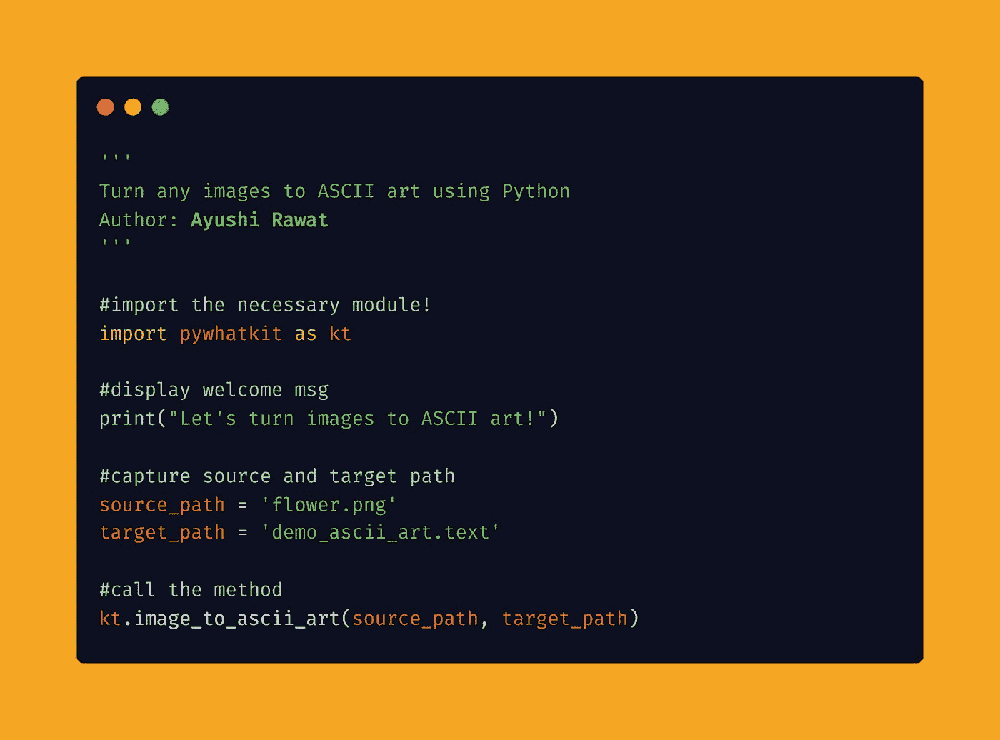
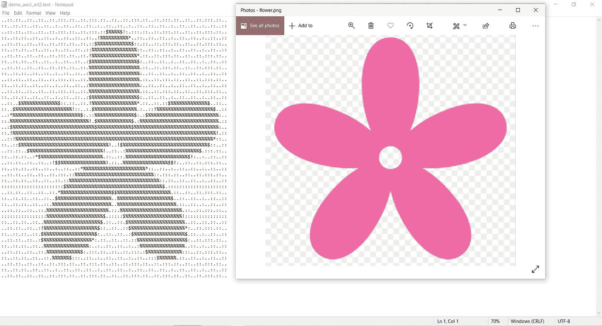
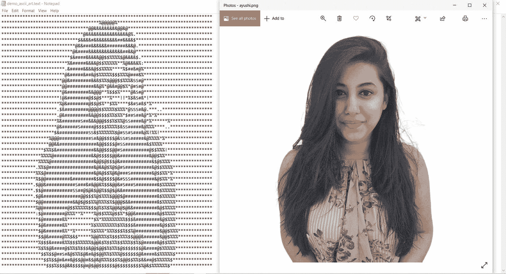

# 使用 Python 将任何图像转换为 ASCII 艺术

> 原文：<https://medium.com/analytics-vidhya/turn-any-image-to-ascii-art-using-python-2ab2b1f7f523?source=collection_archive---------2----------------------->

你好世界！


在这篇博客文章中，我们将学习如何将任何图像转换成 ASCII 艺术。我们将看到 Python 中的实现。

[查看 python 终极资源库](https://github.com/ayushi7rawat/Ultimate-Python-Resource-Hub)。发现有用就掉颗星！有什么要补充的吗？开个 PR 就一样了！

你可以参考我的 YouTube 视频教程，看一个工作教程来更好的理解和一步一步的指导。

# 这个博客将会涵盖什么

```
1\. What is ASCII?
3\. Basics of pywhatkit Module
4\. Converting any image to ASCII art using Python
```

*让我们开始吧！*

# 什么是 ASCII？：

ASCII 是美国信息交换标准代码的缩写。

ASCII 是用于电子通信的字符编码标准。ASCII 码代表计算机、电信设备和其他设备中的文本。

如果你想了解更多，可以参考 [ASCII 的维基百科页面](https://en.wikipedia.org/wiki/ASCII)。

# 使用的模块:

# pywhatkit 模块:

PyWhatKit 是一个 Python 库，具有各种有用的特性。这是一个易于使用的库，不需要你做一些额外的设置。

这个模块还有很多其他很酷的特性。请随意探索它们，或者如果你愿意，我可以写一篇关于它们的文章。

如果你想了解更多，可以参考 [pywhatkit 模块文档](https://github.com/Ankit404butfound/PyWhatKit)。

现在，您已经熟悉了 *ASCII* 的基础知识，并掌握了 *pywhatkit 模块的基础知识，*我们可以前进到*编码部分。*

# 该编码了！

你可以在我的 [GitHub 库](https://github.com/ayushi7rawat/Youtube-Projects/tree/master/Turn%20any%20image%20to%20ASCII)找到所有代码。发现有用就掉颗星。



为了访问 Python 库，需要将其安装到 Python 环境中

```
pip install pywhatkit as kt
```

现在，我们需要在 python 脚本中导入包。使用以下命令来完成此操作。

```
from pywhatkit as kt
```

现在我们已经使用命令`import pywhatkit as kt`导入了库，让我们继续。

让我们显示一条欢迎信息。同样，我们将使用`print`方法。

```
print("Let's turn images to ASCII art!")
```

现在，让我们捕获您希望转换为 ASCII 艺术的图像，并将其存储在 source_path 中。


这是我将在这里用作演示的图像。这幅图像描绘了一朵花。确保在这里给出正确的路径。如果 python 脚本无法在提到的路径中找到具有给定名称的图像，将会导致错误。

接下来，创建一个占位符来存储输出。由于它是一个 ASCII 文件，确保使用正确的扩展名，即`.text`，让我们将它存储在`target_path`中。

```
source_path = 'flower.png'
target_path = 'demo_ascii_art.text'
```

最后，让我们称之为`image_to_ascii_art`法。

```
kt.image_to_ascii_art(source_path, target_path)
```

注意:如果没有提到替代路径，输出文件将在 python 脚本所在的同一文件夹中生成。

让我们看一下输出文件及其与实际图像文件的比较。



让我们看看另一个例子。我在这里使用我的图像作为演示。成功运行后，将创建一个新的文本文件，如下所示



通过这些步骤，我们已经成功地使用 python 将一幅图像转换为 ASCII 艺术作品。就是这样！

很简单，不是吗？希望这篇教程有所帮助。我强烈推荐你去看看 T4 的 YouTube 视频，别忘了订阅我的频道。

您可以使用`pywhatkit`库，甚至探索更多的特性。

你可以在我的 [GitHub 库](https://github.com/ayushi7rawat/Youtube-Projects/tree/master/Turn%20any%20image%20to%20ASCII)找到所有代码。发现有用就掉颗星。

感谢您的阅读，我很乐意通过[Twitter](https://twitter.com/ayushi7rawat)|[LinkedIn](https://www.linkedin.com/in/ayushi7rawat/)与您联系。

请分享您的宝贵建议，感谢您的真诚反馈！

你绝对应该看看我的其他博客:

*   [Python 3.9:你需要知道的一切](https://ayushirawat.com/python-39-all-you-need-to-know)
*   [终极 Python 资源枢纽](https://ayushirawat.com/the-ultimate-python-resource-hub)
*   [GitHub CLI 1.0:你需要知道的一切](https://ayushirawat.com/github-cli-10-all-you-need-to-know)
*   [成为更好的程序员](https://ayushirawat.com/become-a-better-programmer)
*   [如何制作自己的谷歌 Chrome 扩展](https://ayushirawat.com/how-to-make-your-own-google-chrome-extension-1)
*   [使用 Python 从任何 pdf 创建您自己的有声读物](https://ayushirawat.com/create-your-own-audiobook-from-any-pdf-with-python)
*   你很重要，你的心理健康也很重要！

# 资源:

*   en.wikipedia.org/wiki/ASCII
*   【pypi.org/project/pywhatkit 
*   [github.com/Ankit404butfound/PyWhatKit](https://github.com/Ankit404butfound/PyWhatKit)

在我的下一篇博客文章中再见，保重！