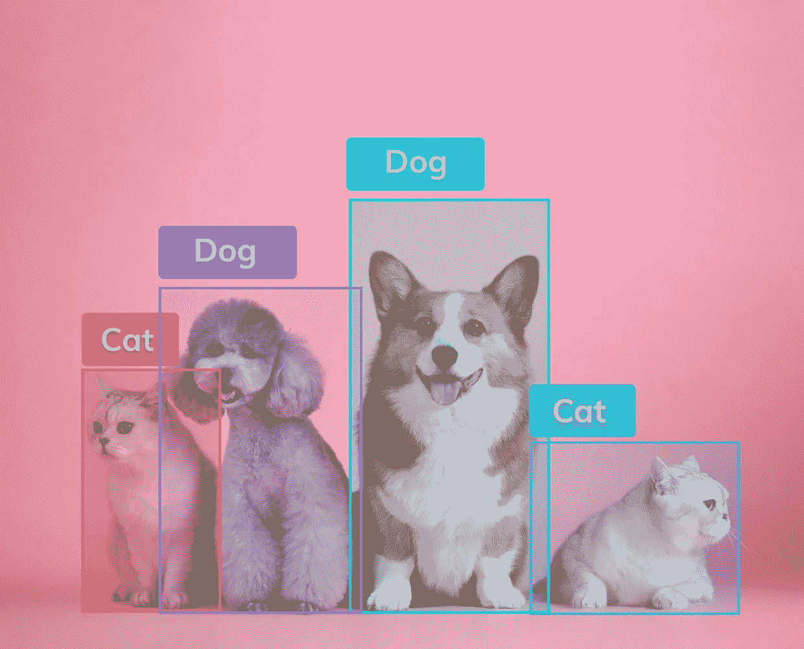
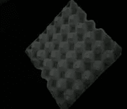
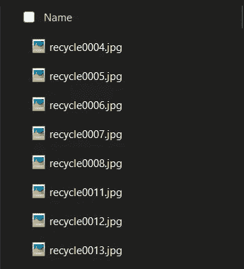
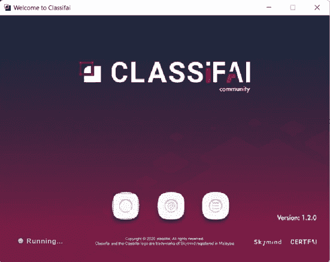
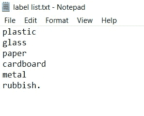
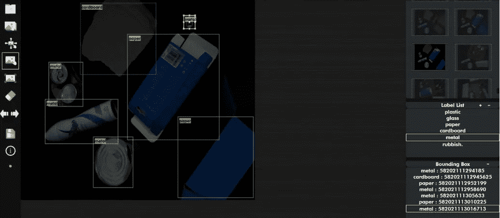
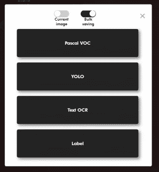
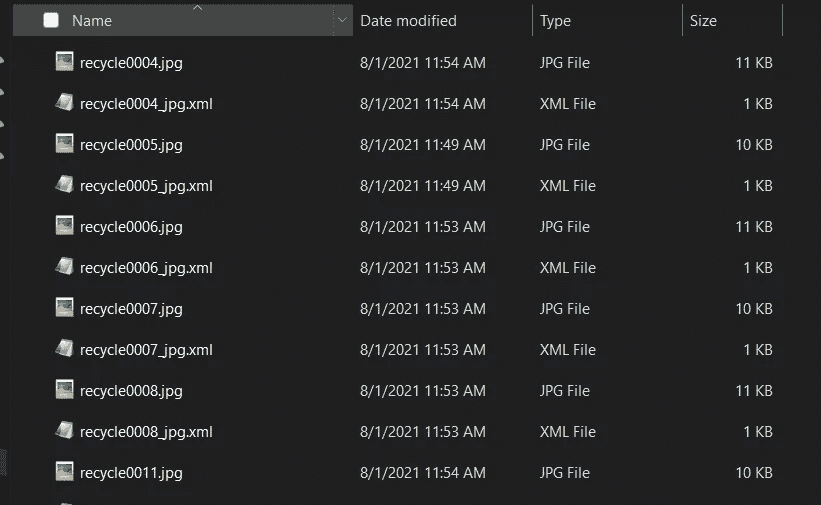
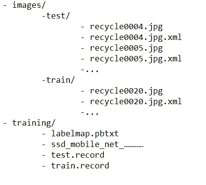
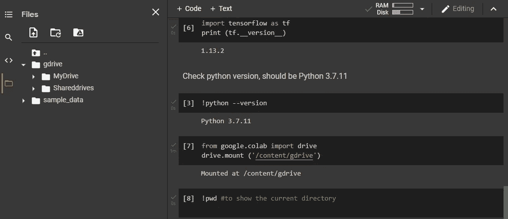

# 使用 Tensorflow 在 Raspberry Pi 上部署对象检测的教程

> 原文：<https://medium.com/analytics-vidhya/tutorial-to-deploy-object-detection-on-raspberry-pi-using-tensorflow-7ebd3e968566?source=collection_archive---------0----------------------->

Raspberry Pi 是一款小型单板电脑，可以用来做实际项目。一个有趣的特点是，它有自己的 Pi 摄像头插槽，可以很容易地安装。因此，一个项目，如部署对象检测模型到董事会将是可怕的。

目标检测是一种计算机视觉技术，可以对图像或视频中的目标进行定位和分类。我们可以看到图像中每个感兴趣对象周围的边界框，并为它们分配一个类别标签。



*图片 1 来源:https://www . v7labs . com/blog/object-detection-guide*

本教程可以应用于您自己图像数据集。在整个教程中，我将使用我的回收项目。图像数据集有 6 类，分别是塑料、玻璃、纸张、纸板、金属和垃圾。

在这些帖子结束时，您将能够:

1.  为实时检测收集良好的数据集

2.Google COLAB 中使用 Tensorflow 的列车目标检测模型

3.在 Raspberry Pi 上部署对象检测

我们将使用谷歌 COLAB 来训练模型，并将其保存到。tflite 将其部署在 Raspberry Pi 上。所以，系好安全带，让我们开始迷你项目。

**1。图像数据集**

对于这个使用 Raspberry Pi 的目标检测项目，我们需要采集模拟真实场景的图像数据集。因此，利用 Pi 摄像机采集回收物品的图像。我们可以像图片 2 一样在每张图片上放一个项目，或者像下面的图片 3 一样在同一张照片上放所有项目。

**1.1 采集图像数据集**



图片 2


图 3

我们应该为每门课收集足够的图像。我们也可以在一个图像中混合物品的类别，比如在一个图像中混合塑料和纸。在这里，我用 Pi 相机拍摄了我的 6 类回收物品的 500 张照片。用相同的名字和不同的号码保存每个图像。



图像 4 图像数据集的名称

**1.2 调整图像大小**

重命名图像后，我们应该调整图像的大小，因为它通常太大，无法进行训练和测试。我们可以用 resizer.py。

[](https://github.com/Aida81/Recycle-Item-Detection/blob/main/resizer.py) [## 主 Aida81/Recycle-Item-Detection 处的 Recycle-Item-Detection/resizer . py

### 用 TensorFlow API 为 Raspberry Pi 训练一个对象检测模型

github.com](https://github.com/Aida81/Recycle-Item-Detection/blob/main/resizer.py) 

**1.3 注释图像**

对于对象检测，我们需要我们的包围盒来分类我们的类。因此，我们需要使用注释工具来注释图像。我选择 Classifai 应用程序来注释我的图像。



图 5 Classifai 应用程序主页

有一个 Youtube 视频，你可以很容易地安装 Classifai 应用程序。

对于标签列表文件，我们很容易在记事本中列出所有的类。



图 6:你应该为类列表保存标签列表的结构。



图 7:注释图像数据对我来说很累但是很有趣！

对于对象检测，单击“绘制矩形”按钮，并在图像上感兴趣的区域绘制矩形。如果你有很多图像和类，这个过程需要时间。

在所有的标签完成后，我们必须保存标签。对于这个项目，我们应该批量保存为 **"Pascal VOC"** ，因为我们需要 **.xml.** 格式的标签



图 8:选择“批量保存”一次保存所有内容。

的。每个图像的 xml 文件应该保存在它们图像的同一个文件夹中，如下图 9 所示。



图 9

**1.3 拆分数据集**

因为我们想要训练和测试图像数据集，所以我们应该将它分成 80–20 份。将图像保存在测试文件夹和训练文件夹中。确保。每个图像的 xml 文件与图像放在一起。

**1.4 预处理图像数据集**

我们将把数据集分成两个阶段。首先，从。xml 文件转换为. csv。csv 到 tfrecord。我们为什么要这样做？这是因为 Tensorflow 接受 TFRecords 形式的数据，TF records 是 8 位整数二进制文件，计算成本较低。

将图像数据集从 xml 转换为 csv 和。tfrecord 表单，我们可以遵循 [Github 中的步骤。](https://github.com/Aida81/datasets)压缩 Github 上的数据集，用于 Google Colab 的培训。以下图的形式保存你的文件。



我们应该压缩数据集 github 的文件结构

**2。安装**

打开新的 Google COLAB，使用您的 Google 电子邮件登录。

2.1 张量流

**Tensorflow GPU v1.13 正在使用，因此我们应该卸载当前的 Tensorflow，然后安装我们需要的版本。**

```
!pip uninstall tensorflow
!pip install tensorflow-gpu==1.13.2
```

****2.2 验证** **已安装的张量流****

```
import tensorflow as tf
print (tf.__version__)
```

**如果单元的输出是 1.13.2，那么我们可以进行下一步。**

****2.3 Python****

**查看 python 版本，本教程应该是 Python 3.7.11。**

```
!python --version
```

****2.4 安装到谷歌驱动****

```
from google.colab import drive
drive.mount (‘/content/gdrive’)
```

**该单元将请求授权码安装在您的 Google Drive 上，您可以通过该单元给出的链接轻松复制该授权码。**

```
!pwd #to show the current directory
```

**输出应该是“/content”。你也可以看到 Google Colab 的左侧是你的 Gdrive 文件，如下图 10 所示。**

****

**图 10:Google Colab 的右侧显示了“gdrive”文件夹下 Google Drive 的内容**

****2.5 从 Tensorflow Github 下载物体检测模型****

**接下来下载包含对象检测模型示例的模型档案。我们需要专门使用 1.13 版本来匹配我们刚刚安装的 Tensorflow 版本**

```
# Get Tensorflow from GitHub and unzip it
!cd /content/gdrive
!mkdir tensorflow1
!cd /content/gdrive/tensorflow1
!wget [https://github.com/tensorflow/models/archive/r1.13.0.zip](https://github.com/tensorflow/models/archive/r1.13.0.zip)
!unzip -q ./r1.13.0.zip
!mv models-r1.13.0/ tensorflow1/models/
!rm r1.13.0.zip
```

****2.6 库和环境设置****

**构建并安装运行 object_detection 示例代码所需的库**

```
# Build and Install Tensorflow
!python /content/tensorflow1/models/research/setup.py build
!python /content/tensorflow1/models/research/setup.py install
```

**转到/research 文件夹，构建原型供以后使用**

```
# Go into research/ DIR of Tensorflow
%cd /content/tensorflow1/models/research/# Build protos!
!protoc object_detection/protos/*.proto — python_out=.
```

**设置 PYTHONPATH 环境变量**

```
%set_env PYTHONPATH=/content/tensorflow1/models:/content/tensorflow1/models/research:/content/tensorflow1/models/research/slim:/content/tensorflow1/models:/content/tensorflow1/models/research/object_detection%cd object_detection # Go into object_detection/ DIR of Tensorflow
```

**如果想知道当前 colab 会话还剩多少时间，请运行此命令**

```
import time, psutil
Start = time.time()- psutil.boot_time()
Left= 12*3600 - Start
print('Time remaining for this session is: ', Left/3600)
```

****3。型号****

**下载预训练的量化 MobileNet V2 可可模型。您将需要量化模型，以便在 Raspberry Pi 上进行更快的计算。**

```
# Now get SSD mobilenet model from GitHub!wget [http://download.tensorflow.org/models/object_detection/ssd_mobilenet_v2_quantized_300x300_coco_2019_01_03.tar.gz](http://download.tensorflow.org/models/object_detection/ssd_mobilenet_v2_quantized_300x300_coco_2019_01_03.tar.gz)
!tar -xf ./ssd_mobilenet_v2_quantized_300x300_coco_2019_01_03.tar.gz
!rm ssd_mobilenet_v2_quantized_300x300_coco_2019_01_03.tar.gz
```

**下载后，我们在 GitHub 的同一个 repo 中创建另一个名为“training”的文件夹，其中有 4 个文件:**

1.  **labelmap.pbtxt**
2.  **SSD _ mobilenet _ v2 _ quantified _ 300 x300 _ coco . config**
3.  **测试.记录**
4.  **火车.记录**

**下载我们之前做的 github 的回购。在这里复制你的 github 的链接。**

```
! git clone [https://github.com/Aida81/datasets.git](https://github.com/Aida81/datasets.git)
```

**根据 SSD _ mobilenet _ v1 _ quantified _ 300 x300 _ coco . config 中的数据集路径和类更改几行**

****第 9 行**:*num _ classes:6 #您的图像数据集的类别号***

****第 156 行**:*fine _ tune _ check point:" SSD _ mobilenet _ v2 _ quantified _ 300 x300 _ coco _ 2019 _ 01 _ 03/model . ckpt " #预训练模型提取文件路径***

****第 175 行** : *训练输入路径:"/content/tensor flow 1/models/research/object _ detection/datasets/training/train . record " #训练 TFRecord 文件路径***

****第 187 行** : *评估输入路径:"/content/tensor flow 1/models/research/object _ detection/datasets/training/test . record " #测试 TFRecord 文件路径***

****Line 177&191**:*label _ map _ Path:"/content/tensor flow 1/models/research/object _ detection/datasets/training/label map . Pb txt " #标签地图文件的路径***

***对于我们文件的路径，我们可以从 Google COLAB 的左侧看到并复制路径**

**创建文件夹来保存测试和训练图像**

```
!mkdir images
```

**将 train.zip 文件复制到/images 目录中，解压缩该文件，然后删除该 zip 文件**

```
#copy the tensorflow train.py example from the legacy folder into the main object detection_folder!cp /content/tensorflow1/models/research/object_detection/legacy/train.py /content/tensorflow1/models/research/object_detection/
```

****4。该训练了！****

```
# Run the training!!!!python train.py --logtostderr --train_dir=training/ --pipeline_config_path=/content/tensorflow1/models/research/object_detection/datasets/training/ssd_mobilenet_v2_quantized_300x300_coco.config# verify that the files indicated in the config file are where you say (test.record and train.record especially)
```

**训练完成后，我们需要知道下几个步骤的最新检查点的数字。从 training 文件夹中的文件来看，我们要查找的编号如下所示:model.ckpt-4696.index**

```
ls -al training
```

**可选:压缩培训文件夹并下载，以防您想在其他时间重新开始培训**

```
### OPTIONAL, if you want to continue training sometimes later #### Zip the training folder and download locally, so we can continue in another session if required!zip -r 'training2784.zip' ./training%cd /content/tensorflow1/models/research/object_detection!python export_inference_graph.py --input_type image_tensor --pipeline_config_path /content/tensorflow1/models/research/object_detection/training/pipeline.config --trained_checkpoint_prefix training/model.ckpt-2784 --output_directory trained_inference_graph/
```

**一旦您的模型训练开始，您应该会看到如下所示的输出:**

```
INFO:tensorflow:global step 126: loss = 3.4387 (4.261 sec/step)INFO:tensorflow:global step 127: loss = 3.2278 (4.213 sec/step)INFO:tensorflow:global step 128: loss = 3.2878 (4.200 sec/step)INFO:tensorflow:global step 129: loss = 2.7067 (4.132 sec/step)INFO:tensorflow:global step 130: loss = 2.6300 (4.413 sec/step)INFO:tensorflow:global step 131: loss = 2.9574 (4.504 sec/step)INFO:tensorflow:global step 132: loss = 2.8398 (4.507 sec/step)INFO:tensorflow:global step 133: loss = 2.9006 (4.498 sec/step)INFO:tensorflow:global step 134: loss = 2.7963 (4.459 sec/step)
```

**每 1000 步保存一个新的检查点文件。(这些检查点可用于恢复训练进度并继续模型训练)**

**训练模型直到损失不断在 0.3 以下为宜！如果您没有取得好的结果，您可以继续训练模型(检查点将允许您恢复训练进度)，直到您获得满意的结果！**

****6。创建 freezed _ inference _ graph . Pb****

**一个冻结的推理图可以在各种各样的机器上使用，在你创建一个之后，你可以在 COLAB 中使用接下来的步骤来测试它，或者你可以上传你自己的到 */test_images* 文件夹。**

**您将需要该命令中最新训练检查点的编号，因此请确保您已经在前面的步骤中找到了它。在培训文件夹中查找最新的步骤编号，并将参数中的编号替换为文件夹中的步骤编号:**

***—trained _ check point _ prefix training/model . ckpt-* * 13144 * ****

```
!mkdir inference_graph# export .pd file for windows!python export_inference_graph.py --input_type image_tensor --pipeline_config_path=/content/tensorflow1/models/research/object_detection/training/pipeline.config --trained_checkpoint_prefix training/model.ckpt-2784 --output_directory inference_graph
```

**压缩 inference_graph 文件夹，并备份到 GDrive，这样我们就可以在 windows 上使用它进行正常的预测**

```
!zip -r 'inference_graph2784-1.zip' ./inference_graph
```

****7。为树莓 Pi 准备模型****

**首先，您需要创建。pb 文件设置，然后将该文件转换为. tflite。**

**7.1 从上次保存的检查点创建 tflite_graph.pb 文件。**

```
%cd /content/tensorflow1/models/research/object_detection/# Create TFLite_model folder
!mkdir TFLite_model
```

**下面的代码将使用最新的检查点生成 tflite_graph.pb 文件(根据 training 文件夹中的最新文件设置 trained_checkpoint_prefix)。请确保在培训文件夹中查找编号最大的检查点，并将“model.ckpt-13144”替换为最新检查点的编号，如“model . ckpt-{您的数值}”。完成后，运行代码。**

**您需要在下面的命令中调整的参数如下所示:**

```
*— trained_checkpoint_prefix=/content/tensorflow1/models/research object_detection/training/model.ckpt-13144*
```

**但是 13144 号码需要来自您的/training 目录中的文件**

**冻结 TFLite 推理图，以便在 RPI 上使用**

```
!python export_tflite_ssd_graph.py --pipeline_config_path=/content/tensorflow1/models/research/object_detection/training/pipeline.config --trained_checkpoint_prefix=/content/tensorflow1/models/research/object_detection/training/model.ckpt-2784 --output_directory=/content/tensorflow1/models/research/object_detection/TFLite_model --add_postprocessing_op=true
```

**7.2 转换。pb 文件到 TFLite，以便在 Raspberry Pi 上使用**

**detect.tflite 将用于 Raspberry Pi，因为它已经被转换为 tflite 格式**

```
# CONVERT USING TOCO!rm ./TFLite_model/detect.tflite!toco --graph_def_file=/content/tensorflow1/models/research/object_detection/TFLite_model/tflite_graph.pb --output_file=/content/tensorflow1/models/research/object_detection/TFLite_model/detect.tflite --input_arrays=normalized_input_image_tensor --output_arrays=TFLite_Detection_PostProcess,TFLite_Detection_PostProcess:1,TFLite_Detection_PostProcess:2,TFLite_Detection_PostProcess:3 --inference_type=QUANTIZED_UINT8 --mean_values=128 --std_dev_values=128 --change_concat_input_ranges=false --allow_custom_ops --input_shapes=1,300,300,3 --enable_v1_converter
```

**现在，您需要知道 detect.tflite 在哪里，以便您可以在 Raspberry Pi 上部署它。**

**[跟随本教程尝试如何演示 PiCamera 来检测物体。](https://www.digikey.my/en/maker/projects/how-to-perform-object-detection-with-tensorflow-lite-on-raspberry-pi/b929e1519c7c43d5b2c6f89984883588)**

**然后，我们应该用经过训练的 detect.file 更改 Raspberry Pi 文件夹上的 detect.file，以便它可以检测我们自己的图像数据集。**

**这是我的演示。**

**正如你所看到的，使用 Raspberry Pi 的缺点是 fps 不到 1 ps，这清楚地表明了延迟。因此，您可以添加其他设备，如英特尔 m ovidius VPUs，它们能够高效地支持要求苛刻的**计算机视觉和边缘人工智能工作负载**。**