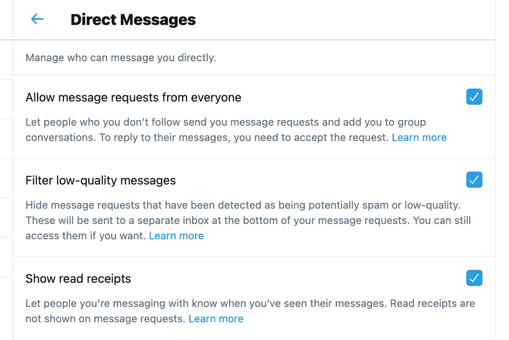

# Twitter 像专业人士一样直接发送消息(带 Tweepy)

> 原文：<https://medium.com/analytics-vidhya/twitter-direct-messages-like-a-pro-with-tweepy-48bc1cdade04?source=collection_archive---------2----------------------->

Twitter 上的直接消息已经出现了一段时间。这并不令人惊讶，因为短信无疑对我们每天交流、工作和联系的方式产生了巨大影响。

在社交平台上，对于那些希望通过客户体验和支持扩大影响(增加关注者)、创建独特品牌或提供“不低于卓越”的企业来说，消息传递可以发挥关键作用。


奥列格·马尼在 [Unsplash](https://unsplash.com/s/photos/twitter-messaging?utm_source=unsplash&utm_medium=referral&utm_content=creditCopyText) 上拍摄的照片

在这里 **1)** 我将讨论一些关于直接的私人信息如何给一个品牌或组织带来价值的事实和考虑， **2)** 我将深入一些技术性的例子(给技术人员)🤓Twitter 机器人如何使用 Tweepy 读取和发送 DMs。

# 直接信息的价值

目的地管理系统可用于追求不同的目标:

*   珍惜你的追随者:任何新的追随者都会受到“谢谢你关注我们”的欢迎消息
*   参与:向关注者发送消息，告知他们一些重要的事情(服务或政策的变化)或新的机会(可用的优惠或有用的提示)
*   个人:以友好和个人的方式私下接触可以在品牌和追随者之间建立联系
*   利用这些功能:Twitter DMs 支持多达 10k 个字符，允许客户提交他们的查询，而不受标准 Tweet(最多 280 个字符)的限制

直接信息**不应被滥用**，因为它们会变成垃圾信息，转移人们的兴趣，并给品牌形象蒙上阴影。出于同样的原因，它们**不应该被忽略**或被认为是响应较晚或较差的低优先级。

最后，当准备好并提交后，启用从每个人那里接收 DMs 的选项:当目标是让客户和用户能够联系到您时，这很重要。



选中“允许来自所有人的消息请求”

# Twitter 机器人的片段和开发实践

Tweepy 是访问 Twitter 最流行的库之一。它提供了一个围绕 Twitter REST API 的包装器，以简化端点的配置、认证和调用。

Tweepy 对 Twitter 直接消息的支持非常好。

在以下部分中，我们将了解如何执行以下操作:

*   设置对 Twitter API 的访问
*   获取发送到 Twitter 帐户的 DMs
*   表达重要意思
*   删除邮件

# 证明

设置和验证非常简单。首先在 [Twitter Dev](https://developer.twitter.com/en) 网站上申请一个 Twitter 开发者账户，以获得必要的访问密钥。

```
import tweepy

# Authenticate access
auth = tweepy.OAuthHandler("CONSUMER_KEY", "CONSUMER_SECRET")
auth.set_access_token("ACCESS_TOKEN", "ACCESS_TOKEN_SECRET")

# Create API handler
api = tweepy.API(auth)
```

不要在源代码中硬编码令牌和凭证，而是将它们存储在一个外部文件中。env)或者(甚至更好)放在环境变量中。

# 收到直接信息

发送到您帐户的 DMs 会出现在“信息”收件箱中。Tweepy 库提供了一个获取它们的方法:

```
messages = api.list_direct_messages(count=5)**for** message **in** reversed(messages):
  # who is sending?  
  sender_id = message.message_create[**"sender_id"**]
  # what is she saying?
  text = message.message_create[**"message_data"**][**"text"**]
```

关于上面代码的几点说明:

1.  单个 API 调用获取的消息数量是可以控制的(默认值为 20，最多可以使用 50)
2.  该列表被反向处理，首先读取最近的消息
3.  **所有收发的**信息都会被返回(是的，还有我们的回复)
4.  尽管 DM 很快出现在 Twitter 消息收件箱中，但是在通过 API 获得之前有一个**延迟**

更多信息请访问 [Twitter REST API 获取直接消息](https://developer.twitter.com/en/docs/twitter-api/v1/direct-messages/sending-and-receiving/api-reference/list-events)

# 发送直接信息

发送 DMs 也是一个简单的操作:

```
recipient_id = "123"  # ID of the user
api.send_direct_message(recipient_id, **"Hoi hoi"**)
```

回复包括一个**媒体**，可能发送一个感谢 gif 或一个小的介绍视频，这可能会很酷。

```
# upload media
media = api.media_upload(filename=**'/files/thankyou.png'**)# send with media
recipient_id = "123"  # ID of the user
api.send_direct_message(recipient_id=recipient_id, text='Thank You!', attachment_type=**'media'**, attachment_media_id=media.media_id)
```

注意`recipient_id`是 Twitter 用户的 ID(号码),而不是用户名(字符串，即@beppecatanese)。数字用户 ID 可以通过 API 调用获得

```
user = api.get_user("beppecatanese")
recipient_id = user.id_str
```

当回复一个 DM 时，我们收到的`recipient_id`可以在原始消息的 JSON 有效载荷中找到

```
recipient_id = message.message_create[**"sender_id"**]
```

更多信息请访问 [Twitter REST API 发布直接消息](https://developer.twitter.com/en/docs/twitter-api/v1/direct-messages/sending-and-receiving/api-reference/new-event)

# 删除直接消息

删除消息也便于清理收件箱，还可以避免无意中回复同一条消息。

**注意**:我通常会在回复后删除一条消息，这样我就不用担心下次下载消息时会跳过这条消息。显然，这不是绝对必要的，但它简化了收件箱的管理。

```
# delete by ID
api.destroy_direct_message(message.id)
```

# 结论

在 [GitHub](https://github.com/gcatanese/1-2-3-Direct-Messages-With-Tweepy) 上查看源代码

对于十二个新手，我推荐一个非常好的关于真正 Python 的教程

如有反馈和问题，请通过推特联系我。