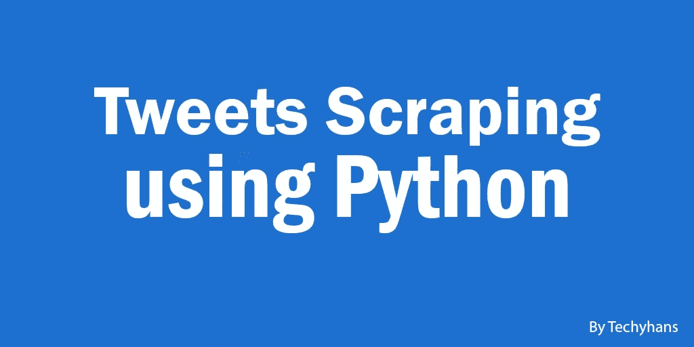

# 使用 Python 抓取推文

> 原文：<https://medium.com/analytics-vidhya/twitter-scrapping-using-python-55a466b2f597?source=collection_archive---------3----------------------->



今天，我将向你展示我们如何使用 python 中的一个库 snscrape 来抓取推文。

# 结果

1.  基于标签或时间戳抓取推文。
2.  无限推文可以刮。
3.  抓取的数据可以保存为 JSON 格式。

# 环境设置

1.  从[这里](https://www.anaconda.com/products/individual)下载 Anaconda。
2.  在这里克隆我的 Tweets 抓取库。
3.  使用命令`conda env create -f environment.yml`，使用 environment.yml 创建一个 Conda 环境。
4.  使用命令`conda activate tweets-scraping`激活 Conda 环境。

# 例子

*   获取特定用户的所有推文。

```
snscrape twitter-user <twitter_username>
```

*   获取标签为#covid19 的最新 100 条推文。

```
snscrape --max-results 100 twitter-hashtag covid19
```

*   获取标签为#covid19 的最新 100 条推文:

```
snscrape --jsonl --progress --max-results 100 --since 2020-06-01 twitter-hashtag "relax until:2020-07-01" > text-query-tweets.json
```

# 使用

*   `--jsonl`以 JSONL 的形式获取输出。这包括 snscrape 提取的所有信息(例如，消息内容、日期时间、图像；细节因模块和刮刀而异)。
*   `--with-entity`获取被抓取实体上的项目，如用户或渠道。并非所有的刮刀都支持这一点。(你可以和`--max-results 0`一起使用，只获取实体信息。)
*   `--format`自定义输出格式。
*   `snscrape --help`或`snscrape <module> --help`提供了可用选项的详细信息。`snscrape --help`还列出了所有可用的模块。

# 参考

*   [https://github . com/MartinBeckUT/TwitterScraper/tree/master/sn scrape](https://github.com/MartinBeckUT/TwitterScraper/tree/master/snscrape)

# 关于作者:

本文由马来西亚 [Arkmind](https://arkmind.com.my) 技术负责人韩胜撰写。他对软件设计/架构相关的东西、计算机视觉以及边缘设备充满热情。他开发了几个基于人工智能的网络/移动应用程序来帮助客户解决现实世界的问题。你可以通过他的 Github 简介来了解他。