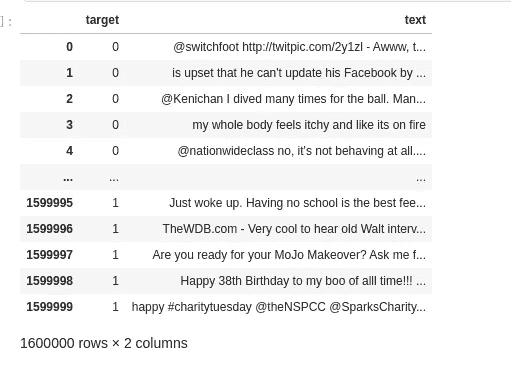

# 从零开始的 Twitter 情感分析

> 原文：<https://medium.com/analytics-vidhya/twitter-sentiment-analysis-from-scratch-9ad93b72a83d?source=collection_archive---------7----------------------->

图片来源:Unsplash

有一句非常著名的话叫做**“笔锋胜于武力”**。这是真的，因为你的话可以让某人开心，也可以毁了它。所以，明智地选择你的用词总是明智的。但在当今的社交媒体世界，人们不假思索地说出自己的心声。因此，在这篇文章中，我们将看到人们在这些社交媒体平台上可以有多积极或消极。

**问题陈述**

*   我们将回顾 twitter 的数据，找出这个平台上人们的情绪。
*   我们将训练一个模型，它将一个人的推文作为输入，并告诉我们它是积极的还是消极的。

**数据集**

*   我们将使用 [Kaggle 数据集](https://www.kaggle.com/kazanova/sentiment140)进行分析。这个数据集包含 160 万条推文，以及正面或负面的目标标签。每个类包含 80 万个示例

包含推文和目标的数据

# **推文预处理**

*   预处理是任何机器学习管道中非常重要的一部分。在我们的数据中，我们有很多对我们的模型没有任何价值的信息，所以我们将一个一个地处理它。我们将对数据执行以下预处理步骤:

1.  删除我们文本中的任何电子邮件 id。
2.  从我们的推文中删除所有标签和提及(例如 [Arpan Srivastava](https://medium.com/u/e4f0c7250996?source=post_page-----9ad93b72a83d--------------------------------) )。
3.  删除我们推文中的任何标点符号。
4.  从我们的推文中删除数字。

完成以上步骤后，我们完成了 50%的清洁工作。现在，我们将执行预处理的第二部分，并了解与 NLP 相关的概念。

**删除停用词**

*   停用词指的是一种语言中最常见的词。在英语中，这些词有["have "、" they "、" our "、" is"]等。这些词在我们的分析中没有多大作用，因为它们主要出现在负面和正面的推文中。
*   我们将使用 nltk 库从我们的 tweets 列表中删除这些停用词。

**词干和小写**

*   词干化是将每个单词缩减为其词根的过程。假设有 3 个词，调，调和调。所有的单词可能看起来不同，但它们都来自同一个单词“吞”。所以在词干分析中，我们所做的是用它们的词根替换这些单词。
*   然后我们把所有的单词都转换成小写，这样在我们的分析中就不会把 great、GREAT 和 Great 当作不同的单词。

# 数据的矢量化

*   现在，在执行了所有的预处理之后，我们得到了一个类似如下的数据集:

预处理数据

*   现在我们无法将这些文本数据输入到我们的机器学习模型中。因为机器只能理解数字而不能理解文本。所以我们将对上面的文本数据进行矢量化。
*   我们能做的是使用我们数据中所有独特的单词创建一个词汇数组。
*   假设我们有三个例子

1.  我喜欢编程。
2.  编程是我喜欢的。
3.  编程很酷。

*   所以，如果我们用上面的三个句子创建一个词汇表，我们会得到一个类似这样的数组:["我"，"爱"，"编程"，"是"，"什么"，"酷"]
*   现在我们将通过一个简单的技巧把我们的句子转换成向量。如果我们的词汇中有一个词存在于我们的句子中，我们会在那里放一个 1，否则放 0
*   因此，转换看起来会像这样:
*   “我爱编程”-> [1，1，1，0，0，0]
*   “编程是我所热爱的”-> [1，1，1，1，0]
*   “编程很酷”->[0，0，1，1，0，1]

**上述方法的问题**

*   上述方法将创建一个非常大的稀疏矩阵，我们的学习算法将因此变得缓慢。

**更好的解决方案**

*   在这种方法中，我们要做的是创建一个包含句子中所有独特单词的词汇表。
*   获取所有正面推文的列表，并找出这些正面推文中每个词的频率。
*   同样，我们得到所有的负面推文，并找出负面推文中所有词的频率。

肯定词和否定词的频率

*   现在我们将使用一个简单的公式把我们的句子转换成向量。

|V|=[1，正面推文的频率和，负面推文的频率和]

*   让我们借助一个例子来理解我们的公式。
*   假设我们的句子是->‘我快乐学代码’。
*   现在正面推文的频率总和= 3(I)+3(am)+2(快乐)+1(学习)+1(代码)=>10
*   类似地，负面推文的频率总和= 3(I)+3(am)+0(快乐)+1(学习)+1(代码)=>8
*   所以最后我们的句子将被表示为[1，10，8]。
*   记住，首字母 1 代表偏差。
*   我们现在可以把每个例子转换成向量。

# 训练我们的模型

*   由于现在这是一个二元分类问题，您可以简单地使用逻辑回归或任何其他二元分类算法来训练和测试您的模型。

# **代码演练**

*   对于代码演练，你可以参考我在 Kaggle 上的笔记本 [Twitter 情绪分析](https://www.kaggle.com/arpansri/sentiment-analysis)

**到那时快乐学习！！**