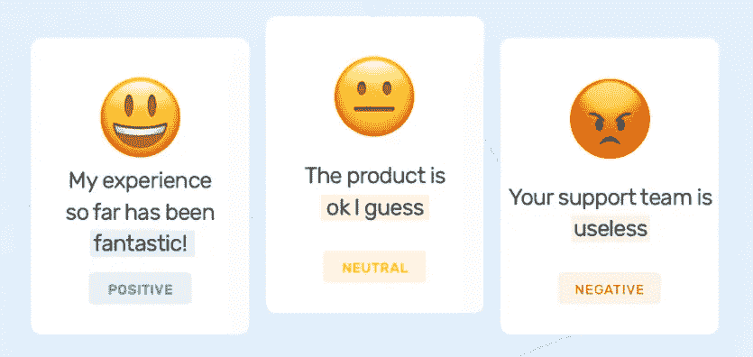
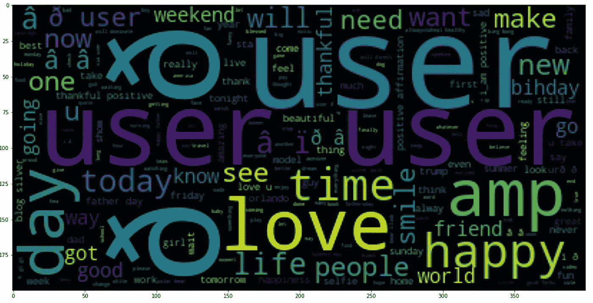
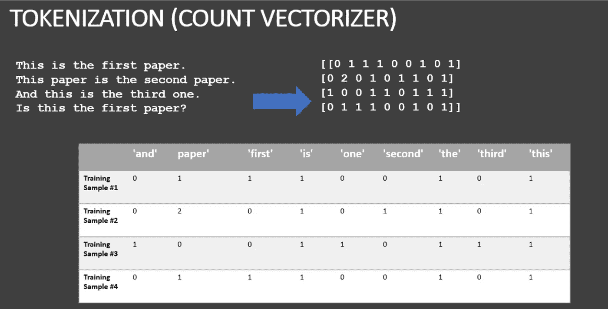

# 使用从文本(Tweets)中提取特征的 Twitter 情感分析

> 原文：<https://medium.com/analytics-vidhya/twitter-sentiment-analysis-using-feature-extraction-from-text-tweets-7dca1cf9624b?source=collection_archive---------1----------------------->

随着社交媒体平台的出现，在过去的 15-20 年中，社交媒体平台的受欢迎程度和活跃用户数量都在不断增加。的确如此，毕竟它们提供了有效的方式，通过互联网与家人、朋友、我们关心的人、导师、招聘人员以及平台上的其他所有人联系。现在，一个明显的现象是，当两个或更多的人在一起时，就有可能出现危机。这里我们谈论的是数百万甚至数十亿人。因此，很自然地，几乎每天，在地球的某个地方，都会有一些用户发布或评论或发不那么令人愉快的话。或者在一些其他情况下，客户可以写关于最近购买的产品的评论。该产品本身可能会有成千上万的顾客的评论，甚至更多。

因此，管理这些没有吸引力的文本是平台的责任，以便作为人们联系的媒介而不是宣传仇恨的媒介，或者分析有价值的客户写的评论，让他们知道自己在公司的价值。此外，自动分析客户反馈，如调查回复和社交媒体对话中的意见，使品牌能够了解什么让客户高兴或沮丧，以便他们可以定制产品和服务来满足客户的需求。但是搜索和阅读数十亿的文本是一项艰巨的任务。这就是自然语言处理(情感分析)发挥作用的地方。

**情感分析**(或**意见挖掘**)是一种自然语言处理技术，用于确定数据是正面、负面还是中性。积极、消极或中性的标签是上下文和主观的，但本质上它们有其字面意义。自动化这个过程有很多好处。

例如，使用情感分析来自动分析 4，000 多条关于您产品的评论，可以帮助您发现客户是否对您的支持团队或产品或他们的整体体验感到满意。

也许你想在社交媒体上实时和长时间地评估品牌情绪，这样你就可以立即发现不满的客户，并尽快做出回应。

情感分析的应用是无穷无尽的。

# **推特情绪分析**

如前所述，twitter 使用 **NLP** 的方法之一是分析所有推文，并将其分类为正面、负面或中性。这有助于保持平台的整体积极向上，并提供愉快的用户体验。

我用过的数据集和代码可以从 [**这里**](https://github.com/OjasPandey99/Twitter-Sentiment-Analysis) 下载。

在这段代码中，我将使用 Twitter 数据集(提供链接)进行情感分析。少数几个模块，如， **wordcloud** ，**计数矢量化**，其工作原理将在下文中简要说明。一般来说，情感分析是用来分析和分类某个文本(或者在我们的例子中是 tweet)是攻击性的还是非攻击性的。这为公司节省了大量的时间和精力，否则它将需要阅读和分类每条评论/推文。让我们深入代码的步骤。

1.  **首先，即使在清理过程之前，人们也应该熟悉他们将要处理的数据类型**(也称为**探索性数据分析**)。这有助于为数据科学家提供更多上下文和背景信息。因此，在阅读 csv 文件后，我对数据运行了一些函数来熟悉它。我们开始了解数据的大小，每个列/特征的数据类型，空条目的数量，不同类别的分布，一条推文中的平均字数等。这取决于每个问题。然后，我们意识到在进一步的分析中不再需要 id 列，所以我们删除了它。
2.  文本/情感分析中 **EDA** 的另一部分可以是使用 [**WordCloud**](https://www.geeksforgeeks.org/generating-word-cloud-python/) ，以获得基于文本的总体类别分布的**大图。对于它的实现，我们首先把所有的 tweets 合并成一个巨大的句子。这句话对我们来说不一定意味着什么，但对 WordCloud 来说却意味着什么。它将这个巨大的句子作为输入，并产生一个输出图像(WordCLoud ),显示最常用的某些“单词”的分布。一个词的用法数量或者它的重要性与它在词云上的大小成正比。从词云我们推断，大多数推文中使用的大多数词通常是“积极的”，这是意料之中的，因为我们的数据集对“积极的”推文不平衡。**

仅正面推文数据集的 WordCloud 图像

**3。**

接下来，我们将讨论数据清理。在情感分析中，数据清理通常指的是删除不必要的标点符号，因为它们会妨碍算法的正常工作，还指的是删除“**停用词**”，停用词是一组“中性的”和非常常见/日常使用的词，这样我们就可以删除那些使我们的数据集太长而无法计算的不必要的字符。

**4。**

清理之后，我们进入一个叫做**计数向量化**的过程。计数矢量化包括计算每个单词在文档/文本(例如，独特的文本，如推文、文章、书籍，甚至段落)中出现的次数。Python 的 Sci-kit learn 库有一个叫做**计数矢量器**的工具来完成这个任务。这个过程有助于将我们理解的文本数据转换成计算机更容易理解的数字数据。例如，我们看到在所有的推文中，我们有 47385 个不同的单词。

标记化示例

**5。**

现在我们有了数字形式的数据，是时候对其实施算法了。这里可以应用任何强大的二进制分类算法，如逻辑回归、SVM 等。我已经应用了**朴素贝叶斯**，因为它对我们这里的大数据很有效。在对我们的训练数据拟合模型并对其进行评估后，我们看到我们的模型给出了 94%的准确率，这是非常好的。**但是正如我们已经看到的，我们的数据集是高度不平衡的，我们不能断定我们的模型是有效的**。为此，我们看一下**精度**和**召回**(还有 tp 和 fp 率，尽管在数字上 tp 率与召回率相同)。对于 0 类(正面推文类)，我们有相当好的精确度、召回率和 f1 得分，但对于数据样本远少于 0 类样本的 1 类(负面推文类)，我们的模型表现不佳。毕竟，我们的目标是正确检测负面推文并报告它们，而不是正面推文。为了提高 1 类的精度和召回率，我们可以尝试不同的分类算法，我没有在这段代码中展示。或者我们也可以使用 **PyCaret** 将多个算法一起实现，进行比较。然而，所有这些都是不同代码的主题。

谢谢你。希望这对你有帮助。