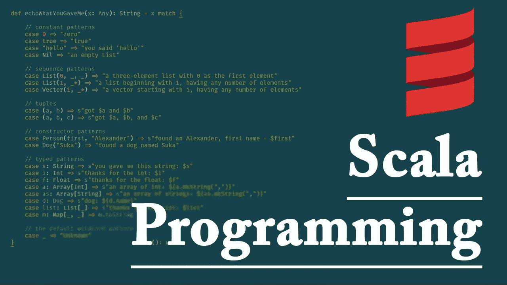

# Scala 中特定多态性的类型类

> 原文：<https://medium.com/analytics-vidhya/type-classes-for-ad-hoc-polymorphism-in-scala-70ec31d0265d?source=collection_archive---------7----------------------->

Scala 有一套丰富的多态技术，通过使用**特征**、**抽象类、**，当然，有时还会使用 **case 对象**和 **case 类**，来实现代码的可重用性。

假设我们希望基于我们操作的类型实现 equals(自定义 equals 方法)的通用功能，这可以是 **Int** 、 **Double** 、 **Person(case class)** ，或者 scala 生态系统中的任何其他类型以及用户定义的类型。

我们能想到的一个解决方案是创建泛型代码块并对其进行操作，但这里的问题是，对于每种类型，我们可能最终会有 n 个对象创建来实现 equals 方法的功能。我们希望实现这样一个目标:只有一个对象被引用来操作不同的类型

这里的问题是我们如何实现这一目标？

> 这就是类型类概念可以拯救我们的地方，我们经常称之为特别多态

现在我们可以跳转来解决这个问题，下面是我们尝试实现`isEqual`方法的简单方法。

现在我们已经准备好了包含 isEqual 方法的 trait，我们将看到如何进一步扩展它，以利用类型类和特别多态性的功能。

但在此之前，让我给隐式的一行程序，这是理解整个概念的先决条件:

如果你想让编译器替你做出决定，来推断被标记为使用隐式的代码块的底层执行的值，隐式就扮演了一个重要的角色。

现在让我们为上面的 trait 创建一个伴随对象，并使用 implicit 来实例化`trait Equality[T]`的对象。

如果我们看到上面的代码片段，我们可以看到，为了实现第 2 行的`def isEqual[T]`的功能，我们将传递的值调用到隐式等式对象`(implicit equality:Equality[T]`的 isEqual。

现在让我们看看如何使用这个伴随对象来覆盖不同类型的 isEqual 方法。首先，我们来看看`Int`

好的，我们正在扩展并利用隐式对象，这样在运行时编译器将决定并选择合适的助手对象来推断实际的实现，我们也在扩展`Equality[Int]`，我们可以用类似的方式为其他类型和实现做这件事，这完全与我们无关。

因此，如果我们想检查一个用户定义的类型，可能是用户类，我们可以这样做。

以上是仅基于年龄的平等，我们可以说这里我们只关心年龄平等。

关于代码有很多讨论，但最后的问题是我们应该引用哪个主要对象调用 isEqual，答案是`Equality.isEqual(...)`

因此，如果我们注意到，基于我们传递到`Equality`的`isEqual`中的类型，对象试图在运行时找到并执行底层逻辑，这也是 1、2 进入`IntEquality`而第二个进入`UseEqualilty`块的原因。

希望这有所帮助:)
完整的代码可以在[这里找到](https://gist.github.com/amitprasad119/cfac1a84aab7e7c563fc3ab55b4e6454)