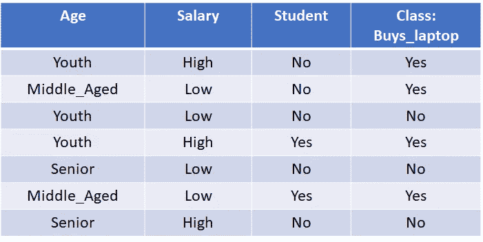
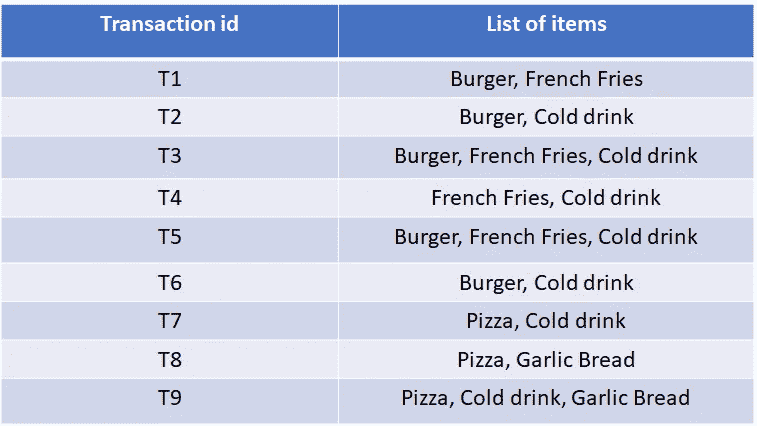
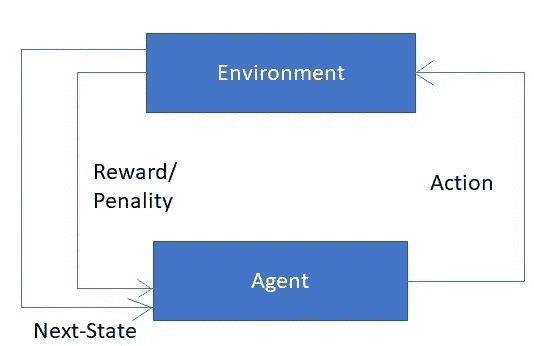

# 机器学习的类型

> 原文：<https://medium.com/analytics-vidhya/types-of-machine-learning-94d4b4ccd512?source=collection_archive---------13----------------------->

阿里·沙阿·拉哈尼在 [Unsplash](https://unsplash.com?utm_source=medium&utm_medium=referral) 上拍摄的照片

M 机器学习是人工智能领域，其主要目的是让机器变得智能，能够利用知识和过去的经验做出自己的决定。让我们举一个现实生活中的例子来理解机器学习。假设一个人去看医生做检查。医生问的第一个问题是你感觉怎么样。这个人告诉医生他的症状，比如出汗、发烧、咳嗽、打喷嚏、食欲不振。根据患者的症状，医生诊断患者患有病毒性发烧。医生通过使用她的知识和过去的经验做出这个决定。

照片由[疾控中心](https://unsplash.com/@cdc?utm_source=medium&utm_medium=referral)在 [Unsplash](https://unsplash.com?utm_source=medium&utm_medium=referral) 上拍摄

在机器学习中，我们希望将人的决策能力灌输给机器，或者我们可以说，我们希望机器像人一样行事。使用机器学习解决问题；机器学习算法的选择取决于手头问题的类型和可用数据的类型。

有监督、无监督和强化学习是三种类型的机器学习。

**监督学习**

在监督学习中，数据被标记，这意味着对于给定的输入集，我们有输出变量，并且基于现有数据训练模型来预测新输入集的输出。例如，我们想知道具有给定配置文件的客户是否会购买笔记本电脑。此外，我们还有客户的详细信息，如年龄、工资、学生和班级变量 buys_laptop，如图 1.1 所示。这里，我们为每组输入设置了一个类变量，这意味着数据被标记。在监督学习中，用该数据训练机器学习模型，从数据中提取特征，并预测新输入集的输出。

图 1.1。客户数据集

监督学习可以分为两种类型-分类和回归。

**分类:——**分类是将一个变量的值分成多个类别的任务。在分类中，目标变量(y)是分类的，意味着 y 的值是一个类别，如是或否、猫或狗等。例如，我们想预测一个人是否患有癌症，答案是“是”或“否”。有各种类型的分类算法，如支持向量机(SVM)、决策树、随机森林、逻辑回归、K-最近邻和朴素贝叶斯。

**回归:——**在回归中，目标变量(y)是连续的意味着 y 的值是一个实数。例如，我们想预测一辆汽车的价格。答案将是一个实数。有各种类型的回归算法，如线性回归，多元回归。

**我们来谈谈无监督学习**

在无监督学习中，数据是无标签的，这意味着数据中缺少输出(y)变量，如图 1.2 所示。无监督学习方法基于一些特征从数据中学习模式。例如，我们有购物中心客户的交易细节，我们希望预测客户的购买模式，例如，如果一个人购买了汉堡，他可能会购买冷饮和薯条。通过了解客户的购买模式，我们可以制定营销策略并增加业务收入。

图 1.2。客户的交易详情

网飞、YouTube 和电子商务网站等各种应用中使用的推荐系统是无监督学习的另一个例子。无监督学习可以分为两种类型——聚类和关联规则。

**聚类-** 是根据相似项目的特征对其进行分组的过程。有各种类型的聚类方法，如 k-means、k-medoids、分层和基于密度的聚类。

**关联规则-** 是从数据中发现规则的过程。基于这些规则，可以做出业务决策并产生收入。

**我们来说说强化学习**

强化学习是另一种基于因果关系的机器学习。在强化学习中，给代理(机器)一个目标，代理使用试错法来实现这个目标。代理感知环境并执行一组动作。基于代理采取的行动，它被奖励(积极的或消极的)。代理在强化学习中的主要焦点是最大化报酬。在这种类型的学习中，机器根据奖励类型通过自己的经验进行学习。

图 1.3。强化学习

例如，学校的班主任奖励一个做了好作业的孩子，给他巧克力。根据奖励，孩子开始知道如果他做得好，老师会奖励他，他努力做好作业来获得奖励。

自动驾驶汽车也是强化学习的一个例子。在无人驾驶汽车中，一个代理(机器)感知路况(环境)，并采取适当的行动来避免事故。车的重点是人的安全。

**强化学习可以分为两种:-**

**积极-** 它的特征是由于外显行为而发生的事件。它增加了行为的强度和频率，并着重影响行为者采取的行动。

**消极-** 消极强化的特征是强化行为，这种行为是由本应停止或避免的消极状况引起的。

无论是正面强化还是负面强化，目标都是增强行为。重要的是，在消极强化的情况下，这种行为会带走一些不愉快的东西。通过积极的强化，这种行为会导致获得想要的东西。