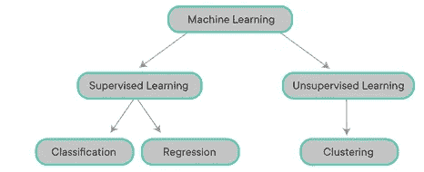
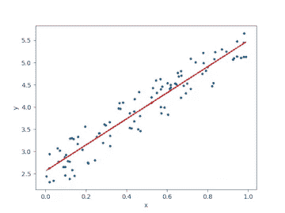
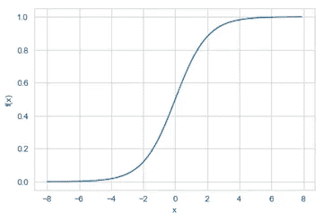
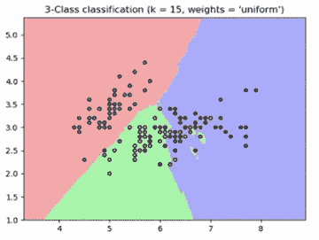

# 机器学习算法的类型

> 原文：<https://medium.com/analytics-vidhya/types-of-machine-learning-algorithms-8ac09d58f7f2?source=collection_archive---------19----------------------->

## **简介:**

机器学习是人工智能的一个应用，它为系统提供了从数据和经验中自动学习的能力，而无需显式编程。

关于机器学习可以用于什么目的，存在一些变化:

*   监督学习
*   无监督学习

## **监督学习:**

监督学习是学习从输入变量(x)到输出变量(y)的映射函数的任务。它被称为监督学习，因为算法从训练数据集学习的过程可以被认为是教师监督学习过程。

监督学习可用于回归和分类问题:

**回归:**当输出变量为实值和/或连续值如“工资”或“身高”时。

**分类:**当输出变量为“热”对“冷”或“绿”对“红”对“蓝”等类别时。

受监督的机器学习算法的一些流行示例是:

*   **线性回归** →试图对标量响应和一个或多个解释变量之间的关系进行建模的线性建模方法

线性回归

*   **逻辑回归** →使用逻辑函数模拟二元因变量的统计模型

逻辑回归

*   **K-最近邻** →一种惰性学习，根据最相似的点对数据点进行分类

k 近邻

*   **决策树** →结构类似流程图的模型，每个问题都有助于进一步分离数据
*   **随机森林** →由许多决策树组成的模型，每个决策树提供自己的分类。随机森林收集分类并选择投票最多的预测作为结果
*   **梯度推进算法(即 XGBoost)** →一种用于回归和分类问题的技术，以弱预测模型(通常为决策树)的集合形式产生预测模型。它以分阶段的方式建立模型，并通过允许优化任意可微分损失函数来概括它们。

## **无监督学习:**

当只有输入数据，而没有相应的输出变量时，使用无监督学习。它被称为无监督学习，因为与监督学习不同，没有正确的答案。算法自行决定和理解数据中的模式。

无监督学习可用于聚类和关联问题:

**聚类:**发现数据集中的内在分组

**关联:**发现描述部分数据的规则(例如购买产品 X 的人也倾向于购买产品 Y)

无监督机器学习算法的一些流行示例是:

*   **K-means** →一种矢量量化的方法，旨在将 *n* 个观测值分成 *k* 个簇。每个观察值都属于具有最近平均值的聚类。
*   **层次聚类** →一种寻求构建聚类层次的算法。端点是一组群集，其中每个群集都不同于其他群集，并且每个群集内的对象大体上彼此相似。

## **参考文献:**

*   布朗利，杰森。"有监督和无监督的机器学习算法."*机器学习掌握*，2020 年 3 月 16 日，machinelingmastery . com/supervised-and-unsupervised-Machine-Learning-algorithms/。
*   Sunil Ray。"常用的机器学习算法:数据科学."*分析 Vidhya* ，2015 年 8 月 10 日，[www . analyticsvidhya . com/blog/2017/09/common-machine-learning-algorithms/。](http://www.analyticsvidhya.com/blog/2017/09/common-machine-learning-algorithms/.)
*   t .博克(2020 年，2009 年 12 月)。什么是层次聚类？检索于 2021 年 1 月 3 日，来自[https://www.displayr.com/what-is-hierarchical-clustering/](https://www.displayr.com/what-is-hierarchical-clustering/)