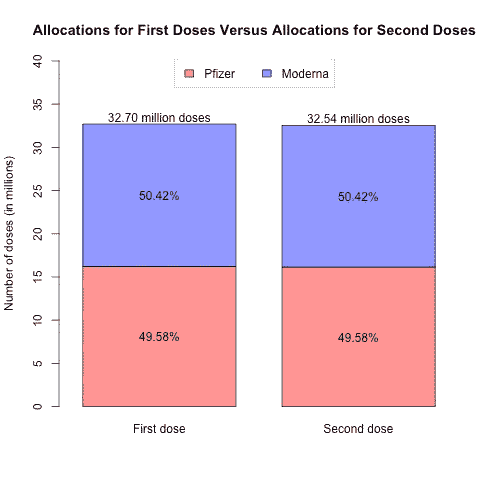
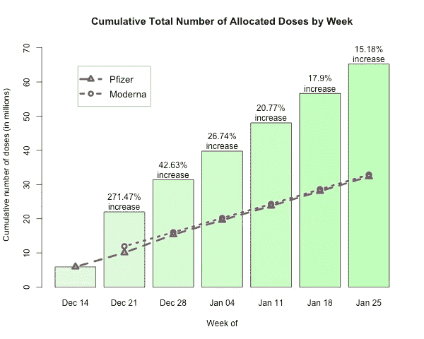
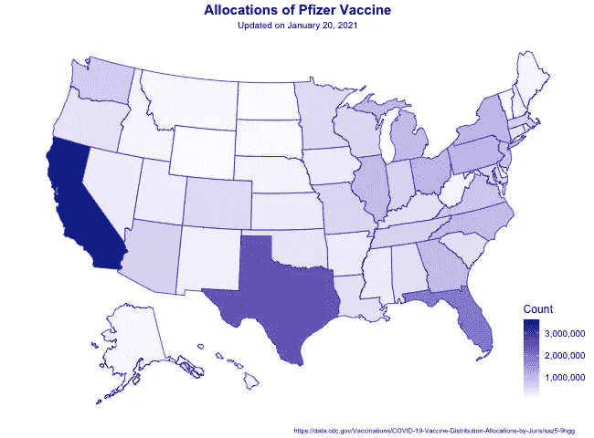
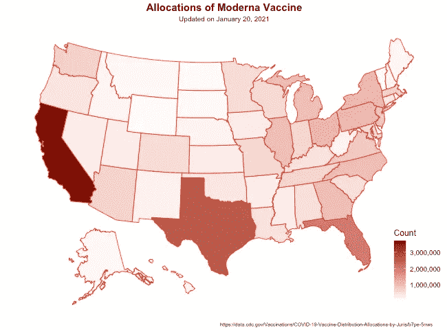
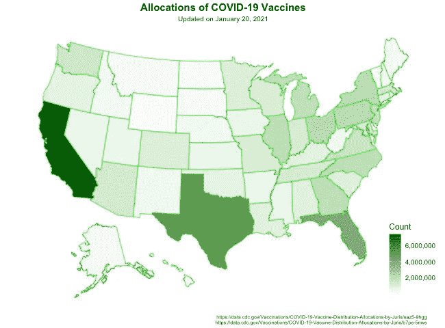
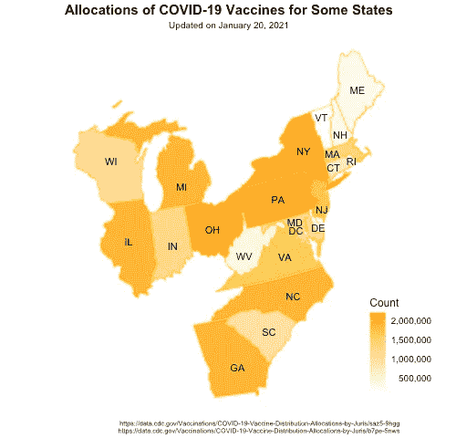

# 美国新冠肺炎疫苗分配图

> 原文：<https://medium.com/analytics-vidhya/u-s-maps-of-covid-19-vaccine-distribution-allocations-2709548cde8a?source=collection_archive---------24----------------------->

*(2021 年 1 月 20 日更新)*

16 岁及以上的美国人接受第一剂辉瑞-生物科技疫苗(简称辉瑞)已经一个多月了，这是目前在美国上市的两种新冠肺炎疫苗之一。另一种疫苗名为 Moderna，四天后(12 月 18 日)被批准用于 18 岁及以上的人群。卫生与公众服务部[发布了](https://www.hhs.gov/coronavirus/covid-19-vaccines/distribution/index.html)两个数据集，每种疫苗一个，是每周分配给不同州和管辖区的剂量数。让我们通过两个图表和四个地图来快速浏览一下这些数字。(有关数据集的更多信息，请访问本文末尾的链接。)

## 第一剂与第二剂的分配

辉瑞和 Moderna 均以两个剂量系列给药。美国萨摩岛、关岛和马里纳群岛同时接受两种剂量。对于所有其他州和管辖区，可在第一剂的同时订购第二剂，但直到 21 天(对于辉瑞)或 28 天(对于 Moderna)后才分发，这是第二剂的给药时间。

下图显示了所有州和管辖区第一剂和第二剂的总分配。第一剂的数量略高于第二剂。请注意，在数据集中，对于同时接受第一剂和第二剂的辖区，第二剂的数量计入第一剂的数量。关于每种疫苗的比例，Moderna 的分配比辉瑞的分配多，但只比第一剂(或 277，575 剂)多 0.85%，比第二剂(或 272，225 剂)多 0.84%。

## 每周分配剂量的累计总数

如下图所示，疫苗总剂量的最大增长发生在 12 月 21 日这一周，这是 Moderna 投入使用的第一周。事实上，在那一周，Moderna 的分配量是辉瑞的 2.88 倍(11，938，600 剂对 4，143，750 剂)。从那以后，每周的分配都很稳定——平均每周 4455750 剂辉瑞和 4191560 剂 Moderna。这解释了累积总剂量数的百分比增长下降(从 12 月 28 日那周的 42.63%增长到 1 月 25 日那周的 15.18%)。

## 分布分配图

现在让我们来看看几周内的总分配图。我们有一张辉瑞分配图，一张 Moderna 分配图，还有一张两种疫苗的总分配图。

这三张地图都告诉我们以下信息:

*   加利福尼亚州接受的疫苗剂量数量最多(共 7，326，550 剂)，其次是德克萨斯州(5，019，300 剂)，然后是佛罗里达州(4，010，650 剂)。考虑到这些州新冠肺炎病例的规模和数量，这并不奇怪。
*   总的来说，东海岸和东北中心地区的州比西海岸和西北中心地区的州受到的辐射剂量多。在西海岸，继加利福尼亚州之后，华盛顿州是疫苗分配数量最多的州，但其数量(总共 1，428，900 剂)仍低于俄亥俄州(2，204，450 剂)、宾夕法尼亚州(2，170，100 剂)和纽约州(2，149，350 剂)——见下图中东北、东北和南大西洋地区的放大图。

## 最后的想法

这篇文章中的可视化提供了美国新冠肺炎疫苗剂量分配的快速浏览。当然，有许多因素与这些数字有关，如州人口、病例数、州预算等。尽管如此，我们可以通过这篇文章中的图表和地图来了解疫苗是如何在全国分发和使用的。据 [Worldometer](https://www.worldometers.info/world-population/us-population/) 统计，目前美国人口超过 3.32 亿，约为分配疫苗剂量总数(6524.3 万剂)的 5.09 倍。希望疫苗分配将很快赶上人口数量，这样生活在美国的每个人都可以获得急需的保护，免受这种已经干扰我们日常生活一年多的疾病的影响。

要访问数据集，请点击以下链接:

*   [按辖区划分的辉瑞分销分配](https://data.cdc.gov/Vaccinations/COVID-19-Vaccine-Distribution-Allocations-by-Juris/saz5-9hgg)
*   [司法管辖区的现代分销分配](https://data.cdc.gov/Vaccinations/COVID-19-Vaccine-Distribution-Allocations-by-Juris/b7pe-5nws)

要了解关于新冠肺炎的信息，请访问 https://www.cdc.gov/。