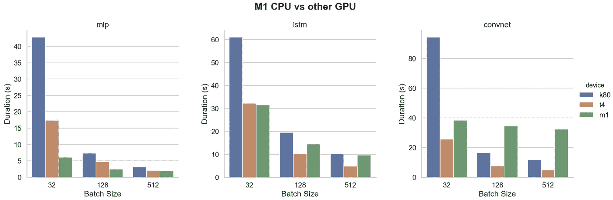

# 从 Ubuntu 18.04 到 MAC OS M1——开发者评论

> 原文：<https://medium.com/analytics-vidhya/ubuntu-18-04-to-macos-m1-developer-review-197dee99d80a?source=collection_archive---------7----------------------->


马丁·卡特勒在 [Unsplash](https://unsplash.com?utm_source=medium&utm_medium=referral) 上拍摄的照片

标题说明了一切。这只是一个简短的帖子，描述我作为一名机器学习工程师从 x86 机器上的 Ubuntu 18.04 切换到苹果芯片上的 MacBook Pro 的经历。我的观点是，作为一个以前从未使用过 mac 的人，下面的一些内容也适用于那些想换到旧 mac 的人，或者从旧 MAC 换到 M1 的人。

# 规格

```
- Machine: Lenovo ThinkPad L390
- OS: Ubuntu 18.04.5
- Processor: Intel® Core™ i7-8565U CPU @ 1.80GHz × 8
- Memory: 16GB
- Disk: 512GB
+ Machine: MacBook Pro (13-inch)
+ OS: macOS Big Sur 11.1
+ Processor: Apple M1
+ Memory: 8GB
+ Disk: 256GB
```

# 末端的

不要使用默认的 macOS 终端，我强烈建议使用 [iTerm2](https://iterm2.com/) 来代替。它*包含了*你永远不会想到终端会有的功能。

不过不管用哪个，一定要用`Rosetta`(其实是 Rosetta 2)打开。这应该会自动安装自己，并负责翻译 x86 代码，使其与 Apple Silicon 兼容。更详细的说明可以在[这里](https://www.notion.so/Run-x86-Apps-including-homebrew-in-the-Terminal-on-Apple-Silicon-8350b43d97de4ce690f283277e958602)找到。

最后，mac 上的默认 shell 是`zsh`，而如果你来自 Ubuntu，你会习惯于标准的`bash`。`zsh`附带了很多`bash`所没有的很酷的特性，但是如果你想坚持你所知道的，你可以使用以下命令将你的默认 shell 设置为 bash:

```
chsh -s /bin/bash
```

# 包管理器

你可能会习惯使用`apt`，但在 mac 上你应该改用`homebrew`。假设你已经用 Rosetta 打开了你的终端，你应该能够按照他们网站上的说明顺利安装`homebrew`。它的用法和`apt`很像。

# 计算机编程语言

macOS 附带了 python 2.7 安装。如果你和大多数 pythonistas 一样使用 3.x，可以考虑卸载。**请勿卸载。我不知道为什么，但它可以破坏你的整个操作系统。更多信息[点击这里](https://stackoverflow.com/questions/3819449/how-to-uninstall-python-2-7-on-a-mac-os-x-10-6-4)。就这样吧，在虚拟环境中设置你想要的 python。**

在这一点上，许多人报告了让`pyenv`(或一般的虚拟环境)在 M1 上正常工作的问题，并因此在环境中安装了库。我设法通过在我的虚拟环境中使用`conda`来完全避免这种情况。如果可以避免的话，我倾向于不安装带有`conda`的包(尽管他们建议),而只在`conda`环境中使用`pip`。因此，我的环境或任何库都没有任何问题。

# 深度学习图书馆

假设你已经按照我上面所做的做了，你应该能够安装`tensorflow`和`pytorch`，使用`pip`作为标准没有问题。然而，他们的表现完全是另一回事。

## 张量流

苹果公司好心地提供了一个`tensorflow`的[分支](https://github.com/apple/tensorflow_macos)，它已经被调整为在苹果芯片上运行，无需 Rosetta。如果你安装了这个版本的`tensorflow`(而不是如上所述使用 pip)，你应该可以享受 M1 提供的显著加速。

你可以在网上找到各种基准测试 M1 性能的帖子，但我遇到的最好的一个是[这个](https://towardsdatascience.com/benchmark-m1-vs-xeon-vs-core-i5-vs-k80-and-t4-e3802f27421c)，它比较了苹果的`tensorflow` fork 和 GPU 上的常规`tensorflow`。下面的图表(转载自博客帖子)显示了 M1 如何在使用 3 种不同批量训练 3 种不同模型时与英伟达的 K80 和 T4 GPU 进行比较。



从这张图表中，我们可以了解到 M1 与 Nvidia GPUs 相比的一些情况:

*   它在小批量时表现更好，大大超过 K80，与 T4 不相上下
*   较大批量的性能提升是非常缓慢的，例如，在训练时，批量增加了 4 个数量级(32 到 512 ), LSTM 只为 M1 提供了 3 倍的加速，而 K80 和 T4 都获得了 6 倍的加速
*   它在卷积中的表现相对较差，在批量较大的情况下，它实际上比 K80 慢得多

## Pytorch

不幸的是，`pytorch`的情况完全不同。没有 Apple fork，而且`pytorch`本身还不支持 Apple silicon，所以我们坚持使用 Rosetta，这严重影响了我们的性能。github 上有很多关于这个的讨论。[这个](https://github.com/pytorch/pytorch/issues/47702)是关于这个问题的最佳线索。

我没有任何官方的基准数据，但是根据我目前的经验，`pytorch`在 M1 上的表现可以和我以前的机器相媲美。如果有的话，它实际上可能会慢一点，但没有什么重要的。

# VS 代码

我大部分时间使用 VS 代码作为我的 IDE。这也不支持 M1，所以实际上比我以前的机器要慢得多。并非令人沮丧，只是明显如此。然而，支持已经在前沿版本中引入，称为 [VS 代码内部人员](https://code.visualstudio.com/insiders/#osx)。简单试用后，老实说，我没有发现太大的区别，所以我决定继续使用稳定版本，只等待 mac ARM 版本。

到目前为止，我遇到了一些问题:

*   集成终端卡在前面提到的系统 python 2.7 上。这似乎也是老款 MAC 电脑的一个问题。修复它[这里](https://stackoverflow.com/questions/54582361/vscode-terminal-shows-incorrect-python-version-and-path-launching-terminal-from)。(你只需要修改`settings.json`)
*   python `multiprocessing`在只使用集成终端时似乎不能正常工作(它崩溃了，出现奇怪的日志)——但是当从普通终端调用运行它的脚本时，它工作得很好。我不确定确切的问题是什么，但我知道我没有使用 Linux
*   扩展市场空无一物。不知道这里发生了什么，最终我只是重启解决了问题

# 浏览器

这里的情况相当好。Chrome 和其他公司(例如 [Brave](https://brave.com/) )很快引入了支持，与 M1 上的 x86 版本相比，差异是巨大的(可能也比我的旧机器上的 x86 版本略快)。我使用 Brave，M1 上的 ARM 版本和机器自带的原生 Safari 一样快。

# 多方面的

*   Ubuntu 18.04 随 OpenJDK 版本 11 一起安装，非常方便。在 mac 上不是这样，需要单独安装
*   Git autocomplete 确实可以开箱即用。修复[这里的](https://stackoverflow.com/questions/14970728/homebrew-s-git-not-using-completion)
*   没有开箱即用的`wget`，需要单独安装

最后，与开发无关，但值得一提的是:

*   电池寿命是。一次充电我可以轻松工作一整天，并且在结束时仍然有足够的电池，这仍然让我感到惊讶。风扇非常安静，也不会发热。
*   显示器是。4k 视网膜显示器几乎太放纵了。不是真正的游戏改变者，但它绝对是一个不错的选择
*   [阿福](https://www.alfredapp.com/)是。这是一个生产力应用程序，让你的生活更轻松(仅在 mac 上可用)

# 结论

如果您刚刚开始使用 M1，希望以上内容能够帮助您在开发方面打好基础。谢天谢地，到目前为止，我的体验相当不错，尤其是考虑到早期采用者总会遇到初期问题。

然而，如果你仍然在考虑冒险，我可能会建议推迟几个月，因为错误已经解决，更多的应用程序/库(特别是`pytorch`)将原生支持 ARM 硬件，因为使用 Rosetta 确实会显著限制 M1 性能。

*原载于 2021 年 1 月 20 日*[*https://Amin-nejad . github . io*](https://amin-nejad.github.io/2021/01/20/ubuntu-to-mac/)*。*