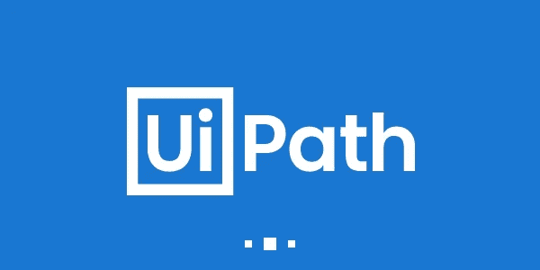
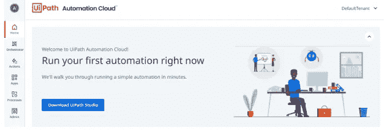
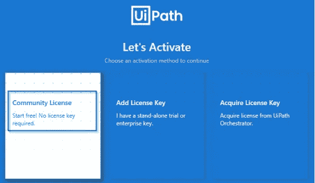
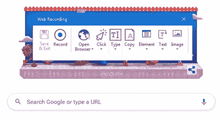
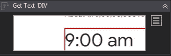
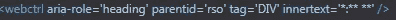
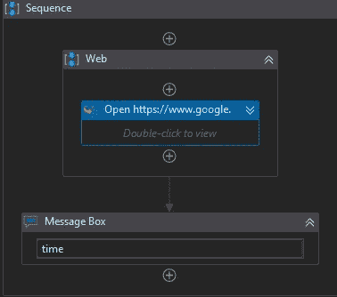
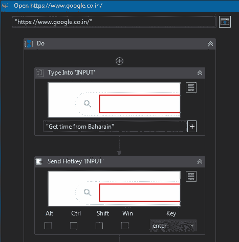
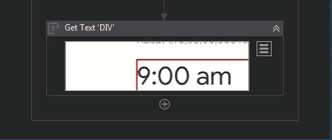

# UiPath —动手操作(基础— 1)

> 原文：<https://medium.com/analytics-vidhya/uipath-hands-on-ede94d3a765d?source=collection_archive---------2----------------------->

UiPath 是领先的 RPA 软件，充当 RPA 工具，您可以在其中自动执行重复性、预测性和需要大量手动工作的任务。UiPath 作为一个平台，您可以在其中执行 Citrix 自动化、PDF 自动化、Web 自动化和 Windows 桌面自动化。

机器人有两种类型，有人值守机器人和无人值守机器人。有人值守机器人是机器人需要人类干预的地方，它可能是我们作为用户必须做的条件或触发。在无人值守的机器人中，不需要人工干预，机器人可以完成任务并相应地获取结果。这些机器人可以通过 Orchestrator 进行调度、监控和跟踪。

Orchestrator 是一个 web 应用程序，它使您能够在执行重复的业务流程时协调您的 UiPath 机器人。Orchestrator 允许您管理环境中资源的创建、监控和部署。它充当第三方解决方案和应用程序的集成点。

## 如何安装 Uipath 软件？

1.  前往[https://www.uipath.com/](https://www.uipath.com/)，点击免费试用 UiPath
2.  注册通过邮件，你会得到邮件激活

3.登录后，您将看到下面的屏幕

4.单击下载 UiPath Studio

5.然后点击社区许可，您将获得观看、学习、学习学院和探索 UiPath 的链接

6.耶，你已经安装了 UiPath，让我们开始吧…

## UiPath 中的迷你项目

目的:使用网络录音通过谷歌搜索获得德国时间

*压惊套餐*

转到工具→在 UiPath 扩展中→安装 Chrome 包/所需的 web 浏览器包，并在相应的 web 浏览器中启用 UiPath 扩展

步骤 1:在新项目->流程中

步骤 2:将空白流程命名为 Get Time of Germany

步骤 3:单击打开主工作流

步骤 4:从活动面板中拖放一个序列

步骤 5:转到录音，然后单击 web

步骤 5.1:单击打开浏览器活动，并指明找到的 URL

第 5.2 步:点击输入，指示文本栏输入，输入“从德国获取时间”

步骤 5.3:在类型下拉列表中选择发送热键，并在键中通过指示谷歌搜索的文本栏输入

步骤 5.4:转到文本，给出副本文本，并指出当前时间

第六步:然后保存并退出

一旦序列在 UiPath studio 上，转到这个活动，点击导航栏，在 UI Explorer 中打开

选择内部文本，并使用包含一个或多个字符的 regex *代替 9.00 am，因此将 inner text 更改为*:* * * * *

现在创建一个变量，将 Get text 的输出存储到一个名为 Time 的变量中，并将它的范围改为 main 序列

通过消息框活动打印时间

## 工作流程截图

既然我们已经在即将到来的项目中看到了记录和选择器修改的概念，我们将研究更高级的框架和项目。

快乐学习！