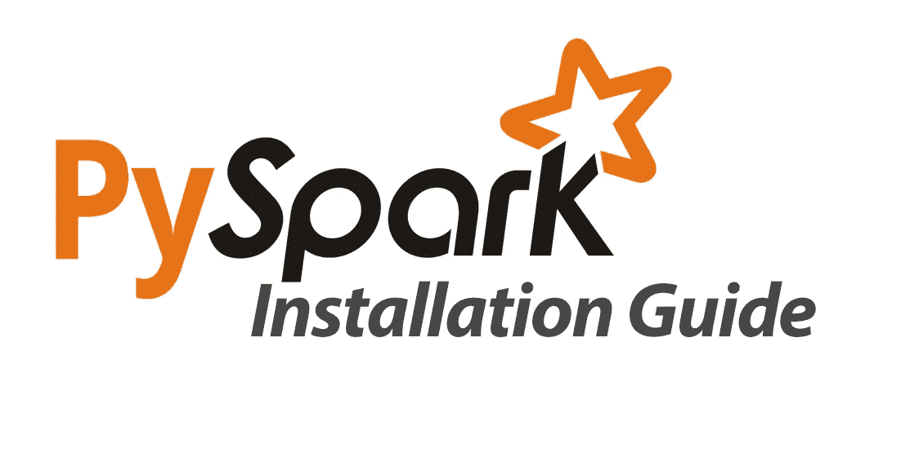

# 在 Google Colab 中设置 PySpark 的终极指南

> 原文：<https://medium.com/analytics-vidhya/ultimate-guide-for-setting-up-pyspark-in-google-colab-7637f697daf1?source=collection_archive---------8----------------------->



Google Colab 安装指南

PySpark 是一个用于 Apache Spark 的 Python API，允许您利用 Python 的简单性和 Apache Spark 的强大功能来驯服大数据。

学习 PySpark 可以提升你的市场价值。根据奥赖利的调查，学习火花比获得博士学位对你的薪水有更大的影响！

然而，在个人电脑上安装 Pyspark 是一个[漫长的任务](https://www.dataquest.io/blog/pyspark-installation-guide/)，它会占用你电脑的大量内存，可能会阻碍你开始学习。希望你可以很容易地在 Google Collab 上设置它，在这篇文章中，你将学习如何去做。我们开始吧！

# 安装 PySpark

在 [Google Colab 中打开一个新笔记本](https://colab.research.google.com/)运行下面的代码:

```
!apt-get install openjdk-8-jdk-headless -qq > /dev/null
!wget -q [https://downloads.apache.org/spark/spark-3.1.1/spark-3.1.1-bin-hadoop2.7.tgz](https://downloads.apache.org/spark/spark-3.1.1/spark-3.1.1-bin-hadoop2.7.tgz)
!tar -xvf spark-3.1.1-bin-hadoop2.7.tgz
!pip install -q findspark
!pip install pyspark
```

您可能知道，当我们想要在 Jupyter 笔记本中运行命令 shells 时，我们用符号(**)开始一行。)**让 GC 知道我们想要一个 shell。然后第一行将安装 **JDK Java** 。

第二行将使用命令 **wget** 下载 **PySpark** 。在这里，检查链接是否启用以及我们使用的是最新的 PySpark 版本是非常重要的。要验证其可用性，请访问[官方网站](https://downloads.apache.org/spark/)并选择最新的 3.x 版本。 **tar** 行将解压所有下载的 PySpark 文件。最后，最后两行将使用 **pip** 命令安装 **findspark** 和 **pyspark** 模块。

# 运行 PySpark

现在您已经在 Colab 中安装了 Spark 和 Java，是时候设置环境路径了，这样您就可以在您的 Colab 环境中运行 Pyspark。通过运行以下代码设置 Java 和 Spark 的位置:

```
import os
os.environ["JAVA_HOME"] = "/usr/lib/jvm/java-8-openjdk-amd64"
os.environ["SPARK_HOME"] = "/content/spark-3.1.1-bin-hadoop2.7"
```

最后，运行一个本地 SparkSession 来测试您的安装:

```
import findspark
findspark.init()
from pyspark.sql import SparkSession
spark = SparkSession.builder.master("local[*]").getOrCreate()
```

恭喜你。您的笔记本已经可以运行和使用 PySpark 了！:)