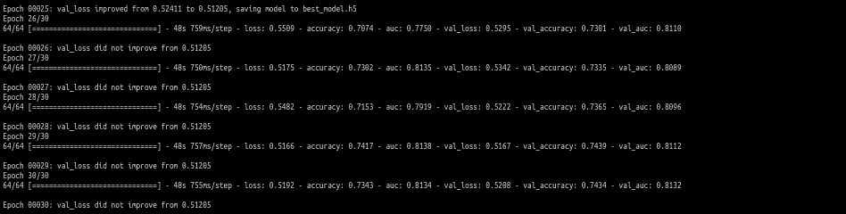
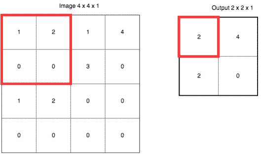

# 超声神经分割:(端到端图像分割案例研究)

> 原文：<https://medium.com/analytics-vidhya/ultrasound-nerve-segmentation-an-end-to-end-image-segmentation-case-study-ec88bfed0894?source=collection_archive---------1----------------------->

Johannes Plenio 在 [Unsplash](https://unsplash.com/s/photos/nature?utm_source=unsplash&utm_medium=referral&utm_content=creditCopyText) 上拍摄的照片

> 医院病床是一辆停着的出租车，还开着计价器。
> 
> 格劳乔·马克斯

任何一个去过医院或者有亲人住院的人都知道这是一种多么可怕的经历。没有人愿意在病床上多呆一个小时。但是，如果患者接受手术，他们可能需要在手术期间和手术后进行麻醉，以减轻手术带来的疼痛。现在，为了减轻这种疼痛，最常见的方法是对病人进行局部麻醉，只麻醉手术周围的区域，同时病人的意识保持完整。这个过程被称为周围神经阻滞 **(PNB)。这是通过在传递疼痛的神经上应用麻醉药物来实现的。还经常使用输液导管，用药物浸泡神经 2-3 天。之后，患者或其护理人员可以将导管移除。因此，在某些情况下，病人可以在手术当天出院。**

为了识别神经结构，获取包含神经的区域的超声图像，但是即使对于本领域的专家来说，识别也是一项重要的任务，因为超声生成的图像受到回波扰动和斑点噪声的影响。

在这个案例研究中，我们将了解如何利用尖端的深度学习技术来构建一个端到端的系统，在这个系统中，一个人只需输入该区域的超声图像，深度学习模型就会分割图像中存在的神经。

听起来很有趣，对吗？！

解决现实世界的问题总是很有趣。以下是本案例研究的流程

1.理解业务问题

2.最大似然和最大似然问题公式的适用性

3.数据源

4.现有方法的文献综述

5.获取结构化数据

6.系统模型化

7.部署

8.未来的工作

9.参考

10.关于作者

在我们开始之前，这里有一些你需要了解的主题，以便理解这篇博客的其余部分:

[深度学习](https://www.ibm.com/cloud/learn/deep-learning):它是机器学习的一部分，依赖于建立模仿大脑神经元的深度或多层神经网络。

[https://en.wikipedia.org/wiki/Deep_learning](https://en.wikipedia.org/wiki/Deep_learning)

卷积网络:这是一种深度学习算法，适用于图像。如果你想知道 CNN 是什么，就跟着 t[this](https://www.freecodecamp.org/news/an-intuitive-guide-to-convolutional-neural-networks-260c2de0a050/)走，如果你已经知道，就忽略它...

[https://link . springer . com/article/10.1007/s 40120-019-00153-8](https://link.springer.com/article/10.1007/s40120-019-00153-8)

[图像分割](https://www.analytixlabs.co.in/blog/what-is-image-segmentation/):这是物体检测的下一步，我们的任务是识别物体的位置并在它周围画一个边界框。这是一个过程，其中基于图像中存在的对象的类别数量，将数字图像的像素划分为子组。

1.  **了解业务问题**

PNB 的成功很大程度上取决于麻醉剂被应用在精确的位置这一事实。这是一场 Kaggle 比赛，主持人希望我们从超声波图像中识别出[臂丛](https://en.wikipedia.org/wiki/Brachial_plexus#:~:text=The%20brachial%20plexus%20is%20a,rib%2C%20and%20into%20the%20armpit.)神经。为此，我们被给予超声图像和对应于包含神经的像素位置的图像的掩模。我们的任务是仅从超声波图像中识别神经。我们需要遵守的几个业务约束是:

*   我们的模型预测的包含神经的区域应该是非常精确的，没有任何偏移。并且模型的预测应该无遗漏地覆盖整个区域。即使是轻微的偏差也可能给患者带来严重的术后疼痛，甚至更糟。
*   由我们的模型做出的预测应该对领域专家有意义，即，我们可以在原始图像上覆盖预测的掩模。

2.**ML 和 ML 问题公式化的适用性**

超声图像通常是有噪声的。即使对于专家来说，精确地找到神经模式也是困难的。但是最近随着深度学习和计算机视觉领域的进步，已经看到像在图像中寻找模式这样的任务可以很容易地自动化。

**ML 问题提法:**

对于从超声图像中检测神经的任务，我们被给予目标标签，即分割的掩模图像，因此我们将遵循监督学习方法，并且我们的任务将是建立能够预测臂丛神经的任何未来超声图像的分割掩模的模型

**3。数据来源**

对于这个案例研究，我们从 kaggle 收集了数据。

 [## 超声神经分割

### 识别颈部超声图像中的神经结构

www.kaggle.com](https://www.kaggle.com/c/ultrasound-nerve-segmentation/data) 

我们获得了以下数据:

训练文件夹:它包含超声波图像和臂丛神经的屏蔽。

图像命名为**'*subject no _ imageno . TIF '****，蒙版命名为****' subject no _ imageno _ mask . TIF '。*** 我们总共有 47 个对象，每个对象大约有 120 个图像和蒙版，因此总共有 5635 个图像要训练。

文件夹中的掩码由领域专家培训的人员进行注释。

从最初的数据分析中，我们发现了以下细节:

*   **学习能力:**数据集中可能存在冲突的图像遮罩对，即文件夹中有相似的图像，一个图像包含遮罩，另一个不包含遮罩。如果存在，它可能会混淆我们的模型。

现在我们已经制定了我们的 ML 问题，让我们看看我们将如何评估我们的模型的性能。

**并集上的交集(IoU)** :也称为 Jaccard 指数，是图像分割最常用的度量。它量化了地面真实标签和我们的预测标签之间的重叠量。

来源:维基百科

IoU 的值在 0-1 之间，0 表示实际值和我们的预测值没有重叠，1 表示实际值和预测值完全重叠。

[**损失:**](https://towardsdatascience.com/importance-of-loss-function-in-machine-learning-eddaaec69519) 我们选择的损失函数需要与我们想要优化的对齐，并且必须是可微的。为此，我们选择骰子损失作为我们的损失函数。

骰子系数=2 * |A∩B|/(|A| + |B|)

骰子损失= 1-骰子系数

与 IoU 不同，骰子损失是可微分的，我们也可以用它来最大化真实值和预测值之间的重叠。

4.**文献调查:**

医学图像分割是图像分割的主要应用之一。但在各种医学图像中，如 MRI、CT 扫描等，超声图像被认为是最难处理的。这归因于此类图像中存在的[斑点噪声](https://en.wikipedia.org/wiki/Speckle_(interference))。但是今天的研究人员已经能够想出处理超声波图像的方法。我们从以前的方法中收集到的关于如何处理超声图像的一些见解是:

*   中值滤波是消除散斑噪声最有效的工具之一
*   全卷积网络架构主要用于图像分割。
*   U-Net 及其变体是可用于医学图像分割的最佳架构之一。
*   膨胀卷积可以用来减轻空间信息的损失。

有了这些信息，让我们从案例研究开始...

**5。数据预处理**

将数据下载并解压缩到本地系统后，我们将拥有一个训练文件夹、测试文件夹和包含训练图像遮罩的编码像素值的 CSV 文件。我们将从每个图像中提取图像名称和主题名称。在 train 文件夹中，我们将为每个训练图像创建一个遮罩。因此，为简单起见，我们将创建一个包含 4 列的数据框，即图像名称、主题名称、图像路径和遮罩路径。

既然我们的数据框已经创建，让我们来看看单个数据点是什么样子的...

在探索数据的过程中，我们观察到有几个冲突的图像和遮罩对，即对于看起来相似的图像，一个包含遮罩，而另一个不包含。这对一个人来说是令人困惑的，而且肯定会对模型造成困惑。看看下面...

上面两幅图像的相似度 I[index](https://en.wikipedia.org/wiki/Structural_similarity#:~:text=The%20structural%20similarity%20index%20measure,the%20similarity%20between%20two%20images.)为 1.0，但是通过观察它们的遮罩，我们发现一幅包含神经，而另一幅则没有。为了平稳地训练我们的模型，我们需要移除所有这样的冲突实例。计算如此多的图像之间的相似性花费了太多的时间，所以我们减少了图像的大小，并以较低的分辨率计算图像之间的相似性。这加快了进程...

在每个图像之间创建相似性字典...

存储相似度> 0.99 的图像的关键字。

从冲突的图像对中丢弃不包含遮罩的图像。

**6。建模**

为了建立一个将进行分割的模型，我们应该首先训练一个分类器，其任务是预测图像是否包含神经。如果它预测**“是”**，那么我们将图像转发给分割器。

在我们继续构建分类器之前，我们首先必须定义将图像和标签输入模型进行训练的管道。为此，我们决定使用 TensorFlow 数据管道...

现在让我们来看看分类器...

对于分类器，我们使用迁移学习方法，并使用在 imagenet 数据集上训练的 InceptionResnetV2 架构。

在训练分类器 30 个时期后，验证准确度没有进一步提高到 0.818 以上，因此我们在这一点上结束训练分类器。

现在让我们来看看用于细分的模型。我们将只在那些包含神经的图像上训练分割模型。

对于我们的细分模型，我们决定使用本文[中提到的架构](https://ieeexplore.ieee.org/document/9010317)。文中提到的架构是 U-net 的变体，被称为**优化结果网**。

灵感来自这篇[论文](https://ieeexplore.ieee.org/document/9010317)中提到的建筑

如你所见，它与 U-net 架构非常相似。唯一的区别是增加了 DAC 模块和 RMP 模块。让我们更详细地理解这个架构...

**编码器:**

上述编码器中的每个矩形块都是一个卷积运算，然后是批量标准化和最大池化。

**卷积:**

[https://the ano-pymc . readthedocs . io/en/latest/tutorial/conv _ 算术. html](https://theano-pymc.readthedocs.io/en/latest/tutorial/conv_arithmetic.html)

使用卷积的主要思想是，如果滤波器被设计成检测输入中的特定类型的特征，那么在输入中系统地应用该滤波器允许我们发现该特征，如果它存在于图像中的任何地方。这种能力通常被称为翻译不变性。简而言之，卷积运算允许我们检测输入图像中是否存在特征。我们用于这项任务的过滤器类似于神经网络中的权重，将通过反向传播来学习。

**批量标准化:**

像将我们的输入归一化到梯度下降一样的算法增加了收敛速度，在深度神经网络的情况下，将输入归一化到隐藏层也增加了神经网络的收敛速度。这是因为我们的输入在每一层传播时都会发生变化。内层的变化如此剧烈，以至于它与原始模型没有任何相似之处。此时，我们可以说内部协变量发生了变化。批处理规范化背后的思想是，即使输入值随时间变化，其平均值和标准差也将保持不变。因此，标准化将有助于减少这种协变量的变化。

**最大池:**

[https://laptrinhx . com/deep-learning-and-computer-vision-from-basic-implementation-to-efficient-methods-2808067501/](https://laptrinhx.com/deep-learning-and-computer-vision-from-basic-implementation-to-efficient-methods-2808067501/)

最大池不仅有助于快速减小图像的大小，而且有助于提取区域中最清晰的特征。

在编码器部分，我们看到图像的尺寸逐渐减小，但深度增加。你可以认为编码器试图了解图像中的“内容”。随着过滤器数量的增加，我们的模型可以提取图像中更复杂的信息。

现在让我们来看看稠密的 atrous 卷积块。

[https://ieeexplore.ieee.org/document/9010317](https://ieeexplore.ieee.org/document/9010317)

在理解上述架构之前，让我们先理解几个术语:

**阿特鲁卷积:**

*资料来源:卷积运算指南* [*杜默林等 2016【11】*](https://github.com/vdumoulin/conv_arithmetic)

阿特鲁或扩张卷积类似于在内核元素之间添加了孔的常规卷积。扩张的回旋倾向于指数地增加感受野。(感受野是影响输出特征图中单个像素的输入特征图的像素数。例如，在上面的 gif 中，扩张率为 2，感受野为 5*5)。这种在保持参数数量不变的同时增加感受野的想法非常有用。

**盗梦空间架构:**

Inception 是在不增加参数的情况下使用多种大小的内核的想法。使用多种尺寸的内核有助于我们检测不同尺寸的特征。

atrous 卷积和 inception 架构一起可以扩大感受野，也可以尝试不同大小的滤波器。

**剩余多核池(RMP):**

[https://ieeexplore.ieee.org/document/9010317](https://ieeexplore.ieee.org/document/9010317)

语义分割以及生物医学图像分割的一个挑战是准确分割不同大小的目标。大目标应该收集大的上下文信息，然而小目标需要小的上下文信息。使用 RMP 的想法是通过使用 4 个不同大小的池，我们获得不同大小的上下文信息。

**解码器:**

这不是像分类或对象检测那样的任务。这里，我们必须输出一个全尺寸的图像，其中所有像素都进行了分类。编码器部分仅捕获图像中存在的“内容”。解码器的任务是恢复目标在图像中的“位置”信息。为此，解码器使用转置卷积来增加图像的大小。

现在我们已经了解了所有的术语，让我们来了解一下细分的流程...

上面的代码做了以下事情

*   接受给定大小的 tiff 图像和蒙版，并对图像进行解码。
*   将图像和遮罩的大小调整为 128 * 128 *通道。
*   从所有可用的图像中创建一批图像
*   如果图像和遮罩是用于训练，那么应用各种增强，如翻转和旋转。
*   在请求之前使批处理准备就绪，以便更快地执行，并在请求时返回数据集。

下面是上面讨论的架构的代码:

让我们来定义回调...

我们使用“Adam”作为优化器，“dice loss”作为损失函数，使用“IoU”来评估性能。

安装发电机...

在训练了 45 个时期的分割模型之后，我们得到了 0.704 的验证 iou_score。

现在我们的分类器和分割器模型都已经训练好了，我们将在推理阶段把它们结合起来...

让我们通过验证集上的模型来可视化几个预测...

我们可以看到，我们的模型可以准确地从超声图像中分割神经。

让我们使用上面训练的模型来为测试数据集生成预测。

作为提交，kaggle 希望我们上传游程编码格式的预测，

在 kaggle 上提交我们的预测，我们在私人排行榜上获得了 0.64912 的分数。

7 .**。部署**

现在我们的模型已经准备好了，让我们看看如何部署它。有几个现成的库可以帮助我们部署我们的机器学习模型。streamlit 就是这样一个库。下面是使用 streamlit 进行部署的代码。

部署之后，我们的模型看起来像这样...

**8。未来工作**

*   探索使用变形金刚进行图像分割【https://arxiv.org/abs/2102.04306 
*   使用 TensorFlow lite 在移动设备中部署模型。

**9。参考文献**

*   论文:[https://ieeexplore.ieee.org/document/9010317](https://ieeexplore.ieee.org/document/9010317)
*   论文:[用于超声图像中淋巴结分割的 FCN](https://www.researchgate.net/profile/Lin-Yang-50/publication/312561521_Coarse-to-Fine_Stacked_Fully_Convolutional_Nets_for_lymph_node_segmentation_in_ultrasound_images/links/5a18a032a6fdcc50ade7e6a2/Coarse-to-Fine-Stacked-Fully-Convolutional-Nets-for-lymph-node-segmentation-in-ultrasound-images.pdf)
*   [理解语义分割](https://towardsdatascience.com/understanding-semantic-segmentation-with-unet-6be4f42d4b47)
*   [用于医学图像分割的 U-Net](https://paperswithcode.com/method/u-net)
*   [如何评价细分模型？](https://towardsdatascience.com/how-accurate-is-image-segmentation-dd448f896388)
*   [(课程)应用人工智能课程](https://www.appliedaicourse.com/)

**10。关于作者**

领英:【https://www.linkedin.com/in/baivab-dash 

github:[https://github.com/baivabdash](https://github.com/baivabdash)

**结论**

太好了！你坚持到了最后。如果您发现医学术语有任何不准确之处，请随时纠正。以上项目的 Github 库可以在[这里](https://github.com/baivabdash/Nerve-Segmentation.git)找到。欢迎在评论区提出任何问题或建议。

祝您愉快！！