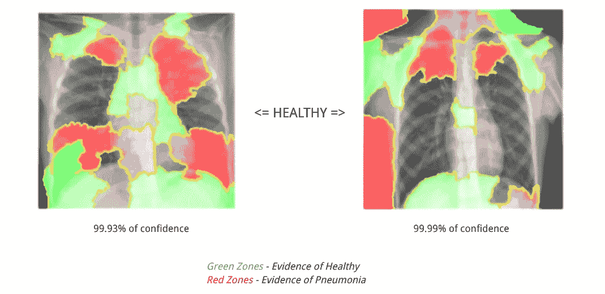

# 模型可解释性的不可避免性

> 原文：<https://medium.com/analytics-vidhya/unavoidability-of-model-interpretability-8f7d5a55a5f0?source=collection_archive---------10----------------------->

高分模型并不意味着它是可解释的，更糟糕的是，模型结果可能会产生误导。永远不要相信第一次就能给出 99%准确率的模型。像石灰、SHAP 或沙帕什这样的工具应该能提供大量信息。

合著者: [**亚尼夫·戈德弗里德**](https://www.linkedin.com/in/ygoldfrid/) ， [**达娜·韦利别科夫**](https://www.linkedin.com/in/danaraevsky/) ，[**亚伊尔·斯特梅尔**](https://www.linkedin.com/in/yairstemmer/)


可解释人工智能

我们查看了肺炎 T16 数据集 T17 挑战中几个具有高准确性的 kaggle 笔记本，我们决定检查它们的可解释性。该模型应该识别与医生相同的症状，如果不是，则某个地方有问题。最后，我们明白了高分模型并不意味着它是可解释的，更糟糕的是，模型结果可能会产生误导。

[](/@ODSC/explainable-ai-from-prediction-to-understanding-38c81c11460) [## 可解释的人工智能:从预测到理解

### 仅仅做预测是不够的。有时候，你需要产生深刻的理解。仅仅因为你是模特…

medium.com](/@ODSC/explainable-ai-from-prediction-to-understanding-38c81c11460) 

在本文中，我们将首先进行一个简短的 EDA，应用基线模型和 CNN 模型，最后进入算法的大脑，解释是什么让它以这种方式预测结果。

# 探索性数据分析

原始数据集由两个类组成:

*   健康的
*   肺炎(细菌或病毒)

我们正在处理总共 5856 张 x 光图像:


数据集稍微偏向“肺炎”类。

平均而言，被定义为健康的病人比生病的病人有更大更详细的 x 光图像。

这些图像看起来是这样的:


健康的病人


生病的病人

我们认为，没有受过医学训练的人无法区分这些图像。

我们通过观察图片得出的结论是:

*   一些图像在顶部或左中部显示字母 R
*   一些图像在右上角或左下角显示文本
*   一些图像以小圆圈和线的形式显示用于肺炎类别的医疗设备
*   图像没有完全居中
*   在所有图像中，胸部并不完全垂直
*   胸部宽度因图像而异

# **试用基线模型**

为了应用基线模型(逻辑回归和随机森林),图像被调整大小(64*64)并转换成表格形式——每行代表一幅图像，每列代表相应的像素。


当随机森林和逻辑回归都在验证集上产生近乎完美的结果(没有执行数据泄漏)时，我们开始想知道无错预测的原因是什么？

使用内置的 sklearn API 来确定特征重要性是一个糟糕的选择，因为每个 X 射线都是唯一的，因此聚合特征重要性不是一个好的解决方案。由于每个像素代表一个独立的特征，应用石灰(伊莱，SHAP 或其他可解释性工具)没有意义。我们还是做了，对方法有个直觉，收到了以下图片。


随机森林模型中最重要像素的石灰结果


病人的 x 光片


模型热图

在这里，我们有一个用随机森林回归器分类为生病的 X 射线，用石灰解释了最重要的像素

*红色圆圈:围绕最重要像素解释* ***疾病***

*蓝色圆圈:围绕最重要的像素解释* ***健康***

基于热图做出决策的模型最重要的点:集中、定位于肺部，但也存在于图像边界

这个结果是不可靠的，大多数重要的像素都在边界上，并且它没有充分地基于患者的肺来做出决定。

# **转向神经网络**

为了训练 CNN 模型，我们决定采用迁移学习。由于该模型最初致力于帮助医生，我们选择了 MobileNet 模型。顾名思义，它的重量很轻，多用于移动应用。

像往常一样，我们忽略了完全连接的层，并确保学习率非常低(以避免灾难性的遗忘)。

模型的最终结构:


模型摘要

对测试集进行预测得到了以下结果:


混淆矩阵

准确率为:81.13%

召回率为 99.23%

0 =健康

1 =生病

在医疗领域，减少假阴性的数量(当病人生病时预测健康)是非常重要的，这就是为什么我们专注于回忆分数。

当我们开始思考是什么让模型做出决策时，我们对结果非常满意(它们与其他笔记本相似)。

**模型可解释性**

对我们来说极其重要的是，不要把这个模型当作一个黑匣子，而是要看看它的预测基于什么。

局部可解释的模型不可知解释(LIME，2016)背后有三个基本思想:

*   模型不可知论——对基础模型不做任何假设
*   可解释性—结果易于解释(表格或图像)
*   局部性——解释我们想要解释的实例的“邻域”

[](/dataman-in-ai/explain-your-model-with-lime-5a1a5867b423) [## 用石灰解释你的模型

### 比较 SHAP 和莱姆

medium.com](/dataman-in-ai/explain-your-model-with-lime-5a1a5867b423) 

让我们来理解石灰的语法

1.  实例化一个类

```
**explainer = lime_image.LimeImageExplainer()**
```

2.生成超像素，以便在做出决策时查看模型最常学习的地方

```
**explain_instance**(image, classifier, top_labels=2, hide_color=None, num_samples=1000, distance_metric=’cosine’)
```

*   **图像** —预处理的图像，用于 tf.keras API
*   **top_labels** —如果不是无，则忽略标签并为预测概率最高的 K 个标签生成解释，其中 K 是该参数。
*   **num_samples** —学习线性模型的邻域大小
*   **距离度量** —用于权重的距离度量。

```
**explanation = explainer.explain_instance(process_img(img_path)[0], model.predict,top_labels=2,hide_color=0,num_samples=1000,distance_metric=’cosine’)**
```

3.绘图的中间步骤

```
**get_image_and_mask**(label, positive_only=True, hide_rest=False, min_weight=0.0)
```

*   **标签** —用于解释的标签
*   **positive_only** —如果为真，仅获取有助于标签预测的超像素。否则，使用顶部 num_features 超像素，它可以是正的，也可以是负的
*   **hide_rest** —如果为真，返回图像的非解释部分变灰

以下是 LIME 制作的一些图像:



用石灰对健康病人的分析


病人的石灰分析

我们失望地得知，该模型主要将背景、四肢、骨骼和医疗设备作为健康或疾病的标志。

很明显，我们不能根据绑在病人身上的医疗设备或图像背景来定义病人是否生病。医疗器械在这里是因为病人生病了，它不是起源。图像背景更多地取决于放射科医师的方法，他可能更喜欢为生病的患者定义不同的位置，以提高结果的可视性。

# 结论

为了避免这种过拟合和可解释性问题，我们应该:

1.  使用**数据扩充**技术
2.  **裁剪图像**，使其仅包含肺部区域
3.  在图片上使用**颜色均衡**
4.  在给出预测(健康或患病)的同时，显示受影响肺部区域的**边界**
5.  使用来自**不同原点**的数据集

当我们知道模型应该如何做出决定时，深入处理可解释性是至关重要的。

> 如果我们希望模型帮助我们做出重要的决定，我们必须知道模型做出决定的原因。

这篇文章是由亚尼夫·戈德弗里德、达娜·韦利别科夫和亚伊尔·斯特梅尔共同完成的

[](https://www.linkedin.com/in/ygoldfrid/) [## Yaniv Goldfrid -以色列科技挑战赛-以色列特拉维夫| LinkedIn

### 查看 Yaniv Goldfrid 在世界上最大的职业社区 LinkedIn 上的个人资料。Yaniv 有 5 个工作列在他们的…

www.linkedin.com](https://www.linkedin.com/in/ygoldfrid/) [](https://www.linkedin.com/in/danaraevsky/) [## Dana Velibekov -数据科学家- Tipalti | LinkedIn

### 查看 Dana Velibekov 在世界上最大的职业社区 LinkedIn 上的个人资料。Dana 有 3 份工作列在他们的…

www.linkedin.com](https://www.linkedin.com/in/danaraevsky/)  [## 耶尔·斯特梅尔——数据科学家——伦戴| LinkedIn

### “选择一份你热爱的工作，你一生中就一天也不用工作”我对新技术和…

www.linkedin.com](https://www.linkedin.com/in/yairstemmer/) 

数据集:

[](https://www.kaggle.com/paultimothymooney/chest-xray-pneumonia/code) [## 胸部 x 光图像(肺炎)

### 5，863 张图片，2 个类别

www.kaggle.com](https://www.kaggle.com/paultimothymooney/chest-xray-pneumonia/code) 

延伸阅读:

[](/oss-by-maif/shapash-maif-releases-a-new-solution-for-a-more-transparent-ai-500a5589b1f4) [## 沙帕什:MAIF 发布了一个更透明的人工智能的新解决方案

### MAIF，一家法国相互保险公司。1934)，几年来一直致力于开源。我们发布了…

medium.com](/oss-by-maif/shapash-maif-releases-a-new-solution-for-a-more-transparent-ai-500a5589b1f4) 

第一个图像参考:

[](https://venturebeat.com/2021/01/12/a-new-technique-called-concept-whitening-promises-to-provide-neural-network-interpretability/) [## 一种叫做“概念白化”的新技术有望提供神经网络的可解释性

### 深度神经网络可以执行精彩的壮举，这要归功于它们极其庞大和复杂的参数网络…

venturebeat.com](https://venturebeat.com/2021/01/12/a-new-technique-called-concept-whitening-promises-to-provide-neural-network-interpretability/)