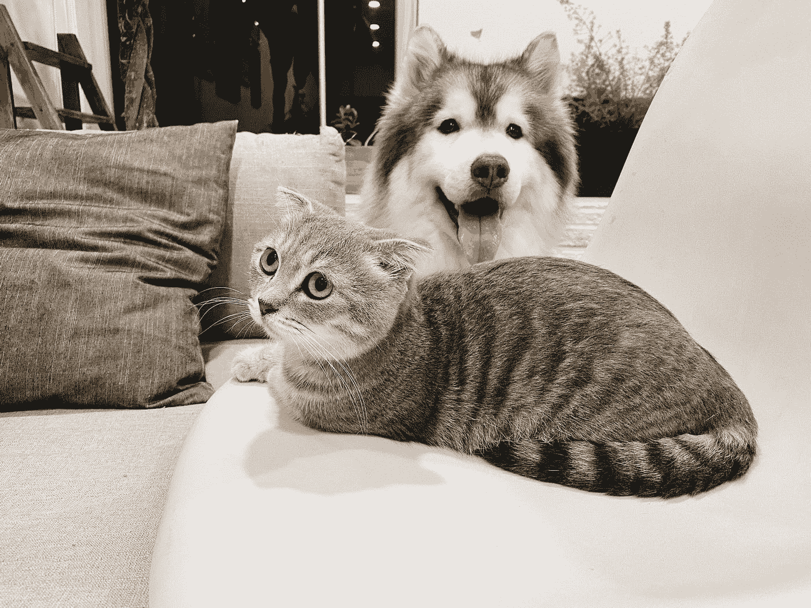

# 自动编码器下方和上方

> 原文：<https://medium.com/analytics-vidhya/under-and-over-autoencoders-3d695f428c1a?source=collection_archive---------21----------------------->

# 介绍

猫和狗(来源:图片由 [Unsplash](https://unsplash.com?utm_source=medium&utm_medium=referral) 上的[陈茂三潭](https://unsplash.com/@tranmautritam?utm_source=medium&utm_medium=referral)拍摄)

如果一个人看到同样大小的一只狗和一只猫的图像，并被问及什么图像会位于它们之间，明智的答案不会是取图像的像素值并取它们的平均值。不管听起来有多荒谬，合理的答案应该是某种半猫半狗的动物形象。

或者作为一个更明智的例子，考虑一个建筑物在夜间的图像。如果一个人想知道它在白天是什么样子，正确的方法不是选取单个像素，然后将亮度移向白色。目标图像应该考虑单个像素对阳光的反应，不同位置的像素对光的反应如何不同，以及其他多种因素。

照片由[拉希特·乔杜里](https://unsplash.com/@rachitchaudhary?utm_source=medium&utm_medium=referral)在 [Unsplash](https://unsplash.com?utm_source=medium&utm_medium=referral) 上拍摄

这两种情况的共同因素是，如果在像素空间中执行图像重建或修改，则给出相当不自然和糟糕的结果。然而，人类能够想象和想象这两种情况下最终的结果会是什么样子。人类绝对不是在像素空间思考。

# 潜在空间

人类能够处理图像并想象不存在的猫或狗的混合体会是什么样子，或者在晚上看着一座建筑并想象这座建筑在白天可能是什么样子的原因是因为人类的思维似乎在潜在空间中运作。潜在空间是包含潜在变量的抽象多维空间，潜在变量是对容易观察到的特征的有用通用信息/表示进行编码的特征向量。潜在空间包含实际向量的内部隐藏表示。它不仅适用于图像，也适用于任何类型的信息。

真实世界的高维数据应该位于嵌入在高维空间中的低维(潜在空间)流形中(流形假设)。捕获流形捕获潜在的空间特征，这将有助于学习数据的一般特征。例如，考虑用不同颜色表示多个类别的数据的三维瑞士卷表示。

图一。瑞士辊数据表示(来源:[https://i.stack.imgur.com/pa1FR.png](https://i.stack.imgur.com/pa1FR.png))

真实世界的数据存在于三维空间中。没有线性分隔符可以分隔这些类。然而，如果理解了实际的流形表示，不仅区分不同的类变得更容易，而且输入也更有效。

同样，潜在空间表示的学习迫使系统学习更有效的数据表示。

# 自动编码器

自动编码器是一种人工神经网络，用于以无监督的方式学习高效的数据编码。(维基百科)自动编码器过滤噪声，学习数据的编码(表示)是低维多维空间。由于没有目标变量，自动编码器的学习是无监督的。autoencoder 中的输出是从输入的编码表示中产生的。

## 为什么要预测我们已经知道是输入的输出呢？

将编码器产生的预测输出与输入进行比较。两者之差表示为损失，因此用于学习自动编码器内部的权重。计算损失的函数取决于输入类型和手头的任务。

图二。基本自动编码器

自动编码器有两个部分:

1.  编码器:它将输入转换成编码的表示。图 2 中的代码“h”是潜在空间。
2.  解码器:它接受编码的表示，并在此基础上提供输出。

## 一点数学的味道

## 重建损失

让损失用 *L* 来表示。损失可以计算为数据点的单个损失的平均值。

正如我们在计算中看到的，输入和输出都位于同一个维度( *n* )超空间中。编码表示位于由 *d* 表示的不同维度中。基于潜在空间的维度( *d* )，我们可以有两种类型的自动编码器。

# 欠自动编码器和过自动编码器

当 d < n 时，自动编码器欠自动编码器。它通过在信息可以传递和学习的维度/自由度上制造瓶颈，迫使学习输入的有效表示。

然而，当 d ≥ n(over-autoencoder)时，编码器和解码器可以是相同的函数，导致输出与输入相同。这是因为损失函数对输入和输出的不同进行惩罚。最简单的方法是不做任何改变地复制输入，这可以通过将输入信号通过编码器和解码器中的相同功能来实现。这里的自动编码器过拟合。Autoencoder 应该能够重建位于流形上的数据，忽略数据中代表噪声的点。强制策略是自动编码器应该只能重构位于流形上的一小组输入。自动编码器应该不能重建远离流形的数据点。

Under-autoencoder 的编码器和解码器层不能充当标识功能，因为潜在空间/隐藏层没有足够的维度来复制输入。

缺失像素(来源:[https://paperswithcode.com/task/facial-inpainting](https://paperswithcode.com/task/facial-inpainting)

例如，如果自动编码器在人脸图像上被训练，并且一个新的人脸被给定为去除了一部分(丢失/被遮蔽的图像)，则自动编码器应该只重建位于它已经学习的人脸流形上的那些像素。这类似于人类在观察一张部分脸后如何估算出其余的脸。自动编码器将随后应用于输入的任何变化视为噪声，并将其忽略，因为网络对这些点不感兴趣。

## 那为什么取 d ≥ n？

如果隐藏层(潜在空间)维度大于输入维度的过自动编码器很容易过拟合，并且可能以编码器和解码器都由单位矩阵表示而结束，那么使用它有什么意义呢？答案是更大的中间表示，即与输入空间相比扩展的空间，使得提取特征和优化更容易，因为有更多的空间可以移动。

然而，为了避免将输入数据直接复制到输出的单位矩阵问题，必须在数据流中引入约束。这些约束迫使网络选择更大的中间隐藏空间的选择性子集。

可以通过在输入中引入噪声(**去噪自动编码器**)来应用约束，并通过将输出与实际干净输入进行比较来学习权重。

降噪自动编码器

添加约束另一种方式是正则化项。**收缩自动编码器**将“隐藏表示相对于输入的梯度的平方范数”添加到重建损失中。虽然重建损失不利于对重建方向的不敏感性，但是梯度的平方范数不利于对任何方向的敏感性。重建损失的附加项通过增加偏差减少了隐藏层/潜在空间表示的变化。

收缩自动编码器(来源:[https://at cold . github . io/py torch-Deep-Learning/en/week 07/07-3/](https://atcold.github.io/pytorch-Deep-Learning/en/week07/07-3/))

由于过自动编码器是高方差模型，约束的引入减少了增加偏差的方差。这里的目标是达到最佳点，偏差的边际增加等于方差的边际减少，消除任何进一步权衡的理由。

# 结论

我们已经理解了自动编码器如何工作背后的基本思想，即通过试图找到数据的潜在空间表示来捕捉其实际的一般和最重要的特征。假设数据位于低维流形中，自动编码器试图从提供的数据中提取代表。