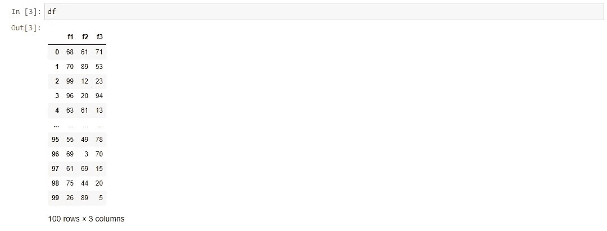
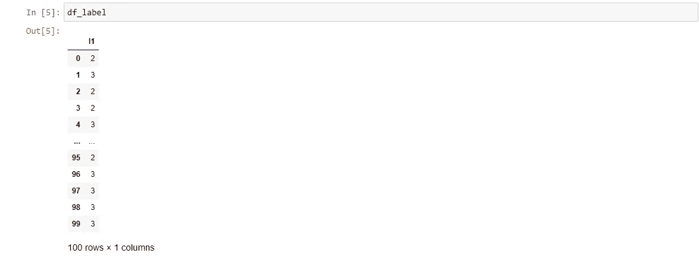
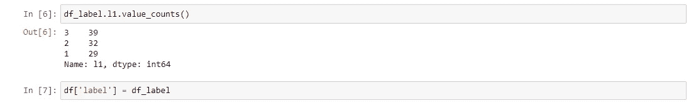
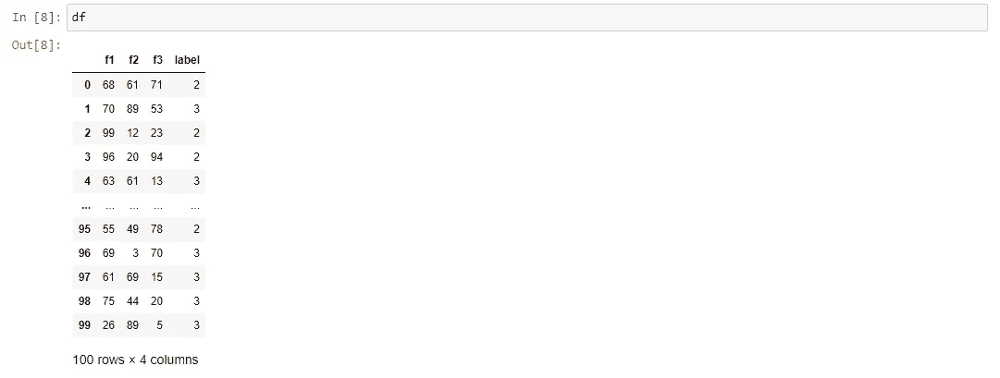
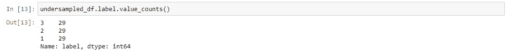
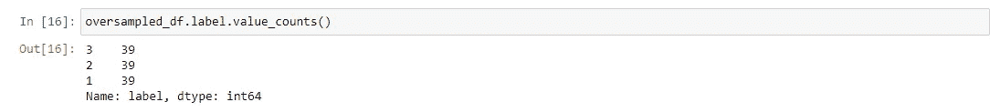

# 欠采样和过采样:新旧方法

> 原文：<https://medium.com/analytics-vidhya/undersampling-and-oversampling-an-old-and-a-new-approach-4f984a0e8392?source=collection_archive---------1----------------------->

**内容:** 1。简介
2。欠采样
3。过采样
4。动态欠采样和过采样

**简介:** 人们可以很容易地找到所有的数据集、语料库等等，而且即使不是全部，它们中的大部分都将处于原始和完美的状态。没有空值，平衡的类，大量的数据，每个数据科学家的完美数据集版本。唉，这或多或少是罕见的，几乎可以说是埃及人所说的“第四个不可能”。欠采样和过采样是用于解决数据集中不平衡类问题的技术。我们有时这样做是为了避免以牺牲其他类(不管是一个类还是多个类)为代价，用多数类来过度拟合数据。因此，在这篇文章中，我试图展示欠采样是如何工作的，过采样是如何工作的，最后我写了一个小惊喜，你可以在方便的时候使用。

**欠采样:** 实现这一点的一种方法或多或少是在名称上。欠采样意味着将所有类的数量与少数类或行数最少的类的数量相同。举个例子:我们有一个 100 行的数据集，有三个独立的列和一个依赖的特性，也称为类列。class 列有三个标签:1、2 和 3。标签 1 有 39 个实例，标签 2 有 32 个实例，标签 3 有 29 个实例。为了对上述数据集应用欠采样，我们必须将标签 1 和标签 2 减少到与标签 3 相同的实例数量。因此，在这个特定的例子中，每个标签有 29 个实例。让我们继续尝试这样做。

首先，让我们导入所需的库。

然后，我们接下来要做的是创建一个随机填充的三列 100 行的数据集。这些值的范围从 0 到 100。我们将这些列称为“f1”、“f2”和“f3”。

这个数据集应该是这样的。

图 01

现在,“df”数据帧中的这些列构成了特征。接下来，我们将创建标签类，命名为“l1”。

数据帧应该看起来像这样。

图 02

让我们看看新的随机创建的类的构成，然后我们将标签 DataFrame 添加到原始 DataFrame。

图 03

合并后，我们应该能够看到新的数据帧。

图 04

此时，数据框架已经完成，其中三列作为特征，一列作为类列。我们接下来要做的是改变所述数据帧，以拉平所有类的计数。我们将分配新的变量，每个变量都有每个类的计数。然后我们将创建新的数据帧，每个类一个。如果对我们为什么需要两者感到困惑，请允许我解释两者之间的区别。

第一行中的变量是数据类型为 *int* 的，将被用来告诉我们需要多少样本。虽然第 2 行和第 4 行之间的数据类型是 DataFrame，但每一行都是 DataFrame 的一部分，只包含一种类型的类。最后，在第 5 行和第 6 行，我们将把数据帧重新分配给新的数据帧，但是我们将对其应用示例函数，并向其传递最小类的 int 值，在本例中是 *class_1* 。

最后，我们将连接最后两个新的数据帧以及一个包含少数类标签的原始数据帧。

让我们看看现在的班级作文是什么样的。

图 05

根据图 03，这些检查出来。

**过采样:** 与本文的前一节相反，这一次我们将尝试复制其他类的行，使其等于多数类的行。现在，除了几个关键的例外，所有的步骤都差不多，但是步骤和逻辑都是一样的。

现在，在大多数情况下，我们将做同样的事情，直到我们将其他类抽样到一个特定的类。这一次我们将对多数阶级而不是少数阶级进行抽样。当然，我们将在示例函数中添加参数 *replace=True* ，以便复制数据，增加传入的类的计数。所以在这种情况下，我们有了其他两个阶级，和多数阶级一样的立足点。

现在，我们将这两个数据帧与原始多数数据帧连接起来。

现在让我们看看这些类的组成。

图 07

没多大区别。

**动态欠采样和过采样:** 至此，大家应该能够理解什么是欠采样和过采样，以及如何实现它们。好吧，到目前为止，这很好，但几乎使穷人的运动。因此，我更进一步，决定做更多的事情。出于这个练习的目的，我编写了两个函数，一个用于欠采样，一个用于过采样，来动态地改变数据帧的类，而不管类的数量。这两个函数是孪生的，但是对于类似于我们在前面部分中所做的差别的小计算。

现在让我们一行一行地剖析这个函数，看看从中能得到什么。我知道从表面上看它可能有点令人生畏，但是如果你理解了前两节，这个函数和下面的应该很容易理解。现在让我们继续吧。

从第 2 行开始，我们将获得数据集的类组成(如第 1 行所示，在函数中作为参数传递)，并将它转换成 python 字典。现在，为了知道哪个类的记录最少，我们对字典的值应用了 *min()* 函数。接下来，对于第 4 行到第 6 行，我们创建了一个名为 *classes_list* 的列表，我们将在其中存储具有单一类类型的数据帧。所以在这一点上，*的 classes_list* 应该已经存储了所有的数据帧。

对于第 7 行到第 9 行，我们创建了另一个名为 *classes_sample* 的列表，我们将在其中存储采样的类。让我借用一下你的注意力，在第 8 行。除了最后一个元素，我们在 list *classes_list* 的范围内循环。这样做的原因是我们希望在 *classes_sample* 中存储除 minority 类之外的所有内容，minority 类总是存储在字典的最后一个元素中，因此逻辑上也存储在 *classes_list 中。*

现在，在这个函数的最后一部分，我们创建一个临时的排序数据帧来连接其中的列表 *classes_sample* 。然后我们创建最终的数据帧(令人惊讶地命名为 *final_df* )，在这里我们连接占位符数据帧以及存储在列表 *classes_list 的最后一个元素中的少数类，*只要确保设置 *axis=0。*最后，我们重置了指数。

现在谈谈过采样动态函数，坦率地说，差异很小，所以我只指出差异及其原因。

这两个区别出现在第 8 行和第 11 行:第 8 行的循环基本上将范围从第一个元素移动到倒数第二个元素，因为在字典中，最大的类存储在第一个键中，在列表 *classes_list 中也是如此。*因此，在第 11 行，出于同样的原因，我们添加了 *classes_list* 中的第一个元素，而不是最后一个。

这两个功能是一个很好的挑战，我希望你可以使用它们，从中学习，甚至升级/改变它们。这是动态功能的第二个版本，我相信还有改进的空间。如果你确实改进了它们，请让我知道。