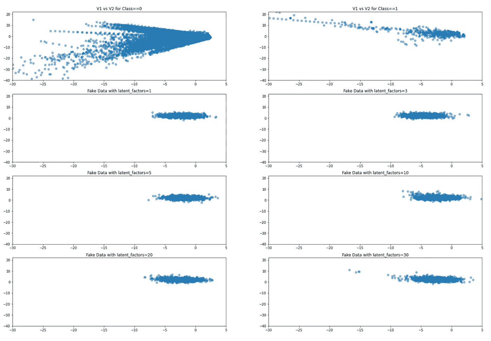
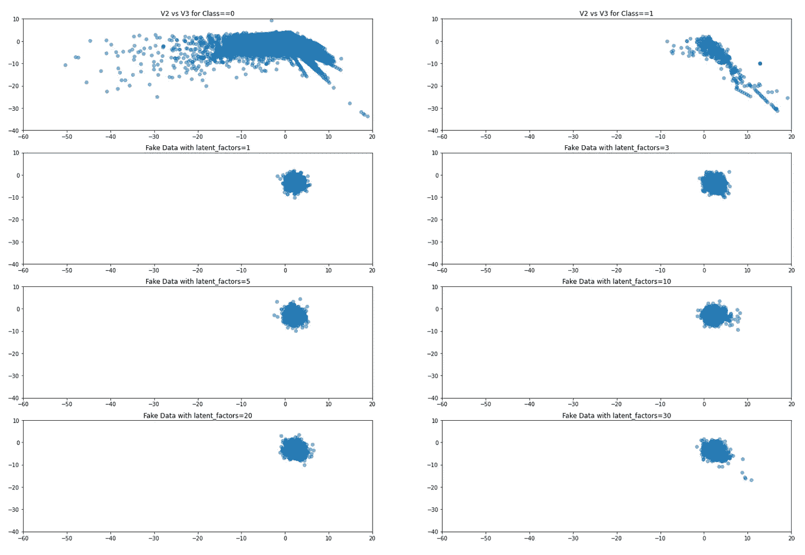
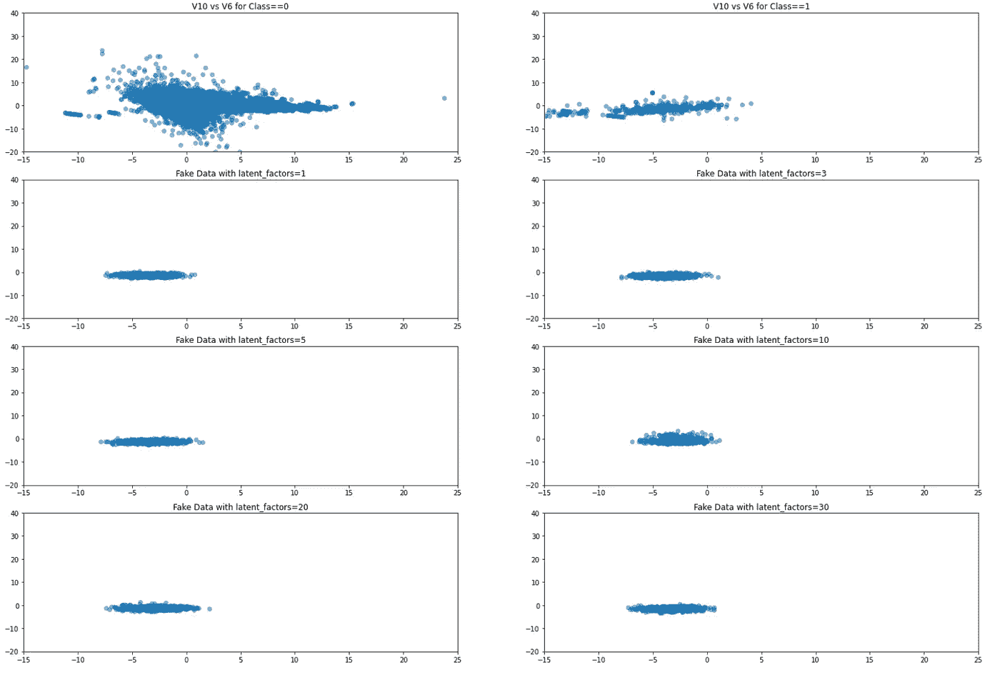
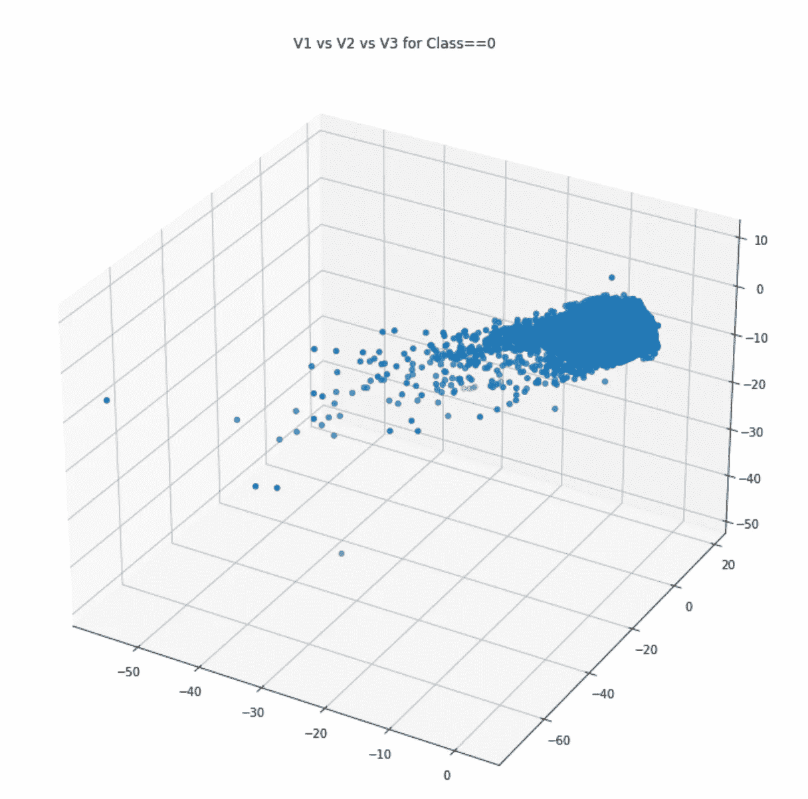
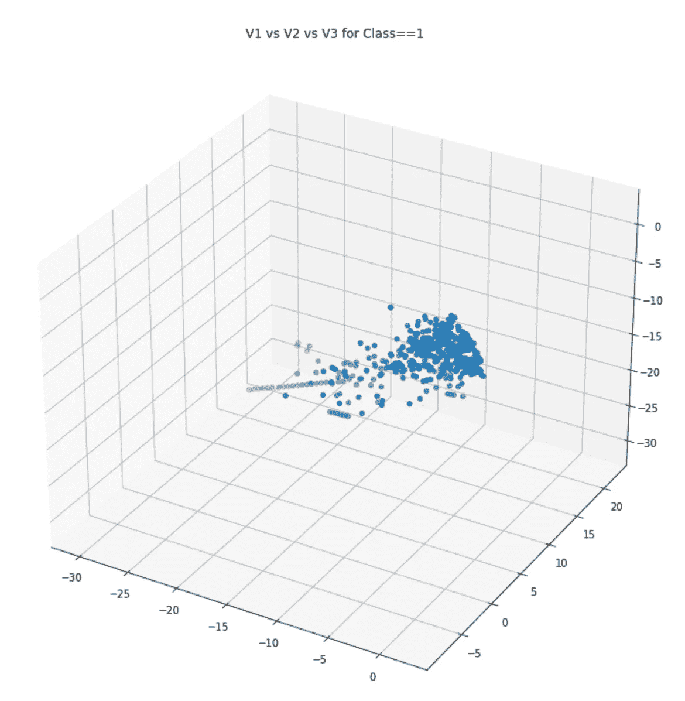
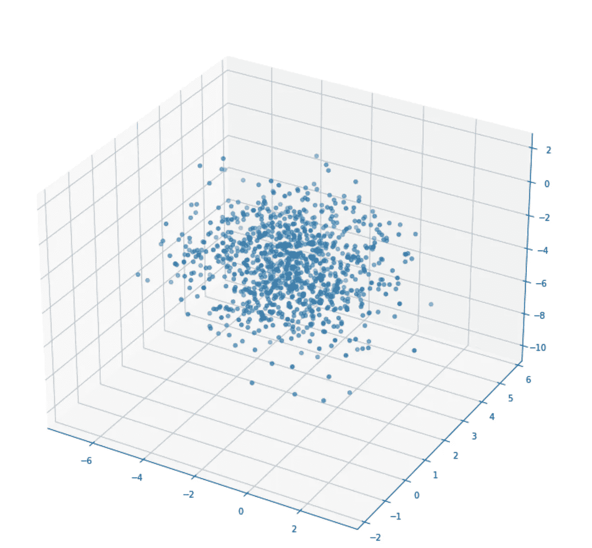
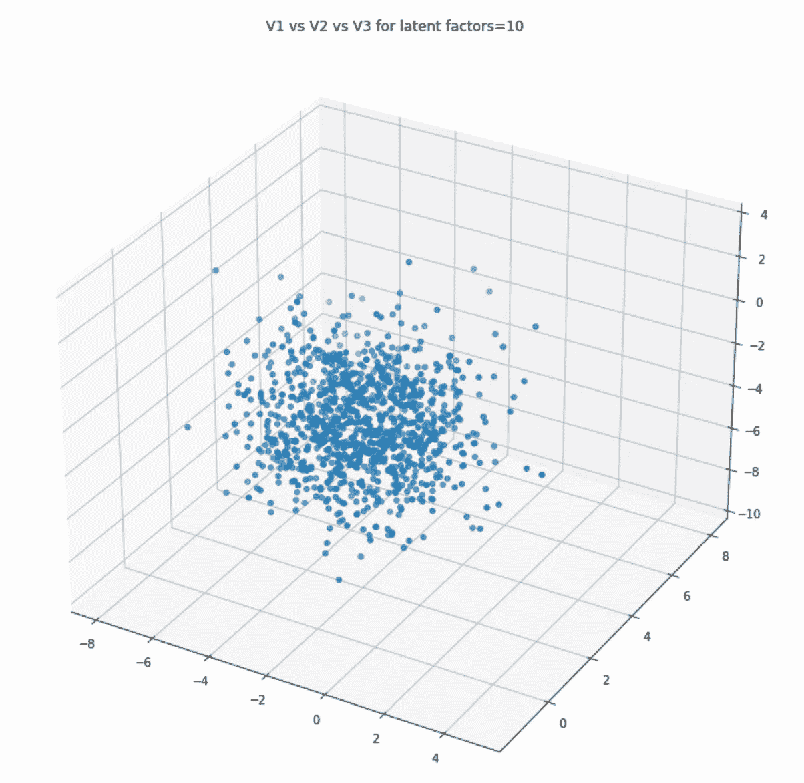
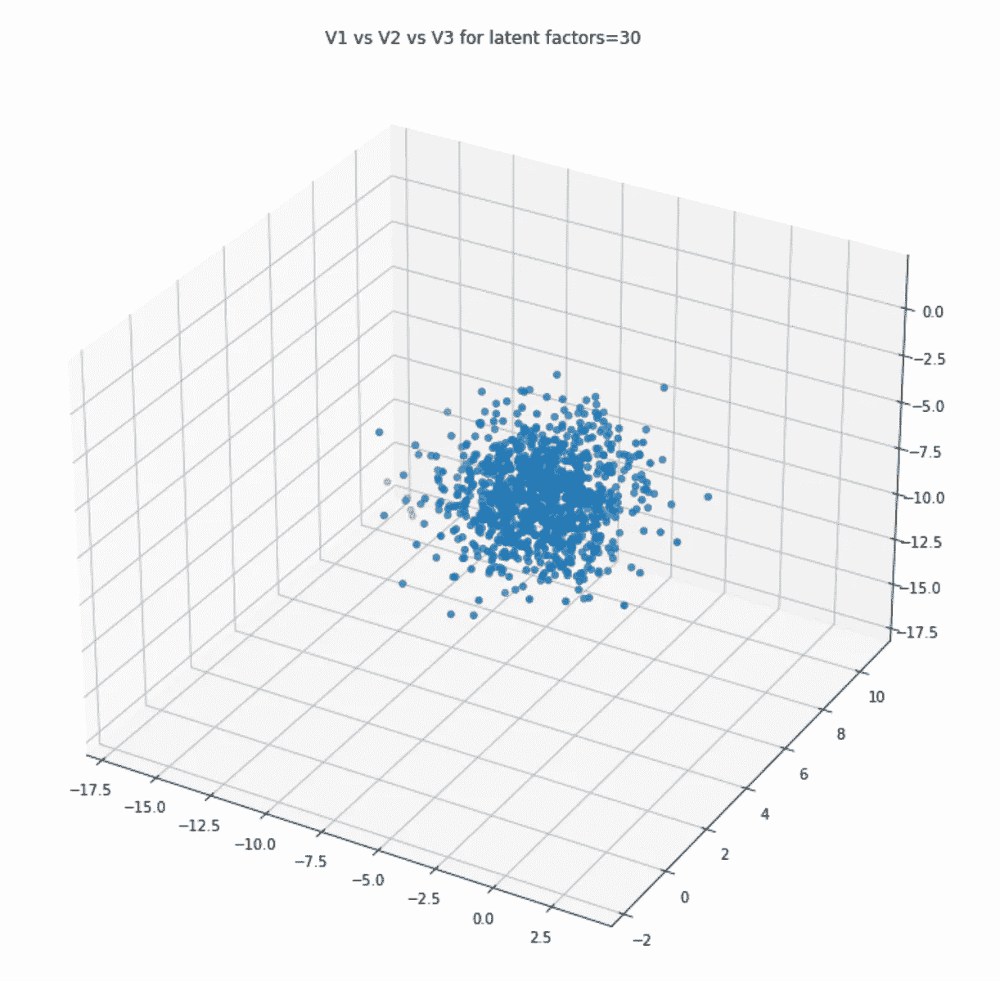

# 了解深层列表增强的潜在因素

> 原文：<https://medium.com/analytics-vidhya/understand-latent-factors-in-deep-tabular-augmentation-fd6d9e2c1307?source=collection_archive---------4----------------------->

卢克·切瑟在 [Unsplash](https://unsplash.com?utm_source=medium&utm_medium=referral) 上的照片

这篇博客应该概述不同数量的潜在因素如何影响由[深度表格增强器](https://github.com/lschmiddey/deep_tabular_augmentation)创建的数据。如果你想了解更多关于深度表格扩充的一般概念，请看这些帖子[这里](/analytics-vidhya/tabular-data-augmentation-with-deep-learning-7270584e7ff)和[这里](/analytics-vidhya/data-augmentation-for-tabular-data-f75c94398c3e)。

这篇博文基于 deep_tabular_augmentation 的 0.4.0 版本。同样，我们使用来自 kaggle 的[信用卡欺诈数据集](https://www.kaggle.com/mlg-ulb/creditcardfraud)。

deep_tabular_augmentation 的工作原理很简单，即我们希望将数据与模型一起保存在一个专用的类中(我们称之为学习者)。数据必须以 dataloader 对象的形式出现，我将它存储在 DataBunch 类中。其中有用于训练和测试数据的数据加载器。然后，runner 类定义流。

我们首先扩展数据，只保留我们想要扩充的类的数据。如前所述，然后我将 train 和 testloader 放入一个名为 DataBunch 的类中，它只是一个数据容器。您可以轻松地创建自己的数据加载器，并将它们放在数据集中。所有上述的行动步骤你都可以在上面提到的博客帖子中找到。

为了使用 deep_data_augmentation，我们需要指定输入形状(基本上就是数据集中有多少变量)、我们想要扩充的目标类的列名和相应的数字，最后是输入变量的列名。

然后，文可以定义我们想要的任何模型架构。我们只是将它作为一个列表传递给模型。我们还可以定义多少潜在维度，我们想添加到我们的自动编码器。由于我想比较不同潜在因素的结果，我将建立四个模型，只是我们设置的潜在因素不同。

此外，该模型允许控制您想要添加到每一列中的方差。如果需要，可以添加尽可能多的方差，以便真实数据的方差与设计数据的方差相匹配。然而，这在大多数情况下是不可取的，因为这增加了太多的噪声，以至于在进行预测时，模型不会像它所能提供的那样好地支持你。我建议使用数据真实标准偏差的 10%-25%左右。

让我们训练所有四个模型，并从每个模型预测假数据:

我们对刚刚创建的四个不同的模型重复这一过程。接下来，我们可以在图形层面上比较这些模型的不同之处。所以我们先看真实数据除以 Class=0 和 Class=1(我们要增广)，然后把结果和增广后的数据进行比较。

这些结果看起来很有希望。此外，似乎当比较两个变量时，你选择多少个潜在因素并不重要，尽管 30 个潜在因素似乎提供了最令人信服的结果。如果我们看看 3 个不同的变量会怎么样:

当比较 3D 图时，更明显的是，更少的潜在因素似乎进一步将数据分开。潜在因素越多，变量之间的关系就越容易被捕捉。

如果你有任何问题或者想在包裹里添加什么，就问我。

拉塞

*原载于 2022 年 2 月 6 日*[*https://lschmiddey . github . io*](https://lschmiddey.github.io/fastpages_/2022/02/06/Understand-Latent-Factors.html)*。*