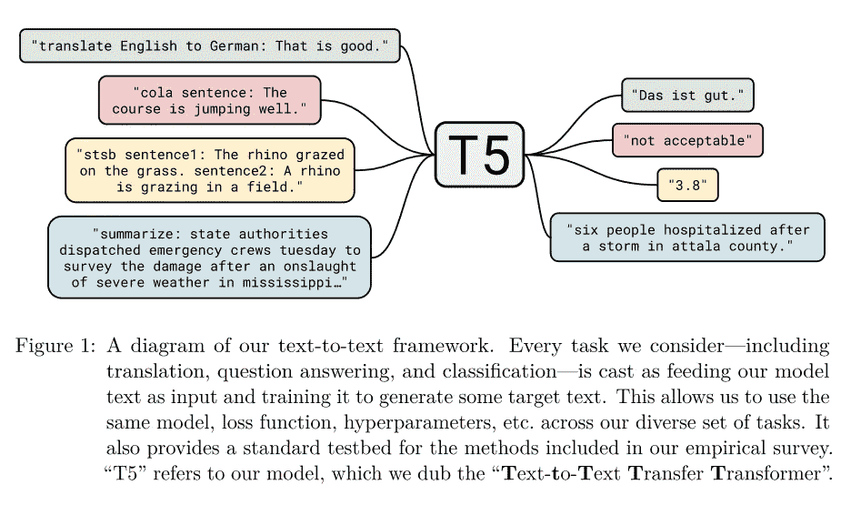
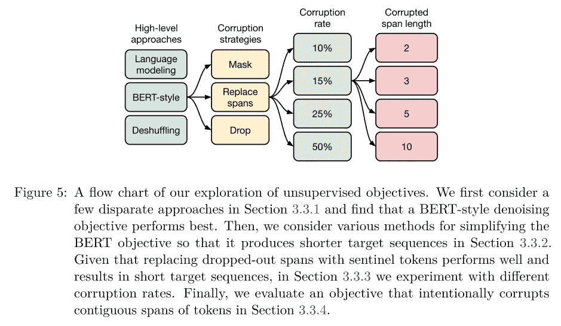
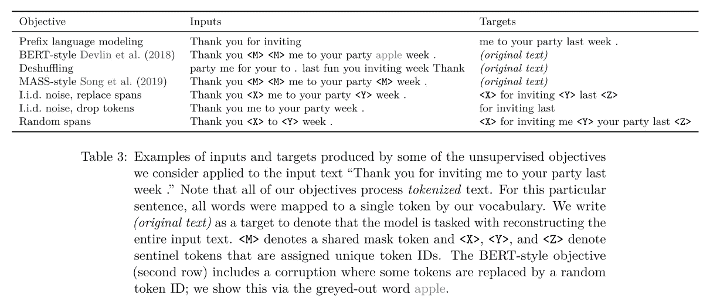
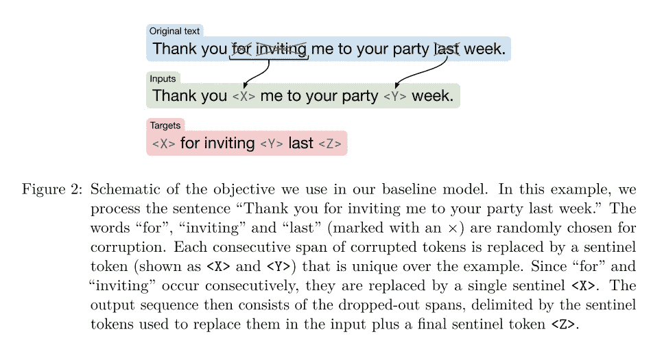

# 了解 T5 —文本到文本转换转换器

> 原文：<https://medium.com/analytics-vidhya/understand-t5-text-to-text-transfer-transformer-9bc1757989ab?source=collection_archive---------7----------------------->

原文：<https://arxiv.org/abs/1910.10683>探索迁移学习的极限。

# 概观

在我看来，这篇论文更多的是面向工程而不是面向方法。它没有提出新的模型架构或训练技术。然而这篇论文的贡献是巨大的。为了研究 NLP 中各种体系结构、训练目标、技术和训练数据集对迁移学习的确切贡献，作者进行了一系列系统的实验，并向我们展示了根据经验考虑的最佳和有前途的策略。之后，他们结合所有的发现，提出了一个预训练模型 T5 和数据集 C4。另一个亮点是他们在研究中使用了统一的文本到文本框架，即把每个自然语言处理任务转换成文本到文本。

根据我的理解，使用统一框架的逻辑是，如果它可以在广泛的任务范围内取得良好的结果，那么它可能暗示着模型确实学到了自然语言中通用的东西。

## **T5:文本到文本转换变压器**

框架中的架构是编码器-解码器，因此每个任务都应该转换成输入-输出格式，其中两者都是文本。为了帮助模型识别要执行的特定任务，任务名称被附加在输入的开头。T5 的优点来自于关于多个方面的最优策略的组合，包括编码器-解码器架构、损坏跨度去噪目标、C4 预训练数据集、多任务预训练+对下游任务的微调，以及在模型大小和训练时间方面的缩放。

## **实验结果**

**架构**:比较了三种类型:编码器-解码器、仅解码器语言模型、仅解码器前缀语言模型。控制参数的数量，编码器-解码器是所有下游任务中最好的。

**无监督目标**:下面的流程图显示了他们的探索，表格通过一个例子说明了这些目标(标题包括实验的细节)。他们选择受损跨度去噪目标，因为计算成本可以降低，同时保持与基线相当的性能。

该目标的详细说明如下。

**预训练数据集**:他们发现对域内未标记数据进行预训练可以提高下游任务上的性能，例如基于维基百科的 SQuAD。此外，关于数据集的大小，他们发现一些重复的预训练数据可能是无害的。

**训练策略**:他们实验了三种微调策略，发现微调所有参数是最好的。他们还考虑了多任务学习，其中他们将无监督的任务与其他任务混合，并探索了三种设置来自每个任务的数据比例的策略。结果表明，首先在无监督任务上进行预训练，然后在下游任务上进行微调优于多任务训练策略。然后，他们将多任务学习与微调相结合，并比较不同的策略，如下所示。由于多任务预训练+微调与无监督预训练+微调具有相似的性能，并且它使我们能够在整个训练期间监控“下游”性能，而不仅仅是微调，因此作者在他们最终的 T5 模型中使用了这一策略。

**扩展**:他们专注于解决这个问题:“你刚刚获得了 4 倍的计算能力。应该怎么用？”他们发现，一般来说，与单独增加训练时间或批量相比，增加模型大小会导致性能的进一步提升。集成学习提供了一种通过扩展来提高性能的正交且有效的方法。

最终，他们将所有的发现整合在一起，结合最佳设置，得出了 T5，这是一个经过预先训练的模型，在许多排行榜上有着最先进的表现。

# **相关主题阅读**

*   多任务学习:[深度神经网络中多任务学习概述](https://ruder.io/multi-task/)
*   UnifiedQA :将文本到文本框架应用于问答的论文

# **参考文献**

1.  Raffel，c .，Shazeer，n .，Roberts，a .，Lee，k .，Narang，s .，Matena，m .，Zhou，y .，Li，w .，，Liu，P. J. (2020)。用统一的文本到文本转换器探索迁移学习的局限性。*机器学习研究杂志*， *21* (140)，1–67。