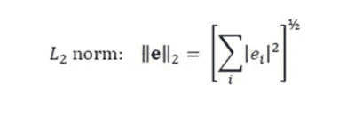

# 通过从头开始构建来了解 TF-IDF。

> 原文：<https://medium.com/analytics-vidhya/understand-tf-idf-by-building-it-from-scratch-adc11eba7142?source=collection_archive---------8----------------------->


布雷特·乔丹在 [Unsplash](https://unsplash.com?utm_source=medium&utm_medium=referral) 上的照片

人们在机器学习领域学习的一个基本和第一个算法是 TF-IDF 矢量化。TF-IDF 代表术语频率和逆文档频率。

在这里，我们将尝试了解 TF-IDF 到底是如何工作的，并将我们的结果与 sklearn 库进行比较。与其他算法相比，我们不会详细讨论它的用处。

# 什么是 TF-IDF？

TF-IDF 是一个统计工具，它测量一个单词与一堆文档中的一个文档的相关程度。

它由两部分组成:
1 .**词频(TF)** :一个词在文档中出现的次数
2。**逆文档频率(IDF)** :单词在一组文档中的逆文档频率。

让我们在这里举一个例子，我们将在整个博客。

```
import pandas as pd
corpus = [('Document 1', 'Alot of people like to play football'),
          ('Document 2', 'many like to eat'),
          ('Document 3', 'According to data, many like to sing')]data = pd.DataFrame(corpus,columns=['Document Number','text of Documents'])
```

TF-IDF 的示例数据

## **什么是词频(TF)？**

为了计算词频，让我们看看是否可以在每个文档中找到唯一的单词及其数量。
计算词频有多种方法:

*   原始计数:tf( *t* ， *d* ) = *f(t* ， *d)*
*   布尔频率:如果 *t* 出现在 *d* 中，tf( *t* ， *d* ) = 1，否则为 0。
*   根据文档长度调整的词频:tf( *t* ， *d* ) = *f(t* ，*d)*(d 中的字数)
*   对数标度频率:tf( *t* ， *d* ) = log (1 + *f(t* ， *d)* )

通常，原始计数或计数向量用于计算术语频率

```
from sklearn.feature_extraction.text import CountVectorizer
vectorizer = CountVectorizer()
X = vectorizer.fit_transform(data['text of Documents'])
cols = vectorizer.get_feature_names()
count = pd.DataFrame(X.toarray(), columns=cols)
```

文档中每个单词的计数。

## **什么是逆文档频率？**

由于术语频率倾向于给常用词更多的权重，我们需要一些东西来减少这种影响，因为像*“the”、“is”、“am”*这样的常用词对于确定文档的唯一性来说不是很有用。如果有两个文档，一个关于体育，一个关于医学领域，像“*足球”、“高血压”*这样的词将很少出现，并且将有助于更好地确定文档。

> Zipf 定律指出，在一组或一组文档中，任何单词的频率都与其在频率表中的排名成反比。因此，最频繁出现的单词的出现频率大约是第二频繁出现的单词的两倍，第三频繁出现的单词的三倍，等等。

IDF 的引入减少了文档集中出现频率很高的术语的权重，增加了出现频率很低的术语的权重。

```
# df is the document frequency (how many dcouments word has occured)
import numpy as np
df = np.array(count.astype(bool).sum())
# df = np.array([1,1,1,1,1,3,2,1,1,1,1,3])# No of documents 
n_samples = len(data)
# n_samples = 3smooth_idf = True
# smooth_idf is used to avoid divide by zero
df += int(smooth_idf)
n_samples += int(smooth_idf)
idf = np.log(n_samples / df) + 1
```

每个单词的 IDF

为什么我们在这里使用 log，添加 log 是为了降低高频词的重要性。某个单词的 IDF(log 之前)越多，该单词的重要性就越大。更多详情请参考此处的。

## **TF *正常化前的 IDF**

这是通过将 TF 和 IDF ((3*12 ) X (12，)相乘计算出来的

```
df_before_normalization = count*idf
```

标准化前的 TF-IDF

**TF*IDF 归一化后** 既然 sklearn 库也对结果进行归一化，我们这里也是这么做的。L2 标准化是在每个文档中完成的



L2 范数公式

```
from math import sqrt
# For document 1
sqrt(pow(0.0,2)+pow(1.69315,2)+pow(0.0,2)+pow(0.0,2)+pow(1.69315,2)+pow(1.0,2)+pow(0.0,2)+pow(1.69315,2)+pow(1.69315,2)+pow(1.69315,2)+pow(0.0,2)+pow(1.0,2))=4.041507document 1 = 0.0/4.041507, 1.69315/4.041507, 0.0/4.041507, 0.0/4.041507, 1.69315/4.041507, 1.0/4.041507, 0.0/4.041507, 1.69315/4.041507, 1.69315/4.041507, 1.69315/4.041507, 0.0/4.041507, 1.0/4.041507 = 
0.0, 0.419, 0.0, 0.0, 0.419, 0.247, 0.0, 0.419, 0.419, 0.418, 0.0, 0.247# same way do the same of Document 2 and Document 3# if you want to do this using python
# method 1
from sklearn.preprocessing import normalize
tf_idf = normalize(df_before_normalization, norm='l2', axis=1)# method 2
from numpy.linalg import norm
for idx, row in df_before_normalization.iterrows():
    print(row/norm(row))
```

标准化后的 TF-IDF

# **Sklearn 库:**

现在，让我们与图书馆版本进行比较。

TF-IDF 的代码段

**库的输出:**

在这里，我们可以看到输出与我们手动计算的相同，因为我们遵循了库中使用的相同步骤。我希望阅读博客可能会给你一些关于 TD-IDF 工作的新信息，如果是这样，请欣赏它。

# TF-IDF 的使用:

[](https://github.com/gskdhiman/zomato-recommendation) [## gskdhiman/zom ATO-建议

### 此时您不能执行该操作。您已使用另一个标签页或窗口登录。您已在另一个选项卡中注销，或者…

github.com](https://github.com/gskdhiman/zomato-recommendation) 

## **参考文献:**

[](https://scikit-learn.org/stable/modules/generated/sklearn.feature_extraction.text.TfidfVectorizer.html) [## sk learn . feature _ extraction . text . tfidf vectorizer-sci kit-learn 0 . 24 . 1 文档

### class sk learn . feature _ extraction . text . tfidf vectorizer(*，input='content '，encoding='utf-8 '，decode_error='strict'…

scikit-learn.org](https://scikit-learn.org/stable/modules/generated/sklearn.feature_extraction.text.TfidfVectorizer.html) [](https://www.journaldev.com/45324/norm-of-vector-python) [## Python 中向量的范数-计算步骤- JournalDev

### 向量的范数是指向量的长度或大小。有不同的方法来计算…

www.journaldev.com](https://www.journaldev.com/45324/norm-of-vector-python)  [## tf-idf

### 在信息检索中，tf-idf，TF*IDF，或 TFIDF，是词频-逆文献频率的缩写，是一个数字…

en.wikipedia.org](https://en.wikipedia.org/wiki/Tf%E2%80%93idf)