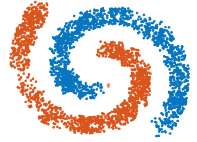
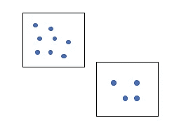
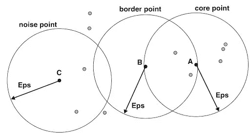
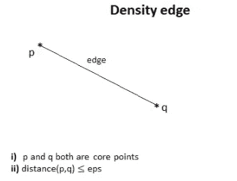
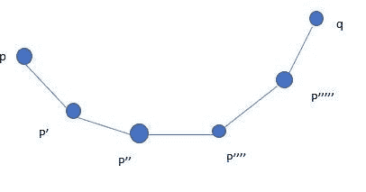
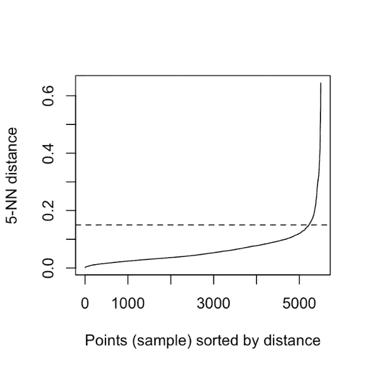
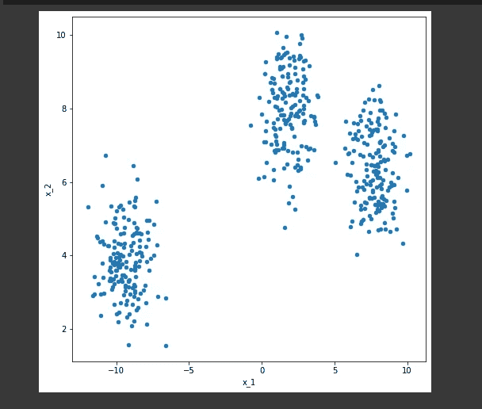
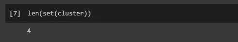
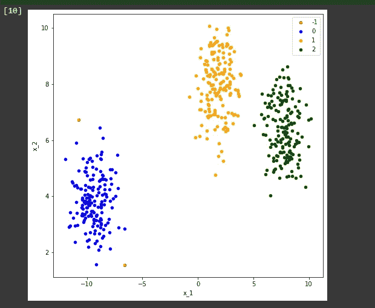

# 了解 DBSCAN 聚类算法

> 原文：<https://medium.com/analytics-vidhya/understand-the-dbscan-clustering-algorithm-b064025a6b5?source=collection_archive---------4----------------------->



在这篇文章中，我将解释 DBSCAN 算法。这是一种用于聚类的无监督学习算法。首先，我将解释该算法的每个概念细节，然后我将向您展示如何使用 Sci-kit Learn 编写 DBSCAN 算法。

DBSCAN 算法的全称是带噪声的应用程序的基于密度的空间聚类。嗯，从名字中我们需要特别注意三个词。它们是密度、聚类和噪声。从名字上看，很明显该算法使用密度来对数据点进行聚类，并且它与噪声有关。也许它能很好地识别噪音。我们过会儿会看见它。

# 目录

1.  什么是密度？
2.  DBSCAN 算法的重要参数
3.  数据点的分类
4.  密度边和密度连接点
5.  DBSCAN 算法中的步骤
6.  如何确定ε和 z？
7.  噪声消除
8.  Python 的实际实现

# 1.什么是密度？

首先，我们来了解一下什么是密度。

从物理学中我们知道，密度就是单位体积中的物质数量。我们可以很容易地将体积的概念扩展到更高的维度，甚至更低的维度。

例如，我们有这个区域。

我们在这个区域有一些数据点。我们在同一区域的另一个区域有这么多数据点。



[来源](https://external-content.duckduckgo.com/iu/?u=https%3A%2F%2Fwww.researchgate.net%2Fprofile%2FQing_Yu51%2Fpublication%2F343345471%2Ffigure%2Fdownload%2Ffig4%2FAS%3A919536819781634%401596246070710%2FSpatial-cluster-identified-by-Density-Based-Spatial-Clustering-of-Applications-with-Noise.jpg&f=1&nofb=1)

所以，从密度的概念来看，第一个区域的密度大于第二个区域。因为，第一个区域有更多的数据点，更多的物质。DBSCAN 使用这种密度概念对数据集进行聚类。现在为了清楚地理解 DBSCAN 算法，我们需要知道一些重要的参数。

# 2.DBSCAN 算法的重要参数

第一个是 epsilon。

# 2.1ε

这是对邻居的一种度量。

什么是邻居？

# 2.2 邻里关系

假设，这是我们现在考虑的点，让我以这点为中心画一个圆，加上距离ε。

所以，我们说这个圆是这个点的邻域。所以，ε只是一个数字，它代表了围绕一个特定点的圆的半径，我们要考虑这个点的邻域。

下一个参数是 min_sample。

# 2.3 分钟 _ 样本

在本文中，我将 min_samples 表示为 z。如果你要从其他来源研究这个 DBSCAN，那么你可能会遇到这个术语 min_samples 或 minPts 等等。这是我们希望在点的邻域中看到的最少点数的阈值。假设我们
取 z = 3。



[来源](https://lh3.googleusercontent.com/proxy/LSWS-2LZgLQb91X15murhE7VcbnheZ-69c1y_qnvJE2m81UOs3dNDOjrOxIRtLzR4dFmpv9gzMXxdKYeh4lXMUIA13VEOwl9XVdRdcVm_r7AkBbxSK1d)

如果我们的邻域中有 4 个点，这也将满足我们的阈值 z = 3。因为该阈值表示邻域中样本的最小数量。

# 3.数据点的分类

现在，基于这两个参数，即ε和 min_samples，我们首先将数据集中的每个点分为三类。他们是

*   核心要点
*   边界点或边界点
*   噪音点

先看核心点。

# 3.1 核心要点

现在见上图。我代表了一个核心观点 a。

如果我说一个点是核心点，那么它必须满足一个条件。条件是相邻点的数量必须大于或等于我们的阈值 min_samples 或 z。如果我设置 z = 3，则该点满足此条件。因此，我们说这是核心点。

我们来看第二类点。

# 3.2 边界点

如果我说一个点作为边界点，那么它必须满足以下两个条件。

*   邻居的数量必须小于 z。
*   该点应该在核心点的邻域内。

考虑上面提到的同一个数字。我表示一个边界点 b。该点的邻居数量少于其邻域内的邻居数量，并且它位于另一个核心点的邻域内。所以，这个点 B 是一个边界点或边界点。

现在让我们看看最后一种观点。

# 3.3 噪音点

噪声点的定义很简单。如果一个点既不是核心点也不是边界点，那么这个点叫做噪声点。在上图中，C 点既不是核心点，也不是边界点。因此，我们可以说这是一个噪声点。

现在，我们已经将每一个数据点分为三类。这是 DBSCAN 算法的第一步。

现在你需要理解另一个概念。

# 4.密度边和密度连接点

# 4.1 密度边缘

假设我们得到了
两个核心点。如果两个点是邻居，那么我们用一条叫做
的边将它们连接起来，我们称之为密度边。



[信号源](https://shritam.medium.com/how-dbscan-algorithm-works-2b5bef80fb3)

# 4.2 密度连接点

我们来考虑 6 点。我假设每个点都是一个核心点。假设它们通过密度边连接
。



[来源](https://shritam.medium.com/how-dbscan-algorithm-works-2b5bef80fb3)

你可以看到 p '在 p "的邻域内，其他点也是如此。但是 p 和 q 不是邻居。如果出现这种情况，当两个核心点通过密度边相连时，那么我们说 p 和 q 是密度连结点。

现在我们来看看这个算法的步骤。

# 5.DBSCAN 算法中的步骤

1.分门别类。

2.丢弃噪音。

3.将集群分配给核心点。

4.给一个核心点的所有密度连接点着色。

5.根据最近的核心点对边界点进行着色。

上面已经解释了第一步。

第二是消除噪声点。

我们来看看第三步。例如，我取一个核心点，并将其指定为聚类红色。第四步，我们要给第三步中选中的核心点的所有密度连接的点上色，颜色为红色。记住这里，我们不应该给边界点上色。

我们必须对每个未着色的核心点重复第三和第四步。

DBSCAN 算法完成了！

让我解释一下这个算法的几个非常重要的问题。

# 6.如何确定ε和 z？

老实说，这是一个困难的问题，因为 DBSCAN 算法对其初始参数非常敏感。所以，如果你稍微改变ε和 z 的值，那么你的算法会产生非常不同的结果。这是这个算法的一个缺点。但是，如果您有适当的领域知识，您可以明智地选择这些值。根据经验，如果你有大量的例子，那么你可以按照维度的顺序选择 z。如果你有 10 个维度，那么最好选择一个接近 10 的 z 值，比如 12 或 15。

要知道ε的值，你可以试试。假设你选择了 z = 5。那么，之后你会做什么？你会发现第五个邻居与每个数据点的距离。

因此，你将有一个距离数组，数组中的第 I 个元素将代表第 I 个数据点的第 5 个邻居的距离。然后你要对这个距离数组进行排序，然后像这样画出来。y 轴上是距离，x 轴上是指数(I)。

理想情况下，你应该得到这样的图。



[来源](https://external-content.duckduckgo.com/iu/?u=https%3A%2F%2Fwww.datanovia.com%2Fen%2Fwp-content%2Fuploads%2Fdn-tutorials%2F005-advanced-clustering%2Ffigures%2F023-dbscan-density-based-clustering-k-nearest-neighbor-distance-1.png&f=1&nofb=1)

由于我们已经对其进行了排序，随着索引的增加，第 5 个数据点与该点的距离也将增加。如果你运气好，你可以找到这种肘型的东西。你可以用一条水平线来切割它，水平线会在某个点切割 y 轴，你可以把这个值作为ε。但在现实世界中，你可能得不到这种光滑的肘部。但这是在某些情况下可以应用的技巧。

现在让我来谈谈第二个要点。

# 7.噪声消除

DBSCAN 在消除噪声方面非常有效。

正如您在我之前的示例中看到的，我们将这些点分为三类，其中有一类是噪声点。因此，该算法可以很好地应用于噪声数据集。最后一点是 DBSCAN 不能很好地处理高维数据。这是许多聚类算法的一个缺点。随着维度的增加，我们必须在更大的体积中寻找相同数量的邻居。所以，点与点之间的相似性降低了。这将导致聚类错误。

现在让我们跳到代码部分。

# 8.Python 的实际实现

首先，我要做一个假数据集。为了制作一个假数据集，我们使用了我们最喜欢的图书馆 Sci-kit Learn。我们需要从 sklearn.datasets 导入名为 make_blobs 的函数。

该函数采用 n_samples，这表示我们需要产生多少数据点。

第二个论点集中在。这告诉我们将会有多少个星团。

第三个参数 n_features 就是我们数据集的维度。

random_state 用于产生相同的结果。这个函数将返回两件事。

第一个是我赋给变量 X 的数据点，第二个是它将返回一个标签数组。

现在，记住 DBSCAN 是无监督学习。因此，我们一开始就不提供标签，即事实真相。我们让我们的算法自己找到这些标签。我们需要一些其他的库，比如 pandas、matplotlib 和 NumPy。

```
import numpy as np from sklearn.datasets import make_blobs from matplotlib import pyplot as plt from pandas import DataFrame X, _ = make_blobs(n_samples = 500, centers = 3, n_features = 2, random_state = 20)
```

继续进行可视化，您可以看到这里有三个集群。现在，我们的 DBSCAN 算法将尝试自己找到标签。

```
df = DataFrame(dict(x=X[:,0], y=X[:,1])) fig, ax = plt.subplots(figsize=(8,8)) df.plot(ax=ax, kind='scatter', x='x', y='y') plt.xlabel('x_1') plt.ylabel('x_2') plt.show()
```



使用 scikit-learn 在 python 中实现 DBSCAN 算法非常简单。类名为 DBSCAN。我们需要用它创造一个物体。我在这里创建的对象是集群。我们需要输入我在概念部分讨论过的两个最重要的参数。第一个是 eps，第二个是 z 或 min_samples。现在我已经给了ε为 1，min_samples 为 5。在下一步中，我们只是获取集群的标签。

```
from sklearn.cluster import DBSCAN clustering = DBSCAN(eps = 1, min_samples = 5).fit(X) cluster = clustering.labels_
```

要查看它在数据集上找到了多少个聚类，我们可以将这个数组转换成一个集合，然后打印出这个集合的长度。现在你可以看到它是 4。



但是发生了什么？

我们看到我们的数据集包含三个集群。

第一个为-1 级的簇表示该 DBSCAN 中的噪声。你可以看到，我们只是通过这段简单的代码来可视化我们的集群，然后我们会发现类似这样的东西。

```
def show_clusters(X, cluster): df = DataFrame(dict(x=X[:,0], y=X[:,1], label=cluster)) colors = {-1: 'red', 0: 'blue', 1:'orange', 2:'green', 3:'yellow'} fig, ax = plt.subplots(figsize=(8,8)) grouped = df.groupby('label') for key, group in grouped: group.plot(ax=ax, kind='scatter', x='x', y='y', label=key, color=colors[key]) plt.xlabel('x_1') plt.ylabel('x_2') plt.show()show_clusters(X, cluster)
```



这就是使用 sci-kit learn 实现 DBSCAN 有多简单。

# 尾注

我希望你现在确信可以在一些数据集上应用 DBSCAN。是时候把它弄到手了！

***本文中显示的媒体不归 Analytics Vidhya 所有，由作者自行决定使用。***

*原载于 2021 年 6 月 1 日*[*https://www.analyticsvidhya.com*](https://www.analyticsvidhya.com/blog/2021/06/understand-the-dbscan-clustering-algorithm/)*。*