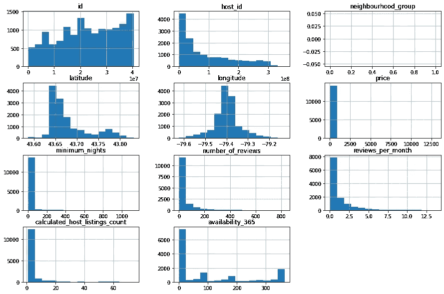
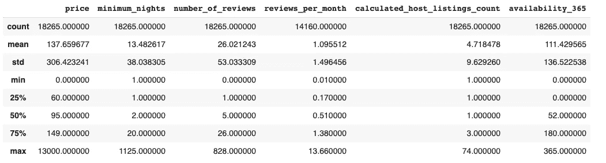
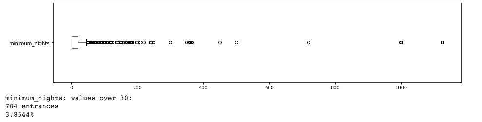
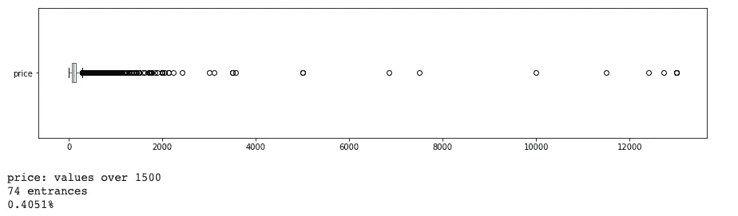
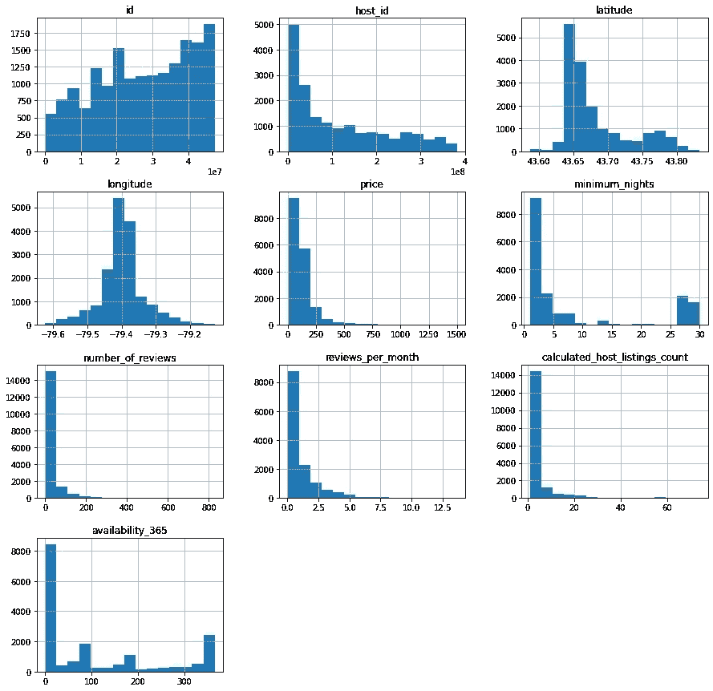
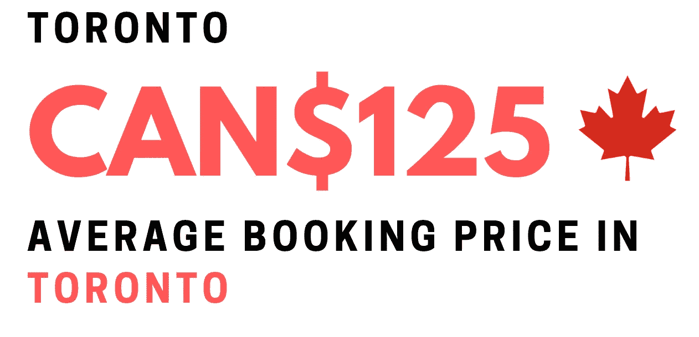
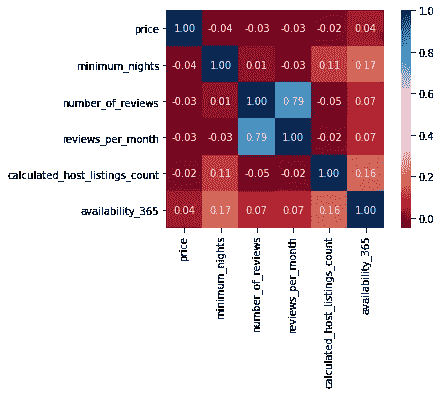
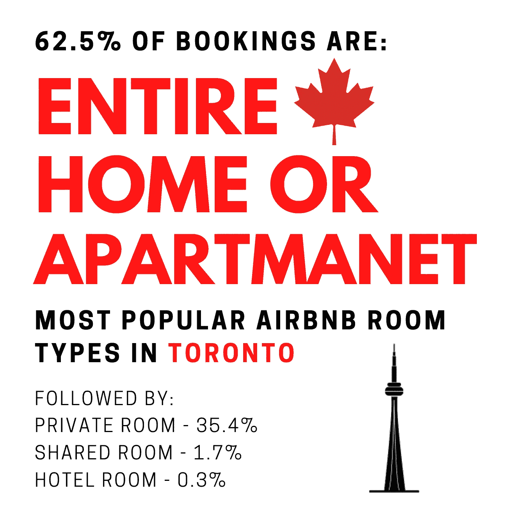
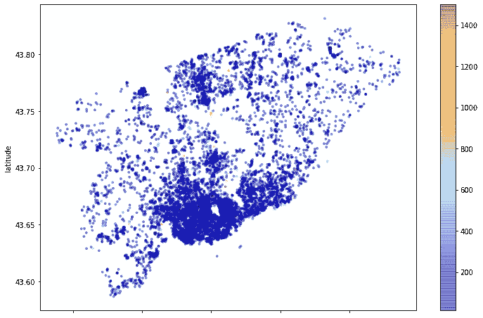

# 通过使用 Python 了解 Airbnb 在多伦多的表现。

> 原文：<https://medium.com/analytics-vidhya/understand-the-performance-of-airbnb-in-toronto-by-using-python-f4abee3569b3?source=collection_archive---------20----------------------->

## 通过分析公司自己免费处理的数据，了解多伦多 Airbnb 的情况。


图片来自 UrbToronto，由我编辑

# 项目的目标

*   了解 Airbnb 在多伦多的知名度。
*   分析最昂贵的地区，最受欢迎的房间类型，评论和价格/夜平均。
*   展示一些 Airbnb 在多伦多的法律问题。
*   教授如何处理缺失数据和异常值。

## 在我们开始之前…

如果你想看到完整的代码，并了解我用来获得我的结果的方法，请确保在[谷歌实验室](https://colab.research.google.com/drive/1ixOFCmEs4n_dTgFBi0hDUswGU9bshJYG#scrollTo=6-B_qtEaYEd-)上检查这个项目的笔记本，也请确保在 [LinkedIn](https://www.linkedin.com/in/vin%C3%ADcius-porfirio-purgato-7891401b3/) 和 [GitHub](https://github.com/vinny380) 上关注我。

# Airbnb 简介

Airbnb 是世界上最大的连锁酒店，有趣的是他们根本没有酒店！

通过一种创新的寻找住宿的方式，Airbnb 将想要旅行(和在某个地方住宿)的人与想要出租他们住处的房东联系起来。

截至 2018 年底，在成立十年后，Airbnb 已经接待了来自世界各地的超过 3 亿人，挑战传统酒店品牌重塑自我。

除此之外，这家初创公司还有一种在互联网上处理免费数据的文化，你可以从 Airbnb 内部的网站下载这些数据，并获得来自世界上一些最大城市的数据，这让你可以建立无数的项目和数据科学解决方案。

看看 Airbnb 的一些数据:


来自张丽[的 Airbnb 社区简介](/analytics-vidhya/how-to-analyze-airbnb-performance-data-in-the-right-way-b83f3dad1458)

对了，这套是来自 Airbnb 的“总结”版。在同一个页面上，我们下载了文件`listing.csv`，有一个更长的版本叫做`listing.csv.gz`，带有**完整的**数据集。

# 呈现多伦多


作者父亲的照片，是的，照片里的就是我

多伦多是加拿大人口最多的城市，它位于安大略省的安大略湖湖畔，它是多伦多猛龙队、多伦多蓝鸟队、德雷克大学、多伦多大学和其他许多著名人士和机构的所在地。多伦多是一个种族非常多样化的城市，拥有健康的移民人口。几乎一半的人口是在国外出生的。你可以找到世界各地的餐馆。像任何好的大城市一样，多伦多不会停下来，它是一个 24/7 都在工作的地方。这座城市也被称为 6ix，这个词因德雷克来自多伦多而在他的歌曲中流行开来。

该市还有两个机场:

*   多伦多皮尔逊国际机场(YYZ)。
*   比利毕晓普多伦多市机场(YTZ)。

其市区人口为 2，600，000，市区人口为 6，231，765，也是北美第五大城市，仅次于墨西哥城、纽约、洛杉矶和芝加哥。多伦多也被称为好莱坞北部，你知道 25%的好莱坞电影都是在多伦多拍摄的吗，不管是在片场还是在街上？很酷，对吧？多伦多的旅游业也很有前景。然而，它对 Airbnb 有几个法律问题:

*   允许在整个城市的住宅区和混合使用区的住宅部分的所有房屋类型中进行短期租赁。
*   人们只能在自己的主要住所进行短期租赁，房主和房客都可以参与。
*   住二套房的人也可以参加，只要二套房是他们的主要住所。
*   如果房主/房客不在，整栋房屋可以作为短期租赁出租，每年最多 180 个晚上。
*   为了租你的二次住宅，短租必须大于 28 晚。

给定城市的背景，让我们开始分析。

# 获取数据

Python 之所以伟大的一个主要原因是它有多少库和包，今天我们将使用四个库来分析我们的*数据集*，它们是:

```
1\. pandas - Used to manipulate our dataset.2\. matplotlib - Used to plot our histograms.3\. seaborn - Used to plot our heatmap.4\. plotly - Used to plot our interactive map.
```

# **变量字典**

*   `id` —为识别地点而生成的 id 号。
*   `name` —公布的地点名称。
*   `host_id` —该场所主人的身份证号。
*   `host_name` —主持人姓名。
*   `neighbourhood_group` —此列没有有效数据。
*   `neighbourhood` —小区名称。
*   `latitude` —房产的纬度坐标。
*   `longitude` —房产的经度坐标。
*   `room_type` —提供的房间类型。
*   `price` —租用场地的价格。
*   `minimum_nights` —预订该地的最低入住天数。
*   `number_of_reviews` —这个地方的评论数量。
*   `last_review` —最近一次审查的日期。
*   `reviews_per_month` —每月评论量。
*   `calculated_host_listings_count` —主人拥有的财产数量。
*   `availability_365` —一年中可供预订的天数。

# 缺失数据和异常值

当我看了看我们的数据集，我意识到有数据丢失，甚至有一些**巨大的**异常值。因此，我不得不把它全部打扫干净。为此，我首先决定检查缺失数据的百分比。这是我们的输出:

```
# ordenating variables with the highest amount of null values in descending order
(df.isnull().sum() / df.shape[0]).sort_values(ascending=False) * 100output:neighbourhood_group               100.000000
reviews_per_month                  22.474678
last_review                        22.474678
host_name                           0.060224
name                                0.005475
availability_365                    0.000000 calculated_host_listings_count      0.000000 
number_of_reviews                   0.000000
minimum_nights                      0.000000 
price                               0.000000 
room_type                           0.000000 
longitude                           0.000000 
latitude                            0.000000 
neighbourhood                       0.000000 
host_id                             0.000000 
id                                  0.000000 
dtype: float64
```

如您所见，`neighbourhood_group`丢失了 100%的值，`reviews_per_month`和`last_review`都丢失了大约 22%的值。`host_name`和`last_review`有大约 0，1%的缺失数据。

好了，现在我们知道有缺失数据，让我们寻找异常值。我们将使用两种方法来做到这一点。首先，让我们绘制直方图:

```
# plot the histogram of the numerical variables
df.hist(bins=15, figsize=(15,10));
```



作者的情节

正如我们在上面看到的，很可能我们确实有异常值。注意`minimum_nights`直方图，已经超过多伦多市政厅允许的 180 晚。让我们看看如何摆脱他们。

# 寻找异常值

如果您看一下直方图的分布，您可能会注意到在变量`price`、`minimum_nights`和`calculated_host_listings_count`中存在异常值。这些值不遵循分布，它们还会搞乱整个图形表示。有两种快速的方法可以帮助我们识别异常值的存在。这些是:

*   使用`.describe()`功能进行统计汇总。
*   绘制变量的方框图。

```
# statistical summary of the variables
df[['price', 'minimum_nights', 'number_of_reviews', 'reviews_per_month', 'calculated_host_listings_count', "availability_365"]].describe()output:
```



作者的情节

通过分析统计摘要，我们可以肯定:

*   变量`price`有 75%的值低于 149，但其最大值是 13000。
*   `minimum_nights`一年超过 365 天。

# 最小 _ 夜的箱线图

你可以在下面看到一些点是多么分散。他们肯定是离群值，可能会扰乱我们的结果。

```
#minimum_nights box plot
df.minimum_nights.plot(kind='box', vert=False, figsize=(15,3))
plt.show()# checking amount of values over 30 days in minimum_nights column
print("minimum_nights: values over 30:")
print('{} entrances'.format(len(df[df.minimum_nights > 30])))
print('{:.4f}%'.format((len(df[df.minimum_nights > 30]) / df.shape[0])*100))
```



作者的情节

*   超过 30 天的有 547 个，占总数的 3.8351%。
*   重要的是要记住**多伦多不允许短期租赁一年超过 180 晚**，但当然，这些是绝大多数。大多数租赁都不超过 30 天。

# 价格箱线图

让我们看看价格是如何分布的:

```
# price box plot
df.price.plot(kind='box', vert=False, figsize=(15,3))
plt.show()# checking the amount of values over 1500 in the price column
print("\nprice: values over 1500")
print("{} entrances".format(len(df[df.price >1500])))
print('{:.4f}%'.format((len(df[df.price > 1500]) / df.shape[0])*100))
```



作者的情节

既然我们在`price`和`minimum_nights`中都发现了异常值，让我们清理*数据帧*并再次绘制这些直方图。

```
#removing outliers in a new DataFrame
df_clean = df.copy()
df_clean.drop(df_clean[df_clean.price > 1500].index, axis=0, inplace=True)
df_clean.drop(df_clean[df_clean.minimum_nights > 30].index, axis=0, inplace=True)#removing neighbourhood_group, because it's empty
df_clean.drop('neighbourhood_group', axis=1, inplace=True)
df_clean.hist(bins=15, figsize=(15,15));
```



作者的情节

好了，现在我们有了一个干净的*数据框架*，所以我们可以分析真实的数据。

# 平均租金是多少？

现在我们有了一个清晰的数据框架，我们可以检查我们的平均预订价格。为此，我们可以使用`.mean()`方法，在该方法中，将打印 price 列中所有值的平均值。

```
# Average of the price column
df_clean.price.mean()
output:124.63443072702331
```



作者照片

在这里，我们可以看到**异常值**如何影响我们的平均值，**在统计摘要中大约是 138 加元**，但在**现实中，大约是 125 加元。**

# 变量之间的相关性是什么？

相关性是指两个(或多个)变量以某种方式联系在一起。我们正在寻找它们之间的联系和相似之处。这些联系是可以测量的，相关系数将告诉我们它们的联系/相关程度。为了找到联系，让我们…

*   做一个相关矩阵。
*   通过使用`seaborn`库，使用矩阵数据绘制一个`heatmap`。

```
# making a correlation matrix
corr = df_clean[['price', 'minimum_nights', 'number_of_reviews', 'reviews_per_month',
"calculated_host_listings_count", 'availability_365']].corr()#plotitng the heatmap with the matrix data
sns.heatmap(corr, cmap='RdBu', fmt='.2f', square=True, linecolor='White', annot=True); 
```



作者的情节

蓝色表示相关，越“红”表示联系越少。除了`reviews_per_month`和`number_of_reviews`之外，我们的*数据帧*中没有任何主要关系。

顺便说一下，热图中的所有`1.00`值没有任何意义，因为它们是与自身进行比较的，例如:`availability_365`到`availability_365`。你可以在下面看到一些点是多么分散。这些肯定是异常值，可能会扰乱我们的结果。

# 在多伦多什么类型的地方租得最多？

列`room_type`包含了你可以在 Airbnb 租到的所有地方，有相当多的选择。通过使用方法`value.counts()`,我们可以查看多伦多最受欢迎的 Airbnb 房产租赁类型。

```
# shows the amount of each type of place in the dataset
df_clean.room_type.value_counts()
output:Entire home/apt    10934 
Private room        6199 
Shared room          305 
Hotel room            58 
Name: room_type, dtype: int64# shows the percentage of each type of place in the dataset
df_clean.room_type.value_counts() / df_clean.shape[0] * 100
output:Entire home/apt    62.494284
Private room       35.430956 
Shared room         1.743256 
Hotel room          0.331504 
Name: room_type, dtype: float64
```



作者照片

正如我们的分析显示，多伦多最受欢迎的房型是整个家庭或公寓。因此，如果你住在多伦多，并想租你的地方，你可能应该投资整个家庭/公寓出租或私人房间。

# 多伦多平均最少住几晚？

我们还可以查看在多伦多预订所需的平均最低住宿天数。为此，我们可以使用`.mean()`方法。既然我们在谈论天数，我就把它四舍五入到最接近的十分之一。

```
# checking the mean of column 'minimum_nights'print(round(df_clean['minimum_nights'].mean()))
output: 8df_clean['minimum_nights'].std()
output: 10.967971072381717
```

平均最低夜数等于 8 是不是很奇怪？确实是。那是很多个夜晚，超过一个星期。这就是为什么我检查了`minimum_nights`的标准差，它返回了几乎 11，这是相当高的，如果你不知道统计学，[标准差](https://www.youtube.com/watch?v=MRqtXL2WX2M)基本上是一个统计量，测量数据集相对于其均值的离差。

为了解决这个问题，让我们复制一个名为`df_new`的`df_clean`，这样我们就不会弄乱我们的原始数据，然后只检查小于 10 天的值的平均值:

```
df_new = df_clean.copy()
df_new = df_new[df_new['minimum_nights'].values < 10]
df_new['minimum_nights'].mean()output:
2.294784406831585
```


作者照片

如你所见，在多伦多，主人要求的平均最低住宿天数是 2 晚。

# 多伦多最贵的地段是哪里？

检查一个变量与另一个变量的一种方法是使用`.groupby()`。在这种情况下，我们希望从租赁价格来比较邻近地区。

```
#check average price per neighbourhood
df_clean.groupby(['neighbourhood']).price.mean().sort_values(ascending=False)[:10]neighbourhood
Yonge-St.Clair                       225.000000
Kingsway South                       196.583333
Maple Leaf                           190.333333
Leaside-Bennington                   189.636364
Rosedale-Moore Park                  185.718182
Lawrence Park South                  179.886364
Waterfront Communities-The Island    170.668984
St.Andrew-Windfields                 169.782609
Forest Hill South                    166.000000
Etobicoke West Mall                  160.733333
Name: price, dtype: float64
```

在这种情况下，我们知道 Yonge-St. Clair (Deer Park)是多伦多预订 Airbnb 最贵的地区，其次是 Kingsway South 和 Maple Leaf，尽管这可以被视为准确的，并且这些都是多伦多的富裕地区，但有时代表性数据可能会产生误导。在某些情况下，你必须考虑可供预订的座位数量。数量越少，平均值可能越高。然而，**这里的**，雍-圣克莱尔，金士威南，怡陶碧谷，福里斯特希尔南，其他都是多伦多物价高的地区。因此，**我们可以信任这个输出**。


[伊利亚·切尔](https://unsplash.com/@yourturn?utm_source=unsplash&utm_medium=referral&utm_content=creditCopyText)在 [Unsplash](https://unsplash.com/s/photos/toronto?utm_source=unsplash&utm_medium=referral&utm_content=creditCopyText) 上拍摄的照片

# 分布图

顺便说一下，既然给我们提供了经纬度，我们就可以绘制一个分布图。让`x=longitude`和`y=latitude`。越红意味着越贵。



作者的情节

现在让我们用我们的*数据集*中所有可用的位置绘制一张交互式地图。顺便说一下，下一张地图没有价格过滤器，它只是显示了多伦多的分布情况。为了绘制地图，我将导入库`plotly`。

```
#importing plotly
import plotly.express as px#plotting our map
fig = px.scatter_mapbox(df_clean, lat="latitude", lon="longitude", hover_name="name",color_discrete_sequence=["red"], zoom=10, height=500)fig.update_layout(mapbox_style="open-street-map")fig.update_layout(margin={"r":0,"t":0,"l":0,"b":0})fig.show()
```

作者的情节

如你所见，多伦多很大，到处都有可供预订的地方。

# 结论

当我们接近尾声时，我们知道数据并不总是完美的。我们有许多丢失的值需要清理，因为它们被证明是异常值，这使得我们的结果和输出与实际情况相差很大。

我们还了解到，有时输出具有误导性和不代表性，导致数据失真。

尽管我们有很好的洞察力，但这只是真实数据集的一个总结版本。为了真正探索数据，最好有这个`csv`的完整版本，它包含更多的变量和属性。

顺便说一句，多伦多是一个伟大的城市，我强烈建议你去参观，不要忘记买一些糖果，玩得开心，嗯？


照片由[康纳·塞缪尔](https://unsplash.com/@csbphotography?utm_source=unsplash&utm_medium=referral&utm_content=creditCopyText)在 [Unsplash](https://unsplash.com/s/photos/tim-hortons?utm_source=unsplash&utm_medium=referral&utm_content=creditCopyText) 拍摄

# 你喜欢这篇文章吗？

如果你喜欢这篇文章，请在 LinkedIn 和 GitHub 上关注我，如果你有任何问题，请不要犹豫。