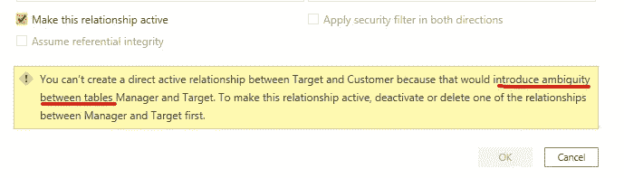
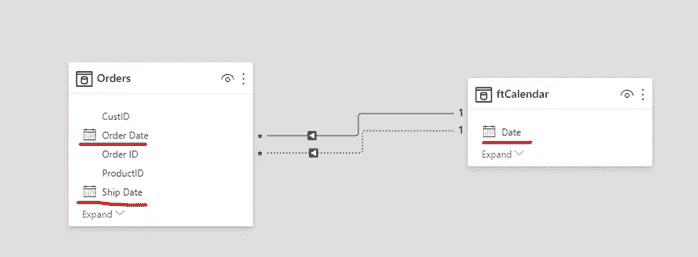
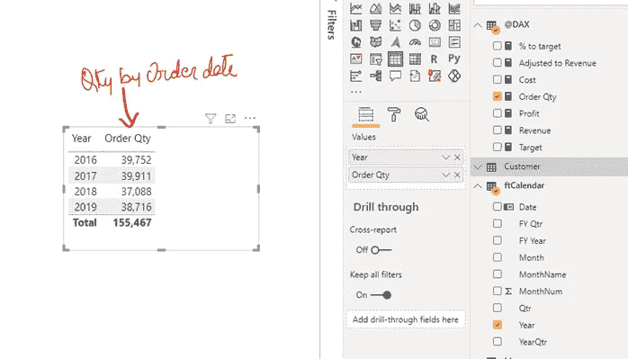
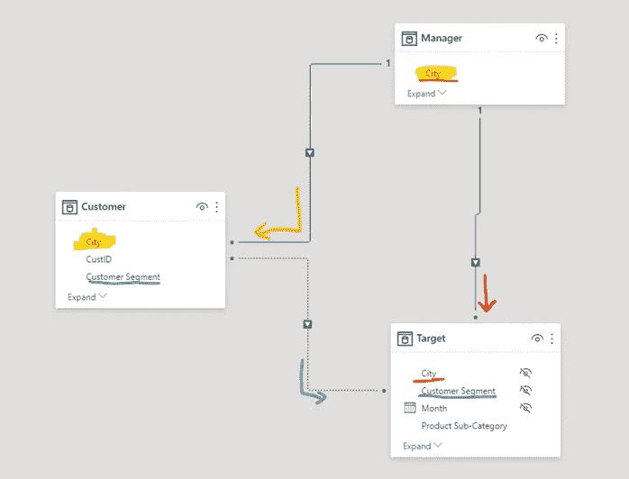
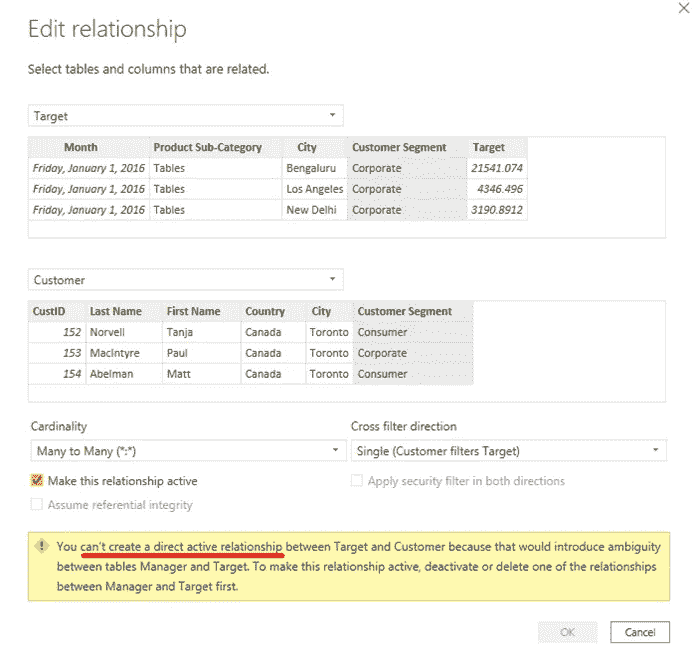
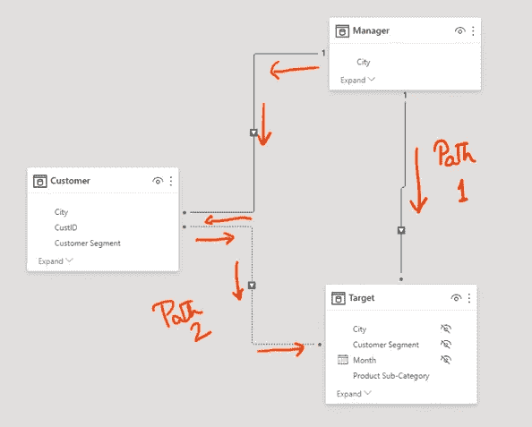

# 理解电力数据模型中的模糊性

> 原文：<https://medium.com/analytics-vidhya/understanding-ambiguity-in-power-data-model-88f69d73465c?source=collection_archive---------15----------------------->


在建立两个表之间的关系时，您是否遇到过以下消息，并想知道它的含义？



如果是，那就跟着读。

这篇文章是我以一种简单可行的方式对此进行解码的努力。

歧义意味着不止一种解释。或者简单的说，什么是合适的选择？存在不确定性。

在数据模型中，我们使用关系在两个表之间传播过滤器。与任何鲁棒系统一样，Power BI 数据模型需要明确定义的滤波器传播路径。

让我们用例子来理解。

# 场景 1

数据模型中模糊性的最简单的例子是在两个表之间建立多个关系。

两个表之间可以有一个活动关系(用实线表示)。所有其他关系总是不活动的(用虚线表示)



在上面的示例中，订单[订单日期]和订单[发货日期]与 ft calendar[日期]相关。Orders[Order Date]和 ftCalendar[Date]之间的关系是活动的，而另一个是非活动的。

我在模型中添加了以下度量:

```
Order Qty = SUM(Orders[Order Quantity])
```

当我们在 visual 和 ftCalendar[Year]中使用上述度量时，它将返回按订单日期排序的订单总数，并按年份分组。



Power BI 通过两个表之间的活动关系(日期到订单日期)传播过滤器。

想象一下，如果订单表和日历表之间的关系都是活动的。上面的图片会返回多少订单？暧昧。

Power BI 不允许我们为数据模型创建任何模糊的场景来避免上述场景。

# 场景 2

考虑以下场景:



经理[城市]与目标[城市]相关(状态—有效)

经理[城市]与客户[城市]相关(状态—有效)

当我们在客户[客户群]和目标[客户群]之间建立关系时，Power BI 不允许它处于活动状态。



它说目标表和客户表之间的活动关系创建了一个不明确的关系。

暂且让我们想象一下，客户和目标之间的关系是主动的。在这种情况下，当我们从经理的表中应用过滤器时，将有两条路径可供模型选择用于过滤器传播:



功率 BI 模型避免了这种对滤波器传播的模糊决策。

替代方案是什么？我们可以借助用户关系临时激活一个不活跃的关系。USERELATIONSHIP 临时激活非活动关系(在公式中定义)并停用其他关系以消除歧义。有关更多详细信息，请参见:

[](https://www.vivran.in/post/multiple-dates-on-the-same-axis-dax-userelationship) [## 同一轴上的多个日期:DAX 用户关系

### Power BI 和 Power Pivot 中的 DAX 建模允许我们在同一轴上查看多个日期字段。这是一个三步…

www.vivran.in](https://www.vivran.in/post/multiple-dates-on-the-same-axis-dax-userelationship) 

我希望它现在有一些意义。

或者说，还是暧昧？

*我写关于*[*MS Excel*](https://www.vivran.in/my-blog/categories/excel)*[*权力查询*](https://www.vivran.in/my-blog/categories/powerquery)*[*权力毕*](https://www.vivran.in/my-blog/categories/powerbi)*[*权力中枢*](https://www.vivran.in/my-blog/categories/power-pivot)*[*DAX*](https://www.vivran.in/my-blog/categories/dax)*[*数据分析【数据*](https://www.vivran.in/my-blog/categories/data-analytics)*****

**[@imVivRan](https://twitter.com/imvivran)**