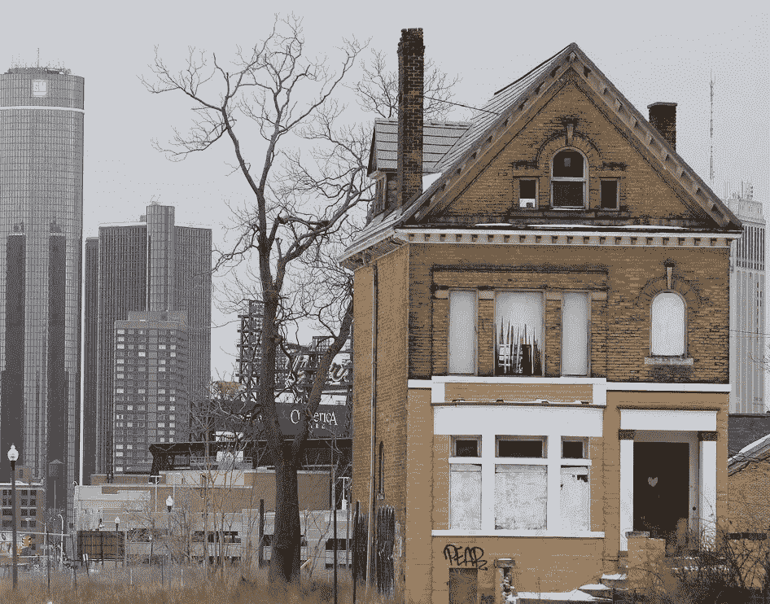
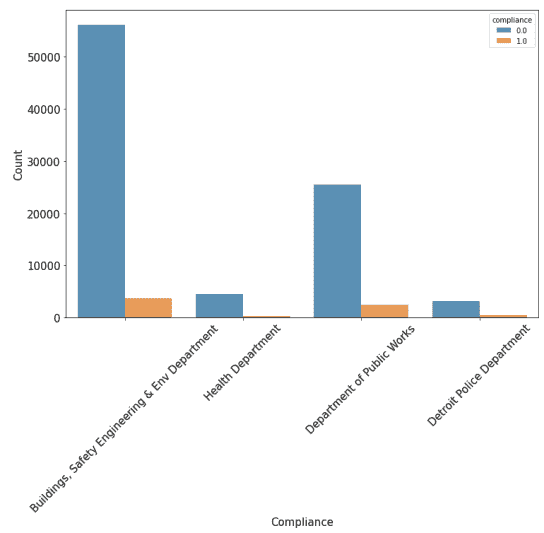

# 了解和预测底特律物业维护罚款的合规性

> 原文：<https://medium.com/analytics-vidhya/understanding-and-predicting-compliance-for-property-maintenance-fines-in-detroit-3585ee96a21b?source=collection_archive---------8----------------------->

## 仔细看看底特律的萧条问题

当我第一次着手这个项目时，我并没有真正理解，而是关注了正在解决的实际业务问题。像许多刚刚进入数据科学或机器学习的学习者一样，我直接进入了建模部分。

现在，作为一个更成熟(希望如此)的解决问题的数据应用者，我尝试用以下方法重做这个项目:

*   *更全面的方法*
*   *更清楚地了解手头的业务问题*
*   *更多数据探索和分析*

最初是作为一项真正的数据科学挑战而创建的，*密歇根数据科学团队* (密歇根大学的一部分)与*跨学科统计科学学生研讨会*和*底特律市*合作，预测疫病合规性，并了解合规率如此之低的原因。该数据集是从[底特律开放数据门户](https://data.detroitmi.gov/)中提取的，并且是公开可用的。

这是我的一个相对较老的项目，但我最近决定重新审视它。这是密西根大学**Coursera**上**密歇根大学**应用数据科学的[机器学习课程](https://www.coursera.org/learn/python-machine-learning?specialization=data-science-python)的顶点项目的一部分。

让我们深入了解一下这个项目的一些背景和动机。

# 底特律的萧条问题

*枯萎病*到底是什么？

枯萎病是一个术语，用来表示由于缺乏保养和维护而处于不良状态的财产或土地。结果，房产最终变得不安全或不适合居住。

房地产衰退影响了底特律超过 20%的房地产，这是一个惊人的统计数字。为了解决这个问题，州政府和联邦政府早在 2013 年就启动了一项计划，通过向居民和各自房产的所有者开出维护罚款来补救这种情况。如果业主的财产被认为是不良的，他们将收到一张罚款或不良罚单，作为促进维护、清洁和安全的措施。

听起来是个简单的解决方案，对吗？不完全是。

原来不到 10%的罚单被支付 **剩下超过 70，000，000 美元的未付罚款**。更糟糕的是，专业清除枯萎病的成本估计在五年内约为 20 亿美元，这使得**预防枯萎病成为重中之重，而不是稍后修复它**。

# 情况怎么会变得这么糟糕？

众所周知，底特律是 20 世纪美国汽车工业的温床，大型制造商如通用汽车、福特和克莱斯勒在此期间蓬勃发展。随着这些汽车制造商的衰落，随之而来的是失业和城市大都市的郊区化。

这导致更多的城市地区的财产和地段的大规模疏散，持续了几十年。据报道，人口从 1950 年的 1，800，000 下降到 2017 年的 700，000**,这导致大量房产和地段被遗弃。**

据报道，自 2005 年以来，由高利率次级抵押贷款导致的抵押贷款止赎有 65，000 起，其中 56%的房产导致了不良后果。在 2013 年至 2014 年期间进行的一项调查显示，大约有 84，461 处房产被认为已经损坏。2013 年，奥巴马政府成立了*底特律衰退特别工作组*来应对衰退问题，但这仍然是一个挑战。

这就是数据应用的切入点。

# 用数据解决问题

对于这个项目，我们有以下三个目标:

*   预测一个人是否会遵守他们的财产维修罚款
*   理解为什么人们没有遵守
*   确保罚款按时缴纳

通过确定不遵守行为的原因，底特律政府可以更好地了解如何接近负责维护其财产的人。如果能够做到这一点，将有助于以两种方式解决枯萎病问题:

*   强制罚款，这将增加清除病害所需的资金
*   帮助业主解决他们的维护问题，并改善保养，如前所述，这是一个非常便宜的选择

# 数据描述

本次分析使用的数据由课程提供，可在我的 Github 个人资料中找到:

训练和测试数据中的每一行都对应于一张损坏的票，并且包括关于每张票何时、为什么以及发给谁的信息。目标变量是*合规*，如果提前、按时或在听证会数据的一个月内支付罚单，则为**真**，如果在听证会日期后支付或根本没有支付罚单，则为**假**，如果发现违规者没有责任，则为**空**。

由于我们试图预测是否会支付疫病合规罚款，这是一个具有以下目标变量的二元分类问题:

请注意某些变量，如*付款金额*、*到期余额*等。仅包含在培训数据中以供参考。因为这些信息在测试集中是不可用的，所以我们不能在建模过程中使用它们。

训练和测试装置中每个变量的描述可以在[这里](https://github.com/saychelsea11/Predicting-Property-Maintenance-Fine-Payment/blob/master/Variables_description.txt)中找到。

# 数据清理和争论

## 初始特征选择的标准

在我们粗略地看了一下变量以及任何丢失的值之后，这一部分相当简单。以下标准用于移除初始变量。

*   提供支付信息的变量，因为这可能导致数据泄露。滞纳金
*   缺少/空值过多的变量— **例如。违反邮政编码**
*   包含太多类别的变量
*   显然不能很好预测目标变量的变量。**例如。州**(因为只有一个州，密歇根州)

## 删除具有太多唯一值或类别的分类变量

每个剩余分类变量的唯一类别数显示在下面的条形图中，这有助于进一步的特征选择。在某些情况下，为了更容易分析，可以将许多独特的类别组合成几个类别。然而，提供姓名或 id 等信息的变量过于独特，无法从中提取任何有用的信息。

包含太多对预测有用的唯一值的变量:

*   *违规者姓名* : ~12 万
*   *违章 _ 街道 _ 号码* : ~2 万
*   *mailing _ address _ str _ number*:~ 15000
*   *mailing _ address _ str _ name*:~ 4 万
*   违规 _ 街道 _ 名称:1791
*   *违规 _ 代码* : 235
*   *违规 _ 描述* : 258
*   邮政编码:5643

我们保留了 *ticket_issued_date* ，因为它后来被用于功能工程。其余的上述变量被删除。

## 过滤数据集以仅包含底特律的违规

对于这一步，在按“底特律”进行过滤之前，“城市”变量的所有值首先被更改为大写。在这一步之后，*城市*变量被删除，因为现在所有的值都相同。

这给我们留下了 96，001 个非空的遵从性变量实例，这表明其他位置包含大量的遵从性值。其他变量的观测值也减少到与柔度变量相同的观测值数量，以形成干净的数据集。

# 探索性数据分析

从法规遵从性的*机构名称*变量的可视化来看，很难清楚地确定特定机构是否倾向于特定的法规遵从性值。这也与不遵从的数量(0 级)远远大于遵从的数量(1 级)有关。因此，我们有了一个**阶级不平衡**的问题。

然而，有两个类别比较突出，即*卫生局*和*建筑、安全工程&环境部*，它们的不合规事件比例略高于其他部门。

对于*处置*变量，负责默认类别的*具有比其他类别大得多的不合规值比例，这些值可用于区分目标变量的类别。*

绘制*罚款金额*变量的合规性图显示，合规性的中值金额低于非合规性的中值金额，两者略有不同。

对于 *discount_amount* 变量的合规性几乎没有任何区别。

*判断 _ 数量*变量显示不合规类别的平均值明显较高，这可能是一个区分因素。

# 数据准备

## 特征选择

基于 EDA，诸如 *admin_fee* 、 *state_fee* 和 *clean_up_cost* 之类的变量被移除，因为它们对于所有观测值具有相同的值，因此对于区分目标变量类别没有用处。结果数据帧的一个片段如下所示。

## 特征工程

创建了一个名为*time-to-hearing*的新变量，它捕获了听证会日期和出票日期之间的时差。这个变量被证明是这个模型的一个重要变量。

下面，我们可以看到合规类别的平均听证时间略低于不合规类别的平均听证时间，两者略有不同。

## 处理缺失值

接下来，我们从数据集中删除任何具有缺失值的观察值。处理缺失值的其他方法可以是插补或基于规则的预测。但是，由于这种情况下缺少的值数量很少，所以删除这些行是安全的。我们还放弃了 *ticket_issued_date* 和 *hearing_date* 变量，因为我们不再需要它们。

## 预处理

我们使用**标签编码**将分类变量转换成离散数值，用于基线模型。另一组数据是使用 **one hot encoding** (OHE)创建的，用于替代模型。对于线性模型，使用**最小/最大缩放器**进一步缩放数据，以便在建模过程中对所有变量进行同等加权。

训练数据被分割成解释变量和目标变量，然后使用 *scikit-learn* 库的 *train_test_split()* 函数进一步分割成训练集和测试集。

# 建模

为了提出我们预测的最佳模型，探索了一些不同的算法以及这些算法的变体。为基于树和非基于树的模型创建了**模型创建和诊断管道**，包括以下关键步骤:

1.  建模
2.  预言；预测；预告
3.  计算预测概率
4.  确定评分标准，如准确度和精确度
5.  可视化 ROC AUC
6.  可视化精度/召回曲线
7.  可视化混淆矩阵
8.  显示最重要的预测变量(仅适用于基于树的模型)

## 基线模型

创建了一个简单的逻辑回归模型作为基线，有以下变化:

*   带有缩放和预处理(一次热编码)
*   没有缩放或预处理
*   有一个热编码但没有缩放

我们发现有 OHE 但没有缩放的模型产生了更好的分数。它产生了比缩放模型更好的准确性、ROC AUC 和回忆分数。下表显示了这些比较。该基线模型使用*网格搜索*算法进行了优化，但没有发现明显的改进。

## 基于树的模型

测试了以下基于树的模型及其优化版本:

*   决策树
*   随机森林
*   梯度推进树
*   轻型 GBM (LGBM)

在 **ROC AUC** 得分方面，大多数基于树的模型的表现略好于基线模型，ROC AUC 得分是我们在模型选择流程中考虑的最重要的指标。一旦选择了模型，我们就更加重视后面描述的**特异性**指标。

## 少数类过采样

在上述模型中，优化的 LGBM 模型似乎表现最好。然而，由于我们处理的是类的不平衡，所以对少数类进行过采样是至关重要的，这样它所包含的观察值的数量在两个类中是相等的。

*为什么处理阶层失衡很重要？*这是因为在不平衡样本上创建的**模型往往会提供夸大的准确度分数，因为大多数实例被预测为多数类**。例如，如果有一个由 100 个实例组成的训练集，其中有 95 个否定类和 5 个肯定类，即使模型预测所有事物都是肯定类，它也有 95%的准确性，甚至没有预测一个肯定类。

我们使用 [*合成少数过采样技术(SMOTE)*](https://machinelearningmastery.com/smote-oversampling-for-imbalanced-classification/) 来创建新的 1 类样本，以匹配 0 类观测值的数量。

## 选择正确的指标

对于我们预测哪些人可能顺从，哪些人可能不顺从的应用程序，我们需要确定**错误预测** **的成本是**。换句话说，假阴性的代价更大还是假阳性的代价更大？

由于当局纠正未支付的不良罚款是一个繁琐而昂贵的过程，因此其想法是找出可能无法按时支付罚款的个人，并**主动采取早期措施以确保支付罚款**或**与他们接触以了解他们无法维护其财产的原因**。

由于早期执行罚款的成本远低于在 upaid 罚款后执行罚款的成本，因此识别尽可能多的不遵从者将是一个更好的解决方案，在这种情况下，这将是一个真正的负面影响。因此，我们希望尽可能减少假阳性的数量，这反过来意味着更高的特异性分数。

*特异性= TN/(TN+FP)*

因此**召回并不重要，而特异性是需要优化的指标**，因为它专注于减少假阳性和增加真阴性。这些考虑对于我们识别可能未能按时支付罚款的个人的应用是最关键的。

## 最终模型

接下来，我们汇总了我们测试的所有模型，以比较每个指标的得分。结果如下表所示。

下图提供了上述比较的直观表示，从中我们可以清楚地看到，精确度和召回率的波动最大，而准确性、ROC AUC 和特异性等指标在每个模型中都相当一致，只是略有变化。

基于上面的推理，有几个模型可以为我们的应用程序工作。然而，我们选择了**模型 19** ，它是过采样和优化的 LGBM 模型。选择这种模式的几个原因是:

*   它提供了相对较高的 **ROC AUC 得分 0.788**
*   它提供了**0.892 和 0.918 的高准确性和特异性分数**
*   它将更好地推广到看不见的数据，因为它是过采样的。少数类未被过度采样的一些其他模型往往具有大于 0.99 的异常高的特异性分数，这表明它们可能预测许多实例为不符合。由于这是多数阶级，偏见并不完全明显。因此，最好使用过采样模型，即使得到的特异性不是最高的。
*   因为它是基于树的模型，我们可以看到最好的预测
*   LGBM 是一个更快的梯度增强版本，并且占用更少的内存

## 模式 19 诊断

ROC AUC 和精密度召回曲线如下图所示。如果有人需要复习，曲线上的点代表不同决策阈值的分数。例如，如果我们沿着精确-召回曲线向下移动，召回会增加，但是精确会降低。理想情况下，我们希望这两个指标都接近 1，但这是不现实的。

下面，我们看到了模型 19 的混淆矩阵，我们可以注意到，大量的不合规标签被准确预测(右下象限)。如前所述，这是因为不合规是大多数标签。我们可能会进一步优化这些结果

在下面的柱状图中，我们可以看到*听证时间*和*处置*是最重要的预测因素，其次是*机构名称*、*判决金额*、*罚款金额*和*折扣金额*。回想一下，我们需要执行一些特征工程来创建对我们的分析至关重要的*听音时间*变量。

# 结果和进一步行动

## 预测看不见的数据

我们在包含 61，001 个观察值的**“保持”测试集上测试了最终模型**。该数据集也经历了与训练集相同的清理和预处理步骤，以便预测可以与模型的训练内容保持一致。

根据预测，11.48%的实例被识别为符合，而 88.52%的实例被识别为不符合。这些统计数据与我们在诊断最终 LGBM 模型时观察到的数据相似。在诊断过程中，我们**确定 11.62%的人群符合标准，因此这些数字相当接近**。另一方面，训练集略有不同，合规实例的百分比为 7.06%。

下面显示了阳性(符合)和阴性(不符合)两种情况下所有预测概率的散点图，我们可以看到阴性类别的大部分人群高于 0.5 决策阈值。如上所述，如果我们想进一步提高特异性，可以将阈值调整到更高的值，以减少假阳性。

下面的直方图提供了概率分布的另一种视图。

## 可操作项目

因此，我们已经确定，底特律有 88.52%的人不合规。我们可以采取什么行动？

我们可以与底特律市合作，接触这 53，998 人，了解他们无法支付罚款的原因。这里有几个选项:

*   让他们支付罚款，这将有助于修复受损的财产
*   如果他们经济困难，向他们提供必要的援助以改善他们的处境
*   让他们从事社区服务或帮助政府修复受损的财产，以换取免除罚款
*   帮助或培训他们良好的物业维护实践，以防止将来发生此类事件

尝试了解是什么具体因素导致这些人不合规。根据我们的分析，以下关键变量可用于采取行动:

*   **倾听时间**:一般来说，倾听时间越长的人似乎越不顺从，但只是很小一部分。
*   **倾向**:默认负责的人似乎有明显更高的不合规率(约 96%)。因此，**最好尽早锁定这些人，以确保他们知道罚款**，并且他们能够获得正确的资源来支付罚款。
*   **机构名称**:两个不合规人员比例略高的机构是*建筑、安全、工程和环境部*和*卫生部*。纽约市可以与这些机构密切合作，强制执行罚款，或者聘请合适的个人来帮助他们。
*   **判决金额**:事实证明，不合规的个人倾向于获得更高的判决金额，平均约为 394 美元，而合规的个人则为 256 美元。这又回到了这些人可能面临的**金融困境**。这也可能是**无法及时维护其物业**的原因。及早处理这种情况的一个方法是**找出被罚款的低收入个人或家庭**，以帮助他们改善财务状况。

这是一个漫长的！如果你做到了这一步，感谢你的阅读。请在评论中告诉我这是否有帮助，或者是否有任何可以改进的地方。干杯！

# 参考

[1] [密歇根数据科学团队—底特律枯萎病分析(mdst.club)](https://www.mdst.club/projects/detroit-blight-analysis)

*原载于 2021 年 4 月 19 日 http://thecraftofdata.com***。**