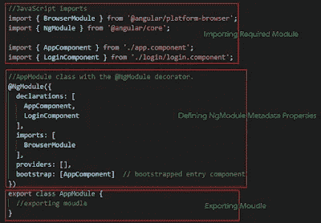

# 了解角度

> 原文：<https://medium.com/analytics-vidhya/understanding-angular-2775383eac99?source=collection_archive---------0----------------------->

走进棱角分明的世界

嗨，伙计们，好久不见了！这次我带来的是 Angular，我们将探讨 Angular 的一些关键概念，触及 Angular 提供的各种功能，安抚那些焦虑的神经，并找到混乱的意义！

## 那么，让我们开始吧👉

## **❶什么是棱角分明**

Angular 是一个使用 HTML 和 TypeScript 构建单页面客户端应用程序的平台和框架。Angular 是用打字稿写的。它将核心和可选功能实现为一组导入到应用程序中的类型脚本库。

## ❷单页应用程序:需要和优点

[视觉表现](https://www.google.com/url?sa=i&url=https%3A%2F%2Fwww.excellentwebworld.com%2Fwhat-is-a-single-page-application%2F&psig=AOvVaw1DDaQkvydOXjjkwOb1rT8H&ust=1627881910580000&source=images&cd=vfe&ved=0CAsQjRxqFwoTCOjDwuyKj_ICFQAAAAAdAAAAABAJ)

单页应用程序是加载单个 HTML 页面的 **web 应用程序，对于任何新功能或组件，每次单击鼠标时，只更新页面的一部分，而不是整个页面**。在此过程中，该页不会重新加载或将控制权转移给另一页。

在这方面，它不同于传统的网络应用。这确保了高性能和更快地加载页面。

Angular 让你以更简单的方式做 SPA。

## ❸棱角建筑

角度建筑——概述

角度应用具有以下重要部分:

⦿模块⦿服务

⦿组件⦿指令

⦿模板

⦿元数据

⦿数据绑定

⦿Dependency 注射液

## ➍天然气模块

Angular 中的模块指的是**一个你可以将与应用相关的组件、指令、管道和服务**分组的地方。如果你正在开发一个网站，页眉、页脚、左边、中间和右边部分成为一个模块的一部分。

模块示例

角度框架的基本构件是角度组件，它们被组织成*ng 模块*。NgModules 将相关代码收集到功能集中；角度应用由一组 NgModules 定义。一个应用总是至少有一个*根模块*支持引导，并且通常有更多的*特性模块*。

将代码组织到不同的功能模块中有助于管理复杂应用程序的开发，并有助于设计可重用性。此外，这种技术允许您利用*延迟加载*——即按需加载模块——来最小化启动时需要加载的代码量。

## ➎角分量

*   组件定义了*视图*，这是一组屏幕元素，Angular 可以根据您的程序逻辑和数据从中进行选择和修改。
*   组件使用*服务*，这些服务提供与视图不直接相关的特定功能。服务提供者可以作为*依赖*被*注入*到组件中，使你的代码模块化、可重用、高效。
*   `@[Component](https://angular.io/api/core/Component)()` decorator 将它下面的类标识为组件，并提供模板和相关的特定于组件的元数据。

## ➏角度模板

模板将 HTML 与角度标记结合起来，可以在 HTML 元素显示之前对其进行修改。模板*指令*提供程序逻辑，绑定标记*连接应用数据和 DOM。有两种类型的数据绑定:*

[单向绑定和双向绑定的区别](https://www.c-sharpcorner.com/UploadFile/ff2f08/data-binding-in-angularjs/)

*   *事件绑定*让您的应用程序通过更新您的应用程序数据来响应目标环境中的用户输入。
*   *属性绑定*允许您将应用程序数据计算出的值插入到 HTML 中。

Ng 模板的一个例子

在显示视图之前，Angular 根据程序数据和逻辑，评估指令并解析模板中的绑定语法，以修改 HTML 元素和 DOM。Angular 支持*双向数据绑定*，这意味着 DOM 中的变化，比如用户的选择，也会反映在你的程序数据中。

## ➐角服务和依赖注入(DI)

对于与特定视图无关的数据或逻辑，并且您希望跨组件共享，您可以创建一个*服务*类。服务类定义的前面紧跟着一个`@[Injectable](https://angular.io/api/core/Injectable)()`装饰器。装饰器提供元数据，允许将其他提供者作为依赖项注入到您的类中。

[模型、服务和组件之间的关系](https://github.com/angular-extensions/model)

依赖注入让你保持组件类的精简和高效。它们不从服务器获取数据，不验证用户输入，也不直接登录控制台；他们将此类任务委托给服务。

## ➑角路由器

Angular `[Router](https://angular.io/api/router/Router)` NgModule 提供了一种服务，允许您定义不同应用程序状态之间的导航路径，并查看应用程序中的层次结构。它以熟悉的浏览器导航约定为模型:

*   在地址栏中输入一个 URL，浏览器就会导航到相应的页面。
*   单击页面上的链接，浏览器将导航到新页面。
*   点按浏览器的后退和前进按钮，浏览器会在您浏览过的页面历史中前后导航。

路由器将类似 URL 的路径映射到视图，而不是页面。当用户执行将在浏览器中加载新页面的操作(如单击链接)时，路由器会拦截浏览器的行为，并显示或隐藏视图层次结构。

如果路由器确定当前的应用程序状态需要特定的功能，而定义它的模块还没有被加载，路由器可以按需*延迟加载*该模块。

路由器根据应用程序的视图导航规则和数据状态解释链接 URL。当用户单击按钮或从下拉框中选择时，或者响应来自任何来源的其他刺激时，您可以导航到新视图。路由器将活动记录在浏览器的历史记录中，因此后退和前进按钮也可以工作。

为了定义导航规则，您将*导航路径*与您的组件相关联。路径使用类似 URL 的语法来集成程序数据，就像模板语法集成视图和程序数据一样。然后，您可以应用程序逻辑来选择显示或隐藏哪些视图，以响应用户输入和您自己的访问规则。

## ➒角状材料

Angular Material**是 Angular JS 开发者的 UI 组件库**。Angular Material components 有助于构建有吸引力的、一致的和功能性的网页和 web 应用程序，同时遵守现代 web 设计原则，如浏览器便携性、设备独立性和优雅降级。

反应式表单提供了一种模型驱动的方法来处理值随时间变化的表单输入。本指南将向您介绍如何创建和更新基本的窗体控件，如何在一个组中使用多个控件，如何验证窗体值，以及如何创建可以在运行时添加或移除控件的动态窗体。

这是所有人的时间，当我进步的时候，我会带你一起走。

**快乐学习！**😃

**参考文献:**

1.  [*https://www . c-sharp corner . com/UploadFile/ff2f 08/data-binding-in-angular js/*](https://www.c-sharpcorner.com/UploadFile/ff2f08/data-binding-in-angularjs/)
2.  [*https://angular.io/guide/*](https://angular.io/guide/architecture#routing)
3.  *【https://github.com/angular-extensions/model】T5[T6](https://github.com/angular-extensions/model)*
4.  *[https://material.angular.io/](https://material.angular.io/)*
5.  *[https://www.tutorialspoint.com/angular_material/index.htm](https://www.tutorialspoint.com/angular_material/index.htm)*