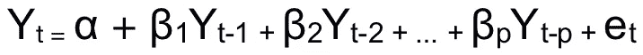
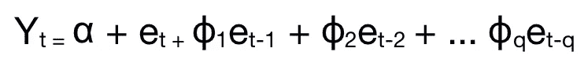
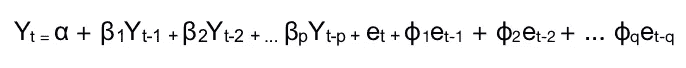

# 了解 ARIMA 预测

> 原文：<https://medium.com/analytics-vidhya/understanding-arima-forecasting-140dc5ceda06?source=collection_archive---------10----------------------->

说到预测，ARIMA 算法通常是首选算法。让我们试着简单地理解这一切是怎么回事。

关于自回归综合移动平均的简单直觉可以建立在该算法仅使用时间序列的过去值来预测未来值的思想上。ARIMA 使用时间序列的滞后和滞后预测误差来预测未来值。然而，要注意的一点是，为了使 ARIMA 工作，该系列应该具有非季节性。

在我们开始研究 ARIMA 之前，我们应该确保这些预测因子是相互独立的，不相关的。

ARIMA 由三部分组成，

AR:自动回归；这里，模型使用了一个序列和一些滞后观测值之间的依赖关系。

**I :** **综合**；使时间序列稳定所需的差异数。

**MA:移动平均线**；这里，模型使用了一个序列和残差之间的相关性，残差是通过滞后观测值的移动平均值计算的。

ARIMA 的三个重要术语是:

**p 代表 AR 术语**

**q 代表移动授权期限**

**d 代表 I 项**

所以，我们从使级数平稳开始。我们将减去具有后续先前项的级数。差分的顺序是 1。对于更复杂的数列，需要更多阶的差。

因此， **d** 的值是使序列稳定所需的**最小差值数**。对于已经稳定的序列， **d 的值=0。**

**p** 是**自回归**项，它对应于用作**预测器**的滞后数。

而 **q** 是**移动平均**项，指预测数值所需的**滞后预测误差**的个数。它是移动平均线窗口的大小。

让我们从数学上理解 p 和 q，

对于纯**自回归**模型，Y *t* 完全取决于 Y *t、*的滞后

这里 Y *t-1* 是数列的滞后 1，β *1* 是滞后项的系数，α是截距项。

类似地，一个纯粹的**移动平均线**模型是 Y *t* 完全取决于滞后预测误差。

这里，误差项来自自回归模型，因此 E *t* 和 E *t-1* 是来自 Y *t* 和 Y *t-1 (* 的等式的项，与第一个等式类似。)

如果我们通过建立在误差项和自回归基础上的理解来总结 ARIMA 模型，它得出:

换句话说，就是，

**预测 Y *t* =截距+滞后值+滞后误差**

这就建立了关于 ARIMA 的基本概念。也会记录代码。

点击此处查找 ARIMA 预测的 Python 代码:

[https://etqadkhan 23 . medium . com/python-code-on-ARIMA-forecasting-d 6 e2fd 90697 c](https://etqadkhan23.medium.com/python-code-on-arima-forecasting-d6e2fd90697c)