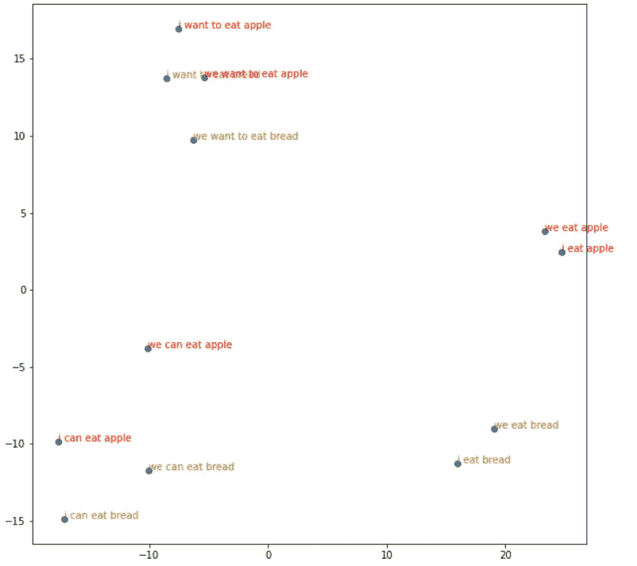
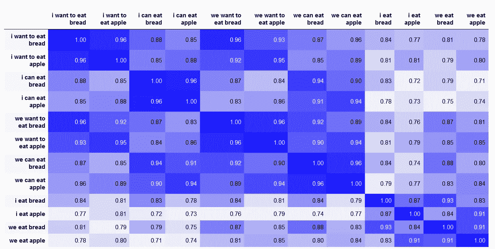
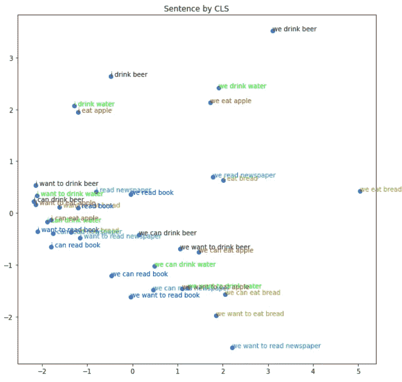
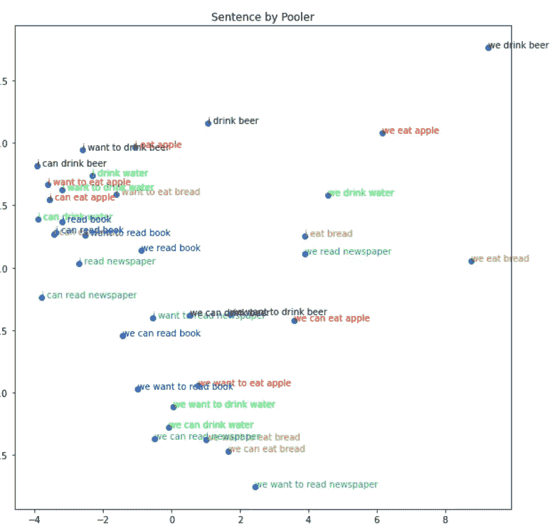
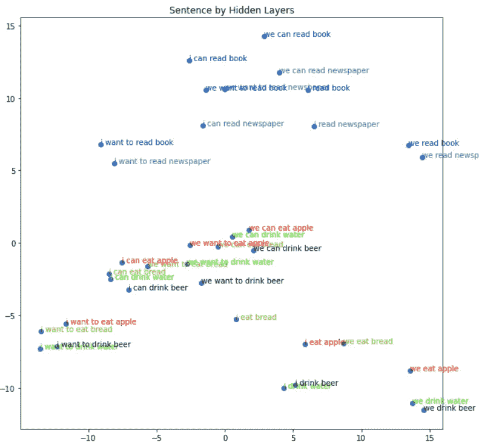
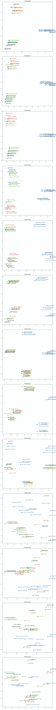

# 了解 Bert 用法

> 原文：<https://medium.com/analytics-vidhya/understanding-bert-usage-31af2042be9e?source=collection_archive---------11----------------------->

在本文中，我将展示 Bert 的基本用法，并在没有任何培训的情况下可视化 Bert 嵌入。有很多很好的学习 Bert 的教程，我将尝试可视化一些方面，所以我假设你已经有了关于 Bert 的基本知识。在下一篇文章中，我将微调 Bert，并尝试展示训练后的变化。(下一篇[链接](https://celikkam.medium.com/bert-fine-tune-visualization-5b405991c84d))

代码在 github [链接](https://github.com/mcelikkaya/medium_articles/blob/main/bert_usage_and_finetune.ipynb)
用 nbviewer 看颜色更好。[链接](https://nbviewer.jupyter.org/github/mcelikkaya/medium_articles/blob/main/bert_usage_and_finetune.ipynb)

现在让我们非常非常简要地总结一下伯特之路:

之前我们有生成固定嵌入的**手套**。(不管我们有什么句子，一个单词都有固定的嵌入。然后用 **Word2vec** 我们开始在嵌入创建中使用上下文。随着 ELMO(bi-LSTM)的出现，我们开始使用句子的上下文来嵌入单词。(左右串接嵌入)
然后 **Bert** 通过同时使用左右，同时使用变压器机构来实现。《变形金刚》是 NLP 的一大步。

我们可以非常高效地使用转换器进行语言翻译(英语->德语)、编码器处理输入(英语)、解码器处理(输入和输出)。Bert 是一个语言模型，它是一个预先训练好的模型，用于生成在**下游**任务中使用的向量。所以我们只需要编码器部分。

**伯特**是一个**蒙面**语言模型。在**自回归**语言模型中，预测每个单词，以之前的单词为条件。在 Bert 中，单词预测依赖于所有单词的剩余部分。Bert 用特殊关键字**【掩码】**替换一些令牌，并尝试预测。现在，输出不是自回归的(左- >右)，它是根据非屏蔽标记一次计算整个句子。(**这有一些缺点，因为屏蔽令牌被假定为独立的)

如何针对我们的问题使用训练有素的网络？
Bert 是一个巨大的网络生成嵌入，我们能在任何任务中使用它吗？
Bert 在两个任务中接受训练，**掩蔽语言模型** ing 和**下一句预测**，所以要时刻记住，如果你的任务不是这些中的任何一个，直接使用 Bert 输出不可能给出很好的结果。在本文中，我将直接使用它，在后面的文章中，我将对 Bert 进行微调。

Bert architecture 有一个 BertEmbeddings 层，它将“Embedding(30522，768，padding_idx=0)”作为第一个元素。30522 是词汇大小，768 Bert 标准嵌入向量大小。还有一个"**位置 _ 嵌入**"和"**令牌 _ 类型 _ 嵌入**"作为输入。当我们提供这 3 个输入时，它为后面的层生成一个[batch_size x seq_len x 768]向量。

在第 1 层之后，Bert 有 12 层称为“BertLayer”的变压器层。([源代码](https://huggingface.co/transformers/_modules/transformers/modeling_bert.html))。与任何神经网络一样，前几层学习基本特征，后几层学习训练目标的数据分布。下面我们将演示所有这些层的输出。基本上，我们可以想到 BertLayers，连续创建大小为 768 的向量的层。

```
BertLayer = BertAttention + BertIntermediate + BertOutput
```

然后我们有一个线性层**池**结束。这为我们分类问题提供了一个有用的向量。

下面我们可以看到 Bert 模型本身有 1.1 亿个参数。在第二篇文章中，我们将结合 1 线性层到这个伯特，并再次计算参数值。您将看到它只会添加近 2000 个新参数。我们将训练网络，权重将根据我们的目标而变化。

我在这里使用的数据是如上简单的 36 个英语句子。

**样本编码用 Bert** 对于使用 Bert 的简单方法可以查看下面的代码。例句是“我吃苹果”。我们首先附加特殊的关键字。然后分裂成代币。在 Bert 词汇表中，将这些拆分更改为 **indexed_tokens** 。然后我们创建分段向量。(对于简单的一句话编码，到处都是 1。)

上述代码的结果如下。你可以看到所有的输入向量和输出向量。

**用 Bert 嵌入单词** 当 Bert 生成向量时，它是用块词来做的，因为 Bert 的词汇量有限(这对低维 30k 来说很好，这对 NLP 来说很小)。因此，当你有一个输入错误或未知(罕见)的单词时，从 Bert 返回的数据将与你预期的不同。所以总是返回一个键向量对。

对于使用单个单词嵌入，你可以试着想象 Bert 为你的问题创建的嵌入。检查 12 个变压器层，检查它们的组合，或者全部使用(平均值或总和)。

下面我将尝试一个简单的单词嵌入可视化。由于 Bert 基于上下文生成向量，因此“我吃苹果”和“我吃面包”中“我”的向量必须不同。
“苹果吃我”和“面包吃我”是不一样的。

或者我们可以查一下“吃”，
“第一单数人在苹果上的动作”
“第一单数人在面包上的动作”
即使这些都是同一个词“吃”，动作有不同的词向量。这意味着伯特正在捕捉上下文。(如果我们使用 Glove，Glove 将为“**吃**”返回相同的向量)



**吃矢量吃 12 句**

上面你可以看到成串的“**可以**”、“**想要**”和“**动词只能**”。你也可以看到“我”和“我们”的子集群。这意味着即使我们有 12 个句子的“吃”向量，向量也会根据句子而变化。

现在我用动词 eat 过滤了 36 个句子，我有 12 个句子。对于 12 个句子，我有 12 个“吃”的向量。我们可以检查这些向量的余弦相似性。下表显示了所有矢量之间的余弦值。你可以看到相同的情态动词或相同的主语句子得到最高分，因为它们有非常相似的语境。最差的是情态动词和普通动词句子(我可以吃面包，我们吃苹果)。如你所见，背景是非常不同的。(在图像模糊的新标签中打开，或检查 github 中的图像)



**每个矢量的余弦值**

**嵌入 Bert 的句子**

有很多方法可以为 Bert 生成句子嵌入。事实上，甚至有针对不同任务的实验。你可以在网上搜索它们。这里我试着测试一些实际的用例。

**CLS** :代表整句向量的特殊记号。为了使用它，我们必须检查模型返回的最后一层(最后一个隐藏状态)的第 0 维。
**Pooler 输出**:这是 Bert 架构最后一层的向量，在网络的末端有一个用于分类任务的线性层。
**隐藏层数** =第 1 个嵌入层数+ 12 个隐藏层数。关于这些层的有趣的事情是，它们是为一个特殊的问题而训练的，可能并不完全适合你的问题。

因为在任何网络中，第一层捕获低级特征，后面的层捕获高级特征(语义、形状、组..)，BERT 的最后几层需要根据任务进行微调。但是由于 Bert 是在一个大的语料库上训练的，它对于几乎所有的 NLP 问题仍然是一个非常好的矢量器。

在互联网上，你通常会看到，极客使用 Bert 的最后 4 层。这 4 层有 768 个维度。您可以连接这些(768x4)或 sum ( 768)或 mean ( 768)。求和不是一个好主意，因为长句会产生更大的总和。

如果你的问题如此复杂，事情对你不起作用，你可以试试 CNN 风格的单词向量卷积。它可以给出非常好的结果。就像图像是 2D 向量，文本是单词(行)x 嵌入(列)2D 结构。

现在我将在我的小数据集中尝试这些。数据集是关于 3 个动词(吃、喝、读)和 6 个

对象(吃->[面包，苹果]，喝->[水，啤酒]，读->[书，报纸])，带 2 个主语(我，我们)…

现在，我将使用这个数据集生成单词和句子向量，并检查生成的向量的质量。正如我们所说的，创建向量有多种方法，下面我展示其中的 3 种。我认为“隐藏层句子”是这些句子的一个很好的分布。即使还没有训练，它也很好地把阅读和(吃，喝)分开了。(我不怪其他向量，他们不必按照这个任务分开，因为他们没有受过这方面的训练。)

上述代码的结果生成了 3 个图，每个图显示了上述句子生成方法的分布。



**伯特隐藏层**

现在我们来检查一下所有中间步骤都学了什么。下面我转储嵌入层和 12 层变压器。如果您检查嵌入，Transformer1、Transformer2、Transformer3 根据动词集群有很好的分布，但是然后组变成混合的(因为 Bert 没有为我的数据集训练)。这实际上显示了第一层网络如何进行特征分解。



上面我们可以看到根据他们所学的伯特的各个层次。如果你把这个逻辑应用到你的问题中，你就会对 Bert 能为你做什么有一个基本的了解。

在本文中，我非常简单地总结了架构。然后我们复习一下**字**，**句**的嵌入。最后我们检查隐藏层学到了什么。在下一篇文章中，我将训练 Bert，所以你可以看到当我们训练时发生了什么变化。