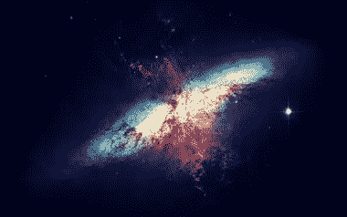
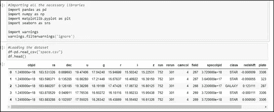
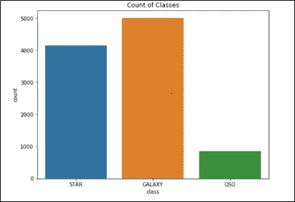
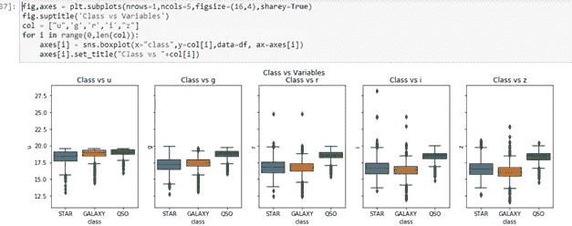
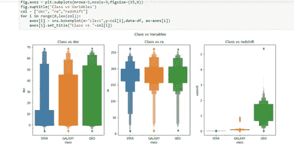
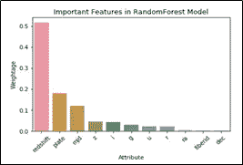
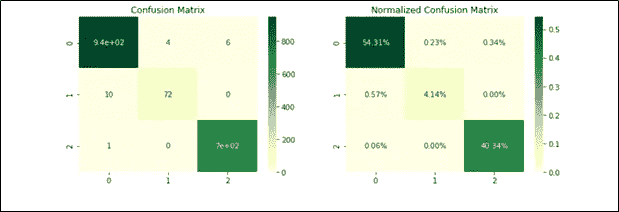
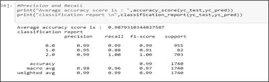
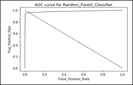
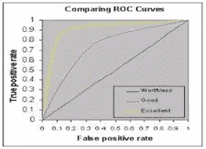

# 了解分类技术:

> 原文：<https://medium.com/analytics-vidhya/understanding-classification-techniques-996f38789e27?source=collection_archive---------2----------------------->

**斯隆数字巡天(SDSS)数据集逐步指南**

> T2:希望你们都平安健康！

在这篇博客中，我们将了解并使用使用 [SDSS 数据集](https://github.com/priyalagarwal27/Classification---SLOAN-Space-Dataset)的分类分析。

**关于数据集:**

星系、类星体和恒星的分类方案是天文学中最基本的方案之一。

类星体是宇宙中最明亮和最遥远的物体。

最大的**恒星群**被称为**星系**。你在天空中看到的每一颗星星都是我们居住的银河系的一部分。

数据有大约 10，000 个观察值(行)的空间。每个观察值由 18 个特征列描述，其中 1 列即类列是因变量或目标变量。而且我们必须确定类柱的结果，即它是恒星、星系还是类星体。

**问题陈述:**

**根据自变量预测类列(因变量)。任务是识别恒星、星系或类星体。**

**1。** **导入库和数据集**

第一步是在我们的笔记本中导入必要的库，如 numpy、pandas、matplotlib 和 seaborn。

然后，我们继续从 csv 格式加载数据集，并将其转换为 panda 数据框和前五行，以了解不同列遵循的数据和模式。

**2。清洗数据集**

1.**使用 ***检查空值:***为空()。sum()** 方法我们检查数据集中是否存在缺失值。

2.**检查数据类型:**我们检查了所有列的数据类型，以查看数据中的任何不一致之处。

3.**检查唯一值:**现在我们必须了解列中是否存在唯一值，这将有助于在未来的处理中减少维数。我发现“objid”和“Rerun”列只有一个唯一值。“类别”列是我们的目标变量，有三个唯一值，即恒星、星系、类星体。

4.**删除列:**因为有 18 列中的‘objid’，‘space objid’只是 id 号，所以可以删除。此外，由于'运行'，'重新运行'，'摄像机'，'视场'列显示的是摄像机的位置，而不是天体的信息，所以我们也可以删除这些列。

**探索性数据分析**

现在进行 EDA 以深入了解数据。

1.**数据可视化:**为了收集洞察力，数据可视化是必须的。

a.**单变量分析:**首先我们使用计数图绘制类的计数，以了解数据的分布。

***在这里，我们清楚地看到恒星和星系在数据集中占主导地位，类星体在数据集中的数据量较少。***

b.**双变量分析:**我们用其他变量绘制了不同的类，以了解不同列之间的关系。

**观察:**

**图 1:** 与其他变量显示不同关系的“u”属性的相关性不同。

**剧情二:**

a.Dec 位置显示 max 恒星从 0 到 10，galaxy 从 0 到 40，QSO 从 0 到 60。
b .所有等级的 RA 值都在相同范围内，看不出有太大差异。

c.红移随着天体距离/大小的增加而增加。恒星红移最小，类星体红移最大。这是一个直接相关的变量，用于识别类别。

**预处理管道:**

在 EDA 过程之后，我们意识到需要将更改合并到数据集中，以使其更适合构建机器学习模型:

**1。** **标签编码:**完成所有探索性数据分析步骤后，我们只剩下一个分类变量，即我们的目标变量“class ”,我们使用标签编码器将其从分类数据类型转换为浮点数据类型，以便进行更好的分析。

**2 *。*** **剔除离群值:** *正如我们在数据可视化过程中观察到的，数据中存在离群值。我们将进一步分析和去除异常值，以使机器学习模型更加稳健。*

**Z 得分分析:**该分析用于从现有数据集中移除异常值。该分析首先计算每个数据值的 z 分数，然后用 zscore > 3 删除数据。

***应用后，我们从数据集中删除了大约 1302 行。现在我们的新数据集形状包含 8698 个属性和 12 列***

现在，我们修改后的数据集已准备好用于模型构建。

**建立机器学习模型:**

1.  ***缩放数据集:*** 通常，第一步是删除目标变量，然后使用标准缩放器缩放数据集，使数据呈正态分布。
2.  ***分割数据集* :** 经过预处理后，我们将我们的数据集分为训练数据集和测试数据集。训练集用于训练模型和拟合机器学习模型，我过去在训练期间实施交叉验证方案来调整超参数，这种类型的验证用于确保拟合的机器学习模型不会过度拟合或欠拟合训练数据。
3.  ***评估模型* :** 我们现在检查了各种分类模型，并计算了精确度、召回率和 *F* 1 分数等指标。这里，“for loop”用于一次性拟合不同的模型。

***从初始模型精度值，我们看到随机森林和决策树比其他的表现更好。它们有最高的准确度和最低的标准偏差。***

4. ***超参数调整* :** 现在，为了进一步提高我们的精度，我们将在两个模型中执行超参数调整，并根据最终指标选择最终模型。

根据这两个结果，我们选择随机森林作为监督学习算法来分类星系、类星体和恒星。

5 **。*特征缩放* :** 现在我们用随机森林模型绘制特征分布，以检查变量在最终预测模型中的权重。

***在特征分配过程中，随机森林模型对红移参数的重视程度最高，对 dec 的重视程度最低。***

*6* ***。*** ***检查模型预测* :** 为了检查模型性能，我们现在将绘制不同的性能指标。

**a.** **混淆矩阵:**

混淆矩阵在预测真实值时显示出很高的准确性:

*   54%的值被确定为恒星的真阳性，0.23%的恒星被错误地确定为类星体，0.34%被错误地确定为星系。
*   0.57%的 QSO 值被错误地识别为 STAR，4.14%的 QSO 被正确识别。
*   0.06%的星系被错误地识别为恒星；40.34%的星系被正确识别。

***只有 21 个值识别错误，其余值分类正确。***

**b .精度和召回:**

***通过观察，我们发现该模型的准确度、精确度和召回率都很高(~0.99)。这表明该模型非常适合预测。***

**c. AUC/ROC 曲线:**AUC-ROC 曲线是在各种阈值设置下对分类问题的性能测量。ROC 是概率曲线，AUC 代表可分性的程度或度量。它告诉我们模型在多大程度上能够区分不同的类。

***通过观察，我们发现我们的 AUC 曲线对于模型的准确度、精密度和召回率都非常接近优秀的准确度(~0.99)。这表明该模型非常适合预测。***

**结束语**

1.将输出变量作为**类**(由标签编码器转换成数值)。

2.通过使用数据可视化了解目标变量与其他变量的关系:

a.Dec 位置显示 max 恒星从 0 到 10，galaxy 从 0 到 40，QSO 从 0 到 60。

b.所有等级的 RA 值都在相同的范围内，看不到太大的差异。

c.红移随着天体距离/大小的增加而增加。恒星红移最小，类星体红移最大。这是一个直接相关的变量，用于识别类别。

3.使用 **z 得分分析**移除异常值，并将数据转换为正态分布。

4.找到最佳模型为 **RandomForestClassifier** ，最佳随机状态为 71，提供最大精度 **99.36%。**

5.**对模型进行微调**并且**找到预测的最佳估计器**。

6.标绘的重要特征和**发现的红移**是**最重要的**因子**贡献了~50%的权重。**

7.发现**精度高，召回分数 0.99。**

8.混淆矩阵显示**分类准确率高**，8398 个中只有 21 个不正确。

9.绘制的 **AOC/ROC 线**显示高真阳性和低假阳性。

**10。整体模型拟合良好。**

**这是我的解决方案的链接:**

[***https://github.com/priyalagarwal27/Classification-斯隆-太空-数据集***](https://github.com/priyalagarwal27/Classification---SLOAN-Space-Dataset)

请在评论区留下任何建议、问题和进一步澄清的要求。

如果你喜欢这篇文章，如果你能分享它，我会非常感激。关注更多博客！！！谢谢大家！