# 理解计算机存储系统

> 原文：<https://medium.com/analytics-vidhya/understanding-computer-memory-system-7e4c9f1017ef?source=collection_archive---------5----------------------->

## *以及所有关于现代计算机内存利用的信息*

M 记忆是大脑的一种功能，通过它可以对数据或信息进行编码、存储，并在需要时进行检索。它是随着时间的推移保留信息，以影响未来的行动。

相似是电脑记忆的功能，和人脑有相似之处。但是在这方面过于简单化是危险的，因为人脑是一个非常复杂和精密的机器。它有记忆和处理能力，这两者交织在一起，还有计算机系统所缺乏的感受和情感的能力。

这里我们将只关注大脑的记忆部分(不是物理上的，只是功能上的)。并尝试用它来类比理解计算机内存是如何工作的。

记忆通常被理解为具有外显和内隐功能的信息处理系统，由**感觉处理器**、**短期(或工作)**记忆和**长期**记忆组成。

这也可能与计算机记忆系统有关。

**感觉处理器**允许外界的信息被感知。这是化学和物理刺激的形式。

**工作记忆**作为一种媒介，用于理解和检索大脑处理的信息。刺激形式的信息由工作记忆处理器按照显式或隐式函数进行编码。工作记忆也从先前储存的材料中提取信息。

最后，**长时记忆**的作用是通过各种范畴模型或系统来存储数据。

上述三个功能类似于计算机存储系统，来自各种输入设备的输入进入存储器，在主存储器(主要是 RAM)中进行处理，数据存储在辅助存储器(辅助存储器)中，用于当前或将来的处理。

除了这三个就是 **ROM** ，电脑内存的硬编码，或者框架。这可以理解为人类习惯的类比，这些习惯慢慢地被编码到行为中，一旦形成，无需有意识的努力就自然而然地产生了。

让我们更深入地研究一下计算机的记忆系统，为了更好地理解它，我们使用上面讨论过的人类记忆类比(也仅仅是为了这个目的)。人类的记忆系统在现实中要复杂得多)。

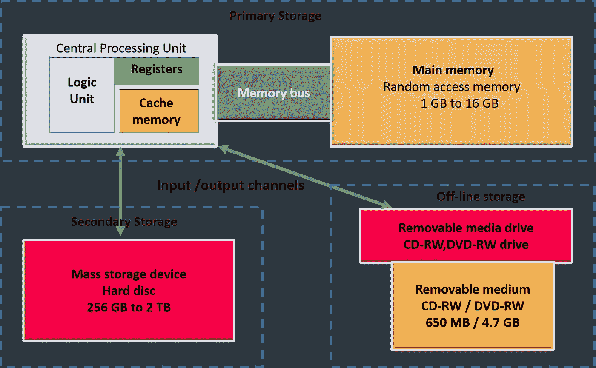

各种形式的存储器，根据它们离中央处理器的距离来划分。通用计算机的基本组件是中央处理器、主存储器、输入输出通道、存储空间和输入输出设备。

# 内存层次结构:

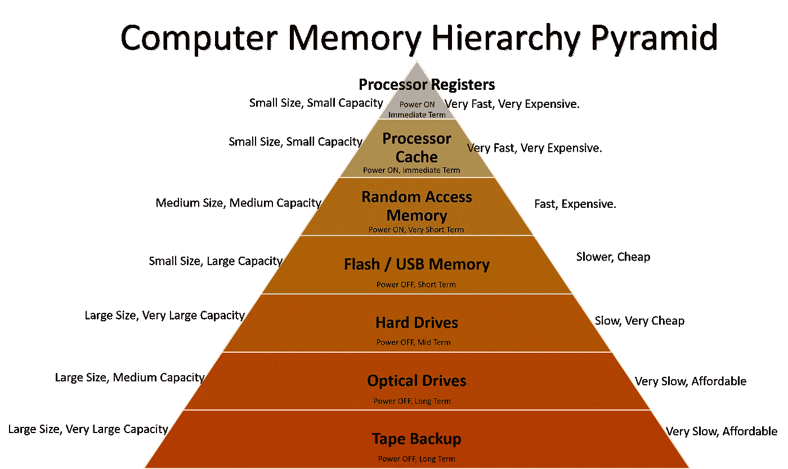

# 计算机如何处理信息

这是我们都非常熟悉的一种布局。这是最基本的计算机布局，为了便于理解，牺牲了一些细节。

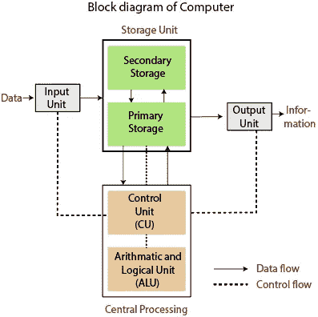

如果你跟随数据流，它作为输入设备的输入直接进入内存，内存由存储单元表示。从这里开始，关于如何使用内存和内存内部都是从哪里开始的困惑就出现了。让我们进一步打破这个盒子。

1.主存储器

2.辅助存储器

这种命名法创造了一种层次结构，其中一种内存优于另一种。也有同样的原因。让我们先了解所有种类的记忆都在那里，然后我们再来看看优越感(双关语😃)的记忆。

在计算中，用于存储信息以供计算机或相关计算机硬件设备立即使用的设备通常称为内存。它通常指半导体存储器，其中数据存储在硅集成电路芯片上的金属氧化物半导体(MOS)存储单元中。术语“存储器”通常是术语“主存储器”的通俗简称。二级存储或内存通常被称为“存储”。

处理器的两个“内存”位于中央处理器(CPU)内部，分别是寄存器和缓存。虽然它们是一种记忆，但通常是在记忆系统之外研究的。这些是最昂贵的，也是 CPU 最快的内存访问。让我们先看看它们。

# CPU 的内存:

## 寄存器:

寄存器是 CPU 用来存储数据和指令的小存储单元。它们内置于处理器本身。因此，处理器可以直接访问这些存储单元。这使得它们成为最快的可访问内存。寄存器由它们可以容纳的位数来衡量，例如，“8 位寄存器”、“32 位寄存器”或“64 位寄存器”。32 位和 64 位通常用于描述处理器架构或处理器设计。32 位处理器有一个 32 位寄存器，可以存储 232 或 4，294，967，296 个值。64 位处理器有一个 64 位寄存器，可以存储 264 或 18，446，744，073，709，551，616 个值。

如果您曾经在安装软件时想知道 32 位和 64 位版本有什么不同，现在您知道了。

## 高速缓存:

高速缓冲存储器不是原始存储器，而是经常使用的“主存储器”的某些部分的副本。因此，高速缓存是一种更小、更快的内存，位于更靠近处理器内核的位置，用于存储经常使用的主内存中的数据副本。当试图从主存储器中的一个位置读取或向其写入时，处理器首先检查来自该位置的数据是否已经在高速缓存中。如果是这样，处理器将从高速缓存中读取或写入，而不是从慢得多的主存储器中读取或写入。这有助于降低从主存储器访问数据的平均成本(时间或能量)。

靠近 CPU 的小内存比大得多的主内存运行得更快。自 20 世纪 80 年代以来，大多数 CPU 都使用一种或多种类型的高速缓存。

# 主存储器(也称为主存储器、内部存储器或主存储器)

*主存储器*(也称为主存储器、*内存*或*主存储器*)，通常简称为*内存*，是唯一一个可以直接访问 CPU 的存储器。CPU 不断读取存储在那里的指令，并根据需要执行它们。任何主动操作的数据也以统一的方式存储在其中。

这张图表详细说明了这一切。两种主要存储器是只读存储器和随机存取存储器。

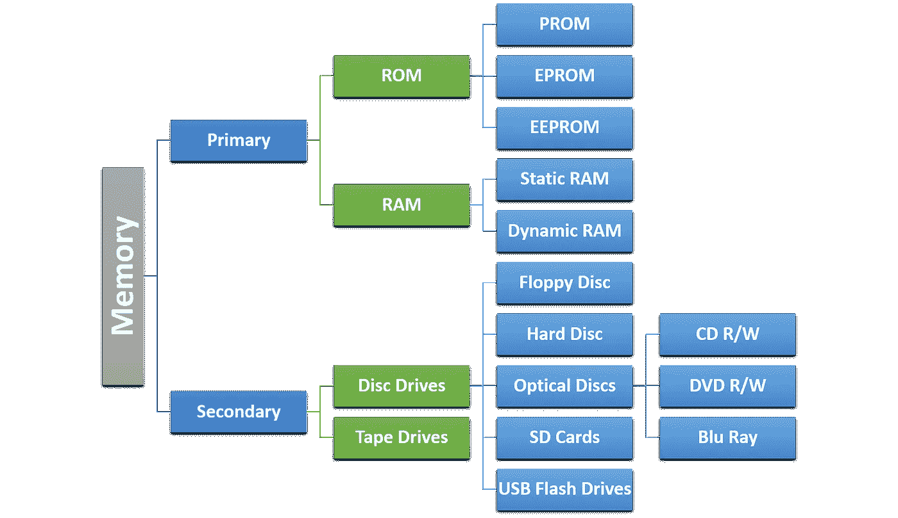

主存储器和辅助存储器:用作 RAM 和 ROM 的不同类型的设备。

**ROM** :只读存储器

**RAM** :随机存取存储器

RAM 和 ROM 是非常流行的缩写，每个学生从中学就知道，但我可以为自己说，我总是对它们在形式和功能上的不同感到困惑。当我把这些点连接起来时，我很兴奋。因为我从他们身上学到的新东西都是关于已知的东西，而这些东西从来没有被感知过。所以我想让你自己把这些点联系起来。

大家都知道 ROM 是只读存储器。但是为什么呢？这个记忆存放在哪里？它执行什么功能？

## 只读存储器

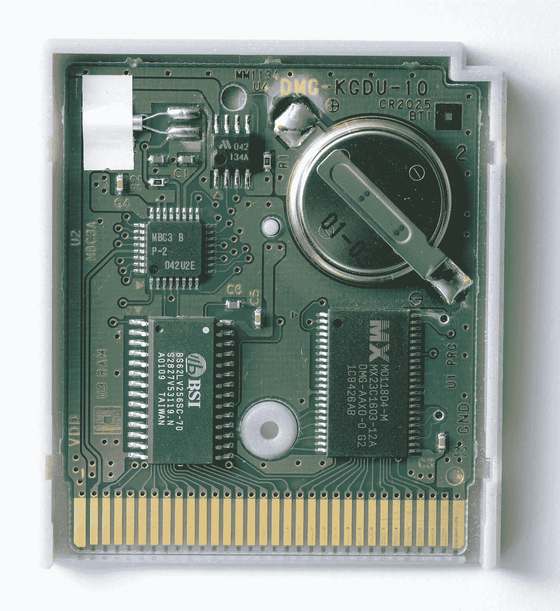

打开了游戏男孩颜色的 ROM 盒。这里:神奇宝贝银。作者西蒙·a·尤金斯特拉——自己的作品，CC BY-SA 3.0，[https://commons.wikimedia.org/w/index.php?curid=17921573](https://commons.wikimedia.org/w/index.php?curid=17921573)

这是一种用于计算机和其他电子设备的非易失性存储器。非易失性意味着不需要电源来保持存储器存活。存储在 ROM 中的数据在存储器设备制造后不能被电子修改。

现在几乎每个设备都有出厂重置。因此我将使用这个类比来使你更容易理解 ROM。

当计算机在工厂制造/组装时，内置在计算机中的存储器就是 ROM。存储在 ROM 中的数据是不可更改的，不容易修改。因此，在计算机系统的寿命期间很少改变的软件被存储在 ROM 存储设备中。这种软件也称为固件。(固件是一个非常常见的术语，当应用出厂重置时，计算机或此类系统会重置为固件。)

神奇宝贝黄金和神奇宝贝白银于 1999 年 11 月 21 日在日本发行，作为神奇宝贝系列的第二套游戏。[https://www . pokemon . com/us/pokemon-video-games/pokemon-gold-version-and-pokemon-silver-version/](https://www.pokemon.com/us/pokemon-video-games/pokemon-gold-version-and-pokemon-silver-version/)

因此，把它看作是最基本和最重要的记忆。基本因为，只能看，不能在上面写东西。这个存储空间不对用户开放。计算机的 BIOS 就是这样一个例子。另一个例子可以是即插即用的视频游戏盒。他们把游戏储存在只读存储器里。许多游戏控制台使用可互换的 ROM 盒，允许一个系统玩多个游戏。ROM 先于操作系统。它允许计算机拥有自己的固件。其他的一切都在那之后，甚至是操作系统。

## 掩模只读存储器:

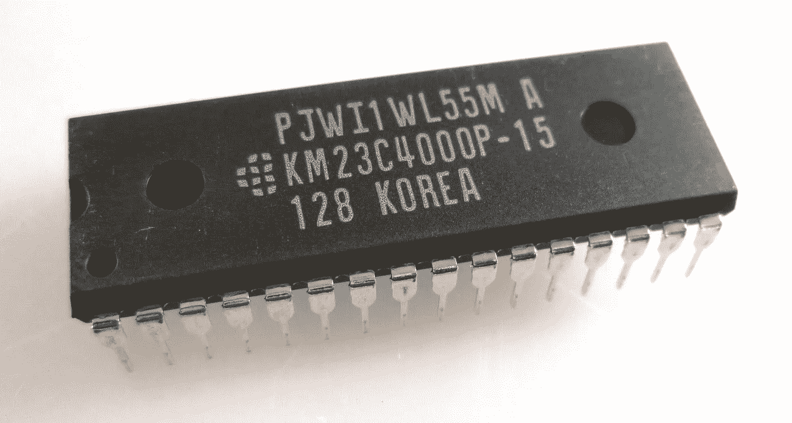

三星 KM23C4000P-15 4M 位(512Kx8) CMOS 掩模 ROM 32 引脚 P DIP OMA037D

第一个只读存储器是硬连线的。它们是由二极管或集成电路(ic)等电子元件组成的，在制造后不能改变。这些只读存储器集成电路也被称为掩模只读存储器集成电路。此后，如果要对 ROM 进行升级，则必须更换。可以安装具有新升级固件的新 ROM，但是旧 ROM 和固件不能改变。(硬连线，记住…)

在掩模 ROM IC 中，数据在制造期间被物理地硬编码。所以它只能在制造过程中被编程。这造成了许多障碍:

1.因为每个掩模 ROM 在制造过程中被编程，所以它的成本变得非常高，因为用户必须与代工厂签订合同来生产定制设计。只有大量订购才有可能。

2.制造一个 ROM 是一个耗时的过程，因为每个 ROM 都是定制的。

3.对于 R&D 的使用，用户必须进行反复试验或者修改和改进存储器中的内容来改进设计，掩模 ROM 变得不切实际。

4.如果 ROM 有故障，并且产品已发货，不全面召回就无法纠正。

## 可编程只读存储器(PROM):

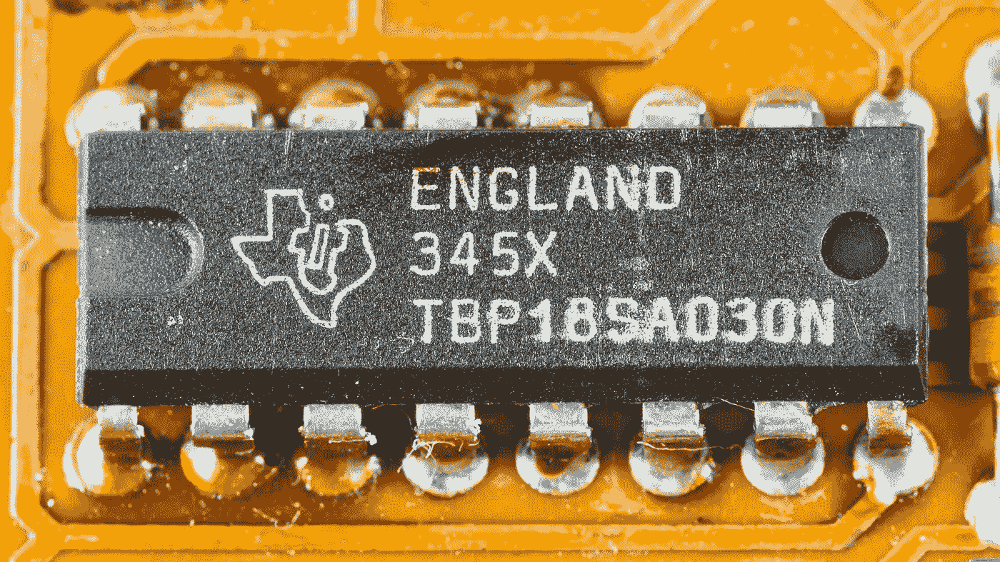

德州仪器 PROM 类型 TBP18SA030N。由雷蒙·斯佩金/ CC BY-SA 4.0(通过维基共享资源)，CC BY-SA 4.0，[https://commons.wikimedia.org/w/index.php?curid=56695971](https://commons.wikimedia.org/w/index.php?curid=56695971)

这些缺点产生了对可编程只读存储器(PROM)的需求。这是 Wen Tsing Chow 在 1956 年发明的，允许用户通过施加高压脉冲物理地改变其结构来对其内容编程一次。这解决了上面的问题 1 和 2，因为公司可以简单地订购一大批新的 PROM 芯片，并在其设计者方便时用期望的内容对它们进行编程。然而，这也可能只有一次。

## 可擦除可编程只读存储器(EPROM):

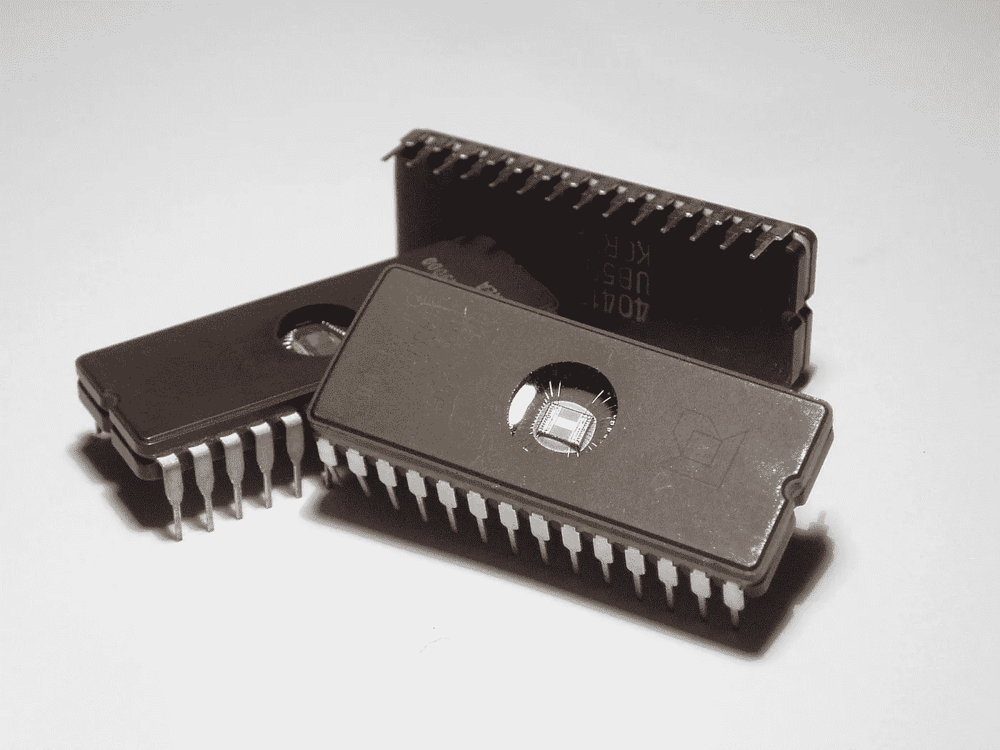

双列直插式封装的可擦除可编程只读存储器(EPROM)集成电路。这些封装有一个透明窗口，显示内部的芯片。该窗口用于通过将芯片暴露在紫外光下来擦除存储器。最初的上传者是英语维基百科上的 Zephyris。—由 TenIslands 使用 CommonsHelper 从 en.wikipedia 转移到 Commons。，CC BY-SA 3.0，[https://commons.wikimedia.org/w/index.php?curid=4560427](https://commons.wikimedia.org/w/index.php?curid=4560427)

1971 年，英特尔公司的多夫·弗罗曼发明了可擦可编程只读存储器(EPROM)。这种新的 ROM，称为 EPROM，基本上解决了上面列表中的第三个障碍，因为 EPROM(不同于 PROM)可以通过暴露在强紫外光下重复复位到其未编程状态。值得注意的是，用户仍然几乎不可能擦除 ROM(这正是我们想要的)，并重写它。它只解决了装备精良的实验室和 R&D 中心的问题。

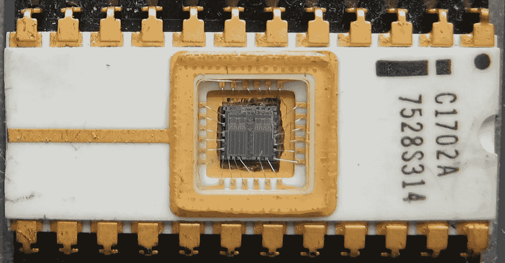

第一个 EPROM 是 Intel 1702，通过擦除窗口可以清楚地看到芯片和焊线。作者:Poil 01:10，2005 年 4 月 17 日(UTC)-作者个人收藏。、CC BY-SA 3.0、【https://commons.wikimedia.org/w/index.php?curid=97658 

## 电可擦除可编程只读存储器(EEPROM):

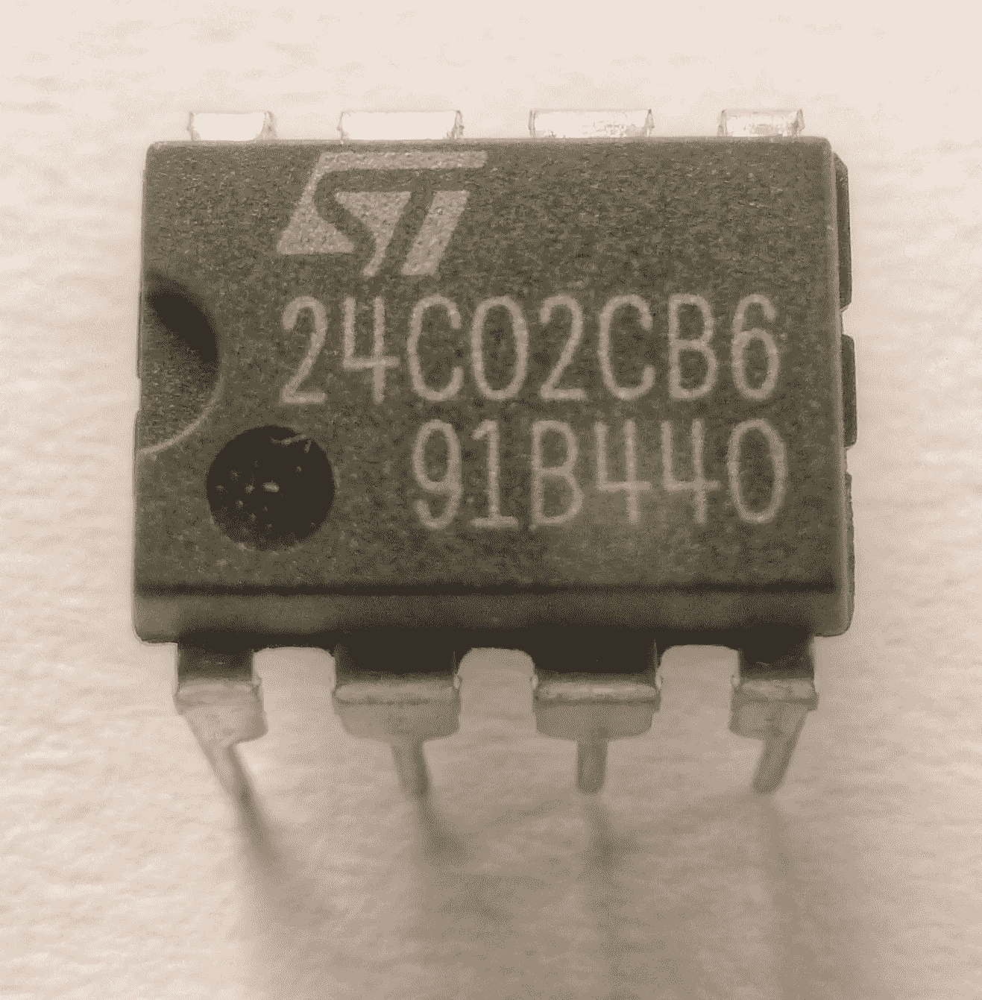

意法半导体 M24C02 I C 串行型 EEPROM，Nevit Dilmen，CC BY-SA 3.0，【https://commons.wikimedia.org/w/index.php?curid=30561436 

EEPROM 是由 Yasuo Tarui、Yutaka Hayashi 和 Kiyoko Naga 于 1972 年在电工实验室开发的。这甚至可以在远程位置进行编程(仅使用计算机和串行电缆)。这也帮助计算机行业跨越了第四个障碍。现在，有缺陷的只读存储器可以在消费者或用户处重新编程，而不需要将整个设备带回制造商处。

## 闪存:

展望未来，东芝公司的桀冈富士雄在 20 世纪 80 年代初发明了闪存，并在 80 年代末将其商业化。闪存是 EEPROM 的一种形式。这非常有效地利用了芯片面积，并且可以被擦除、编程和重新编程数千次而没有任何损坏。

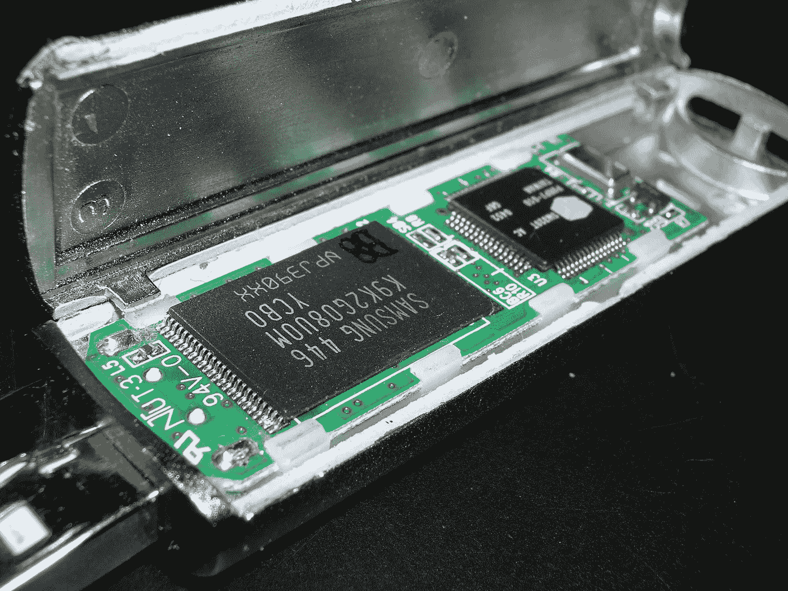

一个拆开的 u 盘。左边的芯片是闪存。控制器在右边。CC BY-SA 3.0，[https://commons.wikimedia.org/w/index.php?curid=179956](https://commons.wikimedia.org/w/index.php?curid=179956)

但这是一个突破性的进步，现在设备的任何特定部分都可以被擦除。(早期的 rom 需要全部删除)。这可以高速完成，因此得名“flash”。

在闪存作为 rom 出现之后，整个 ROM 场景已经从“一次性可编程”变为“ROM 的定期更新”。最好的例子就是定期更新各种计算机系统的固件。早期，固件不容易更改或升级。现在，在移动设备中，公司推动固件的远程升级，用户下载并更新固件。

为什么我们还有 EPROM 和 Mask ROM？

一个自然的问题出现在脑海中，在 EEPROM 的所有优点之后，为什么我们仍然有旧的和功能较少的 ROM 类型？

答案很简单。 ***成本。***

所有的先进技术都增加了 ROM 芯片的灵活性，但也有不利的一面。这项技术的每片成本非常高。而且很多系统终身不需要 ROM 升级，不需要额外的成本负担。因此，只要大量掩模 ROM 更便宜(规模经济)，它们将在多年内仍然是许多器件的 ROM 选择。

# 随机存取存储器

随机存取存储器是计算机的易失性存储器。意思是，一断电它就忘记了。RAM 是一种昂贵的“内存资产”，因此在普通计算设备中，它从 512 MB 到 8 GB 不等(一些昂贵的设备，包括 PC 和移动设备也有更高的 RAM)。内存越多，计算机的运行速度越快。如果我们了解计算机如何管理其内部内存进行操作(只有易失性内存，而不是 ROM)，就可以理解它的原因。

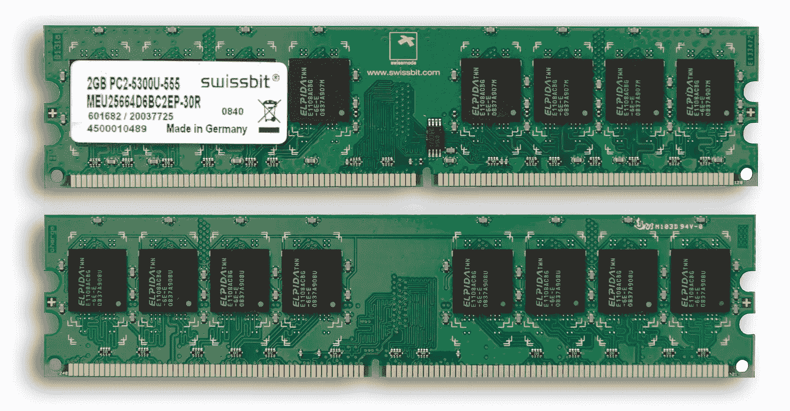

可写易失性随机存取存储器的例子:同步动态 RAM 模块，主要用作个人计算机、工作站和服务器的主存储器。由安-德-自己的作品，CC BY-SA 3.0，[https://commons.wikimedia.org/w/index.php?curid=27224495](https://commons.wikimedia.org/w/index.php?curid=27224495)

RAM 本质上是计算机及其应用程序用来存储和访问临时数据的超高速、高速存储器。可以把它想象成计算机的短期记忆。当一个程序启动时(例如 Google chrome 浏览器或 Microsoft Excel 文件)，它的公共数据存储在 ram 中，由于 RAM 比硬盘(二级内存)快得多，所以通过直接从 RAM 中访问数据，程序运行得更快。程序一结束(你关闭浏览器或文件)，ram 就从它的数据中释放出来。因此，RAM 越大，计算机处理更多同时运行的程序的速度就越快。

内存较小的计算机不能同时做很多事情。比方说，您正在处理多个视频文件，同时打开许多 web 浏览器。每打开一个新程序，内存需求就会增加。当计算机的“临时内存”需求超过 RAM 时会发生什么？现代计算机使用一种叫做虚拟内存的内存管理技术。

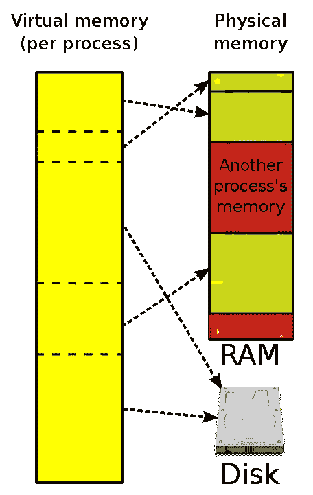

虚拟内存将 DASD[a]上的活动 RAM 和非活动内存组合在一起，形成一个大范围的连续地址。By Ehamberg —自己的作品，CC BY-SA 3.0，[https://commons.wikimedia.org/w/index.php?curid=8352077](https://commons.wikimedia.org/w/index.php?curid=8352077)

这是一种扩展 RAM 容量的方法。计算机硬盘的一部分被留作分页文件，现在 RAM 和分页文件的总和变成了总的“临时内存”。然而，有一个问题。硬盘比内存慢得多。每当计算机依靠从硬盘的分页文件中获取数据时，它得到的响应比 RAM 提供的要慢。

因此，RAM 越高，计算机运算速度越快。

现在自然的问题又出现了。为什么内存在 1 到 8 GB(有时甚至更高)的范围内，而硬盘在 512 GBs 到 2 TBs 的范围内(Terrabyte = 1024 GB)？

母鸡的公羊如此重要，为什么没有更高的公羊呢？

答案又是，**的*成本*的**。

易失性随机存取存储器的两种主要类型是**静态随机存取存储器**和**动态随机存取存储器**。半导体 RAM 的商业应用可以追溯到 1965 年，当时 IBM 为他们的 System/360 Model 95 计算机推出了 SP95 SRAM 芯片，东芝为其 Toscal BC-1411 电子计算器使用了 DRAM 存储单元。

## 静态随机存取存储器

在静态 RAM 中，数据存储在六晶体管(一种半导体)存储单元中，这需要恒定的电流。因为功率流是恒定的，所以不需要刷新存储器来记住正在存储的数据。这称为静态，因为不需要任何更改(不需要刷新)来保持数据完整。它用于高速缓冲存储器。

这需要更少的功率，并提供更快的访问和速度。但同时，它的内存密度较低(同样大小的内存较少)，因此成本较高。

## 动态随机存取存储器(DRAM)。

在动态 RAM 中，数据存储在晶体管和电容器(由金属而不是半导体制成)对存储单元中。电容器缓慢释放能量。因此数据(以能量的形式存储)也丢失了。因此，需要定期刷新电源以保持其功能。DRAM 被称为动态的，因为它需要不断改变功率(刷新)来保持数据完整。

与 SRAM 相比，这需要更高的功耗，并且对数据的访问更慢。但同时，它的内存密度更大(同样大小的内存更多)，因此成本更低。

许多计算机系统具有由处理器寄存器、片上 SRAM 高速缓存、外部高速缓存、DRAM、分页系统和硬盘上的虚拟存储器组成的存储器层次结构。这整个存储器池可以被称为“RAM”。

# 辅助存储器(也称为外部存储器或辅助存储器):

辅助存储器(也称为外部存储器或辅助存储器)不同于主存储器，因为它不能被 CPU 直接访问。计算机利用其输入输出通道访问辅助存储器，并将所需数据传送到主存储器。辅助存储器是非易失性的(即使断电，数据仍会保留)。

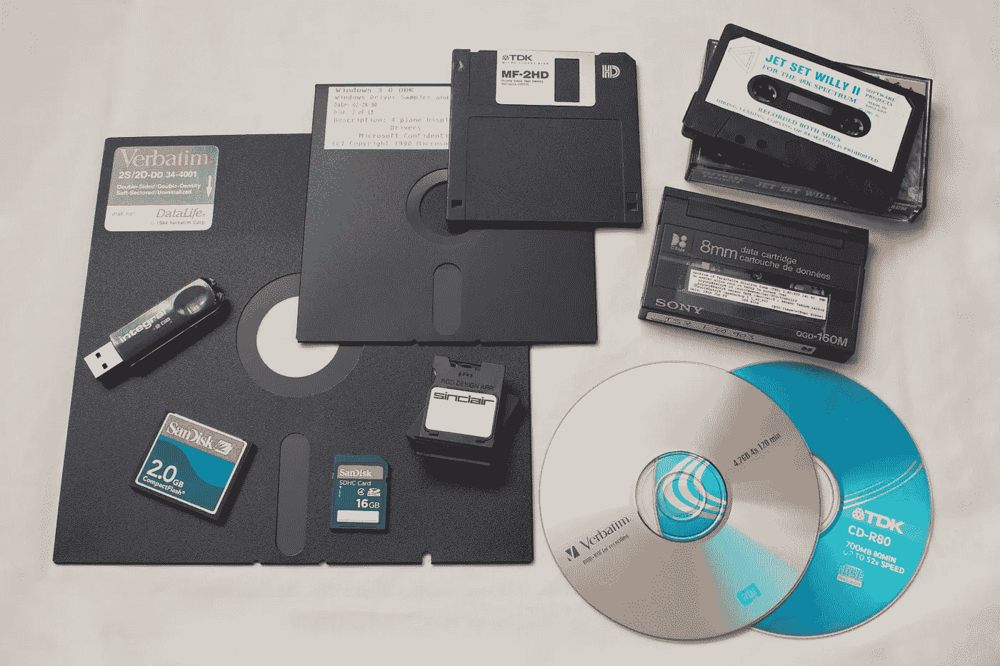

不同的数据存储介质，来自剑桥的 avaragado 移动存储四十年，CC BY 2.0，[https://commons.wikimedia.org/w/index.php?curid=20711777](https://commons.wikimedia.org/w/index.php?curid=20711777)

硬盘或固态硬盘的每字节访问时间通常以毫秒(千分之一秒)为单位，而主存储的每字节访问时间以纳秒(十亿分之一秒)为单位。因此，辅助存储比主存储慢得多。

让我们来看看用来存储记忆的各种辅助存储设备。我们将首先按照最新的顺序列出它们。

## 固态硬盘(SSD)

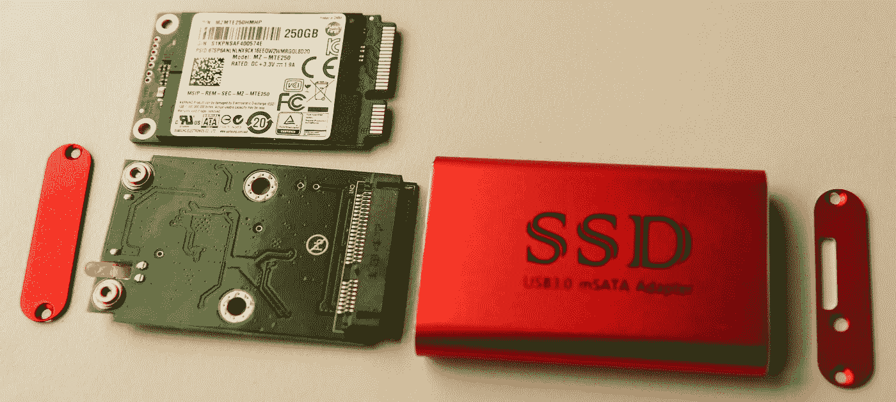

一款带外部外壳的 mSATA 固态硬盘，Ralf Roletschek-Own 作品，https://commons.wikimedia.org/w/index.php?curid=37902393[GFDL 1.2](https://commons.wikimedia.org/w/index.php?curid=37902393)

固态硬盘是一种使用集成电路组件来存储数据的存储设备。这通常使用闪存。与其封闭的竞争对手硬盘驱动器(HDD——俗称硬盘)相比，固态硬盘的数据读写速度更快，运行安静，更能抵抗物理冲击(因为它们不包含任何移动的机械设备)。

固态硬盘将数据存储在半导体存储单元中。

## 硬盘驱动器(HDD)

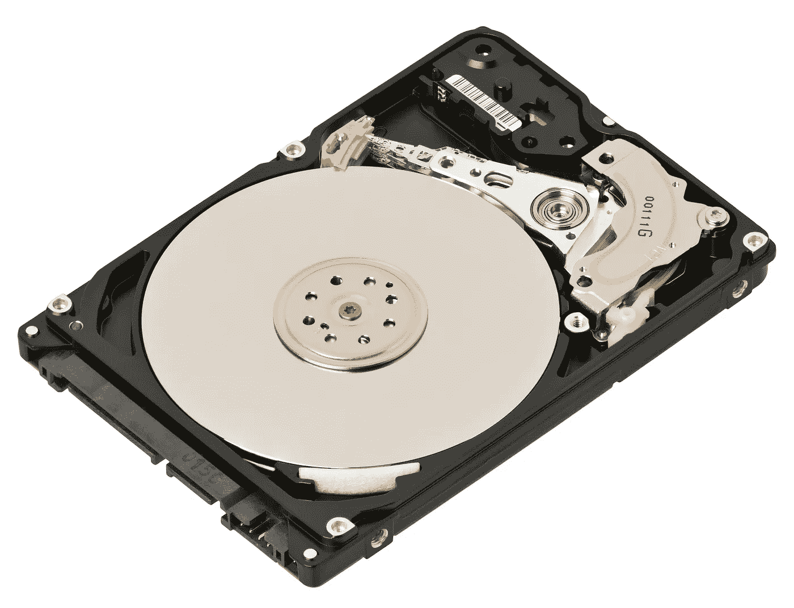

2.5 英寸笔记本电脑硬盘驱动器的内部结构，作者埃文-阿莫斯——自己的作品，CC BY-SA 3.0，【https://commons.wikimedia.org/w/index.php?curid=27940250 

HDD 是一种机电设备，用于使用磁存储来存储大量数字数据。存储是在磁盘上完成的，磁盘上的数据以电磁方式记录在同心圆上。一个看起来像唱机臂的磁头在磁盘上读写数据。每个读或写操作必须首先定位数据，一个操作被称为“查找”。数据以随机访问的方式访问，这意味着单个数据块可以以任何顺序存储和检索。硬盘是一种非易失性存储，即使在关机时也能保留存储的数据。

## USB 闪存驱动器:

2011 年的 SanDisk Cruzer USB 驱动器，存储容量为 4 GB

USB 闪存驱动器是一种数据存储设备，包括带有集成 USB 接口的闪存。它通常是可移动的、可重写的，并且比光盘小得多。大多数重量不到 30 克。它们于 2000 年底首次投放市场。正如大多数发展中的技术一样，存储容量随着时间的推移而提高，价格也下降了。这些是当今人们普遍使用的最常见的便携式存储设备。

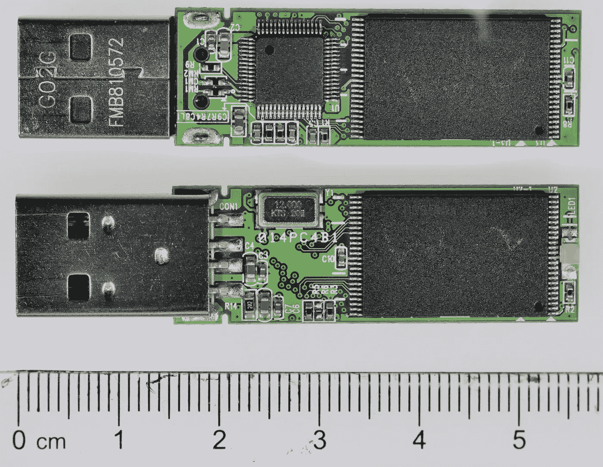

移除外壳后的 USB 闪存驱动器的正面和背面，由 Graham Beards 在家中制作，CC BY-SA 4.0，[https://commons.wikimedia.org/w/index.php?curid=87863271](https://commons.wikimedia.org/w/index.php?curid=87863271)

## 光盘驱动器(奇数)

光学指向与光有关的事物。光盘驱动器是那些使用光(激光或其他电磁波，如光)在光盘驱动器上读取或写入数据的光盘。有三种最流行的光盘用于存储数据。它们是光盘(CD)、数字多功能光盘(DVD)和蓝光光盘(BD)。CD 最低，蓝光光盘存储容量最高。CD 的正常范围是 700 MB 数据，DVD 是大约 4.7 GB 数据，蓝光光盘是大约 25 GB 数据。

光盘被设计成支持三种记录类型之一:只读(例如 CD 和 CD-ROM)、可记录(一次性写入，例如 CD-R)或可重复记录(可重写，例如 CD-RW)。

虽然光盘比早期的视听和数据存储格式更耐用，但如果处理不当，它们容易受到环境和日常使用的损害。

## 软盘

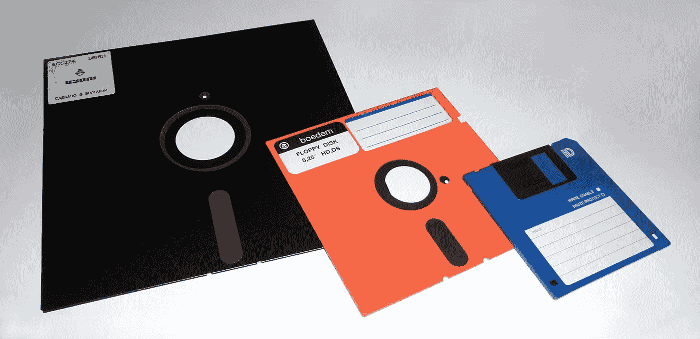

软盘是一种磁性存储设备，其中数据存储在磁性存储介质的薄而柔软的磁盘中。

软盘在 20 世纪末的文化中是如此普遍，以至于许多电子和软件程序直到 21 世纪还在继续使用看起来像软盘的保存图标。然而，由于它们只能容纳非常少量的内存(800 KB 到 2.8 MB)，并且随着更先进的内存解决方案(如光盘和闪存驱动器)的出现，它们在日常计算机使用中已经不再使用。

## 磁带数据存储:

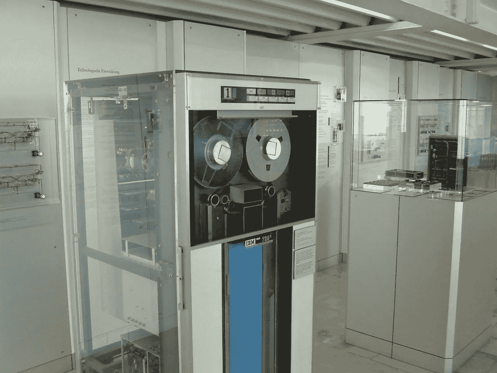

IBM 729V，CC BY-SA 2.5，[https://commons.wikimedia.org/w/index.php?curid=1717519](https://commons.wikimedia.org/w/index.php?curid=1717519)

磁带数据存储是一种使用数字记录在磁带上存储数字信息的系统。在早期的计算机中，磁带是主要数据存储的重要介质，通常使用大型开放卷轴的 9 磁道磁带。

磁带在现代数据中心仍然可行，因为:

1.它是存储大量数据的成本最低的介质

2.作为可移动介质，它允许创建一个空气间隙，可以防止数据被黑客攻击、加密或删除

3.它的寿命允许延长数据保留时间，这可能是监管机构所要求的。

# 结论:

人类的记忆系统和计算机的记忆系统有一些相似之处，就像现代计算机的记忆是由电信号创建、删除和维护的。有点像人类记忆系统的运作方式，通过使用神经元的信号。我们所有创造记忆的感觉都是从以感觉信号的形式发送一些输入开始的。

但是正如我在一开始所说的，人类的记忆系统比迄今为止人类创造的任何东西都要复杂和先进得多。排除暂时的相似性，让我们看看它们在现实生活中的效用有什么不同。

人类或计算机记忆的基本目的有两个——一个是记住事物，另一个是快速处理数据以实现机器的功能。

人类记忆的一个显著特点是它会“忘记”。这听起来像是一些缺陷，但实际上，这是一个很棒的特性。随着时间的推移，我们通常会完全忘记一些事情(也许毕竟不是那么重要的记忆)，但大多数情况下，我们会忘记“更好的细节”，并在更长的时间内记住事情的要点(例如，一张脸看起来很熟悉，但记不起名字)。这种“流线型”记忆不是缺陷或记忆能力限制的副作用，正如弗兰克兰和布莱克·理查兹在 2017 年关于神经元的论文中指出的那样。他们写道，这种简化“是适应性记忆的重要组成部分”，“存储我们经历的要点并避免复杂细节的简单记忆将更好地推广到未来事件。”因此，抓住要点，仅仅是要点，对于帮助做出明智的决定是有价值的。

然而，计算机内存不具备这一“功能”。它们以二进制工作。他们要么知道些什么，要么不知道。除非发生导致失败的灾难性事件，否则他们不会忘记。人类是不同的，因为我们可以“认识事物”，但仍然不能回忆起它们的名字(记忆的要点)。我们可以回忆起记忆并再次感受它(痛苦、焦虑、快乐或恐惧)，也可以创造记忆(想象、梦想和编故事)，这是计算机记忆系统所不能做到的。至少现在还不能。随着机器学习和人工智能的出现，谁知道计算机或机器存储器的未来会是什么样子。