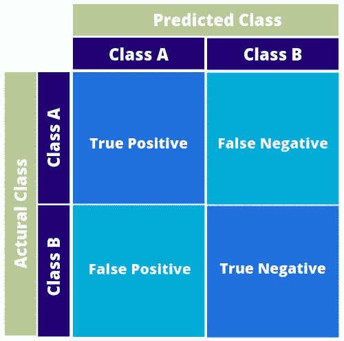
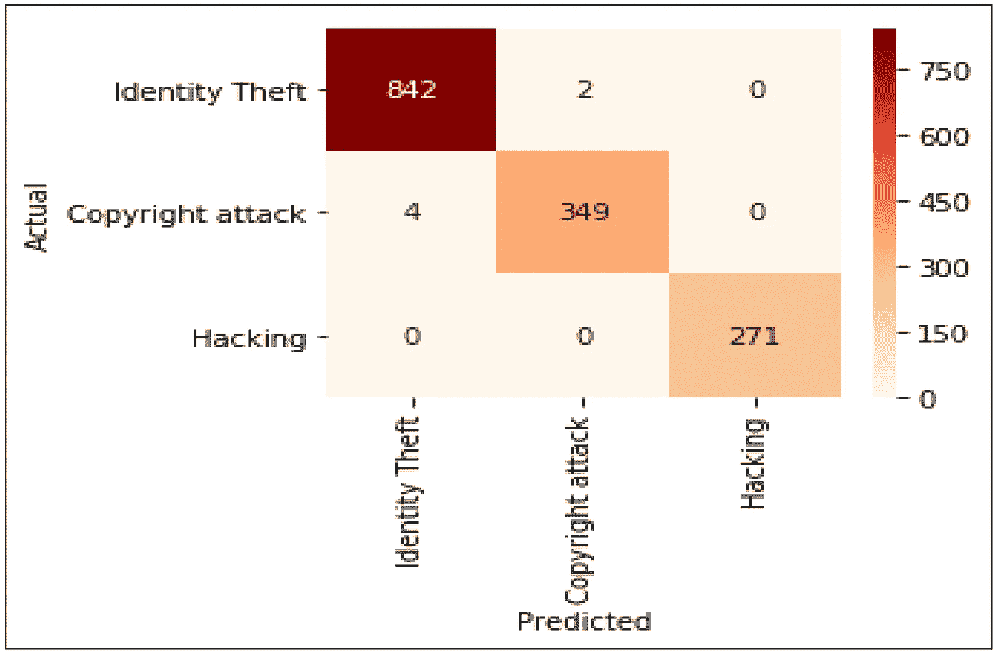

# 理解混淆矩阵和网络犯罪

> 原文：<https://medium.com/analytics-vidhya/understanding-confusion-matrix-and-cyber-crimes-2ab2c0f6ef32?source=collection_archive---------12----------------------->

卡斯帕·卡米尔·鲁宾在 [Unsplash](https://unsplash.com?utm_source=medium&utm_medium=referral) 上的照片

在这篇博客中，我们将了解混淆矩阵及其在网络犯罪分类中的应用。

> *在机器学习中，预测问题大致分为两类:数值预测即回归和分类预测即分类。*

混淆矩阵是在模型被训练之后用于检查分类器的工具。它是一个矩阵，X 轴*表示分类器结果的*，Y 轴*表示 ***实际类*** 。***

****

**上图描绘了具有两类的混淆矩阵，即***A 类*** 和***B 类*** 。**

*****真正:*** 真正包括正确预测的正类，即预测与其所属的类相同。**

*****真否定:*** 真否定包括正确预测的否定类，即预测与其所属的类相同。**

*****假阳性*** 和 ***假阴性*** 是分类器中的错误，意味着正类和负类分别被错误预测。**

**我们可以使用混淆矩阵和以下公式来计算精度:**

> **准确度= (TP + TN)/(TP + TN + FP +FN)**

## **使用网络犯罪分类理解混淆矩阵**

> **根据卡巴斯基的说法，网络犯罪是针对或使用计算机、计算机网络或联网设备的犯罪活动。**

**在本节中，我们将讨论使用混淆矩阵，以文章 [***计算系统使用机器学习***](https://www.mdpi.com/2071-1050/12/10/4087/htm) 对网络犯罪进行分类。**

**在上述文章中，作者使用机器学习对印度各邦的网络犯罪进行分类和聚类，准确率达到 99%，分为以下几类:**

*   **身份盗窃**
*   **版权攻击**
*   **砍**

**训练结束后，使用混淆矩阵来检查案例分类是否正确。**

****

**文章中的混淆矩阵**

**如混淆矩阵所示，842 个案例被正确分类为身份盗窃，349 个案例被正确分类为版权攻击，271 个案例被正确分类为黑客攻击。2 起身份盗窃案件被错误地归类为版权攻击，4 起版权攻击被错误地归类为身份盗窃。**

**感谢阅读。给一个👏，如果你觉得这个有意思。**