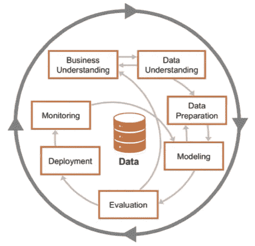

# 了解 CRISP-DM 及其在数据科学项目中的重要性

> 原文：<https://medium.com/analytics-vidhya/understanding-crisp-dm-and-its-importance-in-data-science-projects-91c8742c9f9b?source=collection_archive---------2----------------------->

[因扎塔拍摄的图像](https://www.inzata.com/data-science-vs-business-intelligence-whats-the-difference/)

*CRISP-DM 的快速概述。这是由*[*Stuart Clarke*](https://www.linkedin.com/in/stuartclarkeanalytics/?originalSubdomain=uk)*主讲的* [*openSAP 为期 6 周的数据科学入门(2021 版)*](https://open.sap.com/courses/ds3) *课程的第 1 部分。*

# 什么是 CRISP-DM？

***CRISP-DM*** 或***CR***OSS***I***industry***S***standard***P***process for***D***ATA***M***ining 是一个过程模型它就像一套护栏，帮助你计划、组织和实施你的数据科学(或机器学习)项目。

[马克·缪尔拍摄的图片](https://blogs.sap.com/2018/08/28/sap-machine-learning-approaching-your-project/)

# 为什么重要？

一个好的数据科学项目必须有一个可靠的、可重复的过程，让几乎没有数据科学背景的人能够容易地遵循和理解。这就是 CRISP-DM 的用武之地，因为您可以使用 CRISP-DM 方法作为模板，确保您已经考虑了项目的所有不同方面。

**CRISP-DM 有 6 个阶段**:

1.  [***业务理解***](https://zluna.medium.com/crisp-dm-phase-1-business-understanding-255b47adf90a)

*   确定业务目标
*   估计形势
*   确定数据科学目标
*   制定项目计划

2. [***数据理解***](/analytics-vidhya/crisp-dm-phase-2-data-understanding-b4d627ba6b45)

*   收集初始数据
*   描述数据
*   浏览数据
*   验证数据质量

3. [***数据准备***](https://zluna.medium.com/crisp-dm-phase-3-data-preparation-faf5ee8dc38e)

*   选择数据
*   干净的数据
*   构建数据
*   整合数据
*   格式化数据

4. [***造型***](/analytics-vidhya/crisp-dm-phase-4-modeling-phase-b81f2580ff3)

*   选择建模技术
*   生成测试设计
*   建立模型
*   评估模型

5. [***评价***](/analytics-vidhya/crisp-dm-phase-5-evaluation-phase-d7bb3c75220a)

*   评估结果
*   审查过程
*   确定后续步骤

6. ***部署***

*   计划部署
*   计划监控和维护
*   制作最终报告
*   审查项目

在接下来的几周内，我将提供每个阶段的简要说明。每个阶段都有自己的任务和自己的预计产出。我还将解释如何应用它，以便您能够理解在处理数据科学项目时遵循项目方法为何非常重要。

CRISP-DM 方法不需要一步一步地遵循，因为不同的数据科学项目会有不同的要求。您可以使用 CRISP-DM 方法作为模板，以确保您已经考虑了项目特定的所有不同方面。

要获得完整课程的详细说明，请在 https://open.sap.com/courses/ds3*报名参加为期 6 周的课程。*

****参考文献:****

* [## 数据科学入门(2021 版)

### 加入这个免费的在线课程，了解数据科学。本课程将向您介绍数据的基本原理…

open.sap.com](https://open.sap.com/courses/ds3)  [## CRISP-DM -数据科学过程联盟

### 数据挖掘的跨行业标准过程(CRISP-DM)是一个具有六个阶段的过程模型，它自然地…

www.datascience-pm.com](https://www.datascience-pm.com/crisp-dm-2/)*