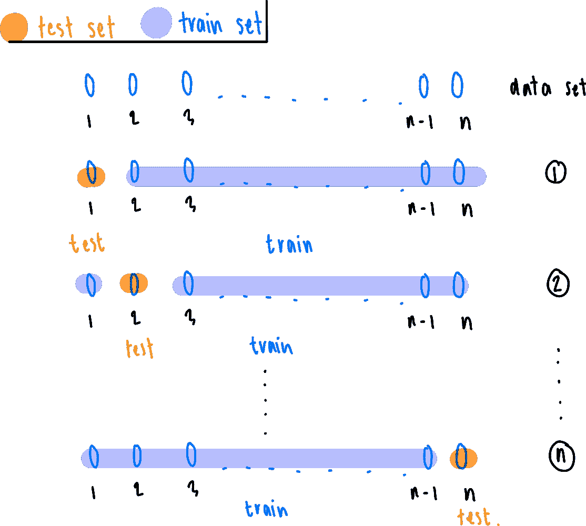
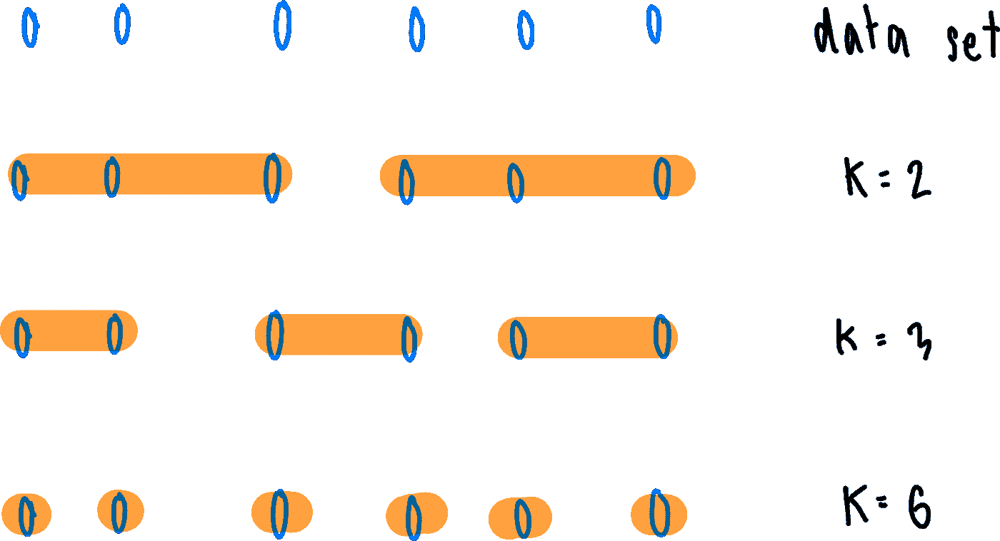
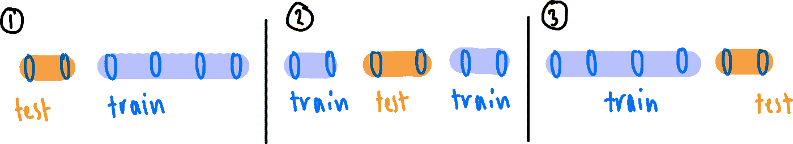

# 初学者了解交叉验证

> 原文：<https://medium.com/analytics-vidhya/understanding-cross-validation-for-beginners-31e0c606ebe0?source=collection_archive---------9----------------------->

无论您是在构建回归模型还是分类器，如果不进行测试，就很难知道您的模型做得有多好。我们希望模型的模式尽可能接近数据的真实关系，而不会受到太多噪音的影响。因此，测试我们的模型是重要的，因为它可能有助于揭示我们的模型的适当性。更不用说，*不*测试我们的模型也会导致过度拟合。过度拟合是一种错误，当模型非常擅长预测或建模数据集中特定区间的数据集，但对数据集外的值却很糟糕时，就会出现这种错误。

那么，我们如何帮助打击过度拟合？通过交叉验证！

# **什么是交叉验证？**

交叉验证(CV)是一种用于训练我们的模型的技术。在 CV 中，我们将把数据集一分为二:测试数据集和训练数据集。这个想法是，我们将使用训练集来训练我们的模型，然后在测试集上测试我们的模型，看看它做得有多好。“看看它做得有多好”可以通过许多方法来完成，但我在开始时使用的一种方法是比较均方差(MSE)值。因此，我们将有一个训练集 MSE 和一个测试集 MSE。通常，我们“更”关心测试集的 MSE，因为我们期望训练集的 MSE 相当低，因为模型是在那个特定集上训练的。请注意，与训练集 MSE 相比，非常高的测试集 MSE 可能表示过度拟合。

既然我们已经回答了为什么要分割数据集，现在的问题在于*如何*分割数据集。理想情况下，我们希望有一个好的分割，我们有足够的数据来尽可能好地训练我们的模型，也有足够的数据来正确地测试它。

# **五五开**

让我们假设将数据简单地分成 50-50 份，也就是说，50%的数据用于训练模型(训练数据集)，另外 50%的数据保留用于在训练后测试模型(测试数据集)。

虽然我们有 50%的时间来测试我们的模型，但 50%的时间仍然不足以帮助训练模型。测试的 50%部分可能包含有价值的信息，如果我们使用这种分割，我们的模型将会遗漏这些信息。这可能会导致我们的预测/估计与实际相差甚远时出现更大的偏差。

*有用文档*:[https://sci kit-learn . org/stable/modules/generated/sk learn . model _ selection . train _ test _ split . html](https://scikit-learn.org/stable/modules/generated/sklearn.model_selection.train_test_split.html)

# **留一法交叉验证(LOOCV)**

想象一下，我们只有很少的数据点，比如说 10 个。那么 50-50 分割甚至更不利，因为遗漏 50%是 5 个非常有影响的数据点。把 LOOCV 作为一个选择。

在 LOOCV，我们在整个数据集上训练模型，只排除一个数据点。我们将遍历整个数据集，这样每次我们都将从训练集中排除不同的数据点。因此，测试集将只包含在每次迭代中改变的唯一点。然后，我们将在训练集上拟合模型并重复。本质上，如果我们总共有 *n* 个数据点，模型将在每次迭代中在 *n-1* 个数据点上拟合。这将在下面进一步说明:

请注意，如果我们有一个非常大的数据集，LOOCV 是非常耗时的，因为我们正在经历 *n* 次迭代。

# k 倍交叉验证

LOOCV 是 K 重交叉验证的一个特例( *k=n，数据集的大小*)。在 K-fold 交叉验证中，我们将数据集分成 *k* 个 Fold(一个 Fold 可以被认为是一个组/子集，而 *k* 是一些组)。从 *k 个*褶中保留 1 个作为测试集，剩余的 *k -1 个*褶作为训练集。褶皱的分割如下图所示，k=2，k=3，k=6，数据集有 6 个数据点:

我们可以将 K-Fold 交叉验证的步骤分解为四个步骤:

1.  首先，我们将把数据分成 k 个 T21 折叠。
2.  然后，我们将保留**一个**折叠作为测试集。
3.  然后我们将在其他 ***k -1*** 褶皱上训练模型。
4.  重复，遍历所有的褶皱，直到所有的褶皱都被测试过(总共 *k* 次)。这在下面用 6 个点的相同数据集和 *k=3* 来描述

在执行 K-Fold 交叉验证之前，您应该混洗数据，以便每个折叠都代表数据集。注意 MSEs 是在 *k* 次迭代中平均的。

在实践中，我们通常使用 *k=5* 或 *k=10* ，但是您可以选择任何合适的 *k* 值。

此外，由于我们分成了 *k* 个折叠，通过使用 *k≠n* 并且不执行 LOOCV，K-Folds CV 在时间上并不昂贵。

*有用文档*:[https://sci kit-learn . org/stable/modules/generated/sk learn . model _ selection。KFold.html](https://scikit-learn.org/stable/modules/generated/sklearn.model_selection.KFold.html)

通过执行交叉验证，我们试图提高我们的模型的性能。以上方法可以通过自己写函数练习或者通过 Scikit-Learn (Python)轻松实现。在考虑用于特定数据集的正确模型时，我们很可能必须做出权衡，以获得最合适的模型。最终，交叉验证是一个很好的工具，可以用来实现我们选择最合适模型的目标。