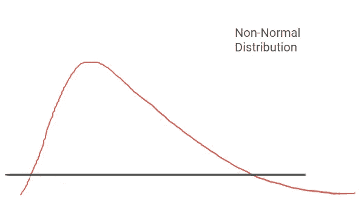

# 以更简单的方式理解数据科学

> 原文：<https://medium.com/analytics-vidhya/understanding-data-science-in-a-simpler-way-ca6a7a0b1750?source=collection_archive---------15----------------------->

在我们上学的时候，我们常常学习历史，因为历史教会我们进化的起源、古代文明、农业、城市化等等。数据就像人类的行为，我们相互学习，并以某种方式表现，这有助于形成模式、假设和预测结果。

我和一群靠训练运动员谋生的人讨论数据科学；房间里的情况是，由于太多的技术术语，他们无法理解这些主题。那么如何用一种能让人理解的方式来解释它们呢？

我将在下面的标题中讨论同样的问题:

*   数据
*   探索性数据分析
*   群体分析
*   使聚集
*   回归或分类

**数据**

我简单地从问你数据是什么意思开始。要了解受众，你必须从查询开始，大多数答案都倾向于数据的数字形式。

照片由[丽莎·里萨格](https://unsplash.com/@risager?utm_source=medium&utm_medium=referral)在 [Unsplash](https://unsplash.com?utm_source=medium&utm_medium=referral) 拍摄

首先，我让他们知道数据无处不在，同时，无论我说什么，都是数据的一种形式。此外，我对他们说，在这个房间里，如果我们计算有多少人在场，这是一种定量数据，如果我们把自己归为田径、足球、篮球、羽毛球等类别，这些类别将被称为定性数据。

用与听众生活或工作相关的例子向他们解释是非常重要的。

**探索性数据分析:**

现在我们知道什么是数据，所以在这一部分，我们必须挖掘更多关于数据的信息，以获得更深入的见解，如行为、模式、关系、关联。所以，我从我们自己的一个例子开始，在一个房间里有多少成员，每个类别有多少，房间里成员的平均年龄，获得的最高资格，等等。因此，在一个小组中，如果我们发现有人不符合我们的模式或部分或行为，那么这将与一个离群值有关，简单地说，在我们的房间中，如果一个人来自化学背景，他将是一个离群值。

如果我们想要在两个数据点之间建立任何关系或关联，我们不能简单地说它们有，伙计们，我们需要在建立相同关系的背后有某种证据，从数据科学的角度来看，我们必须用统计公式和假设公式来做这件事。

**分组分析**

我向观众解释说，假设你是一名活动经理，你必须选择哪个地方更适合举办活动。你做了调查，得出了名为 A、B 和 c 的三家餐厅的结论性列表。现在你担心从三家餐厅中选择一家，你将如何选择，因为管理员会询问有关你为什么选择这家餐厅的相关问题。 要做到这一点，您必须制定一个假设，并进行统计测试，如学生 T-检验(针对两组)或方差分析(如果两组以上),如果是参数数据(遵循正态分布的数据),如果数据是非参数数据，那么我们必须进行 Mann Whitney U 检验或 Wilcoxon 符号秩检验或 Kruskal Wallis 检验。 我给这个测试命名是为了给大家一个基本的概念，但是问题来了，你说的参数数据是什么意思？

**作者图片**

**作者图片**

上面的两个图表有助于理解数据的分布。如果一个属性是正态分布的，那么它将遵循图 1，可以被描述为参数数据，否则图 2，可以被描述为非参数数据。

**聚类**

接下来的话题聚类来了，聚类用简单的话来说就是分组。所以你们都想知道为什么我们要在这里讨论，我们该怎么做？我们讨论这一点是因为聚类有助于更好地理解行为或模式，从而有助于细分的形成。

照片由 [Unsplash](https://unsplash.com?utm_source=medium&utm_medium=referral) 上的 [Adnanta Raharja](https://unsplash.com/@adnantaputra?utm_source=medium&utm_medium=referral) 拍摄

一个常见的例子，在我们的童年时代，我们经常看到星星并形成各种形状，不是吗？让我们来讨论一下我们过去是如何确定形状的，我们过去是通过观察附近的恒星来形成图像的，因为这很有意义。因此，在数据科学中，只需将数据点想象成星星，我们通过计算欧几里德距离、曼哈顿距离、闵可夫斯基距离等数学公式来形成聚类。此外，这里还有一个问题，你将形成多少个集群？它可以通过视觉上的肘部曲线或轮廓系数或轮廓评分或 wss 评分来验证。

**回归或分类**

为了向你们解释回归，有一个小男孩饿了，去找他妈妈要食物，这个男孩是出了名的，只喜欢好吃的食物。所以妈妈去厨房开始为他准备美味的食物，她知道如果食物中有 x1，x2，x3，x4 和 x5 的成分，那么她的儿子会喜欢这个食物并会吃。于是，她开始用上面提到的食材准备食物，来做这道菜 Y，所以，在这个例子中 x1，x2，x3，x4，x5 是自变量，Y 依赖于它们。因此，在未来，我们可以用这些独立变量来预测食物的味道，也可以预测哪些成分是最重要的。在本例中，我们预测男孩是否会喜欢食物的两个等级，这是一个分类算法的例子，如逻辑回归、决策树、随机森林、LDA 等，并通过分类报告、AUC 和 ROC 来衡量算法的准确性。

**作者图片**

线性回归是预测连续变量的一种形式的算法，所以你还记得那个臭名昭著的男孩，你知道他上学时经常做什么吗他每天去购物买大量的糖果，比如一天 100 个，另一天 66 个，71 个，78 个，86 个，99 个，45 个等等，都是同一品牌的糖果。为了预测他第二天将购买多少糖果，我们可以执行线性回归，其中 Y_how_many 将是依赖于过去购买的因变量(自变量)，并且用于测量模型准确性的度量是 RMSE(均方根误差)、R 平方值或 R 调整平方值。

尾注

写这篇文章的目的是用一种简单的方式来解释数据科学，因为我们总是更喜欢简单，这是通过**奥卡姆剃刀**说得很好的，它说

*“简单优先的原则:在两种对立的理论中，对一个实体更简单的解释更受青睐。该原则还被表述为“实体的繁殖不应超出必要的范围。”*