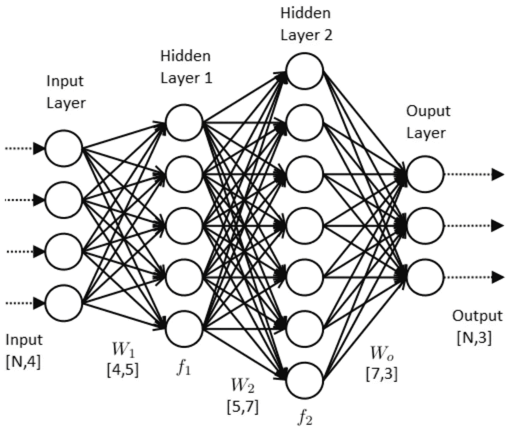
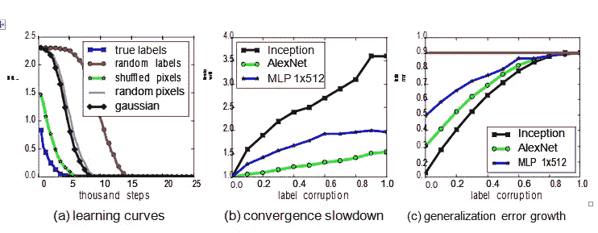

# “理解深度学习需要重新思考一般化”

> 原文：<https://medium.com/analytics-vidhya/understanding-deep-learning-required-rethinking-generalization-6369ade81e83?source=collection_archive---------33----------------------->

本文是为谷歌人工智能暑期学校 2020 撰写的研究论文综述。这项活动的主要任务是寻找申请这项活动的候选人的分析能力。这篇论文在深度学习实践者中非常有名，并提供了一些关于神经网络基本属性的突破性结果。

> 事实:截至 2021 年 1 月，这篇研究论文被引用 2430 次。(谷歌学术)

[**研究论文的链接。**](https://arxiv.org/abs/1611.03530)

题为“理解深度学习需要重新思考泛化”的论文回收了传统深度学习(或神经网络)的概念。这篇文章关注于模型的一般化是通过正则化或者模型特有的属性给出的。引言第一段*(张等，2017)* 提出了神经网络泛化能力优于其他网络的原因问题。换句话说，它解释了神经网络在训练数据上表现良好，在测试数据上也取得了很好的结果。在本文中，完整的方法学基于实验结果与长期建立的模型进行比较。从表 1 中可以看出，具有 1，649，402 个参数的初始模型包含 100%的训练精度和 85–90%范围内的测试精度。

**神经网络的结构图。**

著名的基于图像的数据集****和 [CIFAR10](https://www.cs.toronto.edu/~kriz/cifar.html) 用于进行实验。在相关工作中，*(张等，2017)* 展示了随机化检验、显式正则化、隐式正则化和有限样本表达能力的工作。随机化测试的结果证实了神经网络容易拟合随机标签，并且当在 ImageNet 数据集上测试时观察到它，并且它达到了最高的 95.20%的准确度，考虑到来自 1000 个类别的大量标签，这是非常令人印象深刻的。类似地，在外部正则化和隐式正则化的情况下提高了泛化性能，但这在神经网络中不是必需的。然而，隐式正则化的作用表明，不容易理解神经网络以及线性模型的泛化来源。论文中提到，正则化子(显式或隐式)在适当调整时“可能”有助于提高泛化性能，尽管神经网络在移除所有正则化子后表现良好。****

****在我看来，有许多讨论点需要解决。首先，本文没有提到训练数据集和测试数据集在类型上的区别，这种区别很难达到泛化。讨论的另一点是，本文表明神经网络使用从随机数据集记忆来学习。在这一点上已经提出了一个单独的概念，因为它与典型的基于序列的神经网络体系结构完全相反。*(张等，2017)* 实验工作提供了重新思考泛化固定参数的目的。最后，多标准体系结构的训练过程的几个属性大部分不受标签转换的影响。因此，它提出了一个问题，即当神经网络未被推广时，为什么推广不会影响神经网络的性能。****

****它总结了两个关键的见解，其中一个简单的实验设置考虑更好地理解机器学习模型的学习能力的概念。这些模型肯定地表明，各种神经网络结构能够记忆完整的训练数据。其次，提到了神经网络，不管是广义的还是非广义的，优化是自然的；这也提供了证据，证明优化必须不同于仍然未知的一般化的确切原因。****

********

******不同深度学习参数的结果对比。******

******参考文献******

****[1].张，c .，本吉奥，s .，哈特，m .，雷希特，b .，&维尼亚尔斯，O. (2016)。理解深度学习需要重新思考泛化。 *arXiv 预印本 arXiv:1611.03530* 。****

****[2].伊恩·古德菲勒、约舒阿·本吉奥和亚伦·库维尔的《深度学习》一书。****