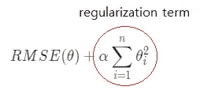
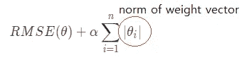
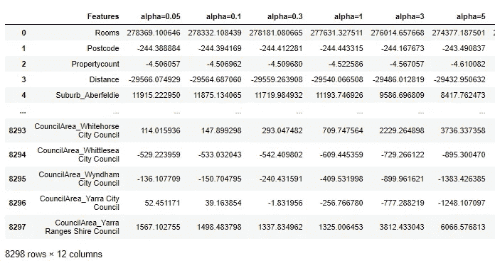
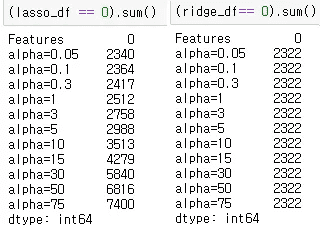
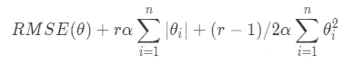

# 理解 Python 中正则化方法 Ridge、Lasso 和 ElasticNet 之间的差异

> 原文：<https://medium.com/analytics-vidhya/understanding-difference-between-regularization-methods-ridge-lasso-and-elasticnet-in-python-996185296ed2?source=collection_archive---------4----------------------->

Haneul Kim 摄

今天，我们将讨论如何正则化线性回归，即在训练时使我们的模型更普遍地适应过度拟合。

线性回归是一种简单而强大的方法，因为它在训练后为我们提供了快速的预测时间，这是开发机器学习模型时要考虑的最重要的特征之一，因为在现实世界中，有客户在等待预测，他们等待的时间越长，客户体验就会下降。

当线性回归不适合时，除了增加模型的复杂性(假设您无法添加更多数据)之外，没有其他方法可以采用多项式回归(三次、二次等)或使用其他复杂模型来获取线性回归因其简单性而无法获取的数据。

当线性回归过度拟合，列数(独立变量)接近观察数时，有两种方法可以减轻

1.  添加更多观察
2.  正规化

> U 与多项式回归等已经很复杂的模型不同，我们可以通过降低模型复杂性(降低多项式的次数)来避免过度拟合，线性模型没有更简单的方法，因此它需要正则化。

由于添加更多的观察值是耗时的，并且经常不被提供，我们将使用正则化技术来减轻过拟合。有多种正则化技术，它们都有相同的概念，即**在独立变量(除了θ_ 0)的权重**上添加约束，但是它们在约束方式上有所不同。我们将介绍三种最流行的正则化技术:

*   岭回归(L2)
*   拉索回归(L1)
*   弹性网回归(L1 和 L2 的混合)

我们使用来自 Kaggle 的[墨尔本房屋数据集尝试不同的正则化。](https://www.kaggle.com/anthonypino/melbourne-housing-market)

下载数据集后，让我们导入数据、依赖项并做一点清理。

现在让我们使用线性回归作为我们的基础模型，注意我们的 X 变量包含的列比观察值多。

正如我们所料，训练集的性能很高，但测试集的性能很差，这表明过度拟合。

我们将看到正则化技术如何解决这个问题→缩小两者之间的差距并降低两者的性能分数。

首先，让我们看看**岭回归**也称为**吉洪诺夫正则化**。它所做的只是简单地将正则化项添加到成本函数中，使模型权重尽可能小，您希望保持多小的权重取决于超参数`**α**` (alpha)

*   `**α**` = 0，对权重没有限制这只是线性回归
*   `**α**` > 0，权重变得接近于零。

请注意，过高的`**α**`可能会导致拟合不足，因此您需要始终牢记“偏差和方差权衡”的概念。

下面是使用岭回归的代码。

在尝试不同的`**α**`值后，我们使用产生最佳性能的`**α**`值来训练岭回归。 [pd。Series.idxmin()](https://pandas.pydata.org/pandas-docs/stable/reference/api/pandas.Series.idxmin.html) 输出序列中最小值的指数，即具有最小 RMSE(我们使用的成本函数，成本函数可以是 MSE 或任何其他)得分的指数。

我们可以看到测试性能下降，即使 RMSE 很高，训练和测试之间的差距也减小了。我们可以说，岭回归能够比以前的线性模型更好地概括，但是我们的模型仍然在预测方面做得很差，因此我们可以考虑使用不同的模型或进行更多的特征清洗和工程设计。

**L** 东**A**b**S**h**S**选举 **O** 操作员(**套索** ) **回归**，又称“L1”正规化。岭和套索正则化项之间的唯一区别在于，在套索回归中，它将权重向量的 L1 范数添加到成本函数中，从而允许套索回归消除最不重要的特征，即，它执行自动特征选择。超参数`**α**`的行为方式相同，因此`**α**` =0 是线性回归。

Lasso 也在 sklearn 中作为 Lasso 提供，只需将前面代码块中的 Ridge()替换为 Lasso()(没有解算器参数)，我们将设置为使用 Lasso 回归。

我们不像上面那样将 Ridge 改为 Lasso，而是运行完全相同的代码，我们将看看在 Ridge 和 Lasso 回归中，独立变量的权重如何随着`**α**`的增加而变化，以了解它们的差异。

我们将使用多个`**α**`值运行 Lasso 和 Ridge，看看随着`**α**`的增加，特征的权重会发生什么变化。

上面的代码创建了两个数据帧:

对于每个`**α**`列，其行表示每个特征的权重，例如第一行表示在`**α**` =0.05 时，房间特征的权重是 278369，表示它是一个信息特征，因为它相对于其他特征较高。

为了看出套索和山脊之间的区别，让我们随着`**α**`的增加来数一下**零重量**的数量。概述:套索减少了不重要的功能，使其权重为 0，而山脊减少了权重，但从未达到 0。

事实上，随着`**α**`的增加，Lasso 将越来越多的特征权重减少到零，然而对于山脊，即使有很高的`**α**`，零的数量保持不变(权重将减少，但从未达到零)。

因此，山脊是一个很好的默认，如果你已经从 EDA 中知道大多数功能是不重要的，那么套索应该是首选，因为它会自动摆脱无用的功能。

最后**弹性网**具有正则项，该正则项是脊和套索正则项的简单混合，并且它们的比例由混合比例`r`控制。添加到成本函数的弹性网络正则化项如下所示。

你可以看到什么时候

*   r = 0，则套索正则项变为 0。弹性网=脊
*   r =1，岭正则项= 0。弹性网=套索

由 Sklearn 作为 ElasticNet()提供，它包含参数`l1_ratio`，即混合比例`r`。只需用多了一个参数`l1_ratio`的 ElasticNet()替换 Ridge()即可使用。

总之，我们已经介绍了不同类型的正则化技术来减少过度拟合。像这样对基础有坚实的掌握是非常重要的，因为这将是深度学习的基础，对这些基础有清晰的理解将在学习更复杂的主题时节省你很多时间。请注意，这些不是唯一的正则化技术，其他一些常见的技术包括早期停止(当验证误差达到最小值时停止训练)和退出(在深度学习中)。

希望你喜欢我的博客，如果有任何错误信息，请纠正我，谢谢！:)

参考资料:

*   [使用 Scikit-Learn 进行机器实践学习& Tensorflow Ch.4](https://www.amazon.com/Hands-Machine-Learning-Scikit-Learn-TensorFlow/dp/1492032646)
*   [墨尔本住房数据集](https://www.kaggle.com/anthonypino/melbourne-housing-market)
*   [线性回归如何过拟合？](https://datascience.stackexchange.com/questions/80868/overfitting-in-linear-regression)
*   [L1，L2 python 教程视频](https://www.youtube.com/watch?v=VqKq78PVO9g&ab_channel=codebasics)
*   [正则化线性模型——ka ggle 笔记本](https://www.kaggle.com/apapiu/regularized-linear-models)
*   [岭回归为什么叫“岭”？](https://stats.stackexchange.com/questions/151304/why-is-ridge-regression-called-ridge-why-is-it-needed-and-what-happens-when)
*   [Lasso 回归 StatsQuest youtube 视频](https://www.youtube.com/watch?v=NGf0voTMlcs&ab_channel=StatQuestwithJoshStarmer)
*   [克里斯·纳伊克的《套索与山脊》youtube 深度视频](https://www.youtube.com/watch?v=9lRv01HDU0s)