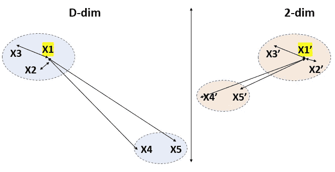
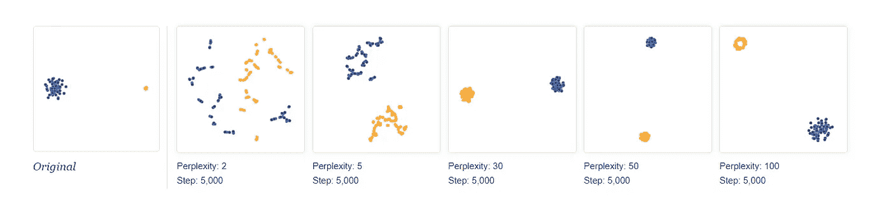

# 理解维度缩减

> 原文：<https://medium.com/analytics-vidhya/understanding-dimensional-reduction-321d4f1f770d?source=collection_archive---------2----------------------->

# **什么是降维？**

1.  降维指的是减少数据集中输入变量/特征数量的技术。
2.  将数据集的要素数量从 D 更改为 D '，使得 D >= D '

# **我们为什么需要降维？**

1.  **维度的诅咒**

*   将表示 N 维特征空间上的维度的数据列和数据行视为该空间中的点。在特征空间中具有多个维度会导致空间的体积异常大，反过来，我们在该空间中的点(数据行)代表一个小的且不具有代表性的样本。这可能会影响机器学习算法的性能&被称为“维数灾难”。
*   具有太多自由度/特征/变量的模型可能会过度拟合训练数据集，因此可能无法很好地处理新数据。
*   它指的是处理高维数据时出现的所有问题，这些问题在低维中并不存在。


图 1:在一个临界点之后，随着特征数量的增加，模型的性能下降(图片由作者提供)

**2。数据可视化**

*   降维技术通常用于数据可视化
*   例如，在 MNIST 数据集中，我们总共有 784 列，但是通过 dim reduction，它减少到只有 2 列，这有助于可视化数据集。

# **尺寸缩减的类型**

## **特征选择方法:**

*   使用评分或统计方法来选择要保留的特征和要删除的特征，例如:
*   **包装器方法**:它采用输入特征的不同子集，并选择产生最佳模型性能的子集。RFE 是包装特征选择方法的一个例子。
*   **过滤方法**:使用评分方法，如特征和目标变量之间的相关性，选择最具预测性的输入特征子集。例子包括皮尔逊相关和卡方检验。

## **矩阵分解**

*   线性代数的技术可以用于降维。
*   最常见的成分排序方法是**主成分分析或简称 PCA** 。


(图片来自谷歌)

## **流形学习:**

*   这些技术用于创建高维数据的低维投影，通常用于数据可视化的目的。
*   例如，**t-分布式随机邻居嵌入(t-SNE)。**

## **其他方法:**

*   删除缺失值高或方差低的列
*   删除相互之间高度相关的列。
*   决策树和随机森林的使用
*   反向特征消除和正向特征构造

# **什么是主成分分析(PCA)？**

PCA 通常用于连续数据的降维，它沿着方差增加的方向旋转和投影数据。方差最大的特征是主成分。

**PCA 背后的几何直觉**

**例 1**


图 2:(作者图片)

在数据集中，我们有两个特征，比如 F1(代表头发的长度)和 F2(代表头发的黑度)，现在我们被迫只有一个特征(即降维)。现在有一个问题，我们应该选择哪些特性&为什么？

与 F2 相比，F1 具有较大的分布或方差，或者与 F2 相比，F1 具有更多关于数据集的信息

因此，我们可以删除 F2，现在我们的数据集只包含一个特征，即 F1。


图 3:(作者图片)

**例 2**

*   我们有另一个两列的数据集，比如 F1，F2 &它们的分布在 pic/graph 中给出。


图 4:作者图片

*   同样，我们希望 dim 减少，即将 2 维减少到 1 维，但这里两个特征的分布很重要，我们不能忽略任何一个特征。因此，在这种情况下，我们将通过旋转轴创建我们自己的新特征(轴)


图 5:橙色的轴是数据集的新轴(图片由作者提供)

*   现在我们有了新的特征，F1' & F2' ( F1' & F2 '，应该是相互垂直的，加上一个特征的展开应该是>>然后是另一个)，就像前面的例子。


图 6:作者图片

但是下一个问题来了，如何选择新特性(F1' & F2 ')？

# **PCA 背后的数学**

*   对于具有最大分布/方差的新特性，我们需要理解它们背后的数学原理。
*   对于给定的数据集 **D** (n*d)(具有 n 行和 D 列)
*   对数据集 **D** 执行列规范化或标准化
*   找到数据集 D 的协方差矩阵 **S** (d*d ),即

**S = D . T * D**(D . T = D 转置)

*   找出 **S** (d*d)的特征值和相应的特征向量

λ1 > λ2 > λ3 …….λd(特征值)

F1 '，F2 '，F3' …。特征向量

*   特征向量(F1' F2' …)。)是我们的新功能或者轴。

# **常设仲裁法院的限制**

*   在某些情况下，PCA 无法捕捉最大方差，导致大量信息丢失，例如:


T-sne 失败的情况(图片由作者提供)

# **什么是 T-sne？**

*   它发音为 tesnee，代表 t 分布随机邻域嵌入。
*   可视化的最佳降维技术
*   PCA 是一种古老而基本的技术，它保持全局结构(只是试图最大化方差，它看不到簇内距离)，而 t-sne 是一种新的先进的数学技术，它保持局部结构。

**t、s、n 的含义& e**

*   N: N 代表邻居


对于橙色的十字，圆内的所有点都在邻域内

*   **E:** E 代表嵌入，对于高维空间中的每一个点，如果我们在低维空间中找到这个点，这叫做嵌入。


*   **随机:**表示随机概率分布或模式，即 tsne 是一种概率算法
*   T 代表学生 t 分布，这有助于克服拥挤问题。

**T-SNE 的几何直觉**

T-sne 在邻域中保持距离在示例中，对于 x1，点 x2 和 x3 在邻域中，但是它不保持其他点(x1 相对于 x4，x5)的距离，因为 x4，x5 不属于邻域 N(x1)。



左边的点是二维的，右边的点是二维的

**t-SNE 的重要参数**

*   **步骤:**迭代次数
*   **困惑:**我们想要保留其距离的邻域中的点数。
*   **Epsilon:** 优化的速度有多快。

**T-SNE 的不同情况**

通常，T-sne 用于可视化，即将“D”维数据集可视化为 2dim，但这里我们采用各种 2d 数据集，并对其应用 T-sne，以了解我们是否获得原始 2d 数据集。

*   **超参数真的很重要**

让我们从 SNE 霸王龙的“hello world”开始:一个由两个相距甚远的集群组成的数据集。为了使事情尽可能简单，我们将考虑 2D 平面中的星团，如左图所示。(为了清楚起见，这两个集群是用颜色编码的。)右图显示了五种不同困惑值的 t-SNE 图。


步骤不变，困惑在变


脚步在变，困惑不变

*   **t-SNE 图中的簇大小没有任何意义**

在下面的图片中，在最左边，我们有两个不同密度的集群。让我们看看如果我们对它应用 T-sne 会发生什么。



在 t-SNE 图中，对于更高的困惑值，这两个集群看起来大小相同。t-SNE 算法使其“距离”概念适应数据集中的区域密度变化。因此，它会自然地扩大密集的星系团，收缩稀疏的星系团，使星系团大小均匀。

*   **星团之间的距离可能没有任何意义**

在最左边，我们有三个集群，每个集群都有 50 个点，但是绿色集群离其他两个集群很远，让我们看看 T-sne 能否记住这些集群之间的距离


从上面的图像看起来，对于更高的困惑，tsne 可以记住距离，让我们检查更多的点。


遗憾的是，没有。如果我们给每一个聚类增加更多的点，困惑度必须增加来补偿。这是三个高斯集群的 t-SNE 图，每个集群有 200 个点，而不是 50 个。现在，没有一个试验困惑值给出好的结果。基本信息是，在 t-SNE 图上，分离良好的星团之间的距离可能没有任何意义。

*   **对于拓扑，你可能需要不止一个图**

有时你可以从 t-sne 图上读出拓扑信息，但永远不要只为一个困惑和一步运行 t-SNE。考虑在三维空间中追踪一个链环或一个结/trie-knot 的一组点。


再一次，查看多个困惑值给出了最完整的图片。低困惑值给出两个独立的循环；高的显示全球连通性。

**MNIST 数据集上的 T-SNE&PCA**

MNIST 是 60，000 个 28×28 像素的小正方形灰度图像的数据集，这些图像是手写的 0 到 9 之间的单个数字。如果我们将 28×28 像素转换成大小为 784 的数组，那么我们的数据集被转换成 60000×784，即 60000 个图像，每个图像具有 784 个值或特征或列。

之后，我们将对 MNIST 数据集(60，000 x 784 到 60，000 x 2)应用降维，首先应用 PCA，然后应用 T-sne。

我的 [GitHub 档案中的实际代码。](https://github.com/harshyadav1508/medium_article_code/blob/main/PCA_Tsne.ipynb)

*   **MNIST 数据集上的主成分分析**


(图片由作者提供)

*   **MNIST 数据集上的 T-SNE**


(图片由作者提供)


图片来自发表的论文

**不同 btw T-sne 和 PCA**

```
+---------------------------+---------------------------+
|   PCA                     |      T-sne                |   
+---------------------------+---------------------------+
| Linear method             | Non-Linear method         |
| Deterministic             | Stochasticity             | 
|Preserve global proportion | Preserve local proportion | 
+-------------------------------------------------------+
```

**降维的优势**

*   降维有助于数据压缩，从而减少存储空间和计算时间。
*   移除多余的特征(如果有的话)。
*   有助于数据可视化
*   治愈维数灾难

**降维的缺点**

*   这可能会导致一些数据丢失。
*   有损压缩

**提示**

*   如果输入变量具有不同的比例或单位，那么在使用这些方法之前对数据进行归一化或标准化是一种很好的做法。

# 参考资料:

[](https://distill.pub/2016/misread-tsne/) [## 如何有效地使用 t-SNE

### 一种流行的探索高维数据的方法叫做 t-SNE，是由范德马滕和辛顿提出的…

蒸馏. pub](https://distill.pub/2016/misread-tsne/) [](https://colah.github.io/posts/2014-10-Visualizing-MNIST/) [## 可视化 MNIST:降维探索

### 在一些基本层面上，没有人理解机器学习。这不是事情太复杂的问题…

colah.github.io](https://colah.github.io/posts/2014-10-Visualizing-MNIST/) 

[https://github.com/harshyadav1508/medium_article_code](https://github.com/harshyadav1508/medium_article_code)