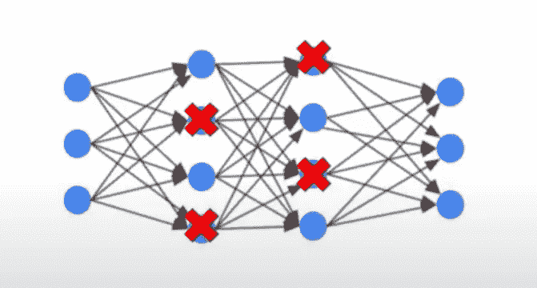
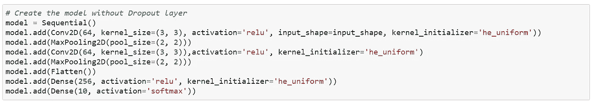
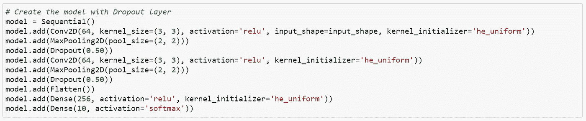

# 理解辍学！

> 原文：<https://medium.com/analytics-vidhya/understanding-dropout-abe00504be82?source=collection_archive---------0----------------------->

辍学者在培训中的重要性

这篇博客文章也是机器学习系列文章的一部分。我之前写过关于 [**正规化**](https://ajinkya29.medium.com/regularization-understanding-fb8cd7b7c0e2) 的博文。所以你可以继续读这本书，如果你愿意，也可以看看其他的。



读者你好，

所以，让我们用简单的方式来理解辍学以及它解决了什么问题。所以让我们开始吧！

我们必须记住的一点是，每当有深度神经网络时，就会有许多**权重和偏差参数**。因此，这可能会导致模型过度适应特定的用例。因此，我们必须找到避免过度拟合的方法。

解决过拟合问题有两种方法:

1.  正规化
2.  拒绝传统社会的人

在这篇博客中，我们主要关注辍学及其概念理解。

那么，**最基本的术语**什么是辍学？
→简单来说，在 dropout 中我们随机忽略或“*dropped”*一些层输出称为节点。因此这些被忽略的节点不参与训练模型。

因为我们已经了解了一些关于辍学的知识，现在让我们进入细节。

**训练**
因此，为了实现一个漏失层，我们必须决定一个漏失率( **p** )，该漏失率在 0 和 1 的范围内，其中 1 表示没有漏失，0 表示该层没有输出。良好的丢失率值介于 0.5 和 0.6 之间

**Dropout 是神经网络中正则化的一种方式。**

**测试**
在测试模型时，我们必须使用所有的节点，并用我们决定的 **p** 值( **w x p** )乘以权重。

## Keras API 辍学

在 Keras 中，辍学被表示为*核心层* (Keras，未注明日期)之一:

```
keras.layers.Dropout(rate, noise_shape=None, seed=None)
```

它可以通过`model.add`添加到 Keras 深度学习模型中，并包含以下属性:

*   **Rate** :决定神经元脱落几率的参数 p。
*   **噪声形状:**如果您希望在(批处理、时间步长、特征)中共享噪声，您可以为此目的设置噪声形状。
*   **种子**:如果您希望固定决定伯努利变量是 1 还是 0 的伪随机生成器(例如，排除数字生成器的问题)，那么您可以通过在此指定一个整数值来设置一些种子。

## **如何使用 Dropout**

没有退出的 CNN 可以用如下代码表示:



因此，要添加一个 dropout 层，我们可以添加这样一行:



在这里，我们可以看到 dropout 参数为 0.5，这意味着一半的给定单元将会退出。您可以更改辍学率值来检查其执行情况。

# 终于！

*感谢阅读！*

如果你喜欢这个，请投我一票，也建议一些更多的主题。

请随时在 [**LinkedIn**](https://www.linkedin.com/in/ajinkya-mishrikotkar-a6594a144/) 上联系我

欢迎在下面发表评论，并提出你认为我遗漏了什么。谢谢！