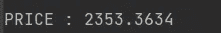

# 使用基本统计数据了解动态定价

> 原文：<https://medium.com/analytics-vidhya/understanding-dynamic-pricing-using-basic-statistics-2aaac323c688?source=collection_archive---------6----------------------->


马库斯·温克勒在 [Unsplash](https://unsplash.com?utm_source=medium&utm_medium=referral) 上的照片

# 别跟我解释，出示代码

你可以在这里访问 [GitHub](https://github.com/ogulcanertunc/Data-Science-Projects/tree/main/Python/Dynamic%20Pricing) 回购。

## 首先，什么是动态定价？

根据定义，动态定价是一种定价策略，其中价格根据实时供求关系而变化。然而，当我们更深入地思考它时，它是考虑到市场中不同参数而做出的产品或服务的定价形式。给这个定价方法一个参数，我们可以在日常生活中的机票价格中非常清楚地看到，飞机的季节性和起飞时间，导致入住的预订百分比，以及飞机上剩余的座位数量都在这些参数之内。

所以我们看条件决定价格。在高峰时期，你希望保持高价格以赚取更多的钱，因为人们会想购买该产品/服务，而不管他们在哪个地区。在非高峰时期，你想降低价格来刺激需求。这不是一个困难的概念。挑战在于，在你看到收益递减之前，要知道价格变化的幅度。

如果我们将动态定价视为一个系统，那么最好是找到可以增加利润回报、实现收入最大化的理想价格，并使用难以预测所有这些定价的算法。

## 传统定价

*除了动态定价，现在使用的传统定价是怎么做的？*

定价通常使用在一段时间内(如 3-6 个月)从评审中收集的过去绩效。这是一个非快速的过程，严重依赖于未来可能准确也可能不准确的指标。如果市场条件导致定价错误，你很可能会损失收入，并且无法迅速扭转局面。

当你需要做出改变时，许多企业依靠直觉或其他情绪反应来应对变化。虽然这可能对那些在该行业有丰富经验的人有用，但总的来说，这并不能提供一个长期有效的策略。

## 那么我们如何用一些统计学知识来处理置信区间呢？

在动态定价中，我们可以将置信区间看作是两个数字的范围，其中可以包括总体参数的估计值。

计算置信区间时，我们应该遵循几个简单的步骤:

1.  求 n、平均值和标准偏差
2.  决定置信区间(如 95%，99%)
3.  计算 Z 表中的值
4.  使用前面的步骤计算置信区间


现在让我们用这些知识来考虑一个简单的业务问题:

**我们的业务问题:**


[KOBU 社](https://unsplash.com/@kobuagency?utm_source=medium&utm_medium=referral)在 [Unsplash](https://unsplash.com?utm_source=medium&utm_medium=referral) 上拍摄的照片

*   一家游戏公司向购买游戏中物品的用户赠送礼品币。
*   使用这些虚拟硬币，用户可以为他们的角色购买各种交通工具。
*   游戏公司没有为一个项目指定价格，并提供用户以他们想要的价格购买这个项目。
*   例如，对于名为盾牌的项目，用户将通过支付他们认为合适的金额来购买该盾牌。
*   换句话说，一个用户可以用给他的 30 个单位的虚拟货币支付，另一个用户可以用 45 个单位支付。
*   因此，用户可以用他们能够支付的金额购买该商品。

**需要解决什么:**

1.  商品的价格因类别而异吗？用统计的方式表达。
2.  根据第一个问题，物品的价格应该是多少？解释一下为什么？
3.  就价格而言，最好是“可移动的”。定价策略的决策支持。
4.  针对可能的价格变化模拟项目采购和收入。

## 1.导入所需的库、函数和准备数据

```
import pandas as pd
import itertools
import statsmodels.stats.api as sms
from scipy.stats import shapiro
import scipy.stats as stats
pd.set_option('display.max_columns', None)

# useful functions #
def replace_with_thresholds(dataframe, col_name):
def outlier_thresholds(dataframe, col_name):
def check_df(dataframe):

# reading the data
df = pd.read_csv("Medium_article/pricing.csv", sep=";")
df.head()
df.isna().sum()
```


我们看到变量中有 category_id 和 price。同样令人高兴的是，我们的数据中没有空单元格。


当我们尝试使用 check_df 函数查看数据集的详细信息时，我们可以看到 95%和 99%的价格水平之间存在巨大差异。

我以为这种情况可能是在数据的原始结构中，但是如果有离群数据，我就试着把一部分数据设置为离群值，从数据中删除。

```
# Threshold values are determined for the price variable.
low, up = outlier_thresholds(df,"price")
print(f'Low Limit: {low}  Up Limit: {up}')# Outlier values need to remove.
def has_outliers(dataframe, numeric_columns):
    for col in numeric_columns:
        low_limit, up_limit = outlier_thresholds(dataframe, col)
        if dataframe[(dataframe[col] > up_limit) | (dataframe[col] < low_limit)].any(axis=None):
            number_of_outliers = dataframe[(dataframe[col] > up_limit) | (dataframe[col] < low_limit)].shape[0]
            print(col, ":", number_of_outliers, "outliers")

has_outliers(df, ["price"])

def remove_outliers(dataframe, numeric_columns):
    for variable in numeric_columns:
        low_limit, up_limit = outlier_thresholds(dataframe, variable)
        dataframe_without_outliers = dataframe[~((dataframe[variable] < low_limit) | (dataframe[variable] > up_limit))]
    return dataframe_without_outliers

df = remove_outliers(df, ["price"])

check_df(df)
df.groupby("category_id").agg({"price": "mean"}).reset_index()
```


似乎没有太大的区别，这就是为什么我们可以尝试在那里应用 A/B 测试。

## 2.AB 试验

```
# 1.Checking Assumptions
# 1.1 Normal Distribution
# 1.2 Homogeneity of Variance

# 1.1 Normal Distribution
# H0: There is no statistically significant difference between sample distribution and theoretical normal distribution
# H1: There is statistically significant difference between sample distribution and theoretical normal distribution

print("Shapiro Wilks Test Result \n")
for x in df["category_id"].unique():
    test_statistic, pvalue = shapiro(df.loc[df["category_id"] == x, "price"])
    if (pvalue<0.05):
        print(f'{x}:')
        print('Test statistic = %.4f, p-value = %.4f' % (test_statistic, pvalue), "H0 is rejected")
    else:
        print(f'{x}:')
        print('Test statistic = %.4f, p-value = %.4f' % (test_statistic, pvalue), "H0 is not rejected")
```


没有提供正态分布，所以我们可以应用非参数方法。

```
# 2.Implementing Hypothesis
groups = []
for x in itertools.combinations(df["category_id"].unique(),2):
    groups.append(x)

result = []
print("Mann-Whitney U Test Result ")
for x in groups:
    test_statistic, pvalue = stats.stats.mannwhitneyu(df.loc[df["category_id"] == x[0], "price"],
                                                      df.loc[df["category_id"] == x[1], "price"])
    if (pvalue<0.05):
        result.append((x[0], x[1], "H0 is rejected"))
        print('\n', "{0} - {1} ".format(x[0], x[1]))
        print('Test statistic= %.4f, p-value= %.4f' % (test_statistic, pvalue), "H0 is rejected")
    else:
        result.append((x[0], x[1], "H0 is not rejected"))
        print('\n', "{0} - {1} ".format(x[0], x[1]))
        print('Test statistic= %.4f, p-value= %.4f' % (test_statistic, pvalue), "H0 is not rejected")
```


```
result_df = pd.DataFrame()
result_df["Category 1"] = [x[0] for x in result]
result_df["Category 2"] = [x[1] for x in result]
result_df["H0"] = [x[2] for x in result]
result_df
```


## 3.问题

```
# Does the price of the item differ by category?
result_df[result_df["H0"] == "H0 is not rejected"]
```


5 个分类组之间的平均价格没有统计上的显著差异

```
result_df[result_df["H0"] == "H0 is rejected"]
```


10 个分类组之间的平均价格存在统计上的显著差异

```
# What should the item cost?
# The average of 4 statistically identical categories will be the price we will determine.
signif_cat = [361254, 874521, 675201, 201436]
sum = 0
for i in signif_cat:
    sum += df.loc[df["category_id"] == i,  "price"].mean()
PRICE = sum / 4

print("PRICE : %.4f" % PRICE)
```



```
# Flexible Price Range
# We list the prices of the 4 categories that selected for pricing
prices = []
for category in signif_cat:
    for i in df.loc[df["category_id"]== category,"price"]:
        prices.append(i)

print(f'Flexible Price Range: {sms.DescrStatsW(prices).tconfint_mean()}')
```


项目采购的模拟

我们将计算从置信区间的最大值、最小值和我们设定的价格中可以获得的收入。

1.  ***为置信区间内的最低价格***

```
# Simulation 
# 1- Price:36.7109597897918
# for minimum price in confidence interval
freq = len(df[df["price"] >= 36.7109597897918])
# number of sales equal to or greater than this price
income = freq * 36.7109597897918
print(f'Income: {income}')
```


***2。对于决定的价格*和**

```
# Price:37.0924
freq = len(df[df["price"] >= 37.0924])
# number of sales equal to or greater than this price
income = freq * 37.0924
print(f'Income: {income}')
```


***3。对于置信区间*中的最高价格**

```
# Price:38.17576299427283
freq = len(df[df["price"] >= 38.17576299427283])
# number of sales equal to or greater than this price
income = freq * 38.17576299427283
print(f'Income: {income}')
```


# 参考

[1][https://www.veribilimiokulu.com](https://www.veribilimiokulu.com/bootcamp-programlari/veri-bilimci-yetistirme-programi/)

[2][https://www . business . com/articles/what-is-dynamic-pricing-and-how-it-affect-ecommerce/](https://www.business.com/articles/what-is-dynamic-pricing-and-how-does-it-affect-ecommerce/)

[3]https://heinonline.org/HOL/LandingPage?[handle = hein . journals/vjolt 6&div = 14&id =&page =](https://heinonline.org/HOL/LandingPage?handle=hein.journals/vjolt6&div=14&id=&page=)