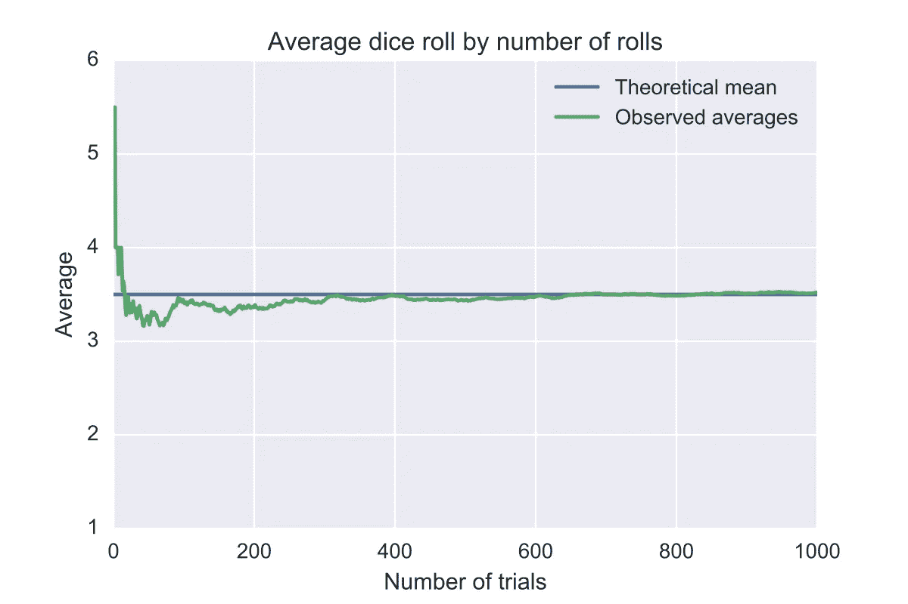

# 理解集成学习

> 原文：<https://medium.com/analytics-vidhya/understanding-ensemble-learning-4019bfc2e8d1?source=collection_archive---------27----------------------->

## 成为 ML 专家的一步。

大数定律。

这种算法背后的直觉来自于 ***群体智慧*** 也就是说，在解决问题和做出决策时，许多人的集体智慧往往超过单个专家的智慧。

> ***与大多数事物一样，平庸无奇。有了决策，往往是卓越*** *。詹姆斯·索罗维基*

例如:假设你决定要买一部 iPhone。但是，你不确定该选择哪种模式。所以你问一群人

*   一个移动店主，他对模型的看法和你有 60%的相似度。
*   一个 YouTube 技术评论者，他和你对某个模型的看法 80%相似。
*   你的一个密友，和你的观点有 70%的相似度。

虽然每个人单独在一起时都会有某种偏差，但他们同时出错的概率等于-
P =(1–0.6)x(1–0.8)x(1–0.7)
P = 0.024
这意味着他们的观点有 97.6%(100–2.4)的可能性是好的(假设他们的观点相互独立)。这是一个相当高的概率来决定。合奏基于相似的信念。

## 首先，我们来了解一下**为什么需要系综建模**？

在现实世界中，通过单个模型对数据集进行概化可能具有挑战性。一些模型将能够很好地捕捉数据的一个方面，而其他模型将在捕捉其他方面做得很好。
集合建模有助于减少误差，并在最终评估指标(例如:准确度/精确度)优于每个单独模型的情况下做出预测。

模型的组合强度抵消了单个模型的*方差*和*偏差*。

> **一根细枝折断，但这捆细枝却很结实**。

就这么简单。

因此，我们可以将**集成建模定义为一种用于组合多个机器学习模型以产生一个最佳模型的机器学习技术。**

集合建模(方法)可分为:

1.  **序贯集成方法**。

*   助推。

1.  **并行集成方法**。

*   装袋粘贴。
*   堆叠。

在**顺序集成方法**中，连续生成基础学习器或个体模型，以提高模型性能。在**并行集成方法**中，基础学习器独立于或同时于训练数据生成。

## **增压**:

基本上就是把几个弱学习者组合成一个强学习者。它按顺序训练模型，每个模型都试图纠正其前任。

1.  **AdaBoost —** 这里，新的预测器更加关注错误分类的训练实例或先前模型拟合不足的实例。
2.  **梯度推进—** 这里，新的预测器由先前预测器产生的残差来拟合。梯度提升框架的好处在于，不必为可能想要使用的每个损失函数导出新的提升算法，相反，它是足够通用的框架，使得可以使用任何可微分的**损失函数**。

## **装袋粘贴**:

Bagging 通常被称为**B**ootstrap**AGG**regat**ING**是一种集成学习方法，其中给定一个训练集，通过从原始数据集中替换采样，创建多个不同的训练样本(称为 bootstrap 样本)。然后，为每个引导样本建立一个模型。然后将各个预测汇总，形成最终预测。

在没有 替换的情况下进行 ***采样时，称为粘贴。***

**RandomForest —** 它是*决策树*的集合，一般通过 bagging 方法训练。随机森林导致更大的树多样性，这以**更高的偏差**(由于特征得到子集化)换取**更低的方差**，通常产生**整体更好的模型**。

## 堆叠:

堆叠是一种集成学习技术，通过元分类器或混合器来组合多个分类模型。它训练一个新模型来执行聚合，而不是使用任何竞争函数。

因此，集成学习通常会提高预测性能，但它也带来了**高计算复杂性**的成本，并且产生的输出也可能**难以分析**。

因此，我们必须尝试不同的算法，包括集成技术，以获得特定数据集的最佳预测。

如果你有任何建议或反馈，请通过我的电子邮件*mwasim.j01@gmail.com 联系我。*