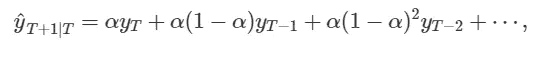
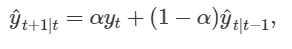
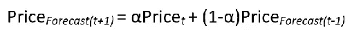
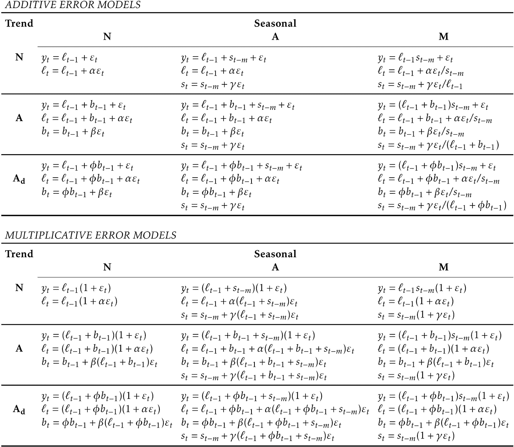
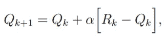
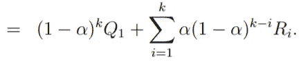
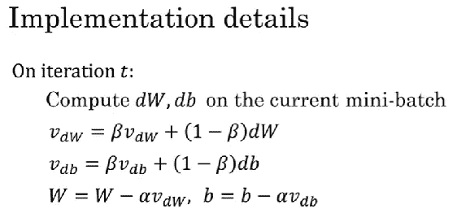

# 从数据科学的角度理解“指数移动平均线”。

> 原文：<https://medium.com/analytics-vidhya/understanding-exponential-moving-averages-e3f020d9d13b?source=collection_archive---------0----------------------->

毫无疑问，当进行任何形式的统计分析时，均线都起着至关重要的作用。简单来说，移动平均线通过平均数据点中的经验给出了对过去的直觉。就这一点而言，我认为“数学”不仅仅是一门学科，而且是一个伟大的工具包，以可以量化和测量的方程形式捕捉生命的概念。是不是很美:)。

马克西姆·霍普曼在 [Unsplash](https://unsplash.com/s/photos/graphs?utm_source=unsplash&utm_medium=referral&utm_content=creditCopyText) 上的照片

EMA 并不是什么新鲜的话题，有大量的文章和内容阐述了 EMA 的概念，但主要是从有限的角度，主要是在金融交易的背景下，例如*[*EMA 12&EMA 26*](/@CryptoTutor/a-short-explanation-simple-and-exponential-moving-averages-117641457c10)***【1】**或者主要是在时间序列分析***【2】**的背景下。然而，在本文中，我想从数据科学的多个角度来讨论 EMA 作为一个基本&通用基本概念的重要性。***

***这篇文章的结构如下:***

*   ***一般 EMA 定义和直觉。***
*   ***时间序列中的均线。***
*   ***强化学习。***
*   ***神经网络/深度学习中的 EMA。***
*   ***结论***
*   ***参考文献***

*****定义**:简单来说，“移动平均线”是一种确定趋势方向的统计工具，为了做到这一点，它通常在一个特定的时间段内聚合一个数据点子集，并将总数除以子集中的数据点数，从而得出一个平均值。之所以称之为移动平均值，是因为这种计算会随着数据点随时间的增长而递归发生。***

******

***照片由[马特·阿特兹](https://unsplash.com/@mattartz?utm_source=medium&utm_medium=referral)在 [Unsplash](https://unsplash.com?utm_source=medium&utm_medium=referral) 上拍摄***

***指数移动平均线是一种移动平均线，它对最近的数据点比过去的数据点施加更多的权重。换句话说，这就像给予最后的经历或记忆比旧的更重要，假设那些是由数据点表示的。***

***以下等式描述了计算指数移动平均线的公式:***

******

***其中 **α** 是平滑参数，并且在 0 和 1 之间。这也用于以最简单的方式产生一步预测。例如，下面的公式揭示了如何使用均线预测股票的*价格*。***

********

**注:还有其他类型的移动平均线，如加权移动平均线、累计移动平均线等。然而，这篇文章的重点只是均线。总而言之，**

*   **SMA(简单移动平均)赋予 ***等于*** 的权重给过去的值，**
*   **WMA(加权移动平均)给*线性递减的权重到过去的值，***
*   ***EMA(指数移动平均线)给 ***以指数*** 递减的权重到过去的值。***

****时间序列中的均线**:在时间序列方法中，均线通常用于指数平滑法，如下表所示。根据要分析的时间序列中存在的成分，可以使用各自的模型以 EMA 为核心进行预测。**

****

**ETS 框架中每个模型的状态空间方程**

**请参考罗伯·J·海曼和乔治·阿萨纳索普洛斯***【3】**的 [*《预测:原理与实践》。*](https://otexts.com/fpp3/)***

****强化学习中的 EMA:**在强化学习(RL)的背景下，或者更准确地说，在 *n 臂土匪*问题中(因为完整的 RL 具有“状态”和“策略”来学习长期奖励)，对于非平稳问题，所选动作的期望值被给定为:**

****

**其中步长参数α ϵ (0，1)是常数。在上面，Qₖ₊₁是新的估计，而 Qₖ是旧的估计，Rₖ是行动的第 *k* 个奖励。**

**这导致 Qₖ₊₁是过去奖励和初始估计 Q₁:的加权平均值**

****

**数量 1- α小于 1，因此给予 Rᵢ的权重随着中间奖励数量的增加而减少。如果 1- α = 0，那么所有的重量都在最后一个奖励上，Rₖ，因为惯例是 0⁰ =1。**

**事实上，如果我们重新排列上面的等式，我们会得到一个类似于用均线预测价格的等式，即 Qₖ₊₁ = Qₖ + α(Rₖ - Qₖ).**

**此外，M. D Awedha 等人在他们的论文“ [*指数移动平均 Q 学习算法*](https://ieeexplore.ieee.org/document/6614986)”**【4】**中已经展示了结合 Q 学习算法(RL 算法之一)对多智能体情况的 EMA 的使用。**

****神经网络/深度学习中的 EMA:**在深度学习中，EMA 的使用可以被视为基于梯度的随机目标函数的优化算法的基础，例如在具有动量的梯度下降、AdaGrad、RMSProp 等中。基本思想是评估梯度的指数加权平均值，然后使用结果来更新权重。**

****

**使用动量算法的 SGD 来源:改进深度神经网络:通过深度学习进行超参数调整、正则化和优化。人工智能**

**例如，具有上述动量算法的 SGD 描述了如何使用指数移动平均方程来评估速度' *v'* ，如右侧所示。**

**通过选择 **β** 值，我们可以控制在计算平均值时最后 N 个数据点的权重。1/1- **β** 是一个简单的方法来记住这个权重是如何应用的。当 **β** 为 0.9 时，我们将对最后 10 个数据点进行平均，而当 **β** 为 0.98 时，我们考虑了最后 50 个数据点，因此对这 50 个数据点进行平均。**

**通过在更大的窗口上求平均值，当数据改变时，平均值适应得很慢。这是因为以前的值被赋予了很大的权重，而新值被赋予了小得多的权重。**

**不仅在收敛方面优化，而且在计算资源方面，EMA 是一种计算平均值的高效方法。我们不需要太多的内存或计算能力来计算这个平均值。特别是，在神经网络/深度学习的背景下，当需要大量计算来训练模型时，这种优化不仅仅是增值，而是必要的。**

# **结论**

**综上所述，指数移动平均线，从数据科学的整体角度来看，很有意义。如上所述，这在不同的数据科学方法和概念中的使用更加明显。因此，对这一构建模块的深入理解将真正有助于建立对许多数据科学概念的牢固理解，并推断出它们之间的相关性。**

# **参考资料:**

1.  **[如何用 Python 进行交易？使用 Python 进行交易——指数… |作者:Michael Whittle | Level Up 编码(gitconnected.com)](https://levelup.gitconnected.com/trading-using-python-exponential-moving-average-ema-f38ed3211a44)**
2.  **[时间序列从无到有——指数加权移动平均(EWMA)理论和实施| Dario rade ci |走向数据科学](https://towardsdatascience.com/time-series-from-scratch-exponentially-weighted-moving-averages-ewma-theory-and-implementation-607661d574fe)**
3.  **Hyndman，R.J .，& Athanasopoulos，G. (2021) *预测:原理与实践*，第三版，原文:澳大利亚墨尔本。OTexts.com/fpp3.**
4.  **米（meter 的缩写））D. Awheda 和 H. M. Schwartz，“指数移动平均 Q-学习算法”，2013 年 IEEE 自适应动态规划和强化学习研讨会，2013 年，第 31–38 页，doi:10.1109/ADPRL . 2013 . 11110136323**