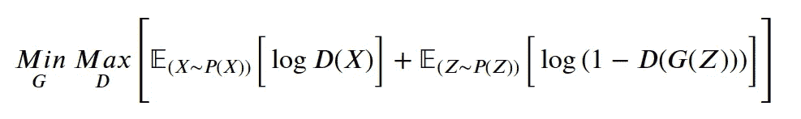

# 理解 GANs——从零开始推导对抗性损失

> 原文：<https://medium.com/analytics-vidhya/understanding-gans-deriving-the-adversarial-loss-from-scratch-ccd8b683d7e2?source=collection_archive---------1----------------------->

Ggenerate adversarial networks(简称 GANs)是一项无监督的学习任务，其中生成器模型学习发现输入数据中的模式，以便该模型可以用于生成训练数据的新样本。

GAN 的主要思想是**对抗训练**，两个神经网络互相对抗，并提高自己以更好地战斗。

生成器将噪声向量作为输入，然后将噪声向量转换为假训练样本，然后通过鉴别器。鉴别器获取真实样本(来自训练数据)和虚假样本(由生成器生成)，然后尝试区分虚假样本和真实样本。换句话说，**生成器试图通过向鉴别器显示虚假的训练数据样本**来欺骗鉴别器，而鉴别器试图尽可能地聪明。

主要思想是，如果生成器欺骗了鉴别器，那么这意味着鉴别器应该改进自己。另一方面，如果鉴别器完美地分类了假样本和真样本，那么这意味着发生器应该自我改进，以便能够欺骗鉴别器！

可能的原因是，

1.  **生成器欺骗鉴别器**表示鉴别器未能对假图像样本进行分类。在这种情况下，鉴别能力应该会提高，因此损耗将仅通过鉴别器反向传播！
2.  **鉴别器在鉴别真假图像**方面做得很好，这意味着假图像还不足以迷惑鉴别器**。**这意味着发电机应该自我改进，因此损耗将仅通过发电机网络反向传播！

# 但是，问题是生成器如何能骗过鉴别器呢？

直观地，生成器学习我们的训练数据的概率分布。下图直观地描述了这个想法。

一句话，生成器学习近似实际训练数据的分布，然后从学习的分布中采样。训练时，发生器和鉴别器会有一场战斗，两者交替训练，同时保持另一个固定！

# 导出对抗性损失:

鉴别器只不过是一个执行二元分类(真的或假的)的分类器。那么，我们用什么损失函数进行二分类呢？不就是**二进制交叉熵**吗？

二元交叉熵损失函数的方程如下所示。

**Z** :噪声向量(噪声向量的维数为超参数)。

**G(Z)** :给定噪声矢量 Z 时发电机的输出。

**X:** 真实的训练数据。

**D(G(Z))** :给定假生成数据或 G(Z)时鉴频器的输出。

**D(X)** :给定来自 X 的真实训练数据时鉴别器的输出。

鉴别器采用 X 或 G(Z)。请注意，鉴别器只不过是一个二元分类器，因此，**我们将 D(X)标记为 1，D(G(Z))标记为 0** 。

我们希望我们的鉴别器将所有 D(X)标记为 1，将所有 D(G(Z))标记为 0。对吗？

所以，

鉴别器应该使 Log(D(X))最大化，并且因为 Log 是单调函数，所以如果**鉴别器使 D(X)** 最大化，Log(D(X))将自动最大化。

另一方面，

鉴别器需要最大化 log(1 — D(G(Z)))，这意味着它必须**最小化 D(G(Z))** 。

因此，鉴别器的损失函数(对于单个样本)变成，

> 鉴别器将**最大化 D(X)** 并且**最小化 D(G(Z))** 以整体最大化上述损失函数。

注意，D(X)和 D(G(Z))都是概率值，并且**都位于 0 和 1 之间**。

现在，鉴别器在一批中的损失函数是，

> 其中，P(X)是真实训练数据的概率分布，P(Z)是噪声向量 Z 的概率分布。通常，P(Z)是高斯或均匀的。

生成器需要通过生成尽可能真实的图像来欺骗鉴别器。这意味着**生成器应该生成这样的 G(Z ),如果我们通过鉴别器，它将被标记为 1。**

> 因此，鉴别器希望 D(G(Z))等于 1，生成器希望 D(G(Z))等于 0。

所以，从二元交叉熵来看，

上面的只是一个样本。一批下来，会是，

发电机将最小化上述损失函数，并且为了最小化上述损失函数，发电机必须最大化 D(G(Z))。现在很清楚了**鉴别器想最小化 D(G(Z))，生成器想最大化 D(G(Z))。**

要知道，发电机永远不会看到任何真实数据，但为了完整起见，发电机损耗函数可以写成如下形式！

注意，发生器无法控制第一项，因此**发生器只会最小化第二项**。

假设， **D** 是鉴频器的参数， **G** 是发生器的参数。所以，我们可以把损失函数写成，

## **这意味着鉴别器参数(由 D 定义)将最大化损失函数，而发生器参数(由 G 定义)将最小化损失函数。**

> 对抗损失可以通过梯度下降来优化。但是当训练一个 GAN **时，我们不会同时训练发生器和鉴别器**，当训练发生器时，我们冻结鉴别器，反之亦然！

最初的 GAN 论文提供了一个伪代码，显示了 GAN 是如何被训练的。

我认为这并不难理解！:)

**参考文献:**

 [## 生成对抗网络

### 生成对抗网络(GAN)是由 Ian Goodfellow 和他的团队设计的一类机器学习框架

en.wikipedia.org](https://en.wikipedia.org/wiki/Generative_adversarial_network)  [## 生成对抗网络

### 我们提出了一个新的框架，通过一个对抗的过程来估计生成模型，在这个过程中，我们同时…

arxiv.org](https://arxiv.org/abs/1406.2661)