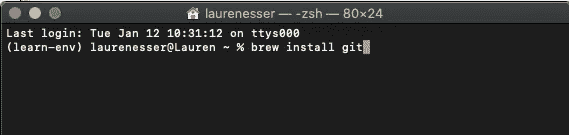
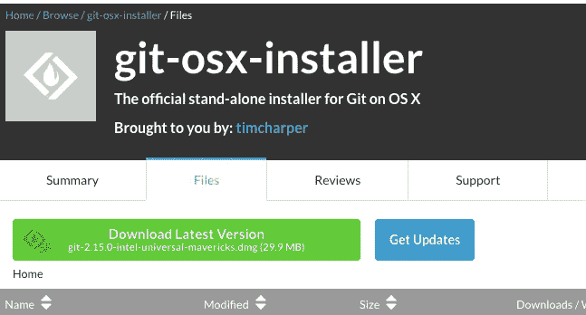
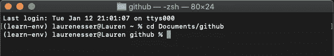
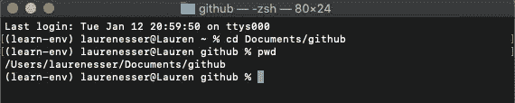
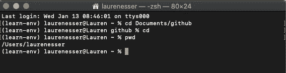
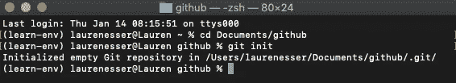
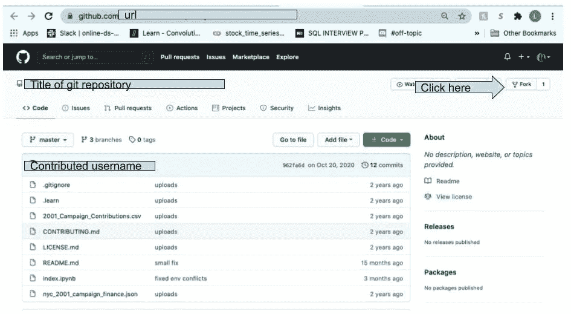
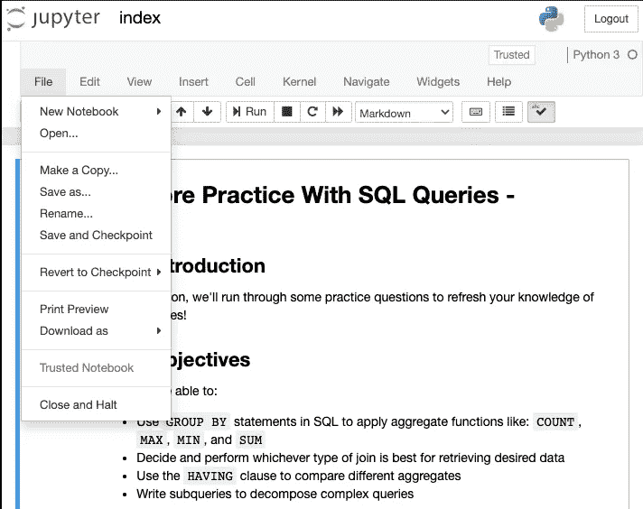
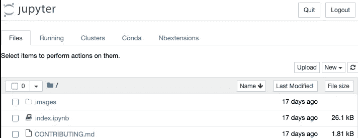
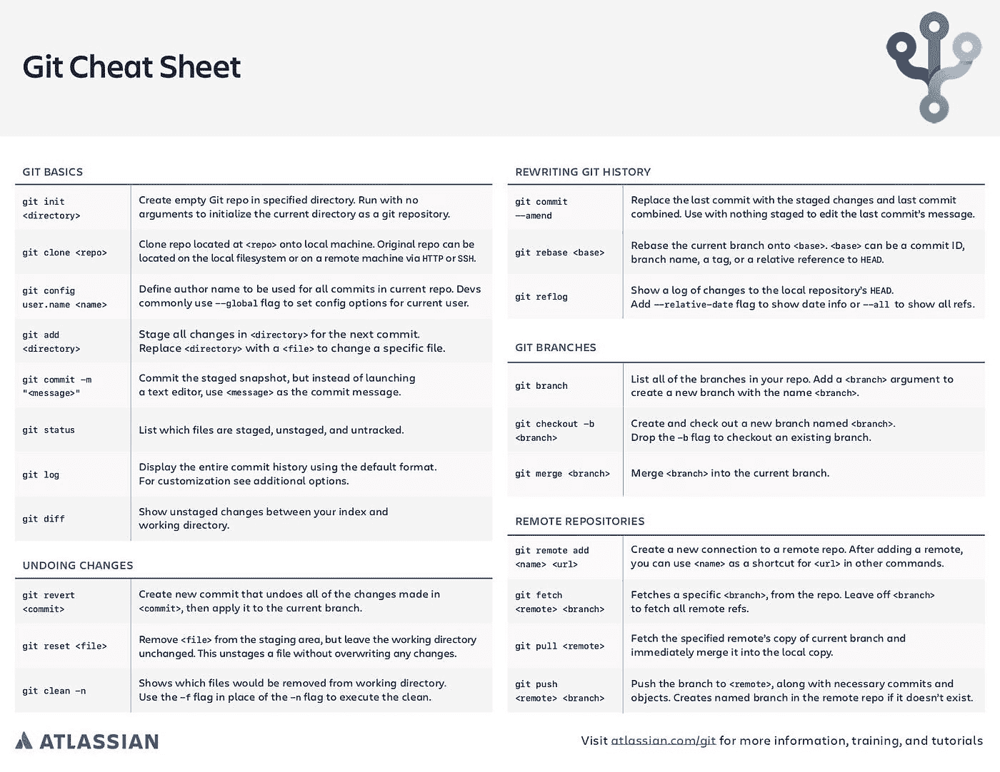

# 了解面向 Mac 用户的 Git

> 原文：<https://medium.com/analytics-vidhya/understanding-git-for-mac-users-8fe0bd350b57?source=collection_archive---------20----------------------->

不要嘲笑我，但出于某种原因，每当我看到或听到“git”这个词时，KC &阳光乐队的歌曲“今晚下来”就会自动在我脑海中播放。只有我一个人吗？很有可能。在这篇文章中，我将介绍面向 Mac 用户的 Git，从设置到功能。让我们开始吧。


图片来自 thecurrent.org

# 安装过程

我在 https://git-scm.com/download/mac 网站上第一次了解了如何为我的 Mac book 下载 git。我的电脑上已经有了自制软件，因此，我所做的就是进入我的终端，键入:

```
brew install git
```



图片取自我的电脑

如果你的电脑上还没有自制软件，另一个选择是去 https://sourceforge.net/projects/git-osx-installer/files/的[点击绿色按钮“下载最新版本”](https://sourceforge.net/projects/git-osx-installer/files/)



我的电脑截图

如果您认为您已经正确遵循了上述步骤，请键入以下内容:

```
git -- version
```

进入你的终端并按下回车键。它应该返回 git 版本 2.15.0(或者您刚刚下载的任何版本)。恭喜你，你现在已经在你的 Mac book 上安装了 Git！

在我们继续解释 Git 之前，我们需要**配置你的 Git 用户名和电子邮件**。在您自己的终端中遵循以下步骤:

```
git config --global user.name "Your name goes here"git confit --global user.email "Your_email@address.com"
```

# **好人有好报**

因此，您已经在 Mac book 上设置了 git。好吧，现在怎么办？让我们介绍一下您将在日常生活中用到的 git 的一些最重要的方面。

```
cd
```

**cd** 代表更改目录，是您从终端内不同文件夹进行移动的方式。如果我想移动到“Documents”文件夹中名为“github”的文件夹，我会编写代码:

```
cd Documents/github
```

请注意，在我的用户名后面现在写着 github。这说明我在我的 github 文件夹里。



另一种确定我在电脑中位置的方法是使用:

```
pwd
```

pwd 代表“打印工作目录”,它会准确地说明我在电脑中的位置。



注意我现在在/Users/laurenser/Documents/github 中。如果我不小心移动到了错误的文件夹，我可以通过再次键入“ **cd** ”移回基本文件夹。为了展示这一点，我键入 pwd 来打印工作目录。



一旦您移动到您想要的文件夹，现在是时候创建或克隆您的第一个 git 存储库了。

**创建您自己的存储库:**

要在指定目录中创建空的 Git repo，您有两种选择。

1.  导航到选择的目录，然后键入:

```
git init
```



2.git init 之后，指定要初始化的目录:

```
git init <directory>
```

关于初始化存储库的更多具体信息，我强烈推荐你看一看 git 关于[https://git-scm.com/docs/git-init](https://git-scm.com/docs/git-init)的文档

**克隆现有存储库:**

克隆一个现有的存储库意味着将位于 www.fullwebsiteurl.com[的存储库带到您的本地机器上。克隆回购时，有两件事需要考虑。](http://www._____.com)

1.它已经是你的仓库了吗？如果是这样，复制链接并克隆到您的本地系统。


上面我复制并粘贴了我的“更好的股票市场预测”项目的链接，并将其克隆到我的本地系统上。

2.我不拥有这个库，但是我想“派生”它并对它进行处理。

转到您想要分叉的回购的网页。单击屏幕右上角的 fork。



我的电脑截图

一旦您分叉了 repo，您应该在 git 存储库的标题前看到您的用户名。复制 url 并粘贴到您的终端中“git clone”字样之后


现在，您在本地机器上有了自己的存储库副本。

**在 Jupyter 笔记本中打开存储库:**

既然您已经成功地克隆或初始化了您的存储库，现在是时候在您的 Jupyter 笔记本中打开存储库了。要做到这一点，请在您的终端中键入“jupyter notebook ”,然后按回车键。您的终端应该会自动打开一个网页，进入您正确的 Jupyter 笔记本。

**将您的工作保存到 Github:**

当您在 Jupyter 笔记本中完成更改后，您需要“保存并检查”，然后“关闭并暂停”您的笔记本以保存更改。



我的电脑截图

当您的笔记本关闭时，您将返回到 jupyter 笔记本主屏幕。点击右上角的“退出”。



我的电脑截图

现在你的笔记本正式合上。为了让这些更改显示在 Github 上，您需要返回到您的终端来添加更改，提交它们，并最终将它们推送到 Github 上。

```
git add
```

git add 用于为下一次提交暂存目录或 repo 中的所有更改。添加更改的最简单方法是键入“git add”在 git add 后面添加句点意味着添加您刚才在目录中所做的所有更改。情况并不总是这样，有时可能有些文件你想保存在本地，而不想推送到 Github。我们将在另一篇博客中讨论这些。

```
git commit -m
```

git commit 用于提交您所做的所有更改，而-m 用于添加一条提交消息。提交消息应该是对所做更改的简要描述。

```
git push
```

git push 是将远程工作推送到 Github 并更新在线资源库的过程。现在，您已经将本地完成的所有工作保存到了 Github。

**其他重要事项:**

```
ls
```

假设您在终端的一个文件夹中，不记得某个特定文件的名称。通过键入“ls”并按回车键。您将列出当前工作目录中的所有文件。另一个帮助你记住文件名的方法是点击 tab 键。如果我输入“cd r ”,然后按 tab 键，它将显示当前目录中所有以 r 开头的文件。

```
git status
```

列表状态通常在您完成笔记本中的工作时使用。通过键入“git status”并按回车键，您将看到您在哪个分支上、在主分支之前提交、已暂存、未暂存和未跟踪的文件。

```
git reset
```

我想花点时间讨论一下“git reset ”,因为这在正确使用时非常有益，但在错误使用时却非常有害。有时您可能会意外地“git commit”一个您并不打算提交的项目。例如，假设您有一个非常大的文件，但实际上无法推送到 Github。为了解决此问题，您需要将临时区域重置回过去的提交状态。有两种不同类型的 git 重置。

*   git 复位—软复位:如果您不确定要进行哪种复位，请始终从软复位开始。这将保留对文件所做的更改，但会删除上次提交的内容。通过这样做，您现在可以将这个大文件添加到您的。gitignore，然后重新提交。
*   git reset — hard:这是我不小心从电脑上删除了几个小时工作的地方。硬重置会更改临时区域、工作目录，并覆盖您刚才所做的所有更改。也就是说，你将回到你最后一次推送 Github 的时候。

git reset 是一个强大的工具，当我们在提交中出错时，只要确保您使用的是正确的就行了！

—

当使用 Git 时，您不仅仅是为自己使用它。你可能作为一个团队来完成一个特定的目标。也许是分而治之的路线。


图片来自 nobledesktop.com

Git 有一个名为 branches 的项目，它允许您从主文件中获取一个副本，并做出自己的更改，以便以后与主文件合并。要创建自己的分支，您可以键入

```
git checkout -b <nameofbranchhere>
```

在这里，您将创建您的分支机构的名称，以及移动到或“检出”您的分支机构以继续工作。当您完成工作时，您仍然需要执行 git add 和 git commit -m。现在，您将“git merge”而不是将您的工作推回 Github，这允许您所做的更改集成回主分支。

今天我们讨论了了解 Git 入门知识的必要性。我鼓励您查看下面的额外资源，了解 Git 中的其他命令，甚至尝试自己测试它们。

**额外资源:**如果你是使用 git 的新手，我强烈推荐你去[https://www . atlassian . com/git/tutorials/atlassian-Git-cheat sheet](https://www.atlassian.com/git/tutorials/atlassian-git-cheatsheet)下载 Git 备忘单。这将有助于我避免许多刚开始时的问题



来自[https://www . atlassian . com/git/tutorials/atlassian-git-cheat sheet](https://www.atlassian.com/git/tutorials/atlassian-git-cheatsheet)

**参考:**

【https://git-scm.com/ 