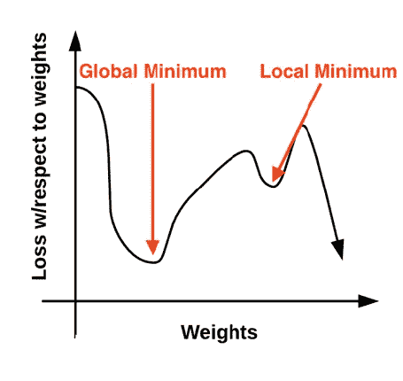
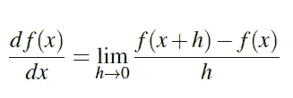
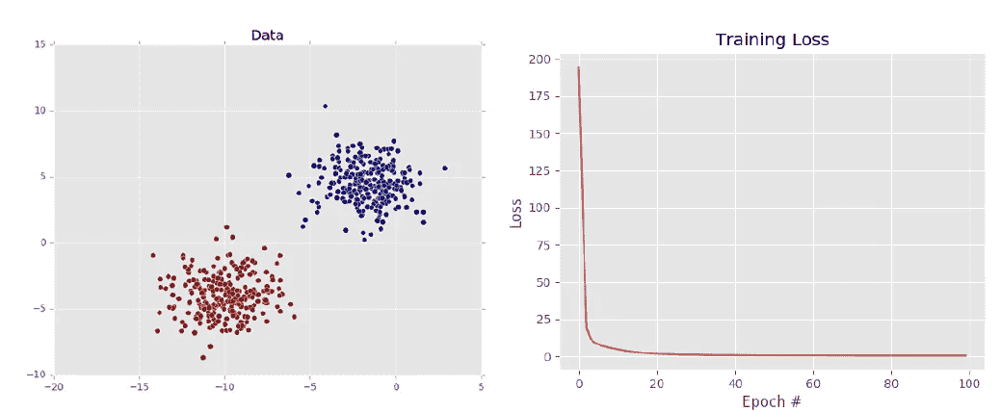

# 了解梯度下降

> 原文：<https://medium.com/analytics-vidhya/understanding-gradient-descent-106ad1142ff4?source=collection_archive---------32----------------------->


> 如果你在早上 8 点左右被丢在喜马拉雅山的某个地方，我们如何在日落前到达安全的地方？—梯度下降是你思维过程背后的实际解决方案。是的，我们需要根据最初的假设找到前进的方向，这样我们就能按时或提前到达安全的地方。

在我以前的文章中，我已经解释了关于[参数化学习](/analytics-vidhya/parameterized-learning-91f701f9cabb)和基本的[损失函数](/analytics-vidhya/loss-functions-multiclass-svm-loss-and-cross-entropy-loss-9190c68f13e0)技术。如果你没有读过，请读一读，以便更好地理解梯度下降。

在基于深度学习的问题中，优化算法通过根据训练过程中发生的损失来更新随机初始化的参数，在实现更高精度方面起着重要作用。我们如何将这与喜马拉雅山的例子联系起来？

在徒步旅行到安全的地方时，人类在向下迈出一步之前可以在多个方向上思考，而当你训练一台机器时，你必须在选择向下移动的方向之前尝试所有的可能性，并根据最初的假设找到损失，并在第二次尝试中更新，以便训练机器到达安全屋。



在上图中，我们可以看到两个极小点，看起来很像，实际上不是。因此，正确的参数是达到实际/真正的最小点(全局最小值)所必需的

# **评估梯度的步骤**

1.  **损耗**:用于计算当前参数 W 和输入数据的损耗的函数。
2.  **数据**:我们的训练数据，其中每个训练样本由一个图像表示
3.  **W:** 我们正在优化的实际权重矩阵。我们的目标是应用梯度下降法找到一个产生最小损失的 W。

> 梯度下降算法将有助于使用以下公式计算所有维度上的梯度(方向) **W**



# **实际实施**

```
# import the necessary packages
from sklearn.model_selection import train_test_split
from sklearn.metrics import classification_report
from sklearn.datasets import make_blobs
import matplotlib.pyplot as plt
import numpy as np
import argparsedef sigmoid_activation(x):
  # compute the sigmoid activation value for a given input
  return 1.0 / (1 + np.exp(-x))def sigmoid_deriv(x):
  # compute the derivative of the sigmoid function ASSUMING
  # that the input `x` has already been passed through the sigmoid
  # activation function
  return x * (1 — x)def predict(X, W):
  # take the dot product between our features and weight matrix
  preds = sigmoid_activation(X.dot(W)) # apply a step function to threshold the outputs to binary
  # class labels
  preds[preds <= 0.5] = 0
  preds[preds > 0] = 1 # return the predictions
  return preds# construct the argument parse and parse the arguments
ap = argparse.ArgumentParser()
ap.add_argument(“-e”, “ — epochs”, type=float, default=100,
 help=”# of epochs”)
ap.add_argument(“-a”, “ — alpha”, type=float, default=0.01,
 help=”learning rate”)
args = vars(ap.parse_args())# generate a 2-class classification problem with 1,000 data points,
# where each data point is a 2D feature vector
(X, y) = make_blobs(n_samples=1000, n_features=2, centers=2,
 cluster_std=1.5, random_state=1)
y = y.reshape((y.shape[0], 1))# insert a column of 1’s as the last entry in the feature
# matrix — this little trick allows us to treat the bias
# as a trainable parameter within the weight matrix
X = np.c_[X, np.ones((X.shape[0]))]# partition the data into training and testing splits using 50% of
# the data for training and the remaining 50% for testing
(trainX, testX, trainY, testY) = train_test_split(X, y,
 test_size=0.5, random_state=42)# initialize our weight matrix and list of losses
print(“[INFO] training…”)
W = np.random.randn(X.shape[1], 1)
losses = []# loop over the desired number of epochs
for epoch in np.arange(0, args[“epochs”]):
  # take the dot product between our features `X` and the weight
  # matrix `W`, then pass this value through our sigmoid activation
  # function, thereby giving us our predictions on the dataset
  preds = sigmoid_activation(trainX.dot(W)) # now that we have our predictions, we need to determine the
  # `error`, which is the difference between our predictions and
  # the true values
  error = preds — trainY
  loss = np.sum(error ** 2)
  losses.append(loss) # the gradient descent update is the dot product between our
  # (1) features and (2) the error of the sigmoid derivative of
  # our predictions
  d = error * sigmoid_deriv(preds)
  gradient = trainX.T.dot(d) # in the update stage, all we need to do is “nudge” the weight
  # matrix in the negative direction of the gradient (hence the
  # term “gradient descent” by taking a small step towards a set
  # of “more optimal” parameters
  W += -args[“alpha”] * gradient # check to see if an update should be displayed
  if epoch == 0 or (epoch + 1) % 5 == 0:
    print(“[INFO] epoch={}, loss={:.7f}”.format(int(epoch + 1),
    loss))# evaluate our model
print(“[INFO] evaluating…”)
preds = predict(testX, W)
print(classification_report(testY, preds))# plot the (testing) classification data
plt.style.use(“ggplot”)
plt.figure()
plt.title(“Data”)
plt.scatter(testX[:, 0], testX[:, 1], marker=”o”, c=testY[:, 0], s=30)# construct a figure that plots the loss over time
plt.style.use(“ggplot”)
plt.figure()
plt.plot(np.arange(0, args[“epochs”]), losses)
plt.title(“Training Loss”)
plt.xlabel(“Epoch #”)
plt.ylabel(“Loss”)
plt.show()
```



**参考文献:**

Adrian Rosebrock 用 Python 实现计算机视觉的深度学习(入门包)