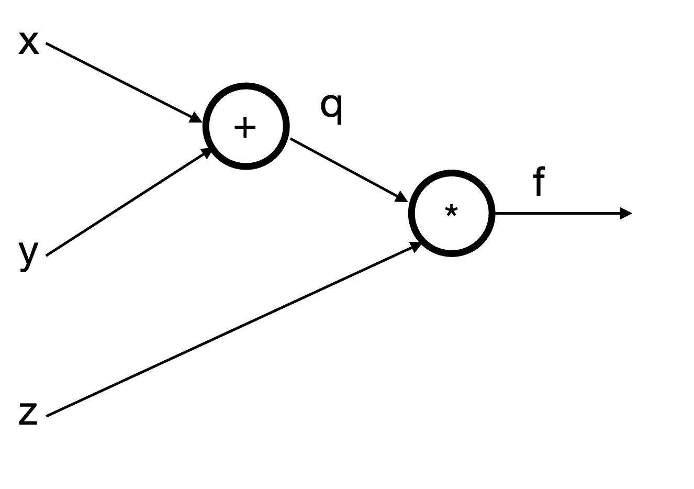
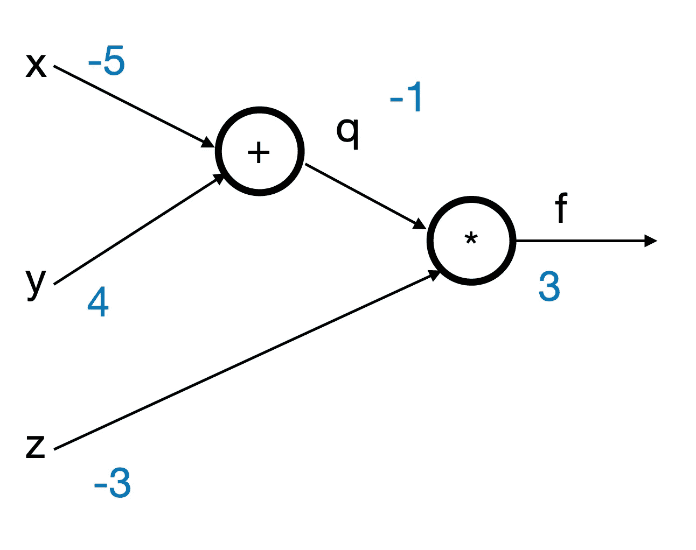

# 理解反向传播中的梯度—适用于初学者

> 原文：<https://medium.com/analytics-vidhya/understanding-gradients-in-backpropagation-for-beginners-f93017fc1390?source=collection_archive---------21----------------------->

用更简单的术语来说就是反向传播。

照片由[思想目录](https://unsplash.com/@thoughtcatalog?utm_source=medium&utm_medium=referral)在 [Unsplash](https://unsplash.com?utm_source=medium&utm_medium=referral) 上拍摄

最近我开始学习机器学习，神经网络等等。，并一直在做一些关于它们的在线课程。在关于节点和它们各自的梯度的一章中，当屏幕上的数字一个接一个地弹出时，讲述者不停地说“好的，所以这个值是 1，那么那个值是 5，所以这个是 3”。

我努力去理解为什么。

我花了一点时间寻找其他来源和材料，并花了几天时间来消化这个想法。如果你和我一样，对其他专业人士所说的有些困惑，这里是我总结的虚拟版本(或者至少是我对它的理解，如果有错误，请告诉我)。

# 简单的图表

假设下图:

作者图片

我们将有:
i) q = x + y

ii) f = z * q

前向传播应该不成问题——将一些值输入到 *x* 、 *y* 、 *z* 中，应该可以直接导出 *q* 和 *f* 处的值，如下所示:

作者图片

# 反向传播

令我困惑的是反向传播。那些δ是什么意思？

首先我们需要一些中学数学:

> 导数/微分，是某事物的变化率。

即如果我们写出δy/δx，那就是 y 的 ***变化率*除以 x 的** 变化率*。换句话说， *y* 变化多少与 *x* 变化多少相关。*

所以，在我的在线课程中，所有的叙述者都在说，反向传播等于计算最后一个节点的变化率超过它之前所有其他节点的变化率。

所以让我们先看看我们有什么。

1.  我们有 q = x + y，所以这意味着δq/δx = 1，δq/δy = 1。
2.  我们有 f = q * z，所以这意味着δf/δq = z 和δf/δz = q。

从末端 *f* 开始，我们有δf/δf，为 1。

在 *q* 处，我们想要计算 *f* 相对于 *q* 的(w.r.t .)变化率的变化率，即δf/δq。我们很幸运，它就在[2]处。].该值就是在 *z* 处的值。

在 *z* 处，我们要计算 *f* w.r.t 的变化率 *z* 即δf/δz，也就是 *q* (从【2。]再上面)。

现在我们到了 *y* 。我们要计算*f*w . r . t .*y*的变化率。也就是δf/δy 啊哦，我们在[2]里没有。]现在。但是不用担心！中学数学也告诉我们，δf/δy = δf/δq * δq/δy，我们既有δf/δq，又有δq/δy，那就是说δf/δy = z * 1 = -3。

在这一点上，我们应该能够计算出 *x* 处的梯度。

现在我们有了。

声明:我是一个完全的初学者，分享我在修改时学到的东西。希望以上对新手有所帮助。