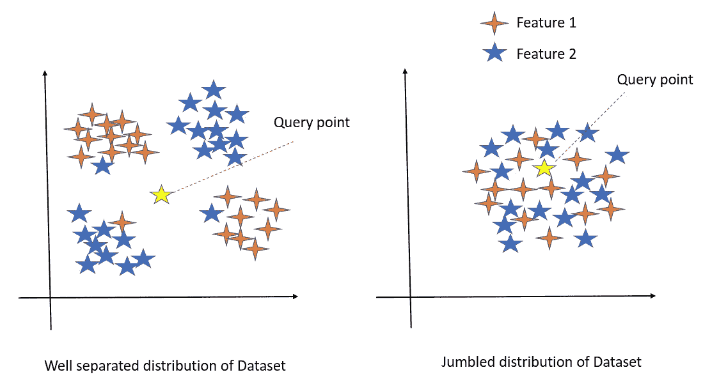

# 详细理解 K-最近邻算法

> 原文：<https://medium.com/analytics-vidhya/understanding-k-nearest-neighbour-algorithm-in-detail-fc9649c1d196?source=collection_archive---------3----------------------->

# 先决条件:

1.  对机器学习或数据科学有基本的了解
2.  基本 Python 编程
3.  机器学习的性能度量

# **目录:**

1.  介绍
2.  KNN 的失败案例
3.  在 KNN 使用不同的距离测量
4.  如何选择 K 值(超参数调谐)
5.  时间复杂性和空间复杂性
6.  KNN 算法的利弊
7.  执行 k-NN 的不同方式
8.  为什么需要交叉验证？
9.  偏差方差权衡
10.  KNN 的代码实现

# **1。简介**

k 近邻(KNN)是一种监督学习算法，用于回归和分类目的，但主要用于分类问题。给定一个具有不同类的数据集，KNN 试图通过计算测试数据和所有训练点之间的距离来预测测试数据的正确类。然后，它选择最接近测试数据的 k 个点。一旦选择了这些点，该算法计算测试点属于 k 个训练点的类的概率(在分类的情况下)，并且选择具有最高概率的类。在回归问题的情况下，预测值是 k 个选定训练点的平均值。

让我们通过一个分类问题的例子来理解这一点:

1)给定如下所示的训练数据集。我们有新的测试数据需要分配给两个类中的一个。


红点和绿点是训练数据中的两类

2)现在，k-NN 算法计算测试数据和给定训练数据之间的距离。


计算相邻点之间的距离

3)在计算距离之后，它将选择与测试数据最近的 k 个训练点。在我们的例子中，假设 k 的值是 3。


选择 k=3，其中 1 个红色，2 个绿色

4)现在，选择 3 个最近邻，如上图所示。让我们看看我们的测试数据将被分配到哪个类中:

绿色类值的数量= 2，红色类值的数量= 1 概率(绿色)= 2/3，概率(红色)= 1/3

由于绿色类的概率高于红色类，k-NN 算法会将测试数据分配给绿色类。

**KNN 回归**

在**回归问题**的情况下，测试数据的预测值将只是所有 3 个最近值的平均值或所有 3 个最近值的中值。中位数不太容易出现异常值

这是 k-NN 的基本工作算法，但是距离是如何计算的呢？在进行距离计算之前，首先让我们了解 KNN 在哪些情况下会失败。

# 2.KNN 的失败案例



1.  当查询点远离数据集中的点时，数据集仍然被很好地分类，KNN 算法不能正确预测。
2.  当数据集以杂乱、随机分布、混杂的形式存在时，如果我们发送查询点来预测它们的 KNN，则无法预测，因为算法无法有效地计算距离，这是由于数据杂乱。不仅 KNN 在这种类型的分布中大多数算法都失败了

# 3.让我们了解一下距离是如何计算的

1.  **欧氏距离:**是计算两点间距离最常用的方法。两点“x1(x11，x12)”和“x2(x21，x22)”之间的欧几里德距离计算如下:


类似地，对于 n 维空间，欧几里德距离被给出为:


图片来源:应用 ai ML 课程

欧几里德距离是向量(x1-x2)的 L2 范数

**2。汉明距离:**根据维基百科，距离度量是测量两个向量之间不匹配的数量。它主要用于分类数据的情况。

通常，如果我们将特征作为分类数据，那么如果两个值相同，我们认为差异为 0，如果两个值不同，我们认为差异为 1。

我们使用汉明距离在文本处理和当我们想要找到布尔向量之间的距离。

**3。曼哈顿距离:** A/c to Wikipedia，曼哈顿距离，也称为 L1 标准、出租车标准、直线距离或城市街区距离。这个距离代表向量中相反值之间的绝对差之和。


图片来源:谷歌搜索

曼哈顿距离受异常值的影响比欧几里德距离小。对于非常高维的数据，这是更优选的。

曼哈顿距离是向量(x1-x2)的 L1 范数

**4。闵可夫斯基距离:**两点间的闵可夫斯基距离无非是向量(x1-x2)的 LP-范数。


**向量的 LP-范数是什么？**

我们使用两点之间的距离，即(x1，x2)，范数是两个向量之间的距离，即


向量 x1 的 LP 范数

如果 p = 2，闵可夫斯基距离与欧几里德距离相同

如果 p =，明柯夫斯基距离与曼哈顿距离相同

**5。余弦-相似度和余弦-距离:**我们先来了解一下相似度和距离的关系。

如果两点之间的距离增加，则这些点之间的相似性降低，如果距离减小，则相似性将增加

**1-cos 相似度(x1，x2) = cos 距离(x1，x2)**


余弦相似性

**6。懒惰学习者:** k-NN 算法通常被称为懒惰学习者。让我们来理解这是为什么。大多数算法像贝叶斯分类、逻辑回归、SVM 等。，被称为求知者。这些算法在接收测试数据之前对训练集进行概括，即它们在接收测试数据之前基于训练数据创建模型，然后对测试数据进行预测/分类。但是 k-NN 算法却不是这种情况。它不会为训练集创建一个通用模型，而是等待测试数据。一旦提供了测试数据，那么只有它开始概括训练数据以对测试数据进行分类。所以，懒惰的学习者只是存储训练数据并等待测试集。这种算法在训练时工作较少，而在分类给定的测试数据集时工作较多。

**7。加权最近邻:**在加权 k-NN 中，我们给 k 个最近邻分配权重。权重通常基于距离来分配。有时，其余的数据点也被赋予 0 的权重。主要的直觉是邻居中的点应该比更远的点具有更大的权重。

# 4.选择 k 的值

k 的值极大地影响 k-NN 分类器。模型的灵活性随着‘k’的增加而降低。“k”值越低，方差越高，偏差越小，但随着“k”值的增加，方差开始减小，偏差开始增加。“k”值非常低时，算法有可能过拟合数据，而“k”值非常高时，有可能欠拟合。让我们设想一下“1/k”、训练错误率和测试错误率之间的权衡:


图片来源: [KNN](https://www.mathstat.dal.ca/~aarms2014/StatLearn/docs/0102_annotated.pdf)

我们可以清楚地看到，训练错误率随着“k”值的增加而增加，而测试错误率最初降低，然后再次增加。因此，我们的目标应该是选择这样一个“k”值，使我们得到误差的最小值，避免过拟合和欠拟合。我们使用不同的方法来计算最佳 k 值，如交叉验证、误差与 k 曲线、检查每个 k 值的准确性等。

# **5。时空复杂度**

为什么我们需要关心时间和空间的复杂性？

时间是宝贵的，RAM 空间是昂贵的。

**时间复杂度:**时间复杂度是在 KNN 给定一个查询点需要多少时间，由 KNN 模型来预测产量。

**空间复杂度:**空间复杂度是在给定查询点时评估输出所需的 KNN RAM 空间。

因此，**时间复杂度是 O(nd)并且空间复杂度也是 O(nd)** 其中 n 是数据集的大小，d 是数据集的维度或特征。

# 6.k-NN 算法的利弊

**优点:**

*   它可用于回归和分类问题。
*   它非常简单，易于实现。
*   算法背后的数学很容易理解。
*   不需要创建模型或进行超参数调整。
*   KNN 没有对给定数据的分布做任何假设。
*   在培训阶段没有太多的时间成本。

**缺点:**

*   寻找“k”的最佳值
*   计算每个测试样本与所有训练样本之间的距离需要花费大量时间(时间复杂度巨大)。
*   由于我们需要存储每个测试集的整个训练集，所以需要很大的空间(空间复杂度巨大)。
*   由于在这种算法中模型不是预先保存的(懒惰学习者)，所以每次预测一个测试值时，它都重复相同的步骤。
*   不适合高维数据。
*   测试阶段成本高昂

# 6.执行 k-NN 的不同方式

上面我们研究了 k-NN 通过计算来自每个观察值的测试数据的距离并选择“k”值来分类数据的方法。这种方法也被称为“暴力 k-NN”。这在计算上非常昂贵。因此，还有其他方法来执行 k-NN，这些方法相对来说比暴力方法更便宜。对 k-NN 分类器使用其他算法背后的想法是通过预处理训练数据来减少测试期间的时间，以这种方式可以容易地将测试数据分类到适当的聚类中。

让我们来讨论和理解两个最著名的算法:

1.  **k 维树(kd 树):** k-d 树是一种层次二叉树。当该算法用于 k-NN 分类时，它以二叉树结构重新排列整个数据集，因此当提供测试数据时，它将通过遍历树给出结果，这比蛮式搜索花费更少的时间。


如上图所示，数据集像树一样被划分。假设我们有三维数据，即(x，y，z ),那么树的根节点是其中一个维度，这里我们从“x”开始。然后在下一个层次，分裂是在第二维度的基础上完成的，在我们的例子中是 y。同样，第三个层次也有第三维度，依此类推。在“k”维的情况下，每次分割都是基于“k”维进行的。我们用一个例子来理解 k-d 树是如何形成的:


上述示例的 K-d 树

一旦树形成，算法很容易通过遍历树来搜索可能的最近邻居。k-d 树的主要问题是它给出了可能的最近邻，但可能遗漏了实际的最近邻。

**2。球树:**和 k-d 树类似，球树也是层次数据结构。这些是非常有效的，尤其是在更高的维度的情况下。

这些由以下步骤形成:

*   最初创建了两个集群
*   所有数据点必须属于至少一个聚类。
*   一个点不能同时位于两个簇中。
*   该点的距离是根据每个聚类的质心计算的。靠近质心的点进入那个特定的簇。
*   然后，将每个聚类再次划分为子聚类，然后基于距质心的距离将这些点分类到每个聚类中。
*   这就是集群被划分到一定深度的方式。


图片来源:谷歌搜索

球树的形成最初需要很多时间，但是一旦创建了嵌套聚类，找到最近的邻居就变得容易了。

**3。局部敏感散列(LSH):** 这种技术更强大，即使在维度很大的情况下也能很好地工作。LSH 使用哈希技术来识别近似的最近邻居。要了解更多关于 LSH 的信息，请阅读[这篇文章](https://towardsdatascience.com/locality-sensitive-hashing-for-music-search-f2f1940ace23)。

# 7.交叉验证

假设您使用任何特定的算法在给定的数据集上训练模型。您尝试使用相同的训练数据来查找训练模型的准确性，并发现准确性为 95%，甚至可能是 100%。

这是什么意思？你的模型准备好预测了吗？答案是否定的。

**为什么？**

因为你的模型已经根据给定的数据进行了自我训练，也就是说，它知道这些数据，并且已经很好地概括了这些数据。但是当你试图预测一组新的数据时，它很可能会给你很差的准确性，因为它以前从未见过这些数据，因此它不能很好地概括这些数据。这就是**过拟合**的问题。

为了解决这样的问题，交叉验证应运而生。交叉验证是一种重采样技术，其基本思想是将训练数据集分为两部分，即训练和测试。在第一部分(训练)中，您尝试训练模型，在第二部分(测试)中，即模型看不到的数据，您进行预测并检查您的模型在这方面的工作情况。如果模型对您的测试数据具有良好的准确性，这意味着模型没有过度拟合训练数据，可以信任预测，而如果它的准确性较差，则我们的模型不可信，我们需要调整我们的算法。

让我们看看交叉验证的不同方法:

*   **撑出方法:**

这是最基本的 CV 技术。它只是将数据集分成两组训练集和测试集。训练数据集用于训练模型，然后将测试数据拟合到训练好的模型中以进行预测。我们检查准确性，并在此基础上评估我们的模型。使用这种方法是因为它的计算成本较低。但是基于拒绝集的评估可能有很大的差异，因为它很大程度上取决于哪些数据点最终出现在训练集中，哪些数据点出现在测试数据中。每次这个划分发生变化，评价都会不一样。

*   **k 倍交叉验证**

为了解决持有法的**高方差**，使用了 k 倍法。这个想法很简单，将整个数据集分成“k”个大小相等的集合。然后选择第一组作为测试组，其余的“k-1”组用于训练数据。针对该特定数据集计算误差。然后重复这些步骤，即选择第二组作为测试数据，剩余的“k-1”组用作训练数据。再次计算误差。类似地，该过程持续“k”次。最后，CV 误差作为单独计算的总误差的平均值给出，数学上表示为:


图片来源:谷歌搜索

*   **留一个出来交叉验证(LOOCV)**

LOOCV 是 k 倍 CV 的一个特例，其中 k 等于 n(观察次数)。因此，它没有创建两个子集，而是选择单个观察值作为测试数据，其余的数据作为训练数据。计算这些测试观察值的误差。现在，选择第二个观察值作为测试数据，其余数据作为训练集。同样，误差是针对这个特定的测试观察值计算的。这个过程持续“n”次，最后，CV 误差计算如下:

使用 LOOCV 的优点是我们利用了所有的数据点，因此模型的结果偏差很低。

LOOCV 的缺点是它会导致更高的变化，因为我们只针对一个数据点进行测试，并且它会花费大量的执行时间，因为它会迭代数据点的次数。

# 8.k 倍 CV、LOOCV 和维持集 CV 的偏置方差权衡

k < n 的 k 重 CV 比 LOOCV 具有计算优势。但是把计算问题放在一边，k 倍 CV 的一个不太明显但可能更重要的优势是，它通常比 LOOCV 给出更准确的测试错误率估计。

验证集方法可能导致对测试错误率的过高估计，因为在这种方法中，用于拟合统计学习方法的训练集仅包含整个数据集的一半观察值。

使用这种逻辑，不难看出 LOOCV 将给出检验误差的近似无偏估计，因为每个训练集包含 n-1 个观测值，这几乎与完整数据集中的观测值数量一样多。

对 k = 5 或 k = 10 执行 k 倍 CV 将导致中等程度的偏差，因为每个训练集包含(k1)n/k 个观察值，比 LOOCV 方法少，但比验证集方法多得多。

因此，从减少偏倚的角度来看，很明显 LOOCV 优于 k 倍 CV。然而，我们知道，在估算过程中，偏差并不是唯一的关注点；我们还必须考虑程序的变化。

事实证明，LOOCV 比使用 Python 实现的 K 重 CV 具有更高的方差。

显示前 5 行数据

我们使用 pandas read_csv 通过索引号 0 读取数据。数据集属于二元分类问题(0，1)，其中目标特征是“目标类”，数据集包含 10 个特征。

## 标准化数据集后

通过使用 skit-learn 库的标准标量()来标准化数据集。标准化有助于数据在范围内。

在应用任何机器学习模型之前，我们需要以 70:30 的比例将数据集分成训练和测试数据集。使用 scikit-learn 库`sklearn.neighbors`应用 KNN 算法。KNeighborsClassifier。如果数据集是回归问题，我们可以使用'`[sklearn.neighbors.](https://scikit-learn.org/stable/modules/generated/sklearn.neighbors.KNeighborsRegressor.html)` [KNeighborsRegressor](https://scikit-learn.org/stable/modules/generated/sklearn.neighbors.KNeighborsRegressor.html) '。

```
#importing libraries
import pandas as pd
import seaborn as sns
import matplotlib.pyplot as plt
import numpy as np
%matplotlib inline#reading data
df = pd.read_csv("Classified Data",index_col=0)
df.head()
```


在导入带有所需参数的初始化 KNeighborsClassifier 之后，这里 n_neighbors 就是我们上面讨论过的“k”。为了获得更好的精度，我们需要调整 K，所以，K 在 KNN 是超参数。

在输出中，我们可以看到 KNNClassifier 使用以下参数构建了一个模型:

```
#standarize te dataset
from sklearn.preprocessing import StandardScaler
scaler = StandardScaler()#fitting standarization after removing target feature
scaler.fit(df.drop(‘TARGET CLASS’,axis=1))
scaled_features = scaler.transform(df.drop(‘TARGET CLASS’,axis=1))#reading the data
df_feat = pd.DataFrame(scaled_features,columns=df.columns[:-1])
df_feat.head()
```


**算法**参数让我们选择想要计算的算法(球树、kd 树、蛮力、自动)。默认情况下它是自动的。自动算法决定球树、kd 树、蛮力中哪种算法对我们的数据集是最好的，并在拟合模型中使用它。

**leaf_size** 参数用于球树或 kd 树。

```
#importig libraries
from sklearn.model_selection import train_test_split
from sklearn.neighbors import KNeighborsClassifier#splitting dataset into train and test data
X_train, X_test, y_train, y_test = train_test_split(scaled_features,df[‘TARGET CLASS’],
 test_size=0.30)#initalizing KNN algorithm 
knn = KNeighborsClassifier(n_neighbors=1)
knn.fit(X_train,y_train)
```


**公制**参数是闵可夫斯基

**p** 参数定义了闵可夫斯基度规的功效。我们在上面讨论了如果 p=1，那么是曼哈顿距离，如果 p=2，那么是欧几里德距离。默认情况下 p=2，所以闵可夫斯基 p=2 就是欧几里德距离。对于我们的数据模型，使用欧几里德距离来计算数据点之间的距离。

**权重**如果我们想要使用加权 KNN，使用的参数，我们已经在制作权重:距离中讨论过。默认情况下，权重是统一的。

K = 1 时 KNN 模型的预测结果

这里使用混淆矩阵和分类报告(给出精确度、召回率、f1 分数、准确度、宏观平均值和加权平均值分数)，使用这些性能指标，我们可以决定我们的模型表现是好还是坏。

上图中，我们对 1 到 40 范围内的 k 值运行循环，并存储模型的准确度分数。

在上面我们正在计算错误率(1-score.mean())

我们在这里可以看到，当 k 值为 23 时，准确率不会下降，所以我们可以选择 k =23 来训练模型。

```
from sklearn.metrics import classification_report,confusion_matrix
from sklearn.model_selection import cross_val_score#prediction of output using test data
pred = knn.predict(X_test)print(confusion_matrix(y_test,pred))print(classification_report(y_test,pred))
```


在错误率图中，我们可以观察到在 k = 23 时，与其他值相比，错误率非常低，因此，在可视化错误率和准确率图之后，我们可以使用 k = 23 来训练 knn 模型。

K = 23 时 KNN 模型的预测结果

```
accuracy_rate = []for i in range(1,40):

 knn = KNeighborsClassifier(n_neighbors=i)
 score=cross_val_score(knn,df_feat,df[‘TARGET CLASS’],cv=10)
 accuracy_rate.append(score.mean())
```

通过比较 K = 1 和 K= 23 时模型的预测结果，我们可以观察到 K = 23 给出了比 K = 1 更好的结果。

```
error_rate = []
# Will take some time
for i in range(1,40):

 knn = KNeighborsClassifier(n_neighbors=i)
 score=cross_val_score(knn,df_feat,df[‘TARGET CLASS’],cv=10)
 error_rate.append(1-score.mean())
```

我强烈建议浏览一下 [sci-kit learn](https://scikit-learn.org/stable/modules/generated/sklearn.neighbors.KNeighborsClassifier.html) 的官方文档，这将有助于更好地理解代码部分。

```
plt.figure(figsize=(10,6))
plt.plot(range(1,40),accuracy_rate,color='blue', linestyle='dashed', marker='o',markerfacecolor='red', markersize=10)
plt.title('Accuracy Score vs. K Value')
plt.xlabel('K')
plt.ylabel('Accuracy Score')
```


谢谢你看这篇文章…快乐学习！！

```
plt.figure(figsize=(10,6))plt.plot(range(1,40),error_rate,color=’blue’, linestyle=’dashed’, marker=’o’,
 markerfacecolor=’red’, markersize=10)
plt.title(‘Error Rate vs. K Value’)
plt.xlabel(‘K’)
plt.ylabel(‘Error Rate’)
```


参考:

```
# NOW WITH K=23
knn = KNeighborsClassifier(n_neighbors=23)knn.fit(X_train,y_train)
pred = knn.predict(X_test)print(‘WITH K=23’)
print(‘\n’)
print(confusion_matrix(y_test,pred))
print(‘\n’)
print(classification_report(y_test,pred))
```


[https://www.ineuron.a](https://www.ineuron.ai/home/coursedetail/-machine--learning-and-deep-learning-masters-118) 我

【https://www.appliedaicourse.com/ 

[https://laptrinhx . com/understanding-the-KNN-algorithm-258072474/](https://laptrinhx.com/understanding-the-knn-algorithm-258072474/)

[https://www.kaggle.com/discussion/226805](https://www.kaggle.com/discussion/226805)

# [https://jovian . ai/ocheotote 97/01-k-nearest-neighbors-with-python](https://jovian.ai/ocheotote97/01-k-nearest-neighbors-with-python)

1.  [https://www.ineuron.a](https://www.ineuron.ai/home/coursedetail/-machine--learning-and-deep-learning-masters-118)i
2.  [https://www.appliedaicourse.com/](https://www.appliedaicourse.com/)
3.  [https://laptrinhx.com/understanding-the-knn-algorithm-258072474/](https://laptrinhx.com/understanding-the-knn-algorithm-258072474/)
4.  [https://www.kaggle.com/discussion/226805](https://www.kaggle.com/discussion/226805)
5.  [https://jovian.ai/ocheotote97/01-k-nearest-neighbors-with-python](https://jovian.ai/ocheotote97/01-k-nearest-neighbors-with-python)