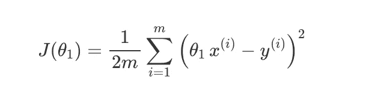
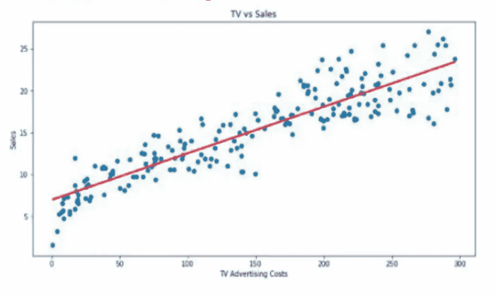

# 了解线性回归

> 原文：<https://medium.com/analytics-vidhya/understanding-linear-regression-befd4d63c3d6?source=collection_archive---------5----------------------->

线性回归——机器学习的支柱之一

在机器学习的世界里，**线性回归**是一种**参数回归模型**，它通过取某些观测值的独立特征或变量的加权正态，并给它加上一个常数值，称为截距或偏差项，来进行预测。

这意味着基本上回归模型将是具有依赖于特征数量的特定固定数量的相关参数/权重的模型，并且它们产生数字预测，例如房子的成本。

线性回归公式

*   ***ŷ*** 预测值。
*   ***n*** 指数据集的变量/特征总数。
*   **是第*个变量*的值。**
*   *****θI***为模型的参数，其中**θ0**为偏差项。**

**这本质上是一条直线的方程。核心思想是获得最适合数据的线。最佳拟合线是数据集中残差值(也称为总预测误差(所有数据点))尽可能小，理想情况下接近 0 的线。误差是回归线中预测点与实际值之间的距离。**

## **通过一个例子理解**

**我们需要考虑每月的电子商务交易和广告费用之间的联系。我们有 7 家网店最近一年的点评结果。目的是发现最符合信息的直线的条件。附表列出了 7 家网上商店的调查结果。**

****

**我们可以看到，每月的电商销售额(Y)与网络广告费用(X)之间存在**正相关关系**。**

***正相关是指自变量(x)的值上升时，因变量(y)的值也上升。***

**因此，如果我们需要通过广告成本来预测每月的电子商务销售额，那么宣传成本的收益越高，我们对交易的预期就越高。如果你试图看一下前面提到的信息的情节，我们会注意到以下内容。**

****

**散点图显示了一个变量对另一个变量的影响程度。在我们的模型中，上面的散点图显示了互联网宣传成本对每月在线交易的影响。这说明了他们的关系。如果我们试图在它上面拟合一条最佳拟合线，例如一条依赖于算法的回归线，图表会以下面提到的方式显示出来。**

****

**线性回归计划追踪通过数据点的最佳拟合直线。最佳拟合线称为回归线。当绘制直线时，如果信息焦点越靠近，则意味着这两个因素之间的关联越大。在我们的模型中，关系是稳固的。在给定的模型中，连接可以是正的，但是也可以是负的。**

**上图中蓝色的倾斜线是回归线，显示了对每一个可以想象的广告费用估计的互联网商业交易的预期得分。**

## **进入数学领域**

****

**在上面的等式中，**

**y =目标变量。**

**x =输入变量。(多元回归情况下的 x1，x2，…xp)**

**b0 =截距值，也称为偏差项。**

**b1、b2、..bp =描述输入变量和目标变量组合之间线性关系的系数。**

****B0 对 x-y 关系的影响:****

**当输入(x)为 0 时，b0 的估计值表征了目标(y)均值的期望值。如果我们给出 b0 为 0，我们强迫这条线通过原点，这里 x 和 y 都是 0 和 0。这有时可能有用，但在其他情况下会降低精度值。因此，根据您正在使用的数据集的要求，探索关于 b0 估计的不同途径是至关重要的。**

****B1 对 x-y 关系的影响:****

**在 b1 比 0 更突出的情况下，信息变量着重影响目标。一个因素的增加会促使另一个因素的估计扩大。然而，如果 b1 小于 0，则信息和产出因子将具有相反的对应关系或负关系。因此，一个因素的增加会导致另一个因素估计值的下降。**

**期望我们得到一个数据集，如上图中的“x”标记所示。直线(即回归线)的目的是发现一条线，如前面提到的图中的蓝线，它最符合准备模型的给定安排。这条线实际上是参数θ0 和θ1 的影响。因此，学习计算的目标是追踪适合数据集的最佳参数。换句话说，选取θ0 和θ1，使得对于准备模型(x，y ), hθ(x)接近 y。**

********

**价值函数**

**学习目标是最小化成本函数值，即**

****

**由于显而易见的原因，这个成本函数也被称为**平方误差函数**。这是线性回归最常用的成本函数，因为它简单且性能良好。**

# **模型评估的一些主要指标**

**我们认识到回归线试图拟合一条线，在预期和实际质量之间产生最小的区别，这些区别也是公正的。这种区别或误差被称为残差。**

****残差=实际值—预测值****

**必须注意到，在使用 R 平方等评估指标调查或评估我们的模型之前，我们应该利用残差图。**

**残差图揭示了一个有偏见的模型，比其他一些评估指标。万一你的残差图看起来很普通，你可以用不同的测量方法来评估你的模型。**

**剩余图在 y 轴上显示剩余量，在 x 轴上显示预期质量。万一你的模型有偏差，你就不能相信结果。尽管如此，万一有任何故意举例的迹象，那么你的模型可以被称为有偏见的。**

# **均方误差**

**回归任务最广泛认可的度量是 MSE。它有一个凸起的结构。它是实际值和预测值的平方差的平均值。因为它是可微分的，并且具有曲线形状，所以对于优化来说它是更简单的。MSE 惩罚大的错误值。**

****

# **平均绝对误差**

**这只是模型预期的目标值和预测值之间差异的绝对量的平均值。在离群值的情况下，这种度量标准不是很受欢迎。MAE 不会惩罚大量的错误。**

****

# **r 平方或决定系数**

**此指标处理由模型的独立变量阐明的目标变量的方差。它估计你的模型和依赖变量之间的联系强度。**

**为了理解 R-square 真正解决的问题，让我们考虑下面的情况，在有和没有自变量信息的情况下，我们测量模型的误差。**

*****在 R 较高的情况下(比如 1)，模型处理依赖变量的方差。*****

*****在 R 较低的情况下，模型不会处理因变量的方差，回归线也不会比取均值线更好，因为您没有利用这些因变量的任何数据。*****

# **均方根误差(RMSE)**

**这是实际值和模型预测值的平方差的平方根**

**r 平方误差优于 RMSE。这是因为 R 平方是相对的，而 RMSE 是拟合的绝对度量。**

**从根本上说，RMSE 只是残差平方的法线的基础。我们意识到，残差是从回归线中无法接近焦点的一部分。因此，RMSE 估计这些残差的分散。**

****

# **调整后的 R 平方**

****调整后的 R 平方**与 R 平方的主要区别在于， **R 平方**描述的是每个独立变量所代表的因变量的方差，而**调整后的 R 平方**测量的是仅由实际影响因变量的独立变量所解释的方差。**

****

***在上面的等式中，n 是数据点的数量，而 k 是模型中变量的数量，不包括常数。***

**r 一般会随着自变量数量的增加而增加。然而，这可能是误导。相应地，改变的 R 平方由于添加了更多不适合模型的独立变量(k)而惩罚了模型。**

# **线性回归的假设**

# **1.回归模型的系数是线性的。**

**这种假设倾向于模型的实用类型。在 stats 中，当模型中的所有项都是截距值或乘以自变量的参数时，回归模型就是线性的。您通过将各项相加来专门构建模型。这些标准要求模型只有一种类型:**

****

**在方程中，贝塔系数(βs)是 OLS 估计的参数。ε是随机误差。**

****

# **2.误差项的总体均值为零**

**误差代表了独立因素没有阐明的目标变量的变化。误差项应该由随机性来解释。为了使你的模型不偏不倚，误差的平均估计值应该接近零。**

**假设正常误差为+7。这个非零的正态误差表明我们的模型有效地低估了所注意到的品质。分析人士暗示，像这样的有序失误是一种偏见，这意味着我们的模型是有缺陷的，因为如果我们考虑平均水平，它是不正确的。**

# **3.误差项具有恒定的方差(无异方差)**

**对于所有的感知，错误量的方差应该是稳定的。因此，波动不会因每个感知或感知范围而改变。这种情况称为同质性。如果方差发生变化，我们称之为异方差。**

**检验这一假设的最简单方法是创建残差与拟合值的关系图。在这种类型的图上，异方差表现为一个圆锥形，残差的分布在一个方向上增加。在下图中，残差的分布随着拟合值的增加而增加。**

****

**各种残差与拟合值图**

# **4.所有独立变量都与误差项无关**

**万一自变量与错误相关，我们可以利用它来预测错误，这与错误解决不寻常的不规则错误的想法相矛盾。我们需要弄清楚如何将它纳入回归模型。**

**这种假设是额外提到的外来性。在这种联系存在的点上，就有了内生性。如果目标变量和因变量之间存在同步，或者自主因素中存在估计错误，就有可能违反这一假设。**

**线性回归有哪些优点和缺点？**

****

# **在有多个自变量的回归中，系数告诉你当自变量增加 1 时，在所有其他自变量保持不变的情况下，因变量预计会增加多少。**

**线性回归算法的一个主要问题是，它极易出现**欠拟合和**过拟合的问题。为了理解这一点，我们需要详细了解**偏差**和**方差**。**

**偏见——你说的偏见到底是什么意思？**

**偏差是我们模型的平均预测值和我们试图预测的正确值之间的对比。具有高偏差的模型几乎不重视训练数据，并且通过大量简化来歪曲模型。它通常会在训练集和测试集上出现较高的错误。**

****差异——差异的确切含义是什么？****

**方差是数据点之间模型预测值相对于给定信息点平均值的变化或分布，它向我们揭示了我们信息的分布。具有高方差的模型告诉我们对训练集的巨大依赖性，并且不概括以前没有看到的信息。因此，这种模型在训练信息上表现得非常好，但在测试信息上却有很高的错误率。**

**这两个因素导致了我们所理解的机器学习世界中的拟合问题。**

****

**显示了方差和偏差的不同情况**

*   **在监督学习中，当模型无法捕捉数据的基本模式时，就会发生欠拟合。这些模型通常具有高偏差和低方差。当我们只有很少的数据来建立一个精确的模型时，或者当我们试图用非线性数据建立一个线性模型时，就会发生这种情况。此外，这种模型非常简单，可以捕捉数据中的复杂模式，如线性和逻辑回归。**
*   **在监督学习中，当我们的模型捕捉到数据中的噪声和潜在模式时，就会发生过度拟合。当我们在嘈杂的数据集上训练我们的模型时，就会发生这种情况。这些模型具有低偏差和高方差。这些模型像决策树一样非常复杂，容易过度拟合。**

# **偏差-方差权衡**

**万一我们的模型过于简单并且没有太多参数，它可能会有高偏差和低方差。另外，万一我们的模型有大量的参数，它会有高方差和低偏差。所以我们需要在不过度拟合和欠拟合信息的情况下找到正确的均衡。这种错综复杂的权衡是偏倚和方差之间存在权衡的原因。一个算法不可能同时更复杂和更不可预测。**

**误差值=方差+偏差+不可约误差**

****

**图像捕捉偏差-方差权衡**

**偏差和方差的最佳平衡永远不会使模型过拟合或欠拟合。**

# **正规化过程的意义？**

**如果我们的模型复杂性超过了这个最佳点，我们实际上是过度拟合了我们的模型；而如果我们的复杂性没有达到最佳状态，那么我们就不适合这个模型。考虑到所有这些，当我们认为我们的模型太复杂时，正则化的概念只是一种有用的技术(具有低偏差但高方差的模型)。这是一种“约束”或“调整”系数大小的方法(“向零收缩”)。我们将要讨论的具体正则化技术是岭回归和套索回归。用于解决过拟合和特征选择的最著名的正则化技术是:**

**1. **L1 正规化****

**2. **L2 正规化****

**使用 L1 正则化技术的回归模型称为 ***套索回归*** ，使用 L2 的模型称为 ***岭回归*** 。**

*****这两者的关键区别在于刑期。*****

# **里脊回归**

****岭回归**将系数的*平方值*作为惩罚项添加到损失函数中。这里，*突出显示的*部分代表 L2 正规化元素。**

****

**价值函数**

**这里，如果λ是零，那么你可以想象我们回到了 OLS。然而，如果*λ*非常大，那么它将增加太多的重量，并且将导致装配不足。话虽如此，如何选择λ很重要。这种技术可以很好地避免过度拟合的问题。**

****

**参数朝着 0 减小**

# **套索回归**

****Lasso 回归**(最小绝对收缩和选择算子)将系数的*大小的绝对值*作为惩罚项添加到损失函数中。**

****

**价值函数**

**同样，如果*λ*为零，那么我们将得到 OLS，而非常大的值将使系数为零，因此它将欠拟合。**

****

**在α的某些值之后，参数减小到 0**

# **弹性网络回归**

**弹性网最早出现是由于对 lasso 的批评，其变量选择可能过于依赖数据，因此不稳定。解决方案是结合岭回归和套索的惩罚，以获得两全其美。弹性网旨在最小化以下损失函数:**

****

**价值函数**

**其中 *α* 是脊( *α* = 0)和套索( *α* = 1)之间的混合参数。**

**现在，有两个参数需要调整: *λ* 和 *α* 。 *glmnet* 包允许通过交叉验证对固定的 *α* 进行调优 *λ* ，但是它不支持 *α* 调优，因此我们将转向*插入符号*来完成这项工作。**

**这些技术之间的关键区别是套索将不太重要的特征的系数缩小到零，从而完全删除了一些特征。因此，在我们有大量特征的情况下，这对于**特征选择**很有用。交叉验证、逐步回归等处理过度拟合和执行特征选择的传统方法适用于小的特征集，但当我们处理大的特征集时，这些技术是很好的替代方法。**

# **结论**

**在这篇博客中，我们通过一个非常直观的例子深入理解了线性回归的概念。我们深入研究了其背后的数学原理，了解了偏差项、与每个功能相关的参数、成本函数最小化等。此外，我们继续了解用于评估我们的模型的各种指标。了解各种优点和缺点后，我们遇到了方差和偏差的概念，这是任何 LR 模型中的主要误差来源，因此了解了如何通过行业中使用的各种正则化技术来优化我们的模型。**