# 了解 LVM

> 原文：<https://medium.com/analytics-vidhya/understanding-lvm-436e629960ea?source=collection_archive---------18----------------------->

将 LVM 与 Hadoop 集成在一起！

为了更好地理解 LVM 的用途，我们将讨论 Hadoop。所以，如果你是 Hadoop 新手，我推荐你阅读我之前关于 Hadoop 基础的文章。

我们知道，运行 NameNode 进程的 Hadoop 主节点负责 HDFS 的所有文件系统名称空间，而从节点提供实际的存储空间来存储文件和文件夹。

这篇博客的目的是了解**逻辑卷**的基本概念，以及我们如何使用它为 HDFS 提供存储。

假设你有两个硬盘插入你的机器。第一个硬盘的大小为 20 GB，另一个为 40 GB。在将这台机器配置为从系统时，您决定从第二个硬盘上的分区(40 GB)中捐赠空间。为了简单起见，假设我们在这个硬盘上只有一个分区，它几乎是硬盘的大小，尽管考虑到为存储元数据保留的空间，它会稍微小一点。此外，假设当前集群只包含一台机器，即单节点集群。

已经为集群设置了主服务器和从服务器，您的一个 HDFS 客户端想要上传一个大小为 43G 的文件。你一定猜对了，上传最终会因为空间不足而失败。

您意识到您的另一个 20GB 硬盘未使用，想知道您是否可以将该硬盘的空间捐赠给 HDFS 的客户。

**您将如何同时从两个磁盘共享存储？**

好了，在这里我向您介绍逻辑卷的概念，这样您就不必一直疑惑了。

那么，我们开始吧。

我们有两个硬盘，我们想用这两个硬盘创建一个逻辑硬盘。第一步是从我们拥有的硬盘创建一个物理卷。

*注意:我使用的是 Linux 虚拟机，并且我的虚拟机已经连接了两个磁盘。*

1.  创建物理卷。

你可以看到我这里有两个设备，/dev/sdb 和/dev/sdc。

为了简单起见，两个磁盘各为 4GB。

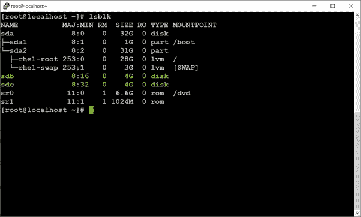

图一

现在，我们想用它们创建物理卷。

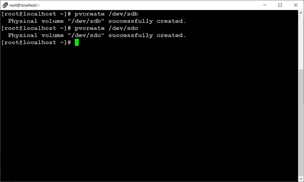

图 2

2.创建卷组。

创建卷组就是将我们创建的两个物理卷合并成一个存储。

***# vgcreate<VG 名称> /dev/sdb /dev/sdc***

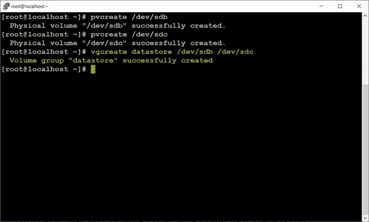

图 3

使用 ***命令 vgdisplay，*** 可以查看详细信息。

如您所见，它为我们提供的大小是用于创建 VG 的两个物理卷的总和。

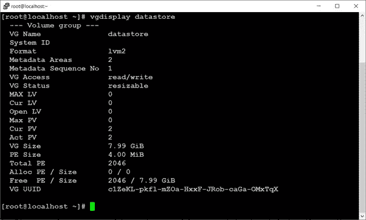

图 4

现在，将这个卷组视为一个全新的硬盘。

3.接下来，就像我们在静态硬盘中创建分区一样。我们也将在这里创建一个逻辑卷/逻辑分区。

***# lvcreate—size<size-of-partition>—name<name-of-partition><name-of-VG>***

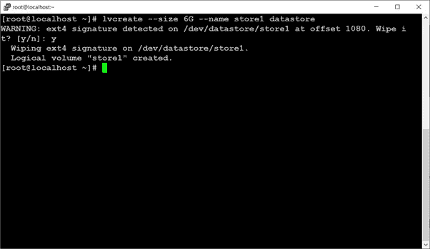

图 5

4.现在，格式化这个分区。在这里，我使用了 **ext4** 格式类型。因此，

***# mkfs.ext4 /dev/ <分割名称> / <分割名称>***

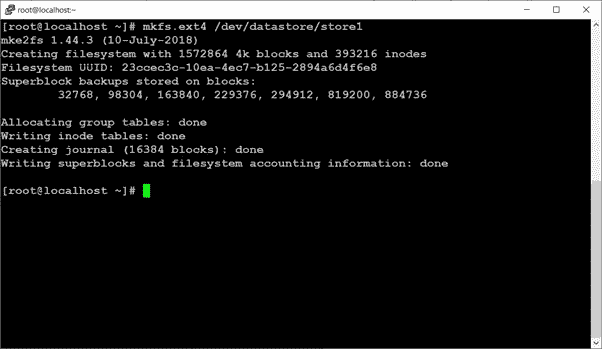

图 6

5.接下来，我们必须决定挂载点，以便我们可以开始使用它。创建一个目录并将该文件夹挂载(链接)到我们的分区。我们存储在分区中的所有内容都将在这个目录下可用。

我已经创建了一个目录*/Hadoop/Hadoop data/HDFS/datanode*，然后挂载了这个分区。

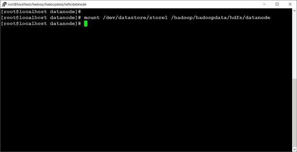

图 7

现在，如您所见，我们已经准备好了一个逻辑分区。逻辑分区的大小为(6G)，类型为 ***lvm*** *。*

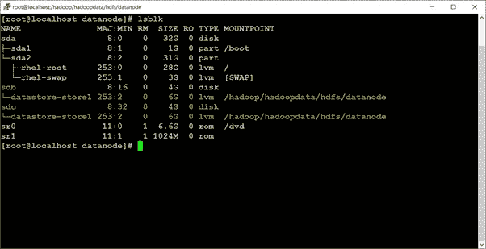

图 8

就是这样。五个简单的步骤，我们创建了一个逻辑卷。

**总结概念…**

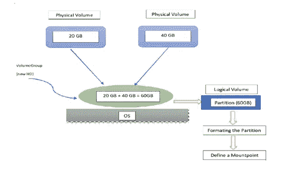

现在，您可以在 LV 的挂载点创建一个目录，然后使用该目录向 HDFS 集群提供存储。为此，您必须编辑 **hdfs-site.xml** 文件。您必须在那里更改共享文件夹的名称。

因为我们在*/Hadoop/Hadoop data/HDFS/datanode*目录中挂载了我们的分区，所以我们将相应地编辑该文件。这里，我在挂载的目录中创建了一个名为 *slave1* 的文件夹，并在 hdfs-site.xml 中给出了路径。

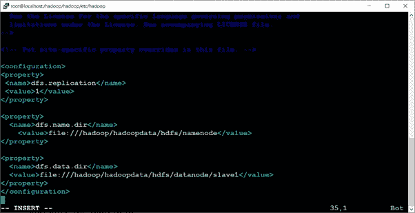

图 9

格式化 namenode 目录并启动集群后，获取 hdfs 报告。

***# HDFS DFS admin-report***

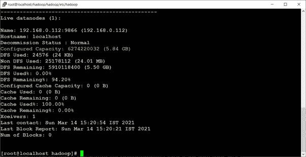

图 10

您可以看到**配置的容量**大约为 6GB，它来自我们的逻辑分区。

好吧，我打赌你有一个问题，为什么是逻辑卷呢？

最明显的原因是，它让您可以从多个物理硬盘上获取空间。但是，使用**逻辑卷**的另一个显著优势是它们可以创建动态分区。

**这是什么意思？**

例如，当前分区中 6GB 的全部空间都用完了。对于逻辑卷，我们可以增加分区大小。当我们扩展分区大小时，存储从**卷组**获得。此外，还可以减少逻辑卷，在这种情况下，额外的存储将返回到**卷组**。

现在让我们尝试扩展分区。假设我想将我的分区大小从 6G 增加到 7G。

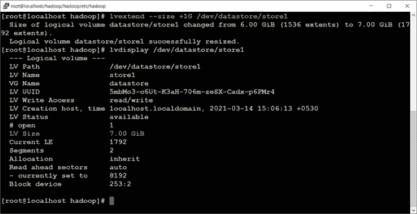

图 11

你现在可以看到 LV 尺寸现在是 7G。

为了使更改生效，我们必须重新格式化我们添加的额外空间。

因此，

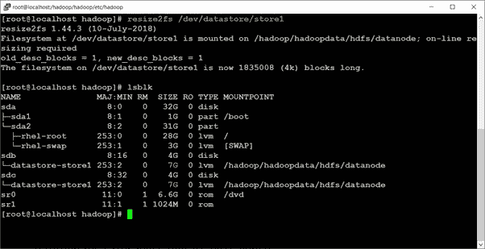

图 12

让我们检查一下 HDFS 集群的**配置容量**是否增加了。还有……

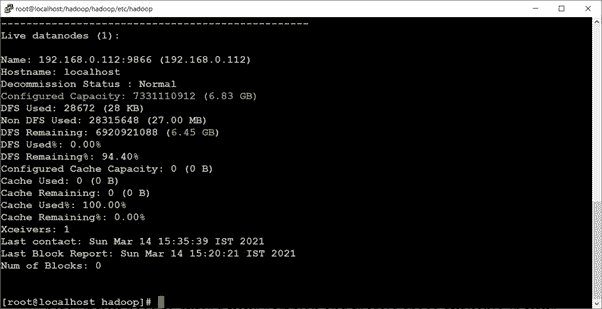

图 13

还好，是的！

因此，现在的 HDFS 从属共享逻辑卷实际上是自己的主人—它可以决定何时要捐出更多空间，或者何时从 LV 中删除未使用的空间。

另外，我想知道您是否注意到了我们案例中的根卷也是一个逻辑卷(图 1)。如果我们使用了它，我们仍然能够扩展它。这会节省我们很多时间！

无论如何，我希望你喜欢阅读这篇博客！