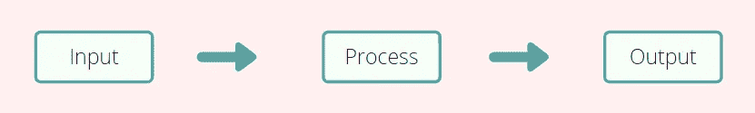
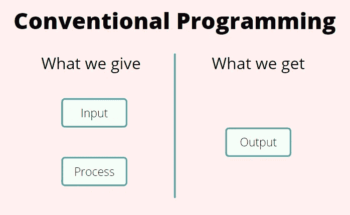

# 理解机器学习

> 原文：<https://medium.com/analytics-vidhya/understanding-machine-learning-a1dbaa8e2fae?source=collection_archive---------18----------------------->

## 以及它与传统编程有何不同

马克·弗莱彻·布朗在 [Unsplash](https://unsplash.com?utm_source=medium&utm_medium=referral) 上的照片

W onder 什么是机器学习？它是如何工作的？也许你是一名崭露头角的机器学习工程师或数据科学家，或者只是对上述话题感兴趣的人？这篇文章是为了让你明白这种嗡嗡声是怎么回事。

下一部分是我介绍我自己。可以跳过这个，从简介开始。

# 我是谁？

照片由[明锐丹](https://unsplash.com/@octadan?utm_source=medium&utm_medium=referral)在 [Unsplash](https://unsplash.com?utm_source=medium&utm_medium=referral)

我是来自印度一所著名大学的二年级工科学生，主修生物技术。从一开始，我就对计算机科学感兴趣。

当封锁开始时，我学习了 web 开发，但很快意识到软件开发通常不是我喜欢的。

然后我遇到了这个美丽的领域**数据科学**，它融合了数学和代码。我热爱这个领域，并从 Udemy 购买了一门课程来开始我的学习。我开始这段旅程的时间并不长，是的，我还在学习。

我是怎么结束写博客的？嗯，我在 YouTube 上看到我的课程老师(大喊到[丹尼尔](https://www.mrdbourke.com/))和& [肯吉](https://www.youtube.com/channel/UCiT9RITQ9PW6BhXK0y2jaeg)谈论写博客并强调交流和分享你所学的重要性。我发现写博客不仅是修正我最近学到的概念的完美方式，也是为社区提供资源的完美方式。

# 介绍

想知道当你点击自拍时，你的智能手机摄像头是如何检测到你的脸的吗？或者 Spotify 如何推荐你喜欢的歌曲？网飞的推荐如何符合你的兴趣？

亚历山大·沙托夫在 [Unsplash](https://unsplash.com?utm_source=medium&utm_medium=referral) 上拍摄的照片

许多人喜欢称之为人工智能，这是所有这些酷东西的背后。我们口袋里装着所有这些技术。

以上例子只是 AI 可能应用的沧海一粟。很疯狂，对吧？

人工智能是我们让计算机思考，并根据不同情况做出明智决定的能力。

需要理解的一件重要事情是，AI 指的是一个非常广泛的概念，即机器可以是“智能的”，而 ML 基于这样一个概念，即机器可以通过获得经验来提高它们在某项任务中的性能。机器学习是人工智能的子集([阅读更多](https://www.sas.com/en_in/insights/articles/big-data/artificial-intelligence-machine-learning-deep-learning-and-beyond.html#:~:text=While%20machine%20learning%20is%20based,techniques%20to%20solve%20actual%20problems.))。

在这篇文章中，我将进一步阐述机器学习。如果你想的话

在我们深入研究之前，让我们看一下编程到底是什么。

# 一些基本的东西

我打算直截了当地说出来。

计算机是愚蠢的。

他们只懂 0 和 1。他们需要被明确地告知如何做某事(也就是说，我们需要以一种非常具体的方式指导计算机完成任务)。

这就是编程的意义所在。

照片由[詹姆斯·哈里逊](https://unsplash.com/@jstrippa?utm_source=medium&utm_medium=referral)在 [Unsplash](https://unsplash.com?utm_source=medium&utm_medium=referral) 上拍摄

如果我们从一个非常高的层面来看我们周围的所有技术是如何工作的，我们使用的所有计算机应用程序都有 3 个主要步骤:

*   投入
*   过程
*   输出

“输入”是应用程序响应用户的特定动作。“进程”是给计算机的指令，告诉它如何响应。“输出”是显示结果的步骤。

考虑一下这个场景:当你滚动 Instagram feed 时，会出现新的帖子。在这种情况下，拇指的移动就是输入。显示器上向上移动的馈送就是输出。你的手机必须做的任何工作都在处理步骤之下。

每个计算机应用程序的基本结构

编程允许你定义一个函数来处理输入并返回输出。我们(用户)给计算机输入，我们告诉它如何处理，它告诉我们结果是什么。

我们给予的和我们得到的

让我给你一个简化的例子。考虑一个计算机程序，它告诉你一个数的平方是多少。如果我们给它一个值 4，程序会将它的平方值评估为 4x4(因为我们就是这样编程的)。计算机将得出 16 的最终答案。

为什么电脑会自己把数字相乘？因为程序员写了代码告诉它这样做。

我们人类喜欢为我们的许多任务编程。这让他们能够削减成本，提高效率和速度。

# ML 有什么不同？

现在我们已经理解了什么是编程，让我们看看机器学习是如何工作的，以及它有什么根本的不同。

在传统程序的情况下，**机器知道如何将输入映射到输出**。

> *如果我们不知道映射函数是什么呢？*

这正是机器学习要回答的问题。如果你有一个训练有素的机器学习估计器/模型，即使你不知道它是如何计算的，你也可以预测结果会是什么。

但是，为了做到这一点，您需要教导模型，以便它能够学习数据之间的模式(也称为训练模型)。我们应用一种算法(一组步骤的别称)让我们的机器学习。

# 机器是如何学习的？

让我问你一个简单的问题:如果我在你面前放一个苹果和一个香蕉，你怎么知道哪个是哪个？

资料来源:联合国人类住区规划署

你甚至不会花一秒钟。

原因是，你和我可以区分这两种水果，因为我们在生活中见过很多很多苹果和香蕉。

如果你是个小孩，事情会有所不同。你可能会问自己这些问题:

*   那是什么颜色？红色还是黄色？
*   它的形状是什么？

随着时间的推移，你会看到足够多的苹果和香蕉，并了解其中的区别。我们的眼睛已经很好地理解了这些模式，以至于感觉我们在回答之前甚至不需要思考。

从根本上来说，我们的大脑已经把“苹果”这个词和又红又圆的联系在了一起，而“香蕉”则和长长的黄色联系在了一起。

机器“学习”的方式类似于你开始的方式——在我们的例子中，学习苹果和香蕉之间的区别。

我们给机器一些材料让它学习。这种材料被称为训练数据。

我们展示苹果的照片，并告诉电脑“嘿，这是一个苹果。”

香蕉也一样。

这样，机器就学会了如何区分苹果和香蕉。

训练机器学习模型

最后，当我们向它展示了我们拥有的所有照片(数据)时，我们通过在测试数据集上测试来评估我们的机器学习得有多好。如果预测结果符合标准，模型就可以投入使用了！

恭喜你！你成功了！从高层次的角度来看，这是你需要知道的所有基本知识。

当然，我已经跳过了周围的许多技术内容，我肯定会在我未来的帖子中涉及它们。

如果你想了解更多关于人工智能的知识，请查看由人工智能的[元素提供的免费课程。](https://www.elementsofai.com/)

下一个系列的博客将基于数学和各种机器学习模型的工作(是的，这将是太技术化了)。

请通过 LinkedIn 与我联系，我希望收到您的来信！

回头见！