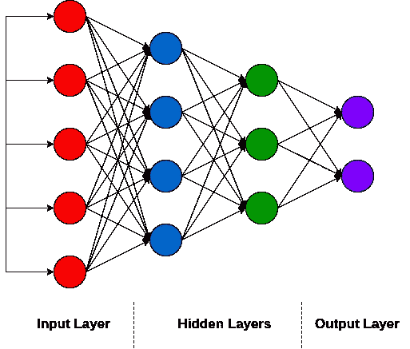
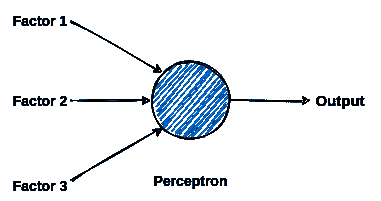

# 了解神经网络…

> 原文：<https://medium.com/analytics-vidhya/understanding-neural-networks-204f2db8e33?source=collection_archive---------15----------------------->

朋友们好，这几天我一直在学习人工神经网络。我写这篇博客是为了表达我到目前为止学到的东西。我希望你会喜欢这个。

每当我们全家去度假时，我们都必须面对一种情况，那就是看不懂用当地语言写的招牌。但是 google translate 已经为新时代 musafirs 解决了这个问题，我们只需点击海报的快照，我们就可以在几秒钟内将所有内容翻译成英语。

这是可能的，因为**人工神经网络**。文本识别和实时翻译是神经网络的应用。

**什么是神经网络？**

顾名思义，ANN 就是神经元的网络。

人工神经网络是一种计算模型，其灵感来自人脑中生物神经网络处理信息的方式。

它从一端接收信息，对其进行处理，并将其输出到相连的神经元。

来掌握神经网络到底是如何工作的？首先，我们将了解人工神经网络中的关键术语:

**感知器:**

感知器是一种人工神经元。我们可以把它想象成一台通过权衡证据来做出决策的机器。

**权重:**

这些是实数，表示感知器接收的输入对产生的输出的重要性。

**偏差:**

它是一个附加参数，用于调整神经网络的输出。偏差类似于线性函数中的截距。

**神经网络是如何工作的？**

神经网络结构

*   神经网络由几层感知器组成。每个感知器通过加权连接连接到下一层感知器。
*   这里，我们将考虑 sigmoid 函数作为进一步解释的激活函数。
*   每个感知器接受几个二进制输入，并产生单个二进制输出。
*   感知器的输出基于其输入的加权和来确定。
*   如果总和大于阈值，则输出为 1，否则为 0。
*   这样，每一层的感知器都做出决定。随着我们在各层中向前推进，决策的复杂性和抽象程度也在增加。
*   这个过程被称为**正向传播**。
*   让我们用一个现实生活中的类比来理解感知机的工作，假设这是一个周末，你的朋友邀请你去疯狂观看全新的网络系列。你喜欢花时间和朋友在一起，并试图决定是否要去。你可以通过权衡以下因素来做出决定，

1.  该系列属于惊悚片类型吗？
2.  网页系列评分是否超过 9？
3.  你最好的朋友想陪你吗？

感知器的工作

*   您可以根据您的优先级为这些因素分配权重。最后，如果所有因素的加权和高于你选择的阈值，那么你应该和你的朋友一起去。
*   这是每个感知器如何做出决定和预测最终输出。
*   将预测输出与实际输出进行比较，以实现预测中的误差。
*   该错误信息随后通过网络传回。这个过程被称为**反向传播**。
*   然后，该信息用于调整输入权重并提高预测的准确性。
*   **神经网络的应用:**

1.  **预测:**神经网络可以用来发现历史数据中的模式，并预测未来的销售、股票价格和天气状况。
2.  音乐创作:安可以发现音乐中的模式，并训练自己创作新的曲调。
3.  **医疗保健管理:**深度学习可以在药物发现和医学成像方面协助医疗部门。它还用于分析保险索赔和限制欺诈。

这个系列的第一篇博客到此结束。

希望你喜欢我的尝试，我将在接下来的文章中详细介绍。

快乐学习！！！