# 了解振荡器(Python)

> 原文：<https://medium.com/analytics-vidhya/understanding-oscillators-python-2813ec38781d?source=collection_archive---------3----------------------->

## **从简谐振动直观到微分方程的数值解。**

简谐振子是物理学中最基本的现象之一。它本质上描述了附在弹簧上的质量的运动。描述其行为的方程是牛顿第二定律和胡克定律相结合的结果，这两个定律都是力的概念的定义。

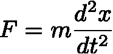

牛顿第二定律。等式(1)

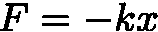

胡克定律。等式(2)

将牛顿定律代入胡克定律，得到简谐振子微分方程:

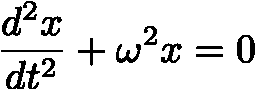

其中，ω平方= √k/m。等式(3)

瞧啊。如此简单的公式，在牛顿力学中却如此有用。

微分方程既可以解析求解(如果解是精确的)，也可以数值求解(如果解没有精确的形式)。该方程的解可以通过分析找到，其一般形式为:

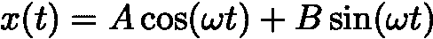

三角函数的线性叠加，其中 A 和 B 是振幅常数。等式(4)

我推荐在提供工具来绘制它们的网站上使用这些函数，比如[德斯莫斯](https://www.desmos.com/?lang=en)。这确实有助于获得视觉洞察力，从而增强学习过程。或者，您可以使用 Python 或您喜欢的编程语言来绘制它们。

记住这个简短的解释，我们将跳到编码方面，在那里我们将使用 SciPy 库来寻找一个数值解。这种方法的最大优点是它的通用性，因为它可以推广到多种类型的微分方程。

# **在 Python 中**

首先，我们导入相关的库。

```
import numpy as np 
from scipy.integrate import solve_ivp
import matplotlib.pyplot as plt
import seaborn as sns
sns.set()
```

然后，我们定义时间的积分范围、ω平方的值以及位置(x)和速度(v)的初始值，在这种情况下分别为 0 和 2，如变量 *y* 所示

```
t = np.linspace(0,15,1000)
omega_sq = 1
y = [0,2] #y[0]=x and y[1]=v
```

现在才是有趣的开始。首先，我们将二阶常微分方程分解为两个一阶微分方程。

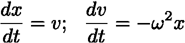

速度是位置相对于时间的变化率。等式(5)

然后过程如下，我们定义一个向量，变量被微分，正如你在上面看到的，它们是 x 和 v，都作为时间的函数变化(等式(5))。

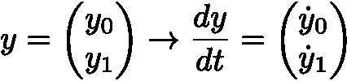

一般定义。等式(6)

如果对等式(5)的理解是正确的，那么在一般定义(等式(6))中插入我们的变量是很自然的。

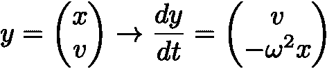

用于我们的例子的一般定义(来自等式(3))

一旦达到这一点，我们只需创建一个返回向量 dy/dt 的函数，如下面的代码所示

```
def harmonic(t,y):
    solution = [y[1],-omega_sq*y[0]]
    return solutionsho = solve_ivp(harmonic, [0,1000], y0 = y, t_eval = t)
```

Solve_ivp 是 SciPy 库的一个函数，它解决了常微分方程组的初值问题，这种情况就发生了。欲了解更多信息，请访问[在线文档](https://docs.scipy.org/doc/scipy/reference/generated/scipy.integrate.solve_ivp.html)。

任何初值问题的解都是特定解，对于这种情况，给定之前陈述的初始条件，我们得到与一般解一致的三角函数，方程(4)。现在我们只是使用 [matplotlib 库](https://matplotlib.org/)来可视化这个特殊的解决方案。

```
plt.plot(t,sho.y[0])
plt.ylabel("Position")
plt.xlabel("Time")
plt.title('SHO', fontsize = 20)
```

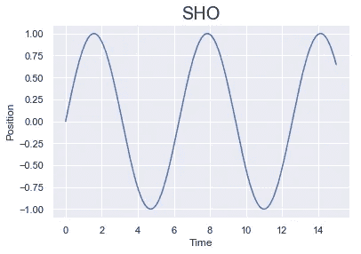

给定某些初始条件的振荡模式 x(t)。

这种方法同样适用于阻尼振动。由于在现实生活中总是存在能量耗散(永恒运动机器在现实生活中不起作用)，我们必须在等式(3)中引入拖曳力项，以获得更现实的振荡方法:

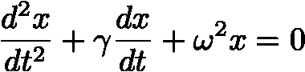

阻尼振子，其中 dx/dt 代表拖曳力。等式(7)

解决这个问题的方法与谐振子相同:

```
t = np.linspace(0,15,1000)
y = [0,1]
gamma = 1
omega_sqr = 100def sho(t,y):
    solution = (y[1],(-gamma*y[1]-omega_sqr*y[0]))
    return solution
solution = solve_ivp(sho, [0,1000], y0 = y, t_eval = t)plt.plot(t,solution.y[0])
plt.ylabel("Position")
plt.xlabel("Time")
plt.title('Damped Oscillator', fontsize = 20)
```

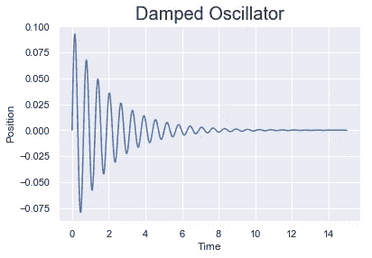

阻尼振动函数 x(t)

从这个特殊的数值解中，我们可以看到振荡是如何指数衰减到平衡态的，这里 x(t) = 0。在前面对 SHO 的分析中，这种衰变不会出现，系统永远保持运动状态。

有整本书致力于研究振荡和波，这方面有更多的探索，它为各个领域的一些物理现象奠定了基础，甚至是量子力学。这篇文章旨在给出振动的一个基本概述，并添加一些方便的数值解。请随意复制代码，尝试各种值并探索解决方案，这可能是从等式中获得洞察力的最佳方式之一。

玩得开心，乘风破浪！

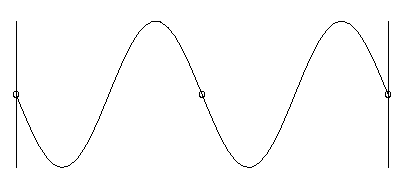